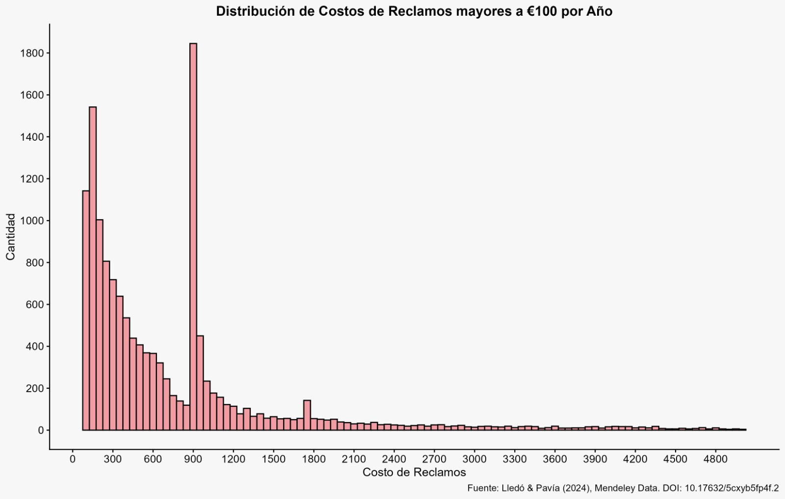
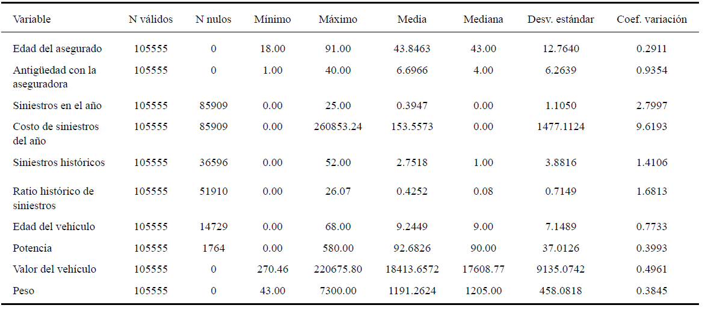

## Introducción: análisis exploratorio inicial

::: columns

:::: column
{width=110%}

::::

:::: column
- El gráfico muestra la cantidad de reclamos de acuerdo al costo de los mismos. \vspace{0.3cm}

- **Mejor visualización:** no se contemplan los montos superiores a €5,000.\vspace{0.3cm}

- **Singularidad:** se presenta un cambio abrupto en la cantidad de reclamos cuando el monto de los mismos alcanza los €900.\vspace{0.3cm}

::::

:::

## Pregunta de investigación
###
¿Cómo intervienen las variables de la edad del asegurado, la antigüedad con la aseguradora, el historial de siniestros y las características del vehículo, tanto en la frecuencia como en la severidad de los siniestros y qué factores explican el incremento abrupto en la cantidad de reclamos al momento que el costo de los mismos supera el monto de 900 euros?

###
Relevante para: \vspace{0.1cm}

- **Actuarios** \vspace{0.1cm}

- **Aseguradoras de automóviles** \vspace{0.1cm}

## Base de datos
###
- Los datos se obtuvieron de la Universidad de Valencia, España, de la página Mendeley Data. \vspace{0.1cm}

- Posee 105,555 observaciones, 53,502 observaciones únicas y 30 variables. \vspace{0.1cm}

- Variables como "Date_lapse" posee 70,408 NA, representando un 66.7% de los datos. \vspace{0.3cm}

###
\begin{center}
\includegraphics[width=0.5\linewidth]{mendeleydata.png}
\end{center}

## Base de datos
\begin{center}
\includegraphics[width=0.75\linewidth]{distibucion_costo_anyo.png}
\end{center}

## Base de datos

## Base de datos
\begin{center}
\includegraphics[width=0.6\linewidth]{velas_atipicos.png}
\end{center}

## Metodología propuesta
### Proceso metodológico a seguir 
La metodología propuesta se estructura en cuatro etapas complementarias:

- **Análisis descriptivo de las variables respuesta:** la frecuencia y la severidad de los siniestros. \vspace{0.1cm}

- **Análisis de correlación:** exploración de la potencial relación entre las variables explicativas y la variables respuesta. \vspace{0.1cm}

- **Comparación entre grupos**: se definen agrupaciones de acuerdo a variables categóricas, como el tipo de vehículo, la zona de circulación y, en caso de ser pertinente, el tipo de combustible.\vspace{0.1cm}  

- **Caso particular:** estudio del comportamiento de los reclamos cuyo costo anual supera el monto de los €900.

## Análisis descriptivo de las variables respuesta
::: columns

:::: column
\normalsize \textbf{Frecuencia (N\_claims\_year)}

\vspace{0.3cm}

- Número de siniestros ocurridos en un periodo determinado \vspace{0.1cm}
- Tabla de distribución de frecuencias \vspace{0.1cm}
- Porcentaje de asegurados que no reportó algún siniestro \vspace{0.1cm}
- Estadísticos descriptivos \vspace{0.1cm}
- Visualización gráfica \vspace{0.1cm}
 

::::

:::: column
\normalsize \textbf{Severidad (Cost\_claims\_year)}

\vspace{0.3cm}

- Costo económico asociado a los siniestros ocurridos \vspace{0.1cm}
- Proporción de registros con costo igual a cero \vspace{0.1cm}
- Estadísticos descriptivos sobre los valores positivos \vspace{0.1cm}
- Visualización gráfica \vspace{0.1cm}

::::

:::

## Análisis de correlación 
::: columns
::: column
\vspace{0.3cm}
- **Coeficientes de correlación:** se considerarán los métodos de Pearson, Spearman y Kendall. \vspace{0.2cm} 
- Debido a las características de los datos se dará prioridad a los coeficientes no paramétricos de Spearman y Kendall. \vspace{0.2cm}
- **Normalidad**: evaluada con la prueba de Shapiro. \vspace{0.2cm}
- **Visualización gráfica:** gráficos de dispersión y líneas de tendencia. 
::::
:::: column
\vfill
\begin{center}
\small \textbf{Gráfico de correlación en R} \\
{\tiny Tomado de: R Coder.}
\end{center}
\begin{center}
\includegraphics[width=0.8\linewidth]{correlacion.png}
\end{center}
\vfill
::::
:::

## Comparación entre grupos
### 
- Se busca estudiar la variación de la frecuencia y la severidad de los siniestros según variables categóricas. \vspace{0.2cm}
- **Variables categóricas planteadas:** el tipo de vehículo, la zona de circulación y, en caso de ser pertinente, el tipo de combustible. \vspace{0.2cm}
- El objetivo de esta etapa consiste en la identificación de diferencias descriptivas entre las categorías analizadas.\vspace{0.2cm}
- Construcción de tablas resumen por grupos. \vspace{0.2cm}
- **Visualización gráfica:** gráficos comparativos. \vspace{0.2cm}

## Estudio del caso particular 
### Cambio abrupto en el monto de €900

- Construcción de una variable indicadora que divida los registros en dos grupos: los siniestros con costo menor a €900 y los siniestros con costo mayor o igual a €900. \vspace{0.2cm}

- Comparativa entre las características de ambos grupos. \vspace{0.2cm}

- Tablas de proporciones y gráficos comparativos entre categorías.

## Justificación de la metodología planteada 
###
- El enfoque metodológico responde a las características observadas en los datos: \vspace{0.1cm}
  - Una **alta concentración de ceros** tanto en la frecuencia como en la severidad.\vspace{0.1cm}
  - La presencia de **valores atípicos marcados**. \vspace{0.1cm}
  - Una **distribución fuertemente asimétrica** en el costo anual de los siniestros.\vspace{0.3cm}

- **Alternativa descartada**: Modelos Lineales Generalizados (GLM). Se descartó en base a: \vspace{0.1cm}
  - La **discrepancia** entre el objetivo del proyecto y el sentido tanto predictivo como de tarifación del GLM. \vspace{0.1cm}
  - El **incumplimiento de los supuestos** del GLM estándar. 

## Resultados esperados
###

- Una mayor comprensión del comportamiento de la frecuencia y la severidad de los siniestros.

- La identificación de patrones que orienten y sustenten la interpretación de los resultados posteriores, en lo relativo a la asociación entre variables. \vspace{0.1cm}

- La detección de diferencias sustanciales en la variación de la frecuencia y la severidad de los siniestros, de acuerdo a las variables categóricas planteadas.\vspace{0.1cm} 

- El hallazgo de comportamientos diferenciados en los siniestros cuyo costo supera los €900, frente a los de menor severidad.

## Pregunta de investigación
::: columns
:::: column
\vspace{0.3cm}
Se determina su respuesta bajo los siguientes parámetros:\vspace{0.2cm}

   - La confirmación o la negación de una asociación entre las variables descritas con la frecuencia y la severidad de los siniestros. \vspace{0.2cm}
   
   - La confirmación o la negación de una relación entre alguna de las variables descritas con el caso particular bajo estudio. \vspace{0.2cm}

::::
:::: column
\vfill
\begin{center}
\includegraphics[width=0.7\linewidth]{rompecabezas.png}
\end{center}
\begin{center}
{\tiny Imagen tomada de: Flaticon.}
\end{center}
\vfill
::::
:::