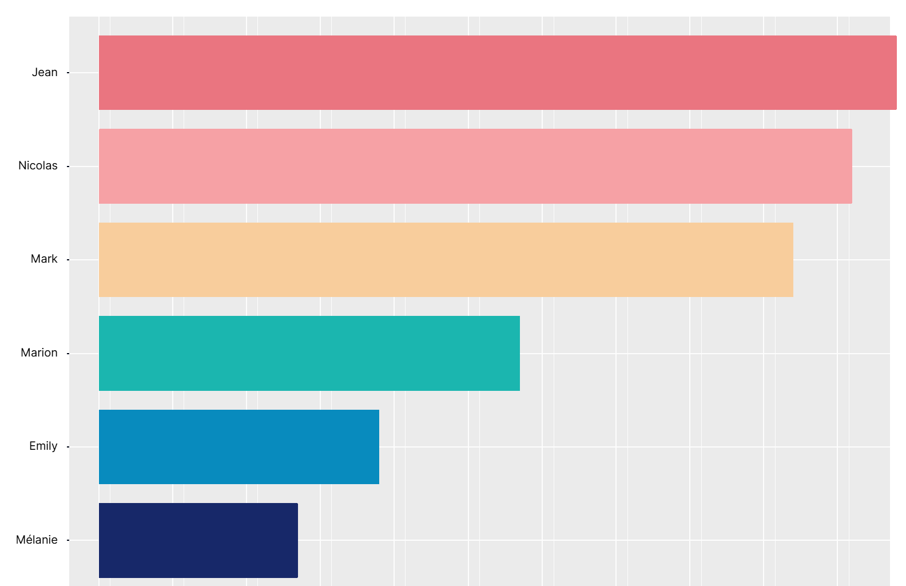
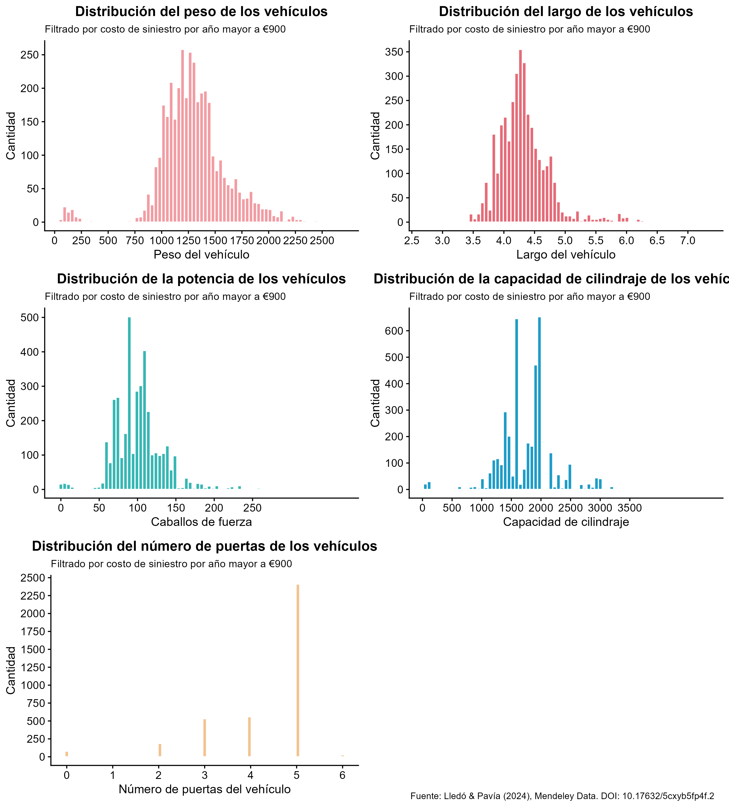
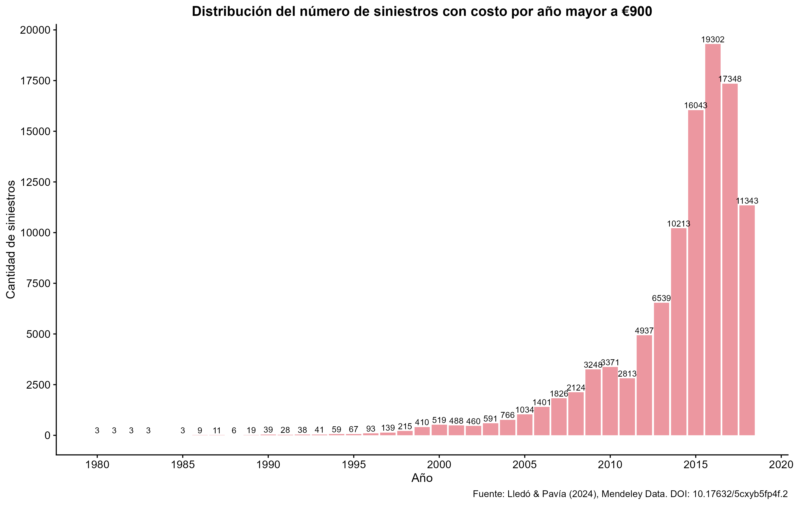

```{=latex}
\setcounter{page}{1} 
```

\newpage

# Parte de planificación

El pleno entendimiento de los elementos conceptuales y metodólogicos del proyecto constituye un pilar fundamental en el óptimo desarrollo del trabajo, en vías de que este último se mantega alineado tanto al problema planteado inicialmente como a los intereses investigativos del equipo. En vista de lo anterior, el objetivo de la sección de planificación de la presente bitácora está orientado a profundizar en los elementos mencionados antes, de manera que se esclarezca con mayor intensidad al lector la idea propuesta.

## Ordenamiento de la literatura

Los elementos metodológicos y conceptuales se construyen a partir de dos fuentes: la primera fuente consiste en la información consultada, dentro de la cual se comtempla la literatura además del acceso a los datos; por otro lado, la segunda fuente proviene de la interpretación y el manejo de la información consultada por parte de lo miembros del equipo.

Si bien en la primera bitácora se acudió a los planteamiento de diversos autores, es preciso que la información mantenga una estructura. En motivo de esto, la tabla siguiente detalla el ordenamiento de la literatura cosultada a partir de su respectiva clasificación: metodológica, temática o teórica, la cual está acompañada de un breve texto que respalda su escogencia. Es importante destacar que además de las fichas literarias construidas en la bitácora pasada, se incluyeron algunas adicionales, que fueron consideradas pertinentes para un análisis de mayor completitud.

\begin{longtable}{|p{2.3cm}|p{6cm}|p{2.5cm}|c|p{2.5cm}|}

\caption{Clasificación de la literatura revisada}
\label{tab:literatura} \\

\hline
\textbf{Clasificación} & \textbf{Justificación breve} & \textbf{Título} & \textbf{Año} & \textbf{Autor(es)} \\
\hline
\endfirsthead

\hline
\textbf{Clasificación} & \textbf{Justificación breve} & \textbf{Título} & \textbf{Año} & \textbf{Autor(es)} \\
\hline
\endhead

\hline
\endfoot

Teórica &
El documento desarrolla principios básicos y generales de modelación de variables y fundamentos probabilísticos que ciertamente sirven como base conceptual para distintos tipos de análisis. &
Loss Data Analytics &
2021 &
Edward Frees \\
\hline

Temática &
Explica la modelación del valor esperado de las variables que el proyecto pretende estudiar: la frecuencia y la severidad; a partir del uso de datos similares y la inclusión de elementos telemáticos. &
Modelos predictivos del riesgo y aplicaciones a los seguros &
2021 &
Montserrat Guillen, María Láinez, Ana M. Pérez-Marín y Eduardo Sánchez \\
\hline

Temática &
La etiqueta se eligió porque el artículo estudia los accidentes de tránsito desde una perspectiva demográfica, geográfica y económica, alineada con el proyecto. Identifica factores clave como la edad del conductor y el tipo de vehículo, relacionados con la frecuencia y severidad de los siniestros. Su contribución es principalmente contextual, ya que ayuda a entender el fenómeno presente en la base de datos. &
Accidentes de tránsito, un problema de salud pública: revisión sistemática. &
2024 &
Adriana Elizabeth Alvia Párraga y Sandra Linares Giler \\
\hline

Metodológica &
Se eligió esta clasificación porque el artículo no solo desarrolla la base teórica de la asimetría de la información (selección adversa y riesgo moral), sino que también aplica un modelo econométrico de datos de conteo (específicamente, un modelo binomial negativo inflado de ceros) a una muestra real de 60,000 pólizas, con el fin de identificar variables significativas en la siniestralidad. &
Los siniestros en el seguro del automóvil: un análisis econométrico aplicado &
2005 &
M.C. Melgar Hiraldo y F.M. Guerrero Casas \\
\hline

Metodológica &
Se eligió esta etiqueta pues el artículo compara distribuciones como la Poisson, binomial negativa y Poisson-inversa gaussiana y sus modificaciones cero infladas para ver cuál brinda el mejor ajuste a los datos de severidad. &
Modelización del tiempo de hospitalización en lesiones por tránsito &
2015 &
Mercedes Ayuso-Gutiérrez, Lluís Bermúdez-Morata y Miguel Santolino-Prieto. \\
\hline

Metodológica &
El análisis de correlación permite comprobar la existencia de una relación lineal entre variables específicas, lo cual constituye una metodología de interés para el proyecto. &
Correlación: teoría y práctica &
2016 &
Pablo Vinuesa \\
\hline

Metodológica &
Este estudio propone una metodología que podría adaptarse de manera efectiva en el proyecto que se está planteando. Esto, ya que el tema es parecido, frecuencia y severidad de seguros de automóviles. El artículo propone un procedimiento concreto para seleccionar distribuciones, estimar parámetros y evaluar ajuste, más que desarrollar una teoría nueva o revisar la evolución histórica del problema. &
Modeling the Frequency and Severity of Auto Insurance Claims Using Statistical Distributions &
2018 &
Cyprian Ondieki Omari, Shalyne Gathoni Nyambura y Joan Martha Wairimu Mwangi \\
\hline

Metodológica &
Se eligió esta etiqueta porque no solamente habla de la teoría de la frecuencia y severidad, sino que da una guía de cómo modelarlos estadísticamente con modelos lineales generalizados (GLM), además, el capítulo 3 es sobre el proceso de construir el modelo. &
Generalized Linear Models for Insurance Rating &
2025 &
Mark Goldburd, Anand Khare, Dan Tevet y Dmitriy Guller \\
\hline

Metodológica &
El análisis de correlación permite comprobar la existencia de una relación lineal entre variables específicas, lo cual constituye una metodología de interés para el proyecto. &
Correlation Analysis: exploring Relationships between Variables &
2025 &
Shivani Patel \\
\hline

\end{longtable}

# Enlaces de la literatura

Con el objetivo de crear un espacio de interacción entre las fuentes empledas, a partir del ordenamiento detallado en el apartado anterior, se crearán enlaces entre los distintos recursos consultados; de manera que a cada documento se le destinan tres párrafos con la siguiente estructura: un resumen de sus principales planteamientos, su contraste con otro documento de la lista y las observaciones del equipo en torno al contraste efectuado. Asimismo, el presente apartado se divide en tres áreas: teórica, temática y metodológica; las cuales coinciden con la clasificación de las fichas de literatura.

## Sección teórica

### Frees (2021)

#### *Loss Data Analytics*

Este libro presenta información acerca del análisis de pérdida en el ámbito asegurador y explica cómo el riesgo puede estudiarse a partir de herramientas estadísticas y probabilísticas. Para el contexto de este proyecto, el documento sostiene que el riesgo asegurador puede analizarse separando dos componentes principales: el número de siniestros que ocurren (frecuencia) y el costo asociado a cada uno de ellos (severidad), utilizando distribuciones probabilísticas distintas para cada componente según la naturaleza de los datos y el comportamiento observado en los registros. El problema principal que aborda el autor es cómo representar matemáticamente el riesgo en seguros cuando las pérdidas no son determinísticas, es decir, cuando no es posible predecir con exactitud ni cuántos eventos ocurrirán ni cuál será el costo económico asociado a cada uno. Su propuesta funciona porque separa dos procesos aleatorios distintos: por un lado, cuántos siniestros ocurren en un periodo determinado, y por otro, cuánto cuesta cada uno de esos eventos. Esta división permite trabajar cada variable de forma independiente y asignar distribuciones diferentes según su comportamiento estadístico, lo cual mejora la capacidad de ajuste de los modelos. El autor también señala que uno de los principales retos en este tipo de análisis es seleccionar distribuciones adecuadas, ya que los datos de seguros suelen presentar asimetría, presencia de valores extremos y heterogeneidad entre asegurados. Estas características dificultan que un único modelo funcione correctamente en todos los contextos, por lo que la elección de la distribución debe hacerse considerando el tipo de cartera, el comportamiento histórico de los datos y el objetivo del análisis.

El enfoque presentado por @frees2021 coincide con @goldburd2025 en que ambos reconocen que el riesgo asegurador debe modelarse a partir de herramientas estadísticas capaces de representar la incertidumbre presente en los siniestros. En ambos textos, se parte de que las pérdidas no son determinísticas y que variables como la frecuencia y la severidad requieren un tratamiento diferenciado debido a su comportamiento estadístico particular. La principal diferencia entre el criterio de los autores radica en el nivel de complejidad del modelado propuesto. El libro de análisis de pérdida de @frees2021 presenta una estructura más clásica, donde primero se separan frecuencia y severidad para luego seleccionar distribuciones probabilísticas apropiadas para cada componente según el comportamiento observado en los datos. En cambio, @goldburd2025 propone el uso de modelos lineales generalizados como una herramienta más flexible, que permite relacionar directamente la variable respuesta con múltiples variables explicativas mediante funciones de enlace y distribuciones pertenecientes a la familia exponencial. Mientras el enfoque clásico prioriza comprender la estructura probabilística de cada componente del riesgo, el texto de @goldburd2025 enfatiza la capacidad de incorporar factores de clasificación del asegurado, como edad, tipo de cobertura o historial de siniestros, dentro de un solo modelo estadístico. Esto permite no solo describir el comportamiento de las pérdidas, sino también mejorar el proceso de tarificación al identificar el efecto individual de cada predictor sobre el riesgo.

A partir de este contraste, puede observarse que ambos enfoques son complementarios más que opuestos. La separación entre frecuencia y severidad sigue siendo una base conceptual importante porque permite entender primero la naturaleza de los datos antes de construir modelos más complejos. Viendo esto, el enfoque clásico de @frees2021 resulta útil como fundamento teórico inicial, pero el uso de GLM (como en el libro de @goldburd2025) representa mayor precisión cuando se dispone de bases de datos más completas y se busca una tarificación. Esto es especialmente relevante en proyectos como el presente donde ya se cuenta con variables diferenciadas y se desea evaluar qué factores tienen mayor influencia en el comportamiento de los siniestros.

## Sección temática

### Guillen et al. (2021)

#### *Modelos predictivos del riesgo y aplicaciones a los seguros*

A lo largo del capítulo, @guillen2021 profundiza en la modelación de la frecuencia y la cuantía de los siniestros para predecir el valor esperado de ambas variables. En el caso de la frecuencia, explica que el modelo básico para predecir el número esperado de siniestros corresponde al modelo de Poisson, cuyos parámetros se estiman a través de la máxima verosimilitud, además, señala que en muchos casos suele presentarse una sobredispersión en los datos o un exceso de ceros, por lo que se aconseja emplear ciertas extensiones del modelo básico de Poisson, por ejemplo, el modelo binomial negativo. En lo que respecta a la cuantía, las autoras esclarecen que es posible utilizar el modelo Gamma para predecir su valor esperado, en el cual la variable sea estrictamente positiva; de igual manera, los parámetros son estimados a partir de la máxima verosimilitud. Por otro lado, se resalta que el uso de elementos telemáticos, como lo son el total de kilómetros recorridos, el número de trayectos realizados, la velocidad media de cada trayecto, la detención abrupta y las aceleraciones, permite acceder a un mayor conocimiento del riesgo y por lo tanto, mejora la modelación del valor esperado de la frecuencia y la cuantía.

En el recurso titulado *Modeling the frequency and severity of auto insurance claims using statistical distributions,* @omari2018modeling proporcionan una guía en torno a la modelación de la frecuencia y la severidad de los reclamos en seguros de automóviles; así, se identifican algunos puntos de encuentro entre esta fuente y lo planteado por @guillen2021 . En primera instancia, dentro de las distribuciones recomendadas por @omari2018modeling para modelar la frecuencia de los reclamos, se sitúa la distribución binomial negativa, que concuerda con lo aconsejado por los autores del presente subapartado. Asimismo, el escenario análogo se presenta en la modelación de la severidad o cuantía de los siniestros, de manera que los dos recursos definen a la distribución Gamma como una opción viable. En segunda instancia, se visualiza que ambos documentos emplean el método de la máxima verosimilitud para estimar los parámetros de las distribuciones utilizadas en los modelos, puesto que el mismo aprovecha al máximo toda la información de los parámetros contenida en la base de datos.

Finalmente, a partir del contraste realizado, se concluye que los planteamientos de las fuentes están alineados. Si bien ambos recursos proponen el uso de la distribución binomial negativa para modelar la frecuencia de los siniestros y la distribución Gamma para modelar la cuantía de los mismos, es preciso destacar la necesidad de analizar las características de los datos con los que se trabaja, ya que de acuerdo al rubro anterior, es posible que varíe la selección del modelo que mejor se ajusta al contexto.

### Alvia Párraga & Linares Giler (2024)

#### *Accidentes de tránsito, un problema de salud pública: revisión sistemática*

Este artículo analiza los accidentes de tránsito como un fenómeno de salud pública a partir de una revisión sistemática de literatura, con el objetivo de identificar los factores de riesgo más frecuentemente asociados a su ocurrencia. Para el contexto de este proyecto, las autoras sostienen que los accidentes de tránsito no se distribuyen de manera aleatoria entre la población, sino que responden a patrones definidos por variables demográficas, geográficas y económicas. Entre los factores identificados con mayor consistencia en la literatura revisada, destacan la edad del conductor, el tipo de vehículo involucrado, el entorno de circulación, ya sea urbano o rural, y el comportamiento al manejar, como el exceso de velocidad o la conducción bajo efectos de sustancias. El problema central que las autoras buscan resolver es por qué los accidentes de tránsito continúan siendo una causa relevante de mortalidad y morbilidad en la región latinoamericana, pese a los esfuerzos preventivos existentes. Si bien el artículo no desarrolla un modelo estadístico propio, su contribución radica en sistematizar la evidencia empírica disponible sobre los determinantes de la siniestralidad vial, lo que permite construir una base contextual sólida para comprender el fenómeno presente en la base de datos de este proyecto.

Al comparar el enfoque de @parraga2024accidentes con el de @guillen2021, se observa que ambas fuentes abordan la siniestralidad vehicular desde ángulos distintos pero complementarios. @guillen2021 se sitúan en un plano técnico-actuarial, orientado a modelar el valor esperado de la frecuencia y la severidad de los siniestros a partir de datos de pólizas reales, con un interés fundamentalmente metodológico orientado a mejorar la capacidad predictiva de los modelos. Por su parte, el primero adopta un enfoque de salud pública y se concentra en describir e interpretar los factores que explican la ocurrencia de los accidentes, sin llegar a construir modelos predictivos. Esta diferencia de propósito determina también una diferencia en el tipo de variables que cada fuente considera relevante: mientras @guillen2021 trabajan con variables propias de la cartera aseguradora, como el historial de reclamos o las características del contrato, el otro prioriza factores del entorno y del comportamiento humano, como la edad, la zona de circulación y el tipo de vehículo. En consecuencia, no se ofrecen herramientas estadísticas aplicables directamente, pero sí se identifican qué variables merecen atención explicativa, lo cual complementa la orientación más formal y cuantitativa de @guillen2021.

Partiendo de este contraste, puede señalarse que la revisión de @parraga2024accidentes aporta al proyecto un marco contextual que permite interpretar con mayor profundidad los patrones observados en la base de datos. Factores como la edad del conductor y el tipo de vehículo, identificados en la literatura de salud pública como determinantes de la siniestralidad, coinciden con las variables que este proyecto plantea analizar en relación con la frecuencia y la severidad de los siniestros. Esto brinda respaldo adicional para justificar la inclusión de dichas variables en los modelos estadísticos. Asimismo, el énfasis de @parraga2024accidentes en la zona de circulación como factor relevante es consistente con los hallazgos descriptivos obtenidos en el análisis exploratorio, donde se observaron diferencias en la siniestralidad entre zonas rurales y urbanas. En ese sentido, aunque @parraga2024accidentes no proveen una metodología directamente aplicable, su contribución es valiosa para fundamentar las decisiones de selección de variables y para enriquecer la interpretación de los resultados desde una perspectiva más amplia que la meramente actuarial.

## Sección metodológica

### Melgar & Guerrero (2005)

#### *Los siniestros en el seguro del automóvil: un análisis econométrico aplicado*

Este artículo analiza la frecuencia de los siniestros declarados en seguros de automóviles a partir de un modelo econométrico de datos de conteo aplicado a una muestra real de 60.000 pólizas. Para el contexto de este proyecto, los autores sostienen que la variable dependiente, que corresponde al número de siniestros reportados, presenta una alta concentración de ceros que no puede explicarse únicamente por la ausencia de eventos, sino también por la decisión de algunos asegurados de no declarar ciertos siniestros de baja cuantía. Ante este comportamiento, los autores proponen un modelo binomial negativo inflado de ceros (ZINB), que separa dos procesos distintos: uno que modela la probabilidad de pertenecer al grupo que nunca declara siniestros y otro que modela el conteo entre quienes sí lo hacen. El problema principal que los autores intentan resolver es cómo identificar los factores asociados al perfil del conductor, las características del vehículo y el nivel de cobertura que inciden de manera significativa en la frecuencia de los siniestros declarados, tomando en cuenta además los fenómenos de selección adversa y riesgo moral propios del mercado asegurador. Sus conclusiones señalan que variables como la edad del conductor, el tipo de cobertura contratada y la antigüedad con la aseguradora resultan estadísticamente significativas para explicar la siniestralidad, lo que refuerza la relevancia de incorporarlas en modelos de este tipo.

Al poner en perspectiva el enfoque de @hiraldo2005siniestros con el propuesto por @goldburd2025, se observa que ambos comparten el objetivo de modelar la siniestralidad a partir de variables explicativas del asegurado y del vehículo; sin embargo, difieren sustancialmente en el tratamiento que cada uno propone para los datos. @goldburd2025 desarrollan una metodología basada en Modelos Lineales Generalizados que asume cierta regularidad en los datos y una relación directa entre los predictores y la variable respuesta mediante una función de enlace. Esta aproximación resulta efectiva cuando la distribución de los datos se ajusta a la familia exponencial y no presenta anomalías severas. @hiraldo2005siniestros, en cambio, parten de un escenario donde los supuestos de los GLM convencionales no se cumplen, específicamente ante la presencia de un exceso de ceros que no responde únicamente a la ausencia de riesgo, sino también a comportamientos no observados como la no declaración de siniestros. En ese sentido, mientras @goldburd2025 ofrecen una guía metodológica general y flexible para la modelación de la frecuencia y la severidad, @hiraldo2005siniestros brindan una solución específica para contextos donde la estructura de los datos exige mayor complejidad en el modelo. Otra diferencia relevante es que @hiraldo2005siniestros centran su análisis exclusivamente en la frecuencia, dejando fuera la dimensión de la severidad, aspecto que sí aborda @goldburd2025 dentro de su propuesta integral.

Bajo esta comparativa, el enfoque de @hiraldo2005siniestros resulta especialmente pertinente para este proyecto, dado que la variable N_claims_year presenta una concentración muy elevada de ceros, situación análoga a la descrita en el artículo. Por lo tanto, antes de aplicar directamente la metodología GLM propuesta por @goldburd2025, conviene evaluar si la estructura de los datos justifica el uso de modelos inflados de ceros. Si dicha evaluación confirma un exceso de ceros que va más allá de lo esperado por las distribuciones clásicas, el modelo ZINB representaría una alternativa más adecuada para la variable de frecuencia. En paralelo, la selección de variables significativas identificada por @hiraldo2005siniestros, como la edad del asegurado y la antigüedad con la aseguradora, es consistente con las hipótesis planteadas en la pregunta de investigación, lo que refuerza la inclusión de dichas variables en los modelos a construir en etapas posteriores del proyecto.

### Ayuso-Gutiérrez et al. (2015)

#### *Modelización del tiempo de hospitalización en lesiones por tránsito*

Este artículo compara distintas distribuciones de probabilidad discretas para modelar los días de hospitalización por accidentes de tránsito. Para el contexto de este proyecto, los autores sostienen que las distribuciones que se utilizan comúnmente como las Poisson no obtienen un buen ajuste debido a una gran cantidad de ceros en los datos o sobredispersión de los mismos. Es por ello que los autores optan por realizar una comparación entre distribuciones como la binomial negativa o la Poisson-inversa gaussiana incluyendo versiones cero infladas de cada una de ellas. El problema principal que los autores intentan responder es cómo identificar los factores sociodemográficos y las lesiones que influyen en el tiempo de hospitalización de las víctimas de accidentes de tránsito, donde hay un alto número de observaciones concentrado en un solo valor, en este caso 0 días de hospitalización. Con el desarrollo del trabajo los autores concluyeron que la distribución Poisson-inversa gaussiana cero inflada dio mejores resultados para determinar los factores que influyen en la duración de hospitalización. Además de esto, señalaron que una de las grandes limitaciones fue que no se dispone de información sobre la severidad de las lesiones, tampoco se posee información acerca del uso de dispositivos de seguridad, ubicación de los pasajeros o conducción bajo los efectos de sustancias, factores que podrían influir en la precisión del modelo.

En contraste con @hiraldo2005siniestros, quienes aplican un modelo binomial negativo inflado de ceros para lograr modelar la frecuencia de siniestros en seguros de automóviles, mientras que @ayuso2015modelizacion usan la misma lógica pero para el caso de la severidad, modelando los días de hospitalización por accidentes de tránsito. Ambos coinciden en que distribuciones tradicionales como la Poisson o la binomial negativa no generan un buen ajuste cuando los datos tienen un exceso de ceros, y que las versiones cero infladas de esas distribuciones brindan un mejor resultado. Sin embargo, @hiraldo2005siniestros trabajan con un conteo pues están modelando la frecuencia, mientras que @ayuso2015modelizacion utilizan una modelación de tiempo, pues miden los días de hospitalización. Por lo que, a pesar de que ambos trabajos utilizan versiones de distribuciones cero infladas, las distribuciones específicas que usan son distintas, la binomial negativa cero inflada para conteos en el caso de @hiraldo2005siniestros y la Poisson-inversa gaussiana cero inflada para el caso de @ayuso2015modelizacion.

A partir de este contraste, la lógica de la utilización de distribuciones cero infladas es aplicable tanto para la frecuencia como para la severidad, pero utilizando distribuciones distintas. Para el contexto de esta investigación esta metodología resulta altamente aplicable, pues la variable "Cost_claims_year" presenta una concentración alta en el valor de €0 y en €900. Aunque @ayuso2015modelizacion modelan el número de días de hospitalización y no costos monetarios, la técnica de comparar distintas distribuciones cero infladas podría adaptarse para el caso de seguros de automóviles. Por esto, para el proyecto se considerará utilizar una distribución Poisson-inversa gaussiana cero inflada para modelar la variable "Cost_claims_year", además de otras distribuciones para ver cuál se adapta mejor, además, se utilizará la interpretación de coeficientes mediante exp(β) para medir el impacto de cada variable en la severidad.

### Omari et al. (2018)

#### *Modeling the Frequency and Severity of Auto Insurance Claims Using Statistical Distributions*

El artículo establece que la frecuencia y la severidad de los reclamos en seguros de automóviles deben modelarse por separado, utilizando distribuciones ajustadas a las características observadas en los datos. Los autores plantean que la selección del modelo debe basarse en un procedimiento estadístico ordenado que incluya estimación por máxima verosimilitud y pruebas de bondad de ajuste con el fin de identificar qué distribución representa mejor cada componente del riesgo. El problema principal que intentan resolver es cómo escoger distribuciones adecuadas para representar la frecuencia y la severidad de las reclamaciones, ya que una elección inadecuada puede afectar directamente el cálculo de reservas, primas y proyecciones financieras dentro del sistema asegurador. Su propuesta funciona bien como punto de partida porque sigue una secuencia clara: primero se seleccionan familias de distribuciones posibles, luego se estiman sus parámetros mediante máxima verosimilitud y finalmente se comparan los ajustes con indicadores estadísticos. Además, los autores señalan que uno de los principales problemas al modelar reclamaciones de seguros es que los datos no siguen distribuciones simples debido a su comportamiento estadístico. En particular, se observa asimetría positiva, presencia de colas pesadas y una alta concentración de valores cero en la frecuencia de siniestros. A partir del análisis realizado, los autores encuentran que la severidad presenta un mejor ajuste con una distribución lognormal, mientras que para la frecuencia se obtienen buenos resultados con distribuciones binomial negativa y geométrica. Esta diferencia responde al comportamiento particular de los datos observados, ya que la frecuencia y la severidad presentan patrones distintos y no pueden representarse adecuadamente con un solo modelo.

El artículo de @hiraldo2005siniestros coincide con el enfoque clásico de análisis de pérdidas en que ambos reconocen que la frecuencia de siniestros presenta un comportamiento estadístico complejo y que no puede modelarse adecuadamente con distribuciones simples en todos los casos. En ambos enfoques se parte de la necesidad de seleccionar modelos de acuerdo con las características empíricas de los datos, especialmente cuando existe heterogeneidad entre asegurados y una alta dispersión en las observaciones. Sin embargo, la diferencia principal entre ambos enfoques se trata de la forma en que se aborda el problema de los valores cero. Mientras el enfoque de @omari2018modeling propone evaluar distintas distribuciones de frecuencia y severidad por separado mediante criterios de ajuste y pruebas estadísticas, @hiraldo2005siniestros introducen un modelo binomial negativo inflado de ceros, argumentando que una parte importante de los ceros observados no corresponde únicamente a ausencia de siniestros, sino también a asegurados que estructuralmente no presentan reclamaciones o que no reportan eventos menores. Además, el enfoque de @omari2018modeling considera simultáneamente frecuencia y severidad como dos componentes fundamentales del riesgo, mientras que @hiraldo2005siniestros concentran su análisis únicamente en la frecuencia de siniestros, dejando fuera la magnitud económica de los reclamos. Esto hace que su propuesta sea especialmente útil para estudiar ocurrencia de eventos, pero menos completa cuando el interés también incluye el costo asociado a cada reclamación.

A partir de este contraste, puede observarse que la elección del modelo depende en gran medida de la estructura real de los datos disponibles. En un primer nivel, el enfoque de @omari2018modeling sigue siendo útil porque permite justificar la separación conceptual como tal entre frecuencia y severidad y evaluar distribuciones base. Sin embargo, cuando la frecuencia presenta una gran cantidad de ceros, como ocurre también en este proyecto con variables como N_claims_year y N_claims_history, resulta razonable considerar modelos más flexibles como los inflados de ceros. Esto sugiere que antes de seleccionar un modelo definitivo no basta con identificar qué distribución ajusta mejor en términos globales, sino que también es necesario interpretar qué significado tienen los patrones observados en la base de datos. En ese sentido, una alta proporción de ceros puede reflejar distintos comportamientos de los asegurados y no únicamente ausencia de riesgo.

### Patel (2025)

#### *Correlation Analysis: exploring Relationships between Variables*

A través de diversos ejes temáticos, la autora aborda introductoriamente el análisis de correlación. Se argumenta que este último evalúa el grado de asociación entre variables determinadas, con el objetivo de estudiar la forma en la que los cambios en una variable están relacionados con los cambios en otra variable. Existen diferentes tipos, no obstante, el documento se enfoca en aquellos que están basados en la dirección: la correlación positiva y la correlación negativa. Así, a partir del coeficiente de correlación, un índice que varía en el intervalo de menos uno a uno, se identifica una correlación positiva cuando su valor es cercano a uno y por el contrario, se expresa una correlación negativa cuando su valor es cercano a menos uno; por otro lado, se distingue una correlación débil cuando el coeficiente adopta un valor cercano a cero. Seguidamente, @patel2025 explica las múltiples funcionalidades que posee el análisis de correlación, de las cuales se rescatan dos principales: en primer lugar, constituye un apoyo en la identificación de patrones en los datos, lo que representa una guía tanto en los análisis posteriores como en los procesos de toma de decisiones; en segundo lugar, está inmerso en la selección de variables para la modelación y el análisis, dado que permite la escogencia de las variables más relevantes de acuerdo a los elementos bajo estudio, mejorando la precisión de los modelos. Pese a su gran utilidad, la autora señala dos importantes limitaciones: el análisis de correlación asume una relación lineal entre las variables, de manera que no contempla las relaciones no lineales entre ellas u otras interacciones de mayor complejidad, asimismo, dicho análisis puede verse influenciado por los valores atípicos o las anomalías presentes en los datos.

En referencia a lo planteado por @vinuesa2016, se percibe que el contenido de ambos autores se complementa: Vinuesa también aborda el análisis de correlación e identifica a este último concepto como una medida de la relación lineal entre variables cuantitativas continuas. Asimismo, el autor proporciona una lista de intervalos de valores para el coeficiente, en los que la correlación muestra distintas intensidades: despreciable, baja, media y alta; concretando en números específicos lo mencionado por @patel2025. Por otro lado, a diferencia de la autora, Vinuesa proporciona una noción sobre las medidas estadísticas que permiten evaluar la correlación entre las variables, de manera que aborda superficialmente tres de ellas: el coeficiente de determinación, de Pearson y de Kendall. Además, explora la idea intuitiva de la correlación, al asociarla con los conceptos de la varianza y la covarianza.

A partir del contraste desarrollado, es posible identificar que, si bien el documento de @patel2025 constituye una breve introducción al análisis de correlación, su contenido se limita a expresar este último como un conjunto de conceptualizaciones, lejos de entenderlo como un fenómeno matemático complejo bajo el cual subyace la interacción de una diversidad de elementos. Asimismo, en vista de que su objetivo radica únicamente en brindar una idea en torno al concepto de correlación, se priva al lector de información que podría guiarlo en la potencial implementación de dicha herramienta de acuerdo a las características de los datos, en consecuencia, se limita la trascendentalidad de la fuente.

### Vinuesa (2016)

#### *Correlación: teoría y práctica*

En el presente documento, @vinuesa2016 aborda el concepto de la correlación, definiéndola como la relación lineal entre variables cuantitativas continuas. Señala que la misma se expresa a través de un coeficiente cuyos valores se sitúan entre menos uno y uno, donde ambos extremos indican la presencia de una perfecta correlación, negativa y positiva respectivamente. De igual modo, el autor hace hincapié en que el coeficiente, por sí mismo, es un indicador de la intensidad de la correlación, a la vez que brinda una lista de cuatro intervalos de valores para el coeficiente, en los que se clasifica el grado de correlación en despreciable, bajo, medio y alto. Por otro lado, Vinuesa ahonda en la idea intuitiva que subyace al concepto: la correlación se define en términos de la varianza y la covarianza de las variables, de forma que constituye una medida de su variación conjunta. Sin embargo, resalta que el obstáculo en utilizar la covarianza como medida de relación, se ubica en que la misma no es una medida estandarizada: no es posible emplearla para evaluar variables cuyas unidades de medida sean distintas. En vista de esto, se presenta el coeficiente de Pearson, el cual busca solucionar el problema de la dependencia a las unidades de medición, al normalizar la covarianza tras dividirla con la desviación estándar, convirtiéndose en un coeficiente estandarizado. Es importante considerar que, en vías de desarrollar pruebas de significancia bajo el estadístico de Pearson, se requiere que las variables sean cuantitativas continuas, además de estar normalmente distribuidas. Esto último corresponde a una característica que no todas las variables poseen, en cuyo caso se introduce el coeficiente de Kendall, que al ser no paramétrico, resulta útil cuando las variables no siguen una distribución normal; en particular, el autor recomienda su uso en bases de datos pequeñas, que presentan muchos valores concentrados en el mismo rango. Finalmente, se aborda el coeficiente de determinación, que corresponde al coeficiente de correlación elevado al cuadrado; dicha herramienta mide la cantidad de la varianza total de la variable dependiente, que se explica a partir de la variable independiente.

En referencia a lo planteado por @patel2025, se determina que el contenido de los documentos se complementa, de manera que su lectura conjunta proporciona al lector una idea mayormente estructurada sobre el análisis de correlación. Por su parte, Patel se enfoca en introducir el análisis de correlación, a la vez que destaca su aplicabilidad en diversos contextos, dentro de los cuales se encuentran la toma de decisiones, la selección de variables para la modelación, así como la investigación y la prueba de hipótesis. Si bien la autora menciona ciertas limitaciones del concepto, se olvida de esclarecer un punto importante que @vinuesa2016 menciona: la correlación no implica necesariamente causalidad, debido a que es posible que la misma sea fortuita, ocasionada por la intervención de una tercera variable. En lo que respecta a Vinuesa, el autor profundiza en mayor medida en la teoría del análisis de correlación, sin embargo, no expone su potencial uso en escenarios relevantes, de manera que su acercamiento al concepto puede resultar rígido, al igual que distante de la realidad del lector. Asimismo, a diferencia de Patel, presenta ciertas medidas estadísticas mediante las cuales es posible evaluar la correlación entre las variables: el coeficiente de determinación, de Pearson y de Kendall.

A partir del contraste efectuado, se determina que la lectura de una sola fuente de las dos utilizadas, no es suficiente para construir una idea sólida en torno al análisis de correlación, puesto que ambos recursos abordan el concepto con objetivos diferentes. El texto de Vinuesa proporciona al lector una guía de las posibles herramientas a utilizar con la meta de estudiar la correlación entre las variables, no obstante, se olvida de argumentar la importancia del concepto que plantea, pues si bien profundiza en la intuición teórica detrás de él, no comunica el rol que este podría ocupar en situaciones que le conciernen al receptor.

### Goldburd et al. (2025)

#### *Generalized Linear Models for Insurance Rating*

Este libro presenta una guía para construir planes de tarifación utilizando Modelos Lineales Generalizados (GLM). En el contexto de esta investigación, los elementos metodológicos que utiliza tales como la selección de las distribuciones para la frecuencia y severidad, además del manejo de las variables continuas, categóricas y detección de relaciones no lineales, son elementos metodológicos que se podrían integrar a la investigación para determinar qué factores influyen en la frecuencia y severidad de los siniestros. El problema que abordan los autores es el de cómo crear un modelo de tarifación que se adecúe al riesgo de cada usuario o asegurado. Una de las grandes limitaciones es que estos modelos GLM se ajustan asumiendo que los datos son totalmente confiables y que no hay correlación en la aleatoriedad, pero en la vida real sí están correlacionados, por ejemplo cuando varios asegurados son afectados por un mismo desastre natural como una inundación.

En contraste con @ayuso2015modelizacion quienes proponen la utilización de distribuciones cero infladas para la modelación de la severidad cuando hay exceso de ceros, @goldburd2025 asumen que los datos son fiables y no presenta una solución para el caso en donde hay gran concentración de observaciones en un valor específico. Ambos trabajos concuerdan en la importancia de una buena selección de distribuciones para la modelación de severidad, pero con enfoques distintos, mientras @ayuso2015modelizacion realiza una comparación entre distribuciones para un caso específico como lo es los días de hospitalización, @goldburd2025 brindan más bien una metodología general para la selección de distribuciones y uso de Modelos Lineales Generalizados para determinar la relación entre variables, además de explicar cómo tratar con relaciones no lineales. De esta forma los autores de los trabajos se complementan, @goldburd2025 dan una versión general para modelar frecuencia y severidad y @ayuso2015modelizacion dan una solución a una situación específica como lo es la concentración de observaciones en un determinado valor.

A partir de este contraste, se puede determinar que el libro de @goldburd2025 es de gran utilidad para el proyecto desarrollado, ya que brinda una metodología paso a paso para modelar la frecuencia y severidad de siniestros, además del manejo de las variables categóricas, continuas y relaciones no lineales, además de la validación de modelos; de este modo, se podrán utilizar las técnicas de @goldburd2025 para seleccionar distribuciones, manejar relaciones no lineales y transformar variables categóricas. Sin embargo, para el caso de la variable "Cost_claims_year" la cual presenta una alta concentración de observaciones en los valores de 0 y 900, la metodología de @ayuso2015modelizacion servirá más que la de @goldburd2025, esto porque @ayuso2015modelizacion tratan el caso específico de concentraciones de observaciones en determinados valores.

# Análisis estadísticos

En este apartado se presenta el análisis exploratorio de los datos del proyecto. Esta etapa permite comprender mejor la información disponible y sirve como base para el modelado estadístico que se desarrollará posteriormente.

La pregunta de investigación que guía el análisis es la siguiente:

> ¿Cómo intervienen las variables de la edad del asegurado, la antigüedad con la aseguradora, el historial de siniestros y las características del vehículo, tanto en la frecuencia como en la severidad de los siniestros y qué factores explican el incremento abrupto en la cantidad de reclamos al momento que el costo de los mismos supera el monto de 900?

El análisis se centra en dos aspectos principales. Por un lado, se estudia la relación entre las características del asegurado, como la edad, la antigüedad con la aseguradora y el historial de siniestros, junto con las características del vehículo, como el tipo, el peso, el largo y el valor, con la frecuencia y la severidad de los siniestros. Por otro lado, se examina el comportamiento observado en la cantidad de reclamos cuando su costo supera los 900 euros, el cual representa un punto de interés dentro del análisis.

## Identidad visual

Para la elaboración de gráficos y figuras, en las secciones siguientes se detalla la plantilla propuesta, con el fin de mantener la uniformidad visual a lo largo del proyecto.

### Paleta de colores

En este caso, se seleccionó la paleta de colores *Pamplemousse*, disponible en el paquete LaCroixColoR, la cual puede consultarse mediante el enlace <https://r-graph-gallery.com/color-palette-finder.html?palette=pamplemousse>, dentro de la página web <https://r-graph-gallery.com/color-palette-finder> recomendada en el documento instructivo de la Bitácora 2. Esta paleta corresponde a una escala de seis colores diferentes, caracterizada por una transición desde tonos cálidos, esencialmente rosados y anaranjados, hasta tonos fríos turquesa y azul oscuro. En la siguiente figura se presenta la selección realizada, a manera de un primer vistazo a la paleta de colores. Esta imagen se obtuvo directamente de la página web de R Graph Gallery, y se copió tal como se mostraba.

{width="40%"}

Como justificación de la elección, esta paleta presenta colores visualmente atractivos y con suficiente contraste, pero manteniendo una apariencia equilibrada y agradable, sin llegar a ser excesivamente intensa, esto con el objetivo de mantener cierto nivel de formalidad en torno al desarrollo del proyecto. Los tonos cálidos permiten destacar ciertos elementos visuales de manera inmediata, mientras que los tonos fríos aportan formalidad, lo cual resulta adecuado para gráficos de carácter académico. Además, al realizar pruebas preliminares, se observó que la paleta ofrece buena legibilidad en pantalla y permite distinguir claramente diferentes niveles o categorías dentro de un gráfico.

Se considera que esta combinación de colores puede contribuir a mantener una identidad visual uniforme a lo largo del proyecto, permitiendo además flexibilidad en la representación de distintos tipos de información. Por ejemplo, los tonos azul oscuro pueden utilizarse para resaltar valores de mayor intensidad o curvas principales, mientras que los tonos intermedios y cálidos pueden emplearse para contrastar categorías, frecuencias o regiones de interés dentro de las figuras. Para conservar claridad visual, se propone utilizar fondos limpios, sin cuadrículas marcadas y con un estilo gráfico uniforme en todas las representaciones.

### Estilo de gráficos

Con el objetivo de que todos los gráficos del proyecto mantengan una presentación consistente, a continuación se muestra un gráfico de ejemplo que servirá como referencia visual para las figuras posteriores.

```{r, echo=FALSE, warning=FALSE, message=FALSE}
#Se importan las librerías requeridas y la base de datos para el ejemplo
library(ggplot2)
library(cowplot)
library(dplyr)
library(lubridate)
library(tidyverse)

datos <- read.csv("../../../datos/originales/Motor vehicle insurance data.csv", sep = ";")

#Se agregan los códigos de cada color
paleta_pamplemousse <- c(
  "#E56B78",
  "#F29CA3",
  "#F2C38F",
  "#36B7B4",
  "#1E9CC7",
  "#253494"
)
```

El siguiente gráfico funcionará como plantilla base para las demás figuras que se elaborarán en el proyecto. En primer lugar, dentro del código se configuran las opciones para ocultar warnings y mensajes automáticos, con el fin de evitar ruido visual innecesario en el PDF final de la bitácora y mantener una presentación más limpia. Asimismo, se incorpora una breve descripción en cada figura mediante su respectivo caption.

En cuanto al tamaño, se establece como referencia un ancho de 6 centímetros, acompañado de una altura ajustada según proporción áurea, con el propósito de conservar una relación visual armónica entre ancho y alto. Además, las figuras se alinean al centro para mantener uniformidad en la presentación del documento.

Como ejemplo, a continuación se presenta un histograma correspondiente a la variable *Premium* (prima del seguro). En este caso, se emplea la paleta seleccionada asignando distintos tonos en función de la frecuencia de cada barra: a mayor frecuencia, se utilizan colores más oscuros, mientras que las frecuencias menores se representan con tonos más claros. Esto permite resaltar visualmente las diferencias dentro de la distribución sin perder coherencia cromática.

Por otra parte, se utiliza el paquete cowplot para definir el estilo general de los gráficos, como se recomienda en las instrucciones.

```{r, warning=FALSE, message=FALSE, fig.cap="Ejemplo de gráfico con paleta de colores seleccionada y formato general",fig.width=5, fig.height=3.09, fig.align='center'}
datos %>% 
  ggplot(aes(x = Premium)) +
  geom_histogram(
    aes(fill = after_stat(count)),
    color = "white",
    bins = 50) +
  scale_fill_gradientn(colors = paleta_pamplemousse) +
  coord_cartesian(xlim = c(0, 1000)) +
  labs(
    title = "Distribución de primas de seguro",
    x = "Prima del seguro",
    y = "Frecuencia"
  ) +
  guides(fill = "none") +
  theme_cowplot(font_size = 12)
```

### Tipografía en figuras

En este caso, se decidió seguir la recomendación respecto al tamaño de la fuente, estableciendo un valor de 12 pt. Al observar el archivo PDF generado, se determinó que este tamaño resulta adecuado en relación con las dimensiones de la figura, ya que mantiene una buena proporción visual y permite una lectura clara sin inconvenientes.

### Nombre del estilo

En este caso, se decidió nombrar la identidad visual del grupo como "Estilo Grupo 3", tomando como referencia el número asignado al grupo de trabajo. A continuación, se presenta el código correspondiente, el cual se definirá una única vez y posteriormente podrá incorporarse en todos los gráficos sin necesidad de reescribirlo en cada ocasión, sino únicamente llamándolo mediante el nombre "estilo_grupo3". Se utiliza el paquete *cowplot* y el tamaño de fuente 12pt.

```{r, warning=FALSE, message=FALSE}
estilo_grupo3 <- theme_cowplot(font_size = 12) +
  theme(
    plot.title = element_text(face = "bold", hjust = 0.5),
    axis.title = element_text(size = 12),
    axis.text = element_text(size = 11)
  )
```

## Análisis descriptivo

### Análisis descriptivo de la base de datos

En primer lugar, se realizó el tratamiento inicial de la base de datos. En algunos casos fue necesario convertir ciertas variables al formato fecha, como se muestra a continuación. En las secciones siguientes, cuando se haga referencia a la base de datos, se entenderá que corresponde a esta versión ya modificada.

```{r carga-datos, warning=FALSE, message=FALSE, echo=FALSE}

datos <- read.csv("../../../datos/originales/Motor vehicle insurance data.csv", sep = ";")

datos_modificados <- datos %>% 
  mutate(
    Date_start_contract = as.Date(Date_start_contract, format = "%d/%m/%Y"),
    Date_last_renewal = as.Date(Date_last_renewal, format = "%d/%m/%Y"),
    Date_next_renewal = as.Date(Date_next_renewal, format = "%d/%m/%Y"),
    Date_birth = as.Date(Date_birth, format = "%d/%m/%Y"),
    Date_driving_licence = as.Date(Date_driving_licence, format = "%d/%m/%Y"),
    Date_lapse = as.Date(Date_lapse, format = "%d/%m/%Y"),
    categoria = case_when(
      Type_risk == 1 ~ "Motocicleta",
      Type_risk == 2 ~ "Furgoneta",
      Type_risk == 3 ~ "Turismo",
      Type_risk == 4 ~ "Agricola"
    ),
    edad = 2019 - year(Date_birth)
  )

```

Las transformaciones responden a necesidades concretas. Las variables de fecha estaban almacenadas como texto y debieron convertirse al formato `Date` para permitir cálculos temporales. La variable `categoria` se creó a partir de `Type_risk` para sustituir los códigos numéricos por etiquetas descriptivas, facilitando la interpretación visual. La variable `edad` se derivó restando el año de nacimiento al año de referencia 2019, último año completo de la base.

#### Información general del dataset

Antes de iniciar con el análisis de las variables, se presenta en la @tbl-info-general una descripción general de la base de datos utilizada. Este resumen permite identificar su tamaño, el número de asegurados incluidos, el periodo temporal cubierto y los tipos de vehículos considerados. Además, permite confirmar que la base contiene registros longitudinales, ya que un mismo asegurado puede aparecer en más de un año según sus renovaciones de póliza.

```{r tbl-info-general, echo=FALSE, warning=FALSE, message=FALSE}

#install.packages("kableExtra")
library(kableExtra)

datos_unicos <- datos_modificados %>%
  group_by(ID) %>%
  slice_max(Date_last_renewal, n = 1, with_ties = FALSE) %>%
  ungroup()

tabla_info <- data.frame(
  Característica = c(
    "Total de filas (transacciones de póliza por año)",
    "Total de columnas (variables)",
    "Asegurados únicos (por ID)",
    "Promedio de registros por asegurado",
    "Año más antiguo de inicio de contrato",
    "Año más reciente de renovación",
    "Tipos de vehículo cubiertos"
  ),
  Valor = c(
    format(nrow(datos_modificados), big.mark = ","),
    ncol(datos_modificados),
    format(n_distinct(datos_modificados$ID), big.mark = ","),
    round(nrow(datos_modificados) / n_distinct(datos_modificados$ID), 2),
    format(min(datos_modificados$Date_start_contract, na.rm = TRUE), "%Y"),
    format(max(datos_modificados$Date_last_renewal, na.rm = TRUE), "%Y"),
    "Turismo, Motocicleta, Furgoneta, Agrícola"
  )
)

#Tabla resumen elaborada con la librería knitr para mejor visualización

knitr::kable(
  tabla_info,
  caption = "Resumen general de la base de datos utilizada.",
  booktabs = TRUE,
  longtable = TRUE,
  align = c("l", "c")
) %>%
  kableExtra::kable_styling(
    latex_options = c("repeat_header"),
    full_width = FALSE,
    position = "center",
    font_size = 10
  ) %>%
  kableExtra::column_spec(1, width = "8cm") %>%
  kableExtra::column_spec(2, width = "5cm")
```

La base de datos confirma que cada persona puede tener múltiples registros anuales. Esta estructura longitudinal, mencionada en la bitácora 1, es valiosa porque permite analizar la evolución del riesgo a través del tiempo usando variables como `N_claims_history` y `R_Claims_history`. Para el análisis del perfil del asegurado se usará `datos_unicos` (una fila por asegurado, la renovación más reciente); para el análisis del comportamiento anual, `datos_modificados`.

#### Verificación del formato *tidy*

Antes de continuar con el análisis, se verificó que la base de datos tuviera una estructura adecuada para su manipulación en R. Para ello, se revisaron las primeras observaciones de la base modificada, con el fin de comprobar la organización de las filas y columnas, así como la forma en que se registran las variables principales.

Para esta verificación, se seleccionarion ciertas variables y las primeras 10 observaciones para ilustrar que los datos se encuentran en formato *tidy*, ya que cada fila representa una observación individual correspondiente a una anualidad de la póliza de un asegurado identificado por `ID`. Asimismo, cada columna corresponde a una variable específica, como características del asegurado, del vehículo o del historial de siniestros. Esta estructura garantiza que cada variable tiene su propia columna, cada observación su propia fila y cada tipo de unidad de análisis se mantiene consistente, lo que facilita su manipulación, visualización y análisis estadístico posterior.

```{r verificacion-tidy, echo=FALSE, warning=FALSE, message=FALSE}

datos_modificados %>%
  select(
    ID, Date_birth, Seniority, N_claims_history, Value_vehicle, N_claims_year, Cost_claims_year      
  ) %>%
  head(10) %>%
  kable(
    caption = "Verificación de formato Tidy",
    booktabs = TRUE, 
    longtable = TRUE,
    linesep = "",
    col.names = c("ID", "F. Nacimiento", "Antigüedad", "Hist. Siniestros", 
                  "Valor Vehículo", "N Siniestros", "Costo Anual")
  ) %>%
  kable_styling(
    latex_options = c("hold_position", "repeat_header", "scale_down"),
    full_width = FALSE,
    position = "center",
    font_size = 10
  )
```

### Limpieza de datos

#### Valores faltantes

Antes de continuar con el análisis, se revisó la presencia de valores faltantes en la base de datos. Esta verificación permite identificar cuáles variables presentan información incompleta y qué porcentaje representan estos valores respecto al total de registros. En el siguiente cuadro se muestran únicamente las variables que contienen al menos un valor faltante.

```{r tbl-missings, echo=FALSE, warning=FALSE, message=FALSE}

tabla_faltantes <- datos_modificados %>%
  summarise(across(everything(), ~ sum(is.na(.)))) %>%
  pivot_longer(cols = everything(),
               names_to = "Variable",
               values_to = "Total_NA") %>%
  mutate(Porcentaje = round(Total_NA / nrow(datos_modificados) * 100, 2)) %>%
  filter(Total_NA > 0) %>%
  arrange(desc(Porcentaje)) %>% 
  mutate(
    Total_NA = format(Total_NA, big.mark = ","),
    Porcentaje = paste0(Porcentaje, " %")
  ) %>% 
  rename(
    `Total de valores faltantes` = Total_NA,
    `Porcentaje de valores faltantes` = Porcentaje
  )

#Contiene únicamente las variables con valores faltantes

knitr::kable(
  tabla_faltantes,
  caption = "Resumen de valores faltantes por variable.",
  booktabs = TRUE,
  longtable = TRUE,
  align = c("l", "r", "r"),
  linesep = ""
) %>%
  kableExtra::kable_styling(
    latex_options = c("repeat_header"),
    full_width = FALSE,
    position = "center",
    font_size = 10
  ) %>%
  kableExtra::row_spec(0, bold = TRUE) %>%
  kableExtra::column_spec(1, width = "4.5cm") %>%
  kableExtra::column_spec(2, width = "4.5cm") %>%
  kableExtra::column_spec(3, width = "5cm")
```

Como se observa en la @tbl-missings, en términos porcentuales, la variable `Date_lapse` presenta el mayor nivel de valores faltantes, con un 66.70%, lo que evidencia una ausencia importante de información y limita considerablemente su utilidad en el análisis. Por su parte, la variable `Length` muestra un 9.79% de datos faltantes, lo cual corresponde a un nivel intermedio, mientras que `Type_fuel` presenta únicamente un 1.67%, considerado bajo.

Dado este comportamiento, en los análisis posteriores se excluirá la variable `Date_lapse` debido a la alta proporción de datos faltantes. En el caso de Length, se trabajará mediante imputación, por ejemplo utilizando la mediana según el tipo de vehículo, con el fin de conservar la información disponible. Finalmente, `Type_fuel` se manejará eliminando las filas con valores faltantes, ya que su baja proporción no afecta de manera significativa el tamaño de la muestra.

#### Detección de valores atípicos (*outliers*)

Como parte de la exploración inicial de los datos, se revisó la presencia de valores atípicos en las variables más relevantes del estudio. Esta se ve representada en el siguiente gráfico:

```{r grafico-outliers, echo=FALSE, fig.cap="Boxplots de variables clave para identificación de valores atípicos", fig.height=6}

library(tidyr)

datos_modificados %>%
  select(edad, Seniority, N_claims_year, Cost_claims_year, N_claims_history) %>%
  pivot_longer(
    cols = everything(),
    names_to = "Variable",
    values_to = "Valor"
  ) %>%
  filter(is.finite(Valor)) %>%
  ggplot(aes(x = Variable, y = Valor, fill = Variable)) +
  geom_boxplot(
    alpha = 0.7,
    outlier.shape = 21,
    outlier.color = paleta_pamplemousse[2],
    outlier.size = 1.5
  ) +
  scale_fill_manual(values = paleta_pamplemousse[1:5]) +
  facet_wrap(~ Variable, scales = "free", ncol = 3) +
  labs(
    title = "Identificación de valores atípicos en variables del proyecto",
    x = NULL,
    y = "Valor",
    caption = "Fuente: Lledó & Pavía (2024), Mendeley Data. DOI: 10.17632/5cxyb5fp4f.2"
  ) +
  estilo_grupo3 +
  theme(
    legend.position = "none",
    axis.text.x = element_blank(),
    plot.title = element_text(size = 12, face = "bold") 
  )
```

La variable `Cost_claims_year` presenta los valores extremos más marcados, lo cual indica que la mayoría de los siniestros tiene costos bajos o moderados, pero existen algunos reclamos con costos muy elevados que podrían influir de forma importante en el análisis de severidad.

En el caso de `N_claims_year` y `N_claims_history`, también se identifican valores atípicos, lo que sugiere que la mayoría de los asegurados registra pocos siniestros, mientras que algunos casos presentan una frecuencia mucho mayor. Esto es esperable en datos de seguros, donde los reclamos suelen concentrarse en una pequeña parte de los asegurados.

Para la variable edad, los valores atípicos se ubican en edades muy altas, cercanas o superiores a los 100 años, por lo que conviene revisar si corresponden a registros válidos o posibles errores. Finalmente, `Seniority` muestra asegurados con una antigüedad considerablemente mayor que la mayoría, lo cual puede representar clientes de larga permanencia en la aseguradora.

### Tablas resumen de las variables relevantes

En esta sección se presentan tablas resumen elaboradas a partir de las variables más relevantes del conjunto de datos. En particular, se consideran variables asociadas con el perfil de los asegurados, la frecuencia de los siniestros y los costos registrados, con el fin de identificar patrones generales que orienten el análisis posterior.

```{r tbl-categorias, echo=FALSE, warning=FALSE, message=FALSE}

tabla_categoria <- datos_unicos %>%
  group_by(categoria) %>%
  summarise(
    `N asegurados` = n(),
    `% del total` = round(n() / nrow(datos_unicos) * 100, 1),
    `Costo prom. siniestro` = round(mean(Cost_claims_year, na.rm = TRUE), 2),
    `Siniestros prom./año` = round(mean(N_claims_year, na.rm = TRUE), 3),
    `Sin siniestros (%)` = round(mean(N_claims_year == 0, na.rm = TRUE) * 100, 1)
  ) %>%
  arrange(desc(`N asegurados`))

tabla_categoria_formato <- tabla_categoria %>% 
  mutate(
    `N asegurados` = format(`N asegurados`, big.mark = ","),
    `% del total` = paste0(`% del total`, " %"),
    `Costo prom. siniestro` = format(`Costo prom. siniestro`, big.mark = ",", nsmall = 2),
    `Siniestros prom./año` = format(`Siniestros prom./año`, nsmall = 3),
    `Sin siniestros (%)` = paste0(`Sin siniestros (%)`, " %")
  ) %>% 
  rename(
    `Categoría` = categoria
  )

knitr::kable(
  tabla_categoria_formato,
  caption = "Resumen de variables relevantes según categoría.",
  booktabs = TRUE,
  longtable = TRUE,
  align = c("l", "r", "r", "r", "r", "r"),
  linesep = ""
) %>%
  kableExtra::kable_styling(
    latex_options = c("repeat_header"),
    full_width = FALSE,
    position = "center",
    font_size = 9
  ) %>%
  kableExtra::row_spec(0, bold = TRUE) %>%
  kableExtra::column_spec(1, width = "1.5cm") %>%
  kableExtra::column_spec(2, width = "2.0cm") %>%
  kableExtra::column_spec(3, width = "2.0cm") %>%
  kableExtra::column_spec(4, width = "2.7cm") %>%
  kableExtra::column_spec(5, width = "2.7cm") %>%
  kableExtra::column_spec(6, width = "2.5cm")
```

Primeramente, y como se observa en la @tbl-categorias, la distribución de la cartera muestra un claro predominio del tipo de vehículo turismo, que concentra el 79.0% de los asegurados, muy por encima del resto de categorías. En segundo lugar se encuentran las furgonetas con un 12.3%, seguidas por las motocicletas con un 8.0%, mientras que la categoría agrícola representa una proporción marginal.

En términos de siniestralidad, se observa que la mayoría de los asegurados no presenta reclamos durante el año, con porcentajes superiores al 85% en todas las categorías y alcanzando incluso el 100% en el caso de los vehículos agrícolas. Este comportamiento evidencia una alta concentración de ceros en la variable del número de siniestros, lo que resalta la necesidad de emplear modelos que capturen este fenómeno.

Por otro lado, en referencia con la @tbl-zona, las furgonetas presentan la mayor frecuencia promedio de siniestros, mientras que los vehículos tipo turismo muestran el mayor costo promedio por siniestro. En contraste, las motocicletas exhiben tanto una baja frecuencia como un bajo costo promedio, lo que sugiere un perfil de riesgo distinto. En conjunto, estas diferencias reflejan que el tipo de vehículo es una variable relevante para explicar tanto la frecuencia como la severidad de los siniestros dentro de la cartera analizada.

```{r tbl-zona, echo=FALSE, warning=FALSE, message=FALSE}

tabla_zona <- datos_unicos %>%
  mutate(zona = ifelse(Area == 0, "Rural", "Urbano")) %>%
  group_by(zona) %>%
  summarise(
    `N asegurados` = n(),
    `% del total` = round(n() / nrow(datos_unicos) * 100, 1),
    `Costo prom. siniestro` = round(mean(Cost_claims_year, na.rm = TRUE), 2),
    `Siniestros prom./año` = round(mean(N_claims_year, na.rm = TRUE), 3),
    .groups = "drop"
  )


knitr::kable(
  tabla_zona,
  caption = "Resumen de variables relevantes según zona.",
  booktabs = TRUE,
  longtable = TRUE,
  align = c("l", "r", "r", "r", "r"),
  linesep = ""
) %>%
  kableExtra::kable_styling(
    latex_options = c("repeat_header"),
    full_width = FALSE,
    position = "center",
    font_size = 9
  ) %>%
  kableExtra::row_spec(0, bold = TRUE)

```

La mayoría de los asegurados se concentra en zonas rurales, con un 72.7% del total, mientras que el 27.3% restante corresponde a zonas urbanas. En cuanto al comportamiento de los siniestros, se observan diferencias leves entre ambas zonas. La zona urbana presenta una mayor frecuencia promedio de siniestros por año, así como un costo promedio ligeramente superior en comparación con la zona rural.

Aunque las diferencias no son particularmente pronunciadas, este patrón sugiere que la zona de circulación podría influir en la siniestralidad, posiblemente asociada a condiciones del tráfico, la densidad vehicular u otros factores propios del entorno urbano. En este sentido, la variable de zona se perfila como un posible factor explicativo dentro del análisis, especialmente en relación con las variaciones en la frecuencia y el costo de los siniestros.

Con el fin de complementar este análisis exploratorio, se procedió a calcular estadísticas descriptivas para las variables numéricas, utilizando la función `stat.desc()` del paquete *pastecs* en R.

Para ello, se calcularon medidas como número de observaciones, cantidad de valores nulos, mínimos, máximos, media, mediana, varianza, desviación estándar y coeficiente de variación. En este proceso se excluyó la columna identificadora (`ID`), ya que corresponde únicamente a un identificador de registros y no aporta información estadística relevante para el análisis.


```{r tbl-estad-desc, echo=FALSE, warning=FALSE, message=FALSE}
library(lubridate)
library(pastecs)

options(scipen = 999)

filas_clave <- c(
  "nbr.val", "nbr.null", "min", "max",
  "mean", "median", "std.dev", "coef.var"
)

datos_desc <- datos_modificados %>%
  mutate(
    Edad_asegurado = floor(time_length(interval(Date_birth, Date_start_contract), "years")),
    Antiguedad_licencia = floor(time_length(interval(Date_driving_licence, Date_start_contract), "years")),
    Edad_vehiculo = year(Date_start_contract) - Year_matriculation
  )

vars_relevantes <- c(
  "Edad_asegurado",
  "Seniority",
  "N_claims_year",
  "Cost_claims_year",
  "N_claims_history",
  "R_Claims_history",
  "Edad_vehiculo",
  "Power",
  "Value_vehicle",
  "Weight"
)

analisis_desc <- as.data.frame(
  round(
    stat.desc(datos_desc[, vars_relevantes]),
    4
  )
)

tabla_desc <- analisis_desc[filas_clave, ]

tabla_desc <- as.data.frame(t(tabla_desc))

tabla_desc <- data.frame(
  Variable = rownames(tabla_desc),
  tabla_desc,
  row.names = NULL
)

tabla_desc$Variable <- recode(
  tabla_desc$Variable,
  "Edad_asegurado" = "Edad del asegurado",
  "Seniority" = "Antigüedad con la aseguradora",
  "N_claims_year" = "Siniestros en el año",
  "Cost_claims_year" = "Costo de siniestros del año",
  "N_claims_history" = "Siniestros históricos",
  "R_Claims_history" = "Ratio histórico de siniestros",
  "Edad_vehiculo" = "Edad del vehículo",
  "Power" = "Potencia",
  "Value_vehicle" = "Valor del vehículo",
  "Weight" = "Peso"
)

colnames(tabla_desc) <- c(
  "Variable",
  "N válidos",
  "N nulos",
  "Mínimo",
  "Máximo",
  "Media",
  "Mediana",
  "Desv. estándar",
  "Coef. variación"
)

knitr::kable(
  tabla_desc,
  caption = "Estadísticos descriptivos de las variables cuantitativas relevantes para el análisis de frecuencia y severidad de los siniestros.",
  booktabs = TRUE,
  longtable = TRUE,
  align = c("l", rep("c", ncol(tabla_desc) - 1))
) %>%
  kableExtra::kable_styling(
    latex_options = c("repeat_header"),
    full_width = FALSE,
    position = "center",
    font_size = 8
  ) %>%
  kableExtra::column_spec(1, width = "2.3cm")
```

<<<<<<< HEAD
Las estadísticas descriptivas presentadas en @tbl-estad-desc permiten caracterizar el perfil de la cartera asegurada y su relación con la siniestralidad. En primer lugar, la variable `edad` muestra un rango amplio entre 19 y 101 años, con una media cercana a los 49 años y una mediana similar, lo que indica que la cartera está compuesta principalmente por asegurados de mediana edad, sin una fuerte asimetría en su distribución. Por su parte, la variable `Seniority` presenta una mediana de 4 años y una media de 6.7, lo que sugiere que predominan clientes relativamente recientes, aunque existen algunos asegurados con una relación más prolongada con la compañía.

En cuanto a la frecuencia de siniestros, la variable `N_claims_year` presenta una mediana igual a cero y una media de 0.39, evidenciando una alta concentración de valores nulos. Este patrón confirma la presencia de un exceso de ceros en la variable, lo cual resulta consistente con la necesidad de emplear modelos que capten este comportamiento. De manera similar, en la variable `Cost_claims_year` se observa una mediana de cero frente a una media considerablemente mayor, acompañada de un valor máximo extremadamente alto, lo que indica una distribución altamente asimétrica con cola derecha pesada. Esto sugiere que, aunque la mayoría de los asegurados no presenta costos por siniestros, existen pocos casos con costos muy elevados que influyen significativamente en el promedio.

Finalmente, las características del vehículo reflejan una flota relativamente homogénea. Variables como `Power`, `Weight` y `Length` presentan coeficientes de variación moderados o bajos, lo que indica una concentración en rangos típicos de vehículos estándar. En conjunto, estos resultados respaldan la relevancia de las variables demográficas y del vehículo en la explicación tanto de la frecuencia como de la severidad de los siniestros, en línea con la pregunta de investigación planteada.

### Visualización de datos

A través de la presentación de distintos gráficos, se abordará información relevante para abordar la pregunta de investigación.

```{r, warning=FALSE, message=FALSE, echo= FALSE}
# Data frame con las observaciones más recientes (eliminar duplicados)
datos_unicos <- datos_modificados %>% 
  group_by(ID) %>% 
  slice_max(Date_last_renewal, n = 1, with_ties = FALSE) %>% 
  ungroup()
```

#### Análisis de gráficos

En el presente subapartado se llevará a cabo la elaboración e interpretación de los gráficos que de momento se han considerado relevantes, los cuales se muestran a continuación.

Como se observa en la @fig-costo-reclamos, se presenta la distribución del costo de los siniestros por año, considerando únicamente los registros con costo entre €1 y €5000.

```{r fig-costo-reclamos, warning=FALSE, message=FALSE, echo=FALSE, fig.cap="Distribución del costo de siniestros por año", fig.align='center'}
datos_modificados %>%
  filter(Cost_claims_year > 0 & Cost_claims_year <= 5000) %>%
  ggplot(aes(x = Cost_claims_year)) +
  geom_histogram(bins=70, fill = paleta_pamplemousse[1]) +
  scale_x_continuous(breaks = seq(0, 5000, 500)) +
  labs(title = "Distribución del costo de siniestros por año",
       x = "Costo de Reclamos",
       y = "Cantidad",
       caption = "Fuente: Lledó & Pavía (2024), Mendeley Data. DOI: 10.17632/5cxyb5fp4f.2") +
  estilo_grupo3

costos_anyo_total <- datos_modificados %>%
  filter(Cost_claims_year > 0 & Cost_claims_year <= 5000) %>%
  ggplot(aes(x = Cost_claims_year)) +
  geom_histogram(bins=70, fill = paleta_pamplemousse[1]) +
  scale_x_continuous(breaks = seq(0, 5000, 500)) +
  labs(title = "Distribución del costo de siniestros por año",
       x = "Costo de Reclamos",
       y = "Cantidad",
       caption = "Fuente: Lledó & Pavía (2024), Mendeley Data. DOI: 10.17632/5cxyb5fp4f.2") +
  estilo_grupo3

ggsave("../../../bitacoras/bitacora_2/figuras/distibucion_costo_anyo_total.png",costos_anyo_total, width = 11, height = 7, dpi = 300)
```

El gráfico muestra que la distribución del costo de los siniestros es fuertemente asimétrica hacia la derecha, con la mayoría de los reclamos concentrados en valores bajos, por debajo de los €500. Sin embargo, destaca un pico pronunciado alrededor de los €900, donde la frecuencia aumenta de forma abrupta respecto a los valores cercanos, sugiriendo una concentración inusual de observaciones en ese monto específico. Este comportamiento constituye precisamente el fenómeno que la pregunta de investigación busca explicar, ya que no responde a una distribución continua y uniforme.

Por otra parte, en la @fig-edad-reclamos se representa la relación entre la edad y la cantidad histórica de reclamos. En este gráfico, la escala de color indica el conteo de observaciones: los tonos más oscuros, como el azul, representan una mayor concentración de asegurados, mientras que los tonos más claros, como el rosado, indican una menor concentración.

```{r fig-edad-reclamos, warning=FALSE, message=FALSE, echo=FALSE, fig.cap="Relación entre la edad del aegurado y reclamos totales", fig.align='center'}

datos_unicos %>% 
  ggplot(aes(x = edad, y = N_claims_history)) +
  geom_hex(bins = 55) + # Divide en hexágonos y cuenta
  scale_fill_gradientn(colors = paleta_pamplemousse, name = "Conteo") + # Color según densidad
  geom_smooth(method = "lm", color = paleta_pamplemousse[6]) + # Crear una regresión lineal
  scale_x_continuous(breaks = seq(20,100,10)) +
  labs(title = "Relación entre Edad e histórico de reclamos",
       x = "Edad", 
       y = "Número de reclamos",
       caption = "Fuente: Lledó & Pavía (2024), Mendeley Data. DOI: 10.17632/5cxyb5fp4f.2") +
  estilo_grupo3 +
  theme(plot.caption = element_text(hjust = 1.4))

dispersion_edad_h_reclamos <- datos_unicos %>% 
  ggplot(aes(x = edad, y = N_claims_history)) +
  geom_hex(bins = 55) + # Divide en hexágonos y cuenta
  scale_fill_gradientn(colors = paleta_pamplemousse, name = "Conteo") + # Color según densidad
  geom_smooth(method = "lm", color = paleta_pamplemousse[6]) + # Crear una regresión lineal
  scale_x_continuous(breaks = seq(20,100,10)) +
  labs(title = "Relación entre Edad e histórico de reclamos",
       x = "Edad", 
       y = "Número de reclamos",
       caption = "Fuente: Lledó & Pavía (2024), Mendeley Data. DOI: 10.17632/5cxyb5fp4f.2") +
  estilo_grupo3 +
  theme(plot.caption = element_text(hjust = 1.4))

ggsave("../../../bitacoras/bitacora_2/figuras/dispersion_edad_h_reclamos.png",dispersion_edad_h_reclamos, width = 11, height = 7, dpi = 300)

```

La mayor concentración de observaciones se encuentra en asegurados con pocos reclamos históricos, especialmente entre 0 y 5 reclamos, aunque se observa de igual manera gran concentración de cantidad de reclamos entre 5 y 20. Esto indica que, para la mayoría de los asegurados, el historial de reclamos es bajo, independientemente de la edad.

También, se aprecia que los reclamos históricos tienden a acumularse ligeramente conforme aumenta la edad. Esto puede deberse a que las personas de mayor edad han tenido más tiempo de permanencia como aseguradas y, por lo tanto, más oportunidades de registrar reclamos a lo largo del tiempo. Sin embargo, la relación no parece ser fuerte, ya que los puntos se encuentran bastante dispersos y existen asegurados de distintas edades con valores similares de reclamos.

Además, se observan algunos casos aislados con una cantidad alta de reclamos históricos, pero estos presentan baja concentración de observaciones. Por tanto, el gráfico sugiere que la edad puede estar asociada de manera leve con el historial de reclamos, aunque no explica por sí sola la variabilidad observada.

Por otra parte, la @fig-edad-num muestra una comparación de dos gráficos, el primero muestra la relación entre la edad del asegurado y el número de siniestros por año, mientras que el segundo gráfico muestra la relación entre la edad del asegurado y el número de siniestros histórico.

```{r fig-edad-num, warning= FALSE, message=FALSE,echo=FALSE, fig.cap = "Gráfico comparativo entre edad y numero de siniestros por año y siniestros totales", fig.height= 5.5, fig.align='center'}

siniestros_anyo <- datos_modificados %>%
  ggplot(aes(x = edad, y = N_claims_year)) +
  geom_jitter(alpha = 0.1, width = 0.2, height = 0.2, # Puntos
              color = paleta_pamplemousse[1]) +
  geom_smooth(method = "lm", color = paleta_pamplemousse[6]) + # Regresión lineal
  scale_x_continuous(breaks = seq(20,110,10)) +
  labs(title = "Relación entre edad y número de siniestros por año",
       x = "Edad del asegurado", 
       y = "Número de siniestros",
       caption =  "Fuente: Lledó & Pavía (2024), Mendeley Data. DOI: 10.17632/5cxyb5fp4f.2") +
  estilo_grupo3

siniestros_historico <- datos_unicos %>%
  ggplot(aes(x = edad, y = N_claims_history)) +
  geom_jitter(alpha = 0.1, width = 0.2, height = 0.2, 
              color = paleta_pamplemousse[1]) +
  geom_smooth(method = "lm", color = paleta_pamplemousse[6]) +
  scale_x_continuous(breaks = seq(20,110,10)) +
  labs(title = "Relación entre edad y número de siniestros histórico",
       x = "Edad del asegurado", 
       y = "Número de siniestros",
       caption =  "Fuente: Lledó & Pavía (2024), Mendeley Data. DOI: 10.17632/5cxyb5fp4f.2") +
  estilo_grupo3

plot_grid(siniestros_anyo,siniestros_historico,ncol=1)
dispersion_comparativo_siniestros_anyo_historico <- plot_grid(siniestros_anyo,siniestros_historico,ncol=1)

ggsave("../../../bitacoras/bitacora_2/figuras/dispersion_comparativo_siniestros_anyo_historico.png",dispersion_comparativo_siniestros_anyo_historico, width = 8, height = 7, dpi = 300)

```

En el primer gráfico se observa que la mayoría de los asegurados presenta pocos o ningún siniestro durante el año, independientemente de la edad. La línea de tendencia se mantiene prácticamente horizontal, por lo que no se aprecia una relación clara entre la edad del asegurado y la cantidad de siniestros anuales. Aunque existen algunos valores altos, estos aparecen como casos aislados y se concentran principalmente entre edades intermedias, donde también parece haber mayor cantidad de registros.

En el segundo gráfico, correspondiente al número histórico de siniestros, se observa una ligera tendencia creciente conforme aumenta la edad. Sin embargo, esta relación debe interpretarse con cuidado, ya que el número histórico de siniestros puede aumentar no solo por la edad del asegurado, sino también por el tiempo que la persona ha permanecido asegurada o por la cantidad de años acumulados dentro de la póliza. Por tanto, el incremento observado podría estar más relacionado con la exposición acumulada que con un mayor riesgo asociado directamente a la edad.

En general, los gráficos sugieren que la edad por sí sola no explica de forma fuerte la frecuencia de siniestros anuales. Para el historial de siniestros sí se observa un aumento leve, pero este podría estar influenciado por la antigüedad del asegurado y no únicamente por su edad.

La @fig-violin-combinado muestra la comparación entre la frecuencia y el costo por año según el tipo de vehículo, ya sea turismo (vehículo particular), motocicleta, furgoneta o agrícola.

{#fig-violin-combinado width="100%"}

```{r , warning= FALSE, message=FALSE, echo =FALSE, fig.align='center'}

violin_frecuencia <- datos_modificados %>%
  filter(is.finite(N_claims_year)) %>%
  mutate(categoria = factor(categoria,
                            levels = c("Turismo", "Motocicleta", "Furgoneta", "Agricola"))) %>% 
  ggplot(aes(x = categoria, y = N_claims_year, fill = categoria)) +
  geom_violin(alpha = 0.6, trim = FALSE) + # trim = False para que no corte las colas
  scale_fill_manual(values = paleta_pamplemousse[2:5]) +
  scale_y_log10(labels = scales::comma,
                breaks = c(1,2,3,4,5,10,15,20,25,30)) +
  labs(title = "Cantidad de siniestros por año según tipo de vehículo",
       x = "Tipo de vehículo", 
       y = "Cantidad el siniestros por año") +
  estilo_grupo3 +
  theme(legend.position = "none")

violin_costo <- datos_modificados %>%
  filter(is.finite(Cost_claims_year)) %>%
  mutate(categoria = factor(categoria,
                            levels = c("Turismo", "Motocicleta", "Furgoneta", "Agricola"))) %>% 
  ggplot(aes(x = categoria, y = Cost_claims_year, fill = categoria)) +
  geom_violin(alpha = 0.6, trim = FALSE) + 
  scale_fill_manual(values = paleta_pamplemousse[2:5]) +
  scale_y_log10(labels = scales::comma,
                breaks = c(100,500,1000,5000,10000,50000,100000)) + # Poner comas a los miles
  labs(title = "Costo de siniestros por año según tipo de vehículo",
       x = "Tipo de vehículo", 
       y = "Costo del siniestro por año") +
  estilo_grupo3 +
  theme(legend.position = "none")

violin_combinado <- plot_grid(violin_costo, violin_frecuencia) %>% 
  ggdraw() +
  draw_label("Fuente: Lledó & Pavía (2024), Mendeley Data. DOI: 10.17632/5cxyb5fp4f.2",
             x = 0.98, y = 0.02, hjust = 1, vjust = 2.5,  size = 9) +
  theme(plot.margin = margin(0, 0, 15, 0)) # Ajustar el margen inferior

ggsave("../../../bitacoras/bitacora_2/figuras/violin_combinado.png", violin_combinado, width = 11, height = 5, dpi = 300)

```

En el gráfico de la izquierda se observa que los costos de siniestros presentan una distribución bastante dispersa, con una alta concentración de valores bajos y algunos casos extremos de costos elevados. Esto indica que, aunque la mayoría de los reclamos tiende a mantenerse en montos relativamente bajos o moderados, existen siniestros puntuales que generan costos mucho mayores. Esta situación es visible principalmente en los vehículos de turismo y las furgonetas, donde la distribución se extiende hacia valores más altos.

En el caso de las motocicletas, los costos parecen concentrarse en rangos más bajos en comparación con los otros tipos de vehículos, aunque también se observan algunos valores elevados. Por su parte, los vehículos agrícolas no presentan una distribución visible, lo que podría deberse a una cantidad muy reducida de registros o a la ausencia de siniestros relevantes en esta categoría dentro de la base analizada.

En el gráfico de la derecha se muestra la cantidad de siniestros por año. La mayoría de los vehículos registra pocos siniestros anuales, principalmente entre uno y dos reclamos. Sin embargo, las furgonetas y los vehículos de turismo presentan una mayor dispersión, con algunos casos donde la cantidad de siniestros es considerablemente más alta. Esto sugiere que tales categorías de vehículo podrían estar asociadas con una mayor exposición al riesgo o con un uso más frecuente.

A manera de síntesis, la figura sugiere que el tipo de vehículo sí puede influir tanto en la frecuencia como en la severidad de los siniestros. Las furgonetas y los vehículos de turismo muestran una mayor variabilidad, mientras que las motocicletas parecen concentrarse en niveles más bajos.

La @fig-peso muestra la comparación entre la distribución de distintas características físicas del vehículo: el peso, el largo, la potencia, el cilindraje y el número de puertas, en los casos en donde se supera el umbral de los 900 euros.

```{r , warning= FALSE, message=FALSE, echo =FALSE, fig.align='center'}
peso_costo <- datos_modificados %>% 
  filter(Cost_claims_year >= 900) %>% 
  ggplot(aes(x= Weight)) +
  geom_histogram(bins = 75, color = "white", fill = paleta_pamplemousse[2]) +
  scale_x_continuous(breaks = seq(0,2500, 250)) +
  scale_y_continuous(breaks = seq(0,250,50))+
  labs(title = "Distribución del peso de los vehículos",
     subtitle = "Filtrado por costo de siniestro por año mayor a €900",
     x = "Peso del vehículo",
     y = "Cantidad")+
  estilo_grupo3

largo_costo <- datos_modificados %>% 
  filter(Cost_claims_year >= 900) %>% 
  ggplot(aes(x= Length)) +
  geom_histogram(bins = 75, color = "white", fill = paleta_pamplemousse[1]) +
  scale_x_continuous(breaks = seq(0,7,0.5)) +
  scale_y_continuous(breaks = seq(0,350,50))+
  labs(title = "Distribución del largo de los vehículos",
     subtitle = "Filtrado por costo de siniestro por año mayor a €900",
     x = "Largo del vehículo",
     y = "Cantidad")+
  estilo_grupo3

potencia_costo <- datos_modificados %>% 
  filter(Cost_claims_year >= 900) %>% 
  ggplot(aes(x= Power)) +
  geom_histogram(bins = 75, color = "white", fill = paleta_pamplemousse[4]) +
  scale_x_continuous(breaks = seq(0,250,50)) +
  labs(title = "Distribución de la potencia de los vehículos",
     subtitle = "Filtrado por costo de siniestro por año mayor a €900",
     x = "Caballos de fuerza",
     y = "Cantidad")+
  estilo_grupo3

cilindraje_costo <- datos_modificados %>% 
  filter(Cost_claims_year >= 900) %>% 
  ggplot(aes(x= Cylinder_capacity)) +
  geom_histogram(bins = 75, color = "white", fill = paleta_pamplemousse[5]) +
  scale_x_continuous(breaks = seq(0,3500,500)) +
  scale_y_continuous(breaks = seq(0,600,100)) +
  labs(title = "Distribución de la capacidad de cilindraje de los vehículos",
     subtitle = "Filtrado por costo de siniestro por año mayor a €900",
     x = "Capacidad de cilindraje",
     y = "Cantidad")+
  estilo_grupo3 +
  theme(plot.title = element_text(face = "bold", size = 11.65)) # Solución para que el título no se corte

puertas_costo <- datos_modificados %>% 
  filter(Cost_claims_year >= 900) %>% 
  ggplot(aes(x= N_doors)) +
  geom_histogram(bins = 75, color = "white", fill = paleta_pamplemousse[3]) +
  scale_x_continuous(breaks = seq(0,6,1)) +
  scale_y_continuous(breaks = seq(0,2500,250)) +
  labs(title = "Distribución del número de puertas de los vehículos",
     subtitle = "Filtrado por costo de siniestro por año mayor a €900",
     x = "Número de puertas del vehículo",
     y = "Cantidad")+
  estilo_grupo3

caracteristicas_costo <- plot_grid(peso_costo, largo_costo, potencia_costo, cilindraje_costo, puertas_costo, ncol=2)%>% 
  ggdraw() +
  draw_label("Fuente: Lledó & Pavía (2024), Mendeley Data. DOI: 10.17632/5cxyb5fp4f.2",
             x = 0.98, y = 0.02, hjust = 1, vjust = 2,  size = 9)

ggsave("../../../bitacoras/bitacora_2/figuras/caracteristicas_costo.png", caracteristicas_costo, width = 10, height = 11, dpi = 300)
```

{#fig-peso width="90%"}

En general, se observa que estos reclamos se concentran principalmente en vehículos con pesos aproximados entre 1000 kg y 1500 kg, longitudes cercanas a 4,0–4,7 m, potencias entre 70 y 130 caballos de fuerza y un cilindraje alrededor de 1400 a 2000. Lo anterior sugiere que los siniestros con costos superiores a 900 euros no se distribuyen de forma uniforme entre todos los tipos de vehículos, sino que se presentan con mayor frecuencia en vehículos de características intermedias, probablemente asociados al turismo, de uso común.

En cuanto al número de puertas, la mayor concentración corresponde a vehículos de 5 puertas, seguido en menor medida por vehículos de 3 y 4 puertas. Esto puede indicar que los reclamos superiores a 900 euros se relacionan principalmente con vehículos familiares o de uso cotidiano, aunque también puede deberse a que este tipo de vehículo es más frecuente dentro de la base de datos.

También se observan algunos valores aislados en pesos, potencias y cilindradas muy bajas o muy altas, los cuales podrían corresponder a registros atípicos, motocicletas, vehículos especiales o posibles inconsistencias en los datos. Por ello, estos casos deberán revisarse antes de sacar conclusiones definitivas.

El siguiente gráfico muestra la distribución del número de siniestros con costo por año mayor a 900 euros, el cual contempla información del año 1980 hasta el 2018.

Por otro lado, la @fig-num-sin, muestra la distribución del número de siniestros con costo por año mayor a 900 euros, el cual contempla información del año 1980 hasta el 2018.

```{r, warning= FALSE, message=FALSE, echo =FALSE, fig.align='center'}
costos_anyo <- datos_modificados %>% 
  mutate(anyo = year(Date_start_contract)) %>% 
  group_by(anyo) %>% 
  summarise(conteo = n()) %>% 
  ggplot(aes(x = anyo, y = conteo)) +
  geom_col(fill = paleta_pamplemousse[1], alpha = 0.7) +
  geom_text(aes(label = conteo), size = 3, vjust = -0.3, hjus = -1) +
  scale_x_continuous(breaks = seq(1980,2020, 5)) +
  scale_y_continuous(breaks = seq(0,20000,2500)) +
  labs(title = "Distribución del número de siniestros con costo por año mayor a €900",
       x = "Año",
       y = "Cantidad de siniestros",
       caption = "Fuente: Lledó & Pavía (2024), Mendeley Data. DOI: 10.17632/5cxyb5fp4f.2") +
  estilo_grupo3

ggsave("../../../bitacoras/bitacora_2/figuras/distibucion_costo_anyo.png",costos_anyo, width = 11, height = 7, dpi = 300)

```

{#fig-num-sin width="90%"}

Se observa que estos casos se concentran principalmente en los años más recientes, especialmente entre 2014 y 2017. Esto podría deberse a que la base contiene más registros en esos años, por lo que el aumento no necesariamente implica un mayor riesgo, sino una mayor cantidad de pólizas observadas. Por esta razón, conviene complementar este gráfico con una proporción por año, es decir, comparar los casos mayores a 900 euros contra el total de registros de cada año.

Finalmente, la @fig-cost-zona muestra la distribución de la cantidad de siniestros por zona, ya sea rural o urbana, dividiendo los casos de acuerdo al costo de los 900 euros.

```{r fig-cost-zona, warning= FALSE, message=FALSE, echo =FALSE, fig.align='center', fig.cap='Distribución del costo de los siniestros por zona', fig.height = 5, fig.width = 8}

datos_modificados %>% 
  filter(is.finite(Cost_claims_year) & is.finite(Area)) %>% 
  mutate(zona = ifelse(Area == 0, "Rural", "Urbano"),
         rango = ifelse(Cost_claims_year >= 900, ">= €900", "< €900")) %>% 
  group_by(zona, rango) %>% 
  summarise(conteo = n()) %>% 
  ggplot(aes(x = zona, y = conteo, fill= rango)) +
  geom_col(position = "dodge") + # Separar las columnas
  geom_text(aes(label = scales::comma(conteo)), # Poner coma en los miles de los conteos
             position = position_dodge(width = 0.9), # Mover a la derecha las columnas pequeñas
            vjust = -0.4) +
  scale_y_continuous(breaks = seq(0,75000,15000), labels = scales::comma) + # Poner coma en los miles del eje y
  scale_fill_manual(values = c(paleta_pamplemousse[1], paleta_pamplemousse[6])) +
  labs(title = "Distribución del costo de los siniestros por zona",
       x = "Zona",
       y = "Cantidad de siniestros",
       caption = "Fuente: Lledó & Pavía (2024), Mendeley Data. DOI: 10.17632/5cxyb5fp4f.2",
       fill = "Costo del siniestro") +
  estilo_grupo3 +
  theme(plot.caption = element_text(hjust = 1.5)) # Mover la fuente a la derecha

costo_siniestro_zona <- datos_modificados %>% 
  filter(is.finite(Cost_claims_year) & is.finite(Area)) %>% 
  mutate(zona = ifelse(Area == 0, "Rural", "Urbano"),
         rango = ifelse(Cost_claims_year >= 900, ">= €900", "< €900")) %>% 
  group_by(zona, rango) %>% 
  summarise(conteo = n()) %>% 
  ggplot(aes(x = zona, y = conteo, fill= rango)) +
  geom_col(position = "dodge") + # Separar las columnas
  geom_text(aes(label = scales::comma(conteo)), # Poner coma en los miles de los conteos
             position = position_dodge(width = 0.9), # Mover a la derecha las columnas pequeñas
            vjust = -0.4) +
  scale_y_continuous(breaks = seq(0,75000,15000), labels = scales::comma) + # Poner coma en los miles del eje y
  scale_fill_manual(values = c(paleta_pamplemousse[1], paleta_pamplemousse[6])) +
  labs(title = "Distribución del costo de los siniestros por zona",
       x = "Zona",
       y = "Cantidad de siniestros",
       caption = "Fuente: Lledó & Pavía (2024), Mendeley Data. DOI: 10.17632/5cxyb5fp4f.2",
       fill = "Costo del siniestro") +
  estilo_grupo3 +
  theme(plot.caption = element_text(hjust = 1.5)) # Mover la fuente a la derecha

ggsave("../../../bitacoras/bitacora_2/figuras/costo_siniestro_zona.png",costo_siniestro_zona, width = 11, height = 7, dpi = 300)

```

En ambos casos predominan ampliamente los siniestros con costos menores a 900 euros, lo que indica que la mayoría de los reclamos registrados son de baja o moderada severidad.

Se observa que la zona rural concentra una mayor cantidad total de registros, tanto para costos menores a 900 euros como para costos mayores o iguales a ese umbral. Sin embargo, esto no necesariamente significa que la zona rural sea más riesgosa, ya que puede deberse a que hay más pólizas o más observaciones rurales en la base de datos.

## Fichas de resultados

::: callout-note
# Ficha 1: Análisis por Tipo de Vehículo

***Nivel descriptivo***

*Titular:* *Turismos lideran el costo anual de siniestros, furgonetas la frecuencia*

*Nombre del hallazgo/resultado:* Existen diferencias notables entre la frecuencia y severidad según el tipo de vehículo

*Resumen en una oración:* Turismos poseen mayor costo anual que otro tipo de vehículos, las furgonetas presentan mayor frecuencia de siniestros.

*Método o análisis que lo produjo:* Este análisis se produjo gracias a un gráfico realizado a través de los datos en el que se compara el número de siniestros según el tipo de vehículo y el costo de los siniestros por año según el vehículo. El gráfico se compone de dos gráficos de violín; para esto se utilizó la función geom_violin() y una escala logarítmica en base 10 en el eje Y para una mejor visualización.

*Evidencia:* El gráfico utilizado para este análisis corresponde a la figura 5 de la bitácora 2.

***Nivel analítico***

*Conexión con la pregunta de investigación:* A través de este hallazgo se puede evidenciar cierto patrón tanto en la frecuencia como en la severidad de los siniestros, uno de los componentes de la pregunta de investigación es qué factores influyen en la frecuencia y severidad de los siniestros; con este hallazgo se puede evidenciar que el tipo de vehículo influye en la frecuencia y severidad, donde los vehículos particulares (turismos) tienen mayor costo de siniestros por año, mientras que el tipo de vehículo de furgoneta posee mayor cantidad de siniestros por año

*Contraste con la literatura:* En contraste con las fichas de literatura, coincide con lo que proponen Fress (2021) y Omari et al. (2018) porque ambos trabajos plantean que se debe trabajar con la frecuencia y severidad por separado para así asignar distribuciones diferentes según el comportamiento de cada variable.

*Lo que NO explica este resultado:* Este hallazgo no responde a qué factores hacen que las furgonetas tengan mayor número de siniestros ni por qué los turismos poseen mayor costo anual que otro tipo de vehículos

*Implicación para el siguiente paso:* Este hallazgo permite incluir justificadamente al tipo de vehículo como una de las variables para modelos en la bitácora 3; además de utilizar distribuciones cero infladas para la frecuencia dada la concentración de ceros en la variable `N_claims_year` y para el costo de los siniestros por año se seguirá el enfoque de Omari et al. (2018) de evaluar empíricamente la distribución que ofrezca mejor ajuste.
:::

::: callout-note
# Ficha 2: Exceso de ceros

***Nivel descriptivo***

*Titular:* *Más del 85 % de asegurados no reportó siniestros en el año*

*Nombre del hallazgo/resultado:* Exceso de ceros en las variables de frecuencia y severidad anual

*Resumen en una oración:* La gran mayoría de los registros anuales presenta cero siniestros y costo nulo.

*Método o análisis que lo produjo:* Este hallazgo se obtuvo mediante estadísticos descriptivos calculados con la función `stat.desc()` del paquete `pastecs`, complementados con tablas resumen por tipo de vehículo y zona. Se observó que la mediana de `N_claims_year` y `Cost_claims_year` es igual a cero, mientras que sus medias son mayores a cero, lo que evidencia una distribución fuertemente asimétrica.

*Evidencia:* La @tbl-estad-desc muestra que la mediana de `N_claims_year` es 0 frente a una media de 0.39, y que la mediana de `Cost_claims_year` es 0 frente a una media de 153.56. Esto implica que al menos el 50 % de los registros son cero, mientras que unos pocos valores positivos elevan la media, lo que evidencia una alta concentración de ceros. Adicionalmente, la @tbl-categorias refuerza este patrón al mostrar que la mayoría de observaciones presentan ausencia de siniestros independientemente del tipo de vehículo.

***Nivel analítico***

*Conexión con la pregunta de investigación:* La pregunta de investigación busca identificar los factores que influyen en la frecuencia y severidad de los siniestros. Este hallazgo es fundamental porque establece que ambas variables presentan un exceso de ceros, lo que condiciona la forma en que deben modelarse y evita el uso de enfoques que asuman distribuciones estándar sin este comportamiento.

*Contraste con la literatura:* Este resultado es consistente con lo planteado por @hiraldo2005siniestros, quienes documentan una alta concentración de ceros en datos de frecuencia de seguros y argumentan que parte de estos no responde a ausencia de riesgo, sino a la no declaración de siniestros pequeños. Asimismo, coincide con @ayuso2015modelizacion, quienes evidencian que distribuciones clásicas como la Poisson no logran capturar adecuadamente este tipo de datos, especialmente en presencia de exceso de ceros.

*Lo que NO explica este resultado:* Este hallazgo no permite diferenciar si los ceros observados corresponden a asegurados que no experimentaron siniestros o a aquellos que decidieron no reportarlos. Tampoco permite identificar los factores que explican esta acumulación de ceros, por lo que no es suficiente para definir por sí solo el modelo adecuado.

*Implicación para el siguiente paso:* En próximos avances deberá compararse la proporción de ceros observada en `N_claims_year` y `Cost_claims_year` contra la proporción que distribuciones estándar como la Poisson o la binomial negativa esperarían generar con los mismos parámetros. Si los datos tienen más ceros de los que esas distribuciones predicen, entonces un modelo estándar los va a ajustar mal y será necesario usar modelos inflados de ceros, como el ZINB para frecuencia o la Poisson-inversa gaussiana cero inflada para severidad, tal como proponen @hiraldo2005siniestros y @ayuso2015modelizacion respectivamente. Si el exceso no se confirma, un GLM convencional podría ser suficiente.
:::

::: callout-note
# Ficha 3: Vehículos más comunes que presentan reclamos

***Nivel descriptivo***

*Titular:* *Vehículos comunes concentran reclamos superiores a €900*

*Nombre del hallazgo/resultado:* Concentración de reclamos más costosos corresponden a vehículos de características intermedias.

*Resumen en una oración:* Los reclamos más costosos se concentran en vehículos de características intermedias (comunes).

*Método o análisis que lo produjo:* Gráficos de distribución para variables físicas del vehículo, filtrando los registros con `Cost_claims_year` > 900.

*Evidencia:* La @fig-peso muestra que los casos con costos superiores a €900 se concentran principalmente en vehículos con pesos entre 1000 kg y 1500 kg, longitudes cercanas a 4,0–4,7 m, potencias entre 70 y 130 hp, cilindraje entre 1400 y 2000, y mayor presencia de vehículos de 5 puertas (4 puertas y cajuela).

***Nivel analítico***

*Conexión con la pregunta de investigación:* Este resultado se relaciona directamente con la parte de la pregunta que busca explicar cómo intervienen las características del vehículo en la severidad de los siniestros. La concentración de reclamos superiores a €900 en vehículos de características medias sugiere que el aumento en el costo no parece estar asociado únicamente con vehículos extremos o especiales, sino principalmente con vehículos de uso común, posiblemente turismos familiares o incluso cotidianos.

*Contraste con la literatura:* El resultado coincide parcialmente con Guillén et al. (2021) y Omari et al. (2018), quienes consideran la frecuencia y la severidad como dimensiones centrales en el análisis de seguros de automóviles. Además, Alvia Párraga y Linares Giler (2024) señalan que factores como el tipo de vehículo, la edad del conductor y el contexto geográfico pueden influir en los accidentes de tránsito. Sin embargo, este hallazgo solo muestra una concentración descriptiva de reclamos superiores a €900, por lo que no permite confirmar una relación causal entre las características del vehículo y la severidad del siniestro.

*Lo que NO explica este resultado:* Este resultado no permite concluir que los vehículos con estas características tengan mayor riesgo de generar reclamos costosos, porque no se compara contra la distribución total de vehículos en la base. Es posible que estos rangos aparezcan más porque son los tipos de vehículos más frecuentes. Además, no controla otras variables como zona, edad del asegurado, historial de siniestros, antigüedad con la aseguradora o tipo de riesgo.

*Implicación para el siguiente paso:* El siguiente paso debería ser profundizar en la revisión de literatura relacionada con los factores que influyen en el monto de los reclamos vehiculares. Esto permitiría contrastar los resultados obtenidos con estudios previos e identificar si variables como la antigüedad del vehículo, el tipo de combustible o las características del siniestro han sido asociadas anteriormente con reclamos de mayor severidad.
:::

## La imagen que cuenta la historia

A continuación, se adjunta el gráfico que, hasta ahora, representa la mejor visualización del trabajo:

{fig-align="center"}

Es preciso recordar que la pregunta de investigación aborda dos aspectos: la relación entre la edad del asegurado, la antigüedad con la aseguradora, el historial de siniestros y las características del vehículo, tanto con la frecuencia como con la severidad de los siniestros; y la determinación de los factores que explican el incremento abrupto en la cantidad de reclamos al momento que el costo de los mismos supera el monto de 900 euros. Si bien, el elemento principal del proyecto corresponde a la primera parte de la pregunta, no es posible ofrecer una óptima visualización de dicho aspecto a través de un único gráfico, por lo que se decidió optar por una imagen que representara el segundo elemento abordado en la propuesta. Además de lo mencionado anteriormente, otro criterio de selección del gráfico consistió en la trazabilidad del fenómeno: comprender el comportamiento que ha tenido, a través de los años, el número de siniestros cuyo costo supera el monto indicado, representa un buen primer acercamiento al problema, así como una herramienta fundamental en el proceso de descomposición del fenómeno, puesto que permite la identificación de eventualidades particulares en años determinados y su potencial asociación con el comportamiento presentado por las demás variables. Seguidamente, a partir de la observación del gráfico y en el contexto del aseguramiento, alguien podría distinguir dos cosas: en ciertos años la cantidad de siniestros cuyo costo supera los 900 euros ha incrementado, mientras que en otros años la cantidad ha dismuido; a partir de esto, se podría tomar la decisión de estudiar a profundidad los elementos que incidieron en la presencia de tales eventos, con el objetivo de poseer un mayor conocimiento sobre los aspectos que potencialmente podrían disparar el pago de obligaciones con montos elevados y resguardar la capacidad de pago de la aseguradora. Finalmente, se destaca que el gráfico se enfoca en mostrar el comportamiento que ha presentado a través de los años, la cantidad de siniestros cuyo costo supera el monto de 900 euros, por lo que se omite de manera intencional aquellos siniestros con un costo de menor valor, puesto que estos no se contemplan en la pregunta de investigación; además, la imagen se apoya solo en las variables del año y del costo anual del siniestro, con el fin de simplificar la visualización al lector.

# Arco narrativo del proyecto

Al explorar los datos, se descubrió

lo que obliga al equipo a repensar cómo se abordará el problema planteado.

# Fichas literarias construidas en la segunda bitácora

::: callout-note
# Vinuesa (2016)

***Nivel descriptivo***

*Título:* *Correlación: teoría y práctica*

*Autor*: Pablo Vinuesa

*Año:* 2016

*Nombre del tema:* el análisis de correlación entre variables.

*Clasificación:* Metodológica

El análisis de correlación permite comprobar la existencia de una relación lineal entre variables específicas, lo cual constituye una metodología de interés para el proyecto.

*Resumen en una oración:* aborda superficialmente la teoría del análisis de correlación e introduce determinados coeficientes: Pearson, Kendall y el coeficiente de determinación.

*Argumento central:* expande la idea del análisis de correlación, a la vez que presenta brevemente las posibles herramientas a utilizar para su respectiva aplicación de acuerdo al contexto y las características de los datos.

*Problemas con el argumento o el tema:* el autor destaca ciertas obstaculizaciones respecto a dos elementos específicos: el uso de la covarianza como medida de relación entre variables y el estadístico de correlación de Pearson. Primero, señala que el problema de usar la covarianza como medida de relación entre variables radica en que la covarianza no es una medida estandarizada, de manera que no es posible utilizarla para determinar la relación entre variables medidas en diferentes unidades. En lo que respecta al estadístico de correlación de Pearson, se menciona que el mismo parte del supuesto de que ambas variables son cuantitativas continuas, además, en vías de aplicar pruebas de significancia, las variables deben estar normalmente distribuidas.

***Nivel analítico***

*Conexión con mi proyecto:* la pregunta de investigación plantea comprobar la existencia de una relación entre las variables de la edad del asegurado, la antigüedad con la aseguradora, el historial de siniestros y las características del vehículos, con la frecuencia y la severidad de los siniestros. De esta manera, el análisis de correlación representa una potencial herramienta para efectuar dicha comprobación.

*Lo que NO dice el autor:* si bien se presentan determinadas herramientas que resultan útiles para analizar la correlación entre variables, no se consolida una metodología específica destinada a guiar la aplicación de estas herramientas en diversos contextos; de forma que el documento únicamente brinda una idea sobre las medidas estadísticas que se pueden utilizar.

*Contraste con otra fuente:* en referencia al recurso titulado *Correlation Analysis: exploring Relationships between Variables*, se identifica que los documentos se complementan. Si bien su contenido está bastante alineado, el presente recurso aterriza determinadas medidas estadísticas orientadas a evaluar la correlación entre variables, un elemento que la autora de la fuente referenciada no consolidó.

*Evaluación de aplicabilidad (escala 1–5):* 4.

El análisis de correlación representa una herramienta importante para el estudio de las relaciones lineales entre variables dadas.

*Pregunta que le haría al autor:* en consideración de las medidas estadísticas de correlación abordadas en su documento, ¿cuál considera que se adapta mejor al estudio de la relación entre la edad del asegurado, la antigüedad con la aseguradora, el historial de siniestros y las características del vehículo, con la frecuencia y la severidad de los siniestros?

*Resumen argumentativo*: el autor expande la teoría del análisis de correlación, a la vez que presenta determinadas medidas estadísticas aplicables a diferentes contextos, las cuales corresponden a los coeficientes de Pearson, Kendall, así como el coeficiente de determinación. El análisis de correlación posee una potencial aplicabilidad en el proyecto, dado que ayuda a determinar la existencia de relaciones lineales entre variables, lo cual constituye el elemento principal de la pregunta de investigación.
:::

::: callout-note
# Ayuso-Gutiérrez et al. (2015)

***Nivel descriptivo***

*Título:* *Modelización del tiempo de hospitalización en lesiones por tránsito*

*Autores:* Mercedes Ayuso-Gutiérrez, Lluís Bermúdez-Morata y Miguel Santolino-Prieto.

*Año:* 2015.

*Nombre del tema:* Análisis de los factores sociodemográficos y de las lesiones causadas por accidentes de tránsito que influyen en el tiempo de hospitalización de las víctimas.

*Clasificación:* Metodológica.

Se eligió esta etiqueta pues el artículo compara distribuciones como la Poisson, binomial negativa y Poisson-inversa gaussiana y sus modificaciones cero infladas para ver cuál brinda el mejor ajuste a los datos de severidad.

*Resumen en una oración:* Comparación entre distribuciones discretas para modelar días de hospitalización por accidentes de tránsito.

*Argumento central:* Se determinó que la distribución Poisson-inversa gaussiana cero inflada ha ofrecido mejores resultados a la hora de detectar los factores que inciden en la duración de la hospitalización y en qué medida.

*Problemas con el argumento o el tema:* Primero, los autores del artículo señalan que una de las grandes limitaciones fue no tener en cuenta las posibles interrelaciones de las distintas lesiones en una misma víctima; además, otra de las limitaciones fue que no se dispone de información sobre indicadores de severidad de las lesiones ni información acerca del uso de dispositivos de seguridad, ubicación de los pasajeros o conducción bajo efectos de sustancias.

***Nivel analítico***

*Conexión con mi proyecto:* Este artículo se relaciona en gran medida con el proyecto, pues una de las partes de la pregunta de investigación es qué factores influyen en el aumento abrupto en el umbral de los €900 en el costo de reclamos por año; como en el artículo se modela una variable de severidad la cual son los días de hospitalización, se podría adaptar para el caso de la variable `Cost_claims_year`; además trabaja con distribuciones cero infladas, extremadamente útil para el caso de esta investigación pues la variable "Cost_claims_year" posee muchos ceros.

*Lo que NO dice el autor:* El artículo no trabaja con datos monetarios, sino con unidades de tiempo, en este caso días, por lo que existe la limitación de análisis para el costo monetario de los siniestros.

*Contraste con otra fuente:* En referencia a la ficha de *Goldburd et al. (2025)* en la que se propone utilizar el modelo lineal generalizado GLM para modelar la severidad, asume de cierta forma que los datos son ideales y que no hay que hacerles modificaciones. Mientras que *Ayuso-Gutiérrez et al. (2015)* proponen una metodología para datos que poseen gran cantidad de ceros mediante la aplicación de distribuciones cero infladas, como es el caso de los datos del proyecto de investigación; de este modo, el artículo de Ayuso-Gutiérrez et al. (2015) se complementa con el enfoque de Goldburd et al. (2025) pues ofrece una solución específica para el manejo de datos que poseen una concentración inusual de observaciones en determinado valor, aspecto que Goldburd et al. (2025) no abordan.

*Evaluación de aplicabilidad (escala 1–5):* 4.5.

La metodología propuesta en el artículo es altamente aplicable al proyecto de investigación, ya que brinda una opción para el manejo de una variable con una concentración de observaciones en valores específicos, como es el caso del 0 y 900.

*Pregunta que le haría al autor:* ¿Cómo adaptaría su metodología para trabajar con datos monetarios en los que hay concentración de cantidad en el 0 y el 900?

*Resumen argumentativo:* Lo que los autores intentan resolver es cómo modelar una variable de severidad la cual es los días de hospitalización la cual posee una gran cantidad de observaciones en 0; descubren que los modelos usados comúnmente como Poisson, no logran obtener un buen ajuste ya que estos modelos no se ajustan bien para datos con sobredispersión; es por esto que deciden hacer una comparación entre distribuciones como la binomial negativa y la Poisson-inversa gaussiana incorporando versiones cero infladas, para determinar cuál brinda el mejor ajuste. Para el proyecto, esta metodología es altamente aplicable, ya que la variable `Cost_claims_year` posee una concentración de datos en 0 y en 900. Por esto, para el proyecto se usará la comparación de distribuciones, además, para medir el impacto de cada variable en la severidad, se utilizará la interpretación de coeficientes mediante exp(β), donde valores mayores a 1 implican un aumento en la severidad y valores menores a 1 implican una disminución.
:::

# Implementación de la retroalimentación

Las observaciones extendidas a partir de la revisión de la primera bitácora se efectuaron en torno a cuatro ejes: el contenido de la pregunta de investigación, la divisa y el origen geográfico de la base de datos, el registro del uso de inteligencia artificial y la extensión del diario de aprendizaje. En la presente entrega se procuró implementar los distintos puntos de mejora, por lo que se detalla a continuación la manera en que esto fue realizado, según los distintos ejes.

## La pregunta de investigación

En la primera bitácora, se formuló la siguiente pregunta de investigación:

> ¿Cómo intervienen las variables de la edad del asegurado, la antigüedad con la aseguradora, el historial de siniestros y las características del vehículo, tanto en la frecuencia como en la severidad de los siniestros y qué factores explican el incremento abrupto en la cantidad de reclamos al momento que el costo de los mismos supera el monto de 900 euros?

Como es posible notar, se abordan dos elementos: la relación entre las variables de la edad del asegurado, la antigüedad con la aseguradora, el historial de siniestros y las características del vehículo, tanto con la frecuencia como con la severidad de los siniestros; y la determinación de los factores que explican el incremento abrupto en la cantidad de reclamos al momento que el costo de los mismos supera el monto de 900 euros. Se señaló que, el afrontar los dos elementos mencionados en un mismo proyecto, podría traer consigo una considerable complejidad metodológica, de manera que se recomendó analizar a nivel de equipo la pregunta planteada.

Así, tras discutir la situación, el equipo decidió mantener la pregunta de investigación. Sin embaro, con el objetivo de controlar posibles problemas originados por el factor del tiempo, se determinó que el elemento principal del proyecto será la primera parte de la propuesta: la relación entre la edad del asegurado, la antigüedad con la aseguradora, el historial de siniestros y las características del vehículo, tanto con la frecuencia como con la severidad de los siniestros. En consecuencia, el desarrollo del trabajo se enfocará, en su mayoría, en resolver dicho problema.

## La divisa y el origen geográfico de la base de datos

Tras efectuar una exhaustiva investigación, se encontró en openICPSR, una plataforma destinada a la divulgación de datos de investigación en ciencias sociales y del comportamiento, que el origen geográfico de la base de datos efectivamente corresponde a España. De esta forma, se establece que la divisa utilizada para las variables monetarias es el euro.

## El registro del uso de inteligencia artificial

Una de las observaciones de la retroalimentación se dedicó a señalar que el apartado del uso de inteligencia artificial no seguía el formato exacto indicado. Así, en la presente bitácora se procuró que el contenido de dicho apartado siguiera la siguiente estructura:

> • *Herramienta:* el nombre de la herramienta utilizada.
>
> • *Prompt:* el texto exacto de la consulta.
>
> • *Respuesta de la IA:* un resumen de la respuesta o una captura de pantalla.
>
> • *Evaluación:* ¿qué fue útil?, ¿qué estaba incorrecto o incompleto?
>
> • *Modificaciones:* ¿qué se cambió, se extendió o se reemplazó?
>
> • *Aprendizaje:* ¿qué nuevo aprendizaje se adquirió?

## El diario de aprendizaje

En lo que respecta al diario de aprendizaje, se mencionó que la extensión del mismo era muy breve; se sugirió expandirlo con tal de reflejar aprendizajes relacionados al campo actuarial, al manejo de la base de datos, así como al proceso de escritura científica. En respuesta a esta observación, se decidió incrementar no solo el número de aprendizajes adquiridos detallados, sino también la variedad de las temáticas que estos abordan.

# Relativo al trabajo en equipo

## Rastro de decisiones

Durante la elaboración de la segunda bitácora, el equipo se vio en la necesidad de tomar una serie de decisiones con el objetivo de desarrollar óptimamente las tareas requeridas. Dichas decisiones atrevesaron varios ejes, los cuales se detallan a continuación en compañía de los párrafos explicativos correspondientes.

### Manejo de la pregunta de investigación planteada

La pregunta de investigación planteada aborda dos aspectos específicos: la relación entre la edad del asegurado, la antigüedad con la aseguradora, el historial de siniestros y las características del vehículo, tanto con la frecuencia como con la severidad de los siniestros; y la determinación de los factores que explican el incremento abrupto en la cantidad de reclamos al momento que el costo de los mismos supera el monto de 900 euros. A partir de esto, en la retroalimentación de la bitácora anterior, se señaló que el afrontar dos componentes podría traer consigo una alta complejidad metodológica, de manera que se recomendó discutir a nivel de equipo el manejo de la pregunta de investigación.

Tras varias discusiones, el equipo acordó mantener la pregunta de investigación, sin embargo, se concluyó que el elemento principal del proyecto será la primera parte de la misma: la relación entre la edad del asegurado, la antigüedad con la aseguradora, el historial de siniestros y las características del vehículo, tanto con la frecuencia como con la severidad de los siniestros. Así, el posterior desarrollo del trabajo estará mayormente enfocado en solucionar dicho problema.

### Inclusión de nuevas fichas de literatura

En vista de que algunas fuentes abordan temas específicos bajo un cierto enfoque, el cual impide una comparación coherente con alguno de los otros recursos de los que se dispone, se decidió incluir nuevas fichas de literatura cuyo contenido fuera comparable con el formato de los planteamientos de estos autores. Tal es el caso de @patel2025, cuyo documento está enfocado en introducir el análisis de correlación; dado que las demás fuentes profundizan en temas distintos, no fue posible establecer una conexión lógica entre ellas. En consecuencia, se decidió incluir el texto de @vinuesa2016, que también ahonda en el análisis de correlación.

### Selección de las variables a graficar

La decisión de elaborar los gráficos mostrados estuvo basada en determinados objetivos, de forma que cada gráfico responde a un objetivo particular. El primer gráfico se creó con la intención de visualizar si la edad del asegurado interviene en el número de siniestros, para ello se empleó una regresión lineal, en busca de verificar si conforme incrementa la edad, aumenta también el número histórico de siniestros. Después, el objetivo que subyace en el segundo gráfico consiste en comparar cómo interviene la edad, tanto en el número de siniestros por año como en el número de siniestros histórico, para este punto también se utilizó una regresión lineal. El tercer gráfico está destinado a mostrar la distribución de los costos y del número de siniestros por año. El cuarto gráfico por su parte, ayuda a observar la potencial, pero no comprobada, existencia de cierta relación entre alguna característica del vehículo con el aumento del número de reclamos al momento que el costo de los mismos supera el monto de 900 euros por año. Seguidamente, el quinto gráfico se realizó para verificar si existe alguna relación entre el año y el número de siniestros que superan el monto de 900 euros por año. Por último, la meta del sexto gráfico consiste en apoyar la visualización de un potencial vínculo entre la zona, tanto rural como urbana, con el número de reclamos que superan el monto de 900 euros por año.

## Diario de aprendizaje

La presente sección está diseñada para registrar los aprendizajes adquiridos durante la elaboración de la bitácora, en torno al proceso de investigar, programar y escribir. Lo anterior a través de oraciones concisas que respondan a la siguiente pregunta: ¿Qué sabemos ahora que no sabíamos hace tres semanas? Dichas oraciones proceden a detallarse como sigue:

-   Durante el desarrollo de la bitácora, se reflexionó acerca de la importancia de implementar un lenguaje accesible con el objetivo de comunicar los planteamientos e ideas a la mayor cantidad de personas posibles. Dado que el aseguramiento vehicular constituye un elemento presente en la realidad de sujetos que no se desempeñan en el ámbito actuarial o matemático, se adquirió el compromiso activo de mantener una comunicación comprensible para la mayoría de lectores, en busca de que estos logren formar una noción sobre los elementos que potencialmente intervienen en la frecuencia y la severidad de los siniestros reportados por las aseguradoras vehiculares, las cuales muchas veces utilizan esta información para fijar el monto de las primas pagadas por los clientes.

-   Además, se fortaleció la comprensión del análisis descriptivo como una etapa clave para conocer la estructura de los datos. A partir de la revisión de tablas, valores faltantes, valores atípicos y gráficos, se aprendió a identificar patrones iniciales sin llegar a conclusiones apresuradas. En adición a esto, se comprendió que la literatura consultada no solo funciona como respaldo teórico, sino también como una guía para interpretar los resultados y orientar los siguientes pasos del proyecto. Este proceso permitió conectar mejor los hallazgos descriptivos con la pregunta de investigación

-   A partir de la construcción de los gráficos, se aprendió que no solamente consiste en hacer gráficos sin decisiones detrás, durante el proceso de la creación de gráficos se pensaron y descartaron diversos gráficos por distintas razones, ya sea que no estaban alineados con la pregunta de investigación u otros motivos, además de esto, se aprendió que en algunas ocasiones es necesario cambiar la escala de alguno de los ejes para que la visualización del gráfico sea lo mejor posible; y se reconoció el papel importante que toma la selección de un determinado estilo para todos los gráficos, para que así todos se vean más homogéneos entre sí.

-   Se aprendió que la escritura científica exige un proceso de revisión constante, pues, al releer secciones redactadas anteriormente, se identificaron ideas que, aunque correctas, podían expresarse con mayor precisión o cohesión. Esto evidenció que la óptima escritura no es un resultado inmediato, sino el producto de múltiples iteraciones sobre un mismo texto.

-   A través de la construcción de los enlaces de la literatura, se comprendió que las fuentes consultadas se conectan entre sí, es decir, que no son elementos aislados. Identificar dónde dos autores coinciden o se contradicen permite desarrollar una lectura mayormente crítica y activa, más allá de solo acumular referencias.

## Audiencia del proyecto

Esta semana le diría a un actuario que se enfoca en el área de seguros para vehículos que se descubrió que más del 85% de los asegurados presentan cero reclamaciones, además, existe una concentración atípica en los costos de reclamos por año cerca del umbral de los 900 euros y que el tipo de vehículo influye tanto en la frecuencia como en la severidad de los siniestros. Con base en estos hallazgos se contempla utilizar modelos con distribuciones cero infladas para las siguientes bitácoras.

## Registro del uso de IA

*Herramienta:* ChatGPT

*Prompt:* “Necesito ayuda para estructurar una tabla en R Markdown usando knitr::kable() y kableExtra, de forma que tenga un formato estándar para un documento en PDF. Quiero que la tabla tenga título, encabezado repetido si ocupa más de una página.”

*Respuesta de la IA:* La IA, mediante múltiples respuestas, explicó cómo construir una tabla con knitr::kable() y darle formato con kableExtra, esto último con motivo estético. Se mostró una estructura base que incluía el uso de caption para el título, booktabs = TRUE para mejorar el estilo de las líneas, longtable = TRUE para permitir tablas largas, y align para definir la alineación de las columnas. También se explicó cómo aplicar opciones de estilo con kable_styling(), como repetir el encabezado, centrar la tabla, ajustar el tamaño de letra y controlar el ancho de cada columna con column_spec().

*Evaluación:* La respuesta fue útil porque permitió entender la función de cada parte del código y no solo copiarlo, se modificó la estructura base explicada en repetidas ocasiones dependiendo del formato que se quería para cada tabla. Sirvió especialmente para aprender cómo hacer una tabla más ordenada y presentable en un documento PDF, ya que con otras alaternativas la tabla salía desordenada al generar el documento. También ayudó a corregir problemas comunes, como tablas muy anchas, encabezados que no se repiten o columnas mal distribuidas o no centradas. Lo que quedó pendiente fue ajustar los anchos de las columnas según el contenido específico de cada tabla, porque esos valores dependen del tipo de datos que se estén presentando.

*Modificaciones:* Se adaptó la estructura propuesta a todas las tablas presentes en este documento. Se cambiaron el nombre del objeto de datos, el título de la tabla y los anchos de las columnas para que el contenido no quedara amontonado o que se saliera de la hoja. También se mantuvo el encabezado en negrita, se centró la tabla y se redujo el tamaño de letra para que se ajustara mejor al formato del documento.

*Aprendizaje:* Se aprendió a crear una tabla con formato más claro y prolijo usando knitr::kable() y kableExtra. También se comprendió cómo controlar elementos importantes del diseño, como el título, la alineación, el tamaño de letra, el ancho de columnas y la repetición del encabezado en tablas largas, y a reordenar los datos en caso de que no quedara estético el resultado.

## Registro del trabajo en equipo

+:------------------------------:+:-----------------------------------------------------:+
| **Nombre**                     | **Contribuciones**                                    |
+--------------------------------+-------------------------------------------------------+
| Alexandra González Bermúdez    | Correción en base a la retroalimentación              |
|                                |                                                       |
|                                | Arco narativo del proyecto                            |
|                                |                                                       |
|                                | La imagen que cuenta la historia                      |
|                                |                                                       |
|                                | Enlaces de la literatura                              |
|                                |                                                       |
|                                | Rastro de decisiones                                  |
|                                |                                                       |
|                                | Registro del trabajo en equipo                        |
|                                |                                                       |
|                                | Diario de aprendizaje                                 |
|                                |                                                       |
|                                | Construcción de fichas de resultados                  |
|                                |                                                       |
|                                | Construcción de fichas literarias                     |
+--------------------------------+-------------------------------------------------------+
| **Nombre**                     | **Contribuciones**                                    |
+--------------------------------+-------------------------------------------------------+
| Emily Estefanía Mora Contreras | Identidad visual del proyecto                         |
|                                |                                                       |
|                                | Resumen de las variables de la base de datos          |
|                                |                                                       |
|                                | Confección de tablas resumen                          |
|                                |                                                       |
|                                | Interpretación de gráficos                            |
|                                |                                                       |
|                                | Enlaces de la literatura                              |
|                                |                                                       |
|                                | Diario de aprendizaje                                 |
|                                |                                                       |
|                                | Construcción de fichas de resultados                  |
+--------------------------------+-------------------------------------------------------+
| **Nombre**                     | **Contribuciones**                                    |
+--------------------------------+-------------------------------------------------------+
| Daniela Prado Vargas           | Organización de las tareas de acuerdo a su dificultad |
|                                |                                                       |
|                                | Ordenamiento de las fichas de literatura              |
|                                |                                                       |
|                                | Análisis descriptivo de la base de datos              |
|                                |                                                       |
|                                | Enlaces de la literatura                              |
|                                |                                                       |
|                                | Diario de aprendizaje                                 |
|                                |                                                       |
|                                | Construcción de fichas de resultados                  |
+--------------------------------+-------------------------------------------------------+
| **Nombre**                     | **Contribuciones**                                    |
+--------------------------------+-------------------------------------------------------+
| José Miguel Rodríguez Gómez    | Audiencia del proyecto                                |
|                                |                                                       |
|                                | Elaboración de gráficos                               |
|                                |                                                       |
|                                | Enlaces de la literatura                              |
|                                |                                                       |
|                                | Diario de aprendizaje                                 |
|                                |                                                       |
|                                | Construcción de fichas de resultados                  |
|                                |                                                       |
|                                | Construcción de fichas literarias                     |
+--------------------------------+-------------------------------------------------------+

\newpage

# Referencias
