```{=latex}
\setcounter{page}{1} 
```

\newpage

# Parte de planificación

La fase en la que se encuentra el proyecto actualmente, está enfocada en efectuar los análisis de modelación necesarios con tal de aproximarse a la construcción de los resultados finales, lo anterior mediante el ajuste y el desarrollo de la metodología propuesta en el anteproyecto.
En vista de esto, las secciones posteriores se encargan de materializar las ideas abordadas tanto en las bitácoras pasadas como en la presentación brindada por el equipo.

## Análisis de la modelación

Para esta sección se retomó el prototipo de modelación elaborado en la segunda bitácora.
Anteriormente, se había construido una primera versión de la base de datos modificada: se cargaban los datos originales, se transformaban las variables de fecha, se creaba una variable categórica para el tipo de vehículo y se calculaba la edad del asegurado.

Sin embargo, para la presente bitácora fue necesario tanto ampliar como mejorar el procesamiento inicial, con el fin de que el código fuera más completo, robusto y reproducible.
Por esta razón, se mantuvo la carga automática de la base original, pero se agregaron nuevas variables derivadas que son relevantes para el análisis actuarial, como la antigüedad de la licencia y la edad del vehículo.

### Carga de datos de forma automática

Previo a iniciar el análisis descriptivo, se realiza la carga automática de la base de datos.
Este paso permite que el código lea directamente el archivo desde la carpeta correspondiente, sin necesidad de seleccionar los datos manualmente.

```{r, message=FALSE, warning=FALSE, echo=FALSE}
# Librerías necesarias para el análisis

library(tidyverse)
library(lubridate)
library(readr)
library(knitr)
library(kableExtra)
library(cowplot)
library(scales)
library(dplyr)

# Paleta utilizada desde la Bitácora 2

paleta_pamplemousse <- c(
  "#E56B78",
  "#F29CA3",
  "#F2C38F",
  "#36B7B4",
  "#1E9CC7",
  "#253494"
)

# Estilo gráfico reutilizado desde la Bitácora 2

estilo_grupo3 <- theme_cowplot(font_size = 12) +
  theme(
    plot.title = element_text(face = "bold", hjust = 0.5),
    axis.title = element_text(size = 12),
    axis.text = element_text(size = 11)
  )
```

```{r, message=FALSE, warning=FALSE, echo=FALSE}
datos <- read.csv(
  "../../../datos/originales/Motor vehicle insurance data.csv",
  sep = ";"
)

datos_modificados <- datos %>% 
  mutate(
    Date_start_contract = as.Date(Date_start_contract, format = "%d/%m/%Y"),
    Date_last_renewal = as.Date(Date_last_renewal, format = "%d/%m/%Y"),
    Date_next_renewal = as.Date(Date_next_renewal, format = "%d/%m/%Y"),
    Date_birth = as.Date(Date_birth, format = "%d/%m/%Y"),
    Date_driving_licence = as.Date(Date_driving_licence, format = "%d/%m/%Y"),
    Date_lapse = as.Date(Date_lapse, format = "%d/%m/%Y"),
    
    categoria = case_when(
      Type_risk == 1 ~ "Motocicleta",
      Type_risk == 2 ~ "Furgoneta",
      Type_risk == 3 ~ "Turismo",
      Type_risk == 4 ~ "Agricola",
      TRUE ~ "Sin clasificar"
    ),
    
    edad = floor(time_length(interval(Date_birth, Date_start_contract), "years")),
    antiguedad_licencia = floor(time_length(interval(Date_driving_licence, Date_start_contract), "years")),
    edad_vehiculo = year(Date_start_contract) - Year_matriculation
  )

```

### Análisis descriptivo completo de la base de datos

El análisis descriptivo se organiza a partir de la pregunta de investigación del proyecto.
Por esta razón, se seleccionan variables relacionadas con tres dimensiones principales: las características del asegurado, las características del vehículo y el historial de siniestros.
Las variables *N_claims_year* y *Cost_claims_year* son centrales, ya que permiten estudiar la frecuencia y la severidad anual de los siniestros, respectivamente.

#### Resumen general de la base de datos

```{r, message=FALSE, warning=FALSE, echo=FALSE}
tabla_info <- data.frame(
  Caracteristica = c(
    "Total de registros",
    "Total de variables",
    "Asegurados únicos",
    "Promedio de registros por asegurado",
    "Fecha más antigua de inicio de contrato",
    "Fecha más reciente de renovación",
    "Tipos de vehículo"
  ),
  Valor = c(
    format(nrow(datos_modificados), big.mark = ","),
    ncol(datos_modificados),
    format(n_distinct(datos_modificados$ID), big.mark = ","),
    round(nrow(datos_modificados) / n_distinct(datos_modificados$ID), 2),
    as.character(min(datos_modificados$Date_start_contract, na.rm = TRUE)),
    as.character(max(datos_modificados$Date_last_renewal, na.rm = TRUE)),
    paste(unique(datos_modificados$categoria), collapse = ", ")
  )
)

knitr::kable(
  tabla_info,
  caption = "Resumen general de la base de datos",
  booktabs = TRUE,
  longtable = TRUE,
  align = c("l", "c")
) %>%
  kableExtra::kable_styling(
    full_width = FALSE,
    position = "center",
    font_size = 10,
    latex_options = c("repeat_header", "scale_down"),
  ) %>%
  kableExtra::column_spec(
    1,
    width = "7cm"
  ) %>%
  kableExtra::column_spec(
    2,
    width = "8cm"
  )
```

La tabla muestra que la base contiene 105,555 registros y 34 variables, correspondientes a 53,502 asegurados únicos.
Lo anterior indica que algunos asegurados aparecen más de una vez en la base de datos, lo cual se confirma con el promedio de 1.97 registros por asegurado.
Además, la información cubre contratos desde 1980 hasta renovaciones registradas en el 2018, de forma que se dispone de un amplio periodo para el análisis.
Finalmente, se observa que la base incluye cuatro tipos de vehículos: motocicleta, turismo, furgoneta y agrícola; así, es posible comparar posteriormente el comportamiento de los siniestros según la categoría de riesgo asegurada.

#### Tratamiento de valores faltantes

Asimismo, se revisa la presencia de valores faltantes, ya que estos pueden afectar el análisis descriptivo y la posterior construcción de los modelos.
La revisión permite identificar cuáles variables requieren tratamiento especial antes de ser utilizadas en la etapa de modelación posterior.

```{r, message=FALSE, warning=FALSE, echo=FALSE}
tabla_faltantes <- datos_modificados %>%
  summarise(across(everything(), ~ sum(is.na(.)))) %>%
  pivot_longer(
    cols = everything(),
    names_to = "Variable",
    values_to = "Total_NA"
  ) %>%
  mutate(
    Porcentaje = round(Total_NA / nrow(datos_modificados) * 100, 2)
  ) %>%
  filter(Total_NA > 0) %>%
  arrange(desc(Porcentaje)) %>%
  mutate(
    Total_NA = format(Total_NA, big.mark = ","),
    Porcentaje = paste0(Porcentaje, " %")
  ) %>%
  rename(
    `Total de valores faltantes` = Total_NA,
    `Porcentaje de valores faltantes` = Porcentaje
  )

knitr::kable(
  tabla_faltantes,
  caption = "Resumen de valores faltantes por variable",
  booktabs = TRUE,
  longtable = TRUE,
  align = c("l", "r", "r")
) %>%
  kableExtra::kable_styling(
    latex_options = c("repeat_header"),
    full_width = FALSE,
    position = "center",
    font_size = 10
  )
```

A partir de la tabla, se visualiza que la base presenta valores faltantes únicamente en tres variables.
La variable con la mayor cantidad de datos faltantes es *Date_lapse*, con 70,408 registros faltantes, lo que representa un 66.7 % de la base.
Esto puede deberse a que no todos los contratos han tenido una fecha de cancelación o finalización registrada.

También se observan valores faltantes en *Length*, con 10,329 registros equivalentes al 9.79 %, y en *Type_fuel*, con 1,764 registros, equivalentes al 1.67 %.
En comparación con *Date_lapse*, estas dos variables tienen una proporción menor de datos faltantes.

En vista de la revisión anterior, se definió un tratamiento básico para las variables con valores faltantes.
La variable *Date_lapse* se excluye del análisis descriptivo principal, debido a que presenta una proporción elevada de datos ausentes y no resulta indispensable para responder la pregunta de investigación.
En el caso de *Length*, se utiliza una imputación mediante la mediana según el tipo de vehículo, ya que se trata de una variable numérica asociada con las características físicas del automóvil.
Finalmente, para *Type_fuel*, se eliminan los registros faltantes, pues representan una proporción baja de la base.

```{r, message=FALSE, warning=FALSE, echo=FALSE}
datos_analisis <- datos_modificados %>%
  select(-Date_lapse) %>%
  group_by(categoria) %>%
  mutate(
    Length = ifelse(
      is.na(Length),
      median(Length, na.rm = TRUE),
      Length
    )
  ) %>%
  ungroup() %>%
  filter(!is.na(Type_fuel))
```

#### Resumen de la frecuencia y la severidad

Para estudiar la frecuencia y la severidad de los siniestros, se seleccionan variables cuantitativas relacionadas con las características del asegurado, el vehículo y el historial de reclamos.
En particular, se consideran variables como la edad, la antigüedad con la aseguradora, el número de siniestros, el costo anual de los siniestros, el valor del vehículo y otras características físicas del automóvil.

Como primer acercamiento a la pregunta de investigación, se resumen las variables asociadas directamente con la frecuencia y la severidad de los siniestros.
La frecuencia se representa mediante *N_claims_year*, mientras que la severidad se visualiza a través de *Cost_claims_year*.

```{r, message=FALSE, warning=FALSE, echo=FALSE}
variables_modelacion <- c(
  "ID",
  "categoria",
  "Area",
  "edad",
  "Seniority",
  "antiguedad_licencia",
  "edad_vehiculo",
  "Power",
  "Value_vehicle",
  "Weight",
  "Length",
  "N_claims_year",
  "Cost_claims_year",
  "N_claims_history",
  "R_Claims_history"
)

datos_modelacion <- datos_analisis %>%
  select(all_of(variables_modelacion))

tabla_frecuencia_severidad <- datos_modelacion %>%
  summarise(
    `Promedio de siniestros anuales` = mean(N_claims_year, na.rm = TRUE),
    `Mediana de siniestros anuales` = median(N_claims_year, na.rm = TRUE),
    `Máximo de siniestros anuales` = max(N_claims_year, na.rm = TRUE),
    `% sin siniestros anuales` = mean(N_claims_year == 0, na.rm = TRUE) * 100,
    `Costo promedio anual` = mean(Cost_claims_year, na.rm = TRUE),
    `Costo mediano anual` = median(Cost_claims_year, na.rm = TRUE),
    `Costo máximo anual` = max(Cost_claims_year, na.rm = TRUE),
    `% con costo anual igual a 0` = mean(Cost_claims_year == 0, na.rm = TRUE) * 100
  ) %>%
  pivot_longer(
    cols = everything(),
    names_to = "Indicador",
    values_to = "Valor"
  ) %>%
  mutate(Valor = round(Valor, 2))

knitr::kable(
  tabla_frecuencia_severidad,
  caption = "Resumen descriptivo de frecuencia y severidad de siniestros",
  booktabs = TRUE
) %>%
  kableExtra::kable_styling(
    full_width = FALSE,
    position = "center",
    font_size = 9,
    latex_options = c("hold_position")
  )
```

La tabla muestra que la mayoría de los registros no presenta siniestros durante el año.
Esto se observa en la mediana de siniestros anuales, que es cero, y en el porcentaje de registros sin siniestros, que corresponde al 81.21 %.
Es decir, una parte importante de la cartera no generó reclamos en el periodo analizado.

En cuanto a la frecuencia, el promedio de siniestros anuales es de 0.40, lo cual indica que, en general, la cantidad de reclamos por registro es baja.
Sin embargo, el máximo observado es de 25 siniestros anuales, lo que evidencia la presencia de algunos casos extremos con una frecuencia mucho mayor que el comportamiento típico.

Respecto a la severidad, el costo promedio anual es de 155.60 euros, mientras que la mediana es cero.
La diferencia observada indica que la distribución de los costos está concentrada en cero, no obstante, existen algunos reclamos con montos elevados que aumentan el promedio.
Lo dicho antes se confirma con el costo máximo anual de 260,853.24 euros.

#### Estadística descriptiva completa de las variables cuantitativas

Además de las variables principales: la frecuencia y la severidad, se analizan variables cuantitativas relacionadas con el asegurado, el vehículo y el historial de reclamos.
De esta manera, se observa la variabilidad de los datos y se identifican posibles factores asociados con el riesgo.

```{r, message=FALSE, warning=FALSE, echo=FALSE}
variables_relevantes <- c(
  "edad",
  "Seniority",
  "antiguedad_licencia",
  "N_claims_year",
  "Cost_claims_year",
  "N_claims_history",
  "R_Claims_history",
  "edad_vehiculo",
  "Power",
  "Value_vehicle",
  "Weight",
  "Length"
)

tabla_descriptiva <- datos_modelacion %>%
  select(all_of(variables_relevantes)) %>%
  pivot_longer(
    cols = everything(),
    names_to = "Variable",
    values_to = "Valor"
  ) %>%
  group_by(Variable) %>%
  summarise(
    n_validos = sum(!is.na(Valor)),
    n_nulos = sum(is.na(Valor)),
    minimo = min(Valor, na.rm = TRUE),
    Q1 = quantile(Valor, 0.25, na.rm = TRUE),
    media = mean(Valor, na.rm = TRUE),
    mediana = median(Valor, na.rm = TRUE),
    Q3 = quantile(Valor, 0.75, na.rm = TRUE),
    maximo = max(Valor, na.rm = TRUE),
    desv_estandar = sd(Valor, na.rm = TRUE),
    .groups = "drop"
  ) %>%
  mutate(
    across(
      c(minimo, Q1, media, mediana, Q3, maximo, desv_estandar),
      ~ round(., 3)
    )
  )

knitr::kable(
  tabla_descriptiva,
  caption = "Estadística descriptiva de variables cuantitativas relevantes",
  booktabs = TRUE,
  longtable = TRUE
) %>%
  kableExtra::kable_styling(
    latex_options = c("repeat_header", "scale_down"),
    full_width = FALSE,
    position = "center",
    font_size = 8
  )
```

La construcción arriba, muestra que no hay datos nulos en las variables analizadas.

Es importante resaltar que las variables de reclamos, como *Cost_claims_year* y *N_claims_year*, están muy concentradas en cero: sus cuartiles y sus medianas son cero.
Constituye un indicador de que la mayoría de asegurados no presentó reclamos, aunque existen algunos casos extremos con costos o cantidades muy altas.

Por otro lado, se observan posibles valores atípicos en variables como *Cost_claims_year, Power, Weight* y *Value_vehicle*, por sus máximos elevados.

#### Concentración de ceros y umbral de 900 euros

Dado que la pregunta de investigación considera el comportamiento de los reclamos cuando su costo supera los 900 euros, se analiza la concentración de observaciones en cero y alrededor de ese umbral.
Tal paso permite identificar si existe una acumulación particular de registros que deba considerarse en la etapa de la modelación.

```{r, message=FALSE, warning=FALSE, echo=FALSE}
tabla_ceros_umbral <- datos_modelacion %>%
  summarise(
    `Registros sin siniestros anuales` = sum(N_claims_year == 0, na.rm = TRUE),
    `% sin siniestros anuales` = mean(N_claims_year == 0, na.rm = TRUE) * 100,
    `Registros con costo igual a 0` = sum(Cost_claims_year == 0, na.rm = TRUE),
    `% con costo igual a 0` = mean(Cost_claims_year == 0, na.rm = TRUE) * 100,
    `Registros con costo igual a 900` = sum(Cost_claims_year == 900, na.rm = TRUE),
    `% con costo igual a 900` = mean(Cost_claims_year == 900, na.rm = TRUE) * 100,
    `Registros con costo mayor a 900` = sum(Cost_claims_year > 900, na.rm = TRUE),
    `% con costo mayor a 900` = mean(Cost_claims_year > 900, na.rm = TRUE) * 100
  ) %>%
  pivot_longer(
    cols = everything(),
    names_to = "Indicador",
    values_to = "Valor"
  ) %>%
  mutate(Valor = round(Valor, 2))

knitr::kable(
  tabla_ceros_umbral,
  caption = "Concentración de ceros y comportamiento respecto al umbral de 900 euros",
  booktabs = TRUE
) %>%
  kableExtra::kable_styling(
    full_width = FALSE,
    position = "center",
    font_size = 9,
    latex_options = c("hold_position")
  )
```

La tabla extendida, confirma que hay una alta concentración de ceros en los reclamos.
El 81.21% de los registros no presentó siniestros anuales, lo cual coincide con los registros cuyo costo fue igual a cero.
Así, la mayoría de los asegurados no generó costos por concepto de reclamaciones durante el año.

Además, no hay registros con un costo exactamente igual a los 900 euros, pero sí hay 3,779 casos con costos mayores a los 900 euros, equivalentes al 3.64% de la base de datos.

#### Detección de valores atípicos

Como parte del análisis descriptivo, se revisa la presencia de valores atípicos en las variables cuantitativas más relevantes.
Dicha revisión es importante en vista de que los datos de seguros suelen presentar valores extremos, especialmente en las variables relacionadas con los costos y el número de reclamos.

```{r, message=FALSE, warning=FALSE, echo=FALSE}
variables_outliers <- c(
  "edad",
  "Seniority",
  "antiguedad_licencia",
  "N_claims_year",
  "Cost_claims_year",
  "N_claims_history",
  "R_Claims_history",
  "edad_vehiculo",
  "Power",
  "Value_vehicle",
  "Weight",
  "Length"
)

tabla_outliers <- datos_modelacion %>%
  select(all_of(variables_outliers)) %>%
  pivot_longer(
    cols = everything(),
    names_to = "Variable",
    values_to = "Valor"
  ) %>%
  group_by(Variable) %>%
  summarise(
    Q1 = quantile(Valor, 0.25, na.rm = TRUE),
    Q3 = quantile(Valor, 0.75, na.rm = TRUE),
    IQR = Q3 - Q1,
    limite_inferior = Q1 - 1.5 * IQR,
    limite_superior = Q3 + 1.5 * IQR,
    total_outliers = sum(
      Valor < limite_inferior | Valor > limite_superior,
      na.rm = TRUE
    ),
    porcentaje_outliers = round(total_outliers / sum(!is.na(Valor)) * 100, 2),
    .groups = "drop"
  ) %>%
  mutate(
    across(where(is.numeric), ~ round(., 3))
  )

knitr::kable(
  tabla_outliers,
  caption = "Detección de valores atípicos mediante el método IQR",
  booktabs = TRUE,
  longtable = TRUE
) %>%
  kableExtra::kable_styling(
    latex_options = c("repeat_header", "scale_down"),
    full_width = FALSE,
    position = "center",
    font_size = 8
  )
```

El elemento de mayor relevancia percibido, consiste en que las variables de *Cost_claims_year* y *N_claims_year* tienen el mayor porcentaje de valores atípicos, con 18.79% cada una.
Esto ocurre porque la mayoría de registros está en cero, de forma que cualquier valor positivo de reclamo se identifica como atípico.

También sobresalen *Weight, Power, R_Claims_history* y *Seniority*, con porcentajes entre 7% y 9.7%, lo que sugiere la presencia de valores extremos en las características del vehículo y el historial del asegurado.

En contraste, ciertas variables como *edad, antiguedad_licencia* y *edad_vehiculo* presentan escasos valores atípicos, a la vez que parecieran ser más estables.

#### La frecuencia y la severidad según el tipo de vehículo

En vías de responder a la pregunta de investigación, también se analiza el comportamiento de los siniestros de acuerdo al tipo de vehículo asegurado.
La comparación a efectuar, permite la identificación de posibles diferencias entre las categorías de riesgo.

```{r, message=FALSE, warning=FALSE, echo=FALSE}
tabla_categoria <- datos_modelacion %>%
  group_by(categoria) %>%
  summarise(
    `Cantidad de registros` = n(),
    `% del total` = round(n() / nrow(datos_modelacion) * 100, 2),
    `Promedio de siniestros` = round(mean(N_claims_year, na.rm = TRUE), 3),
    `% sin siniestros` = round(mean(N_claims_year == 0, na.rm = TRUE) * 100, 2),
    `Costo promedio` = round(mean(Cost_claims_year, na.rm = TRUE), 2),
    `Costo mediano` = round(median(Cost_claims_year, na.rm = TRUE), 2),
    .groups = "drop"
  )

knitr::kable(
  tabla_categoria,
  caption = "Frecuencia y severidad de siniestros según tipo de vehículo",
  booktabs = TRUE
) %>%
  kableExtra::kable_styling(
    full_width = FALSE,
    position = "center",
    font_size = 8,
    latex_options = c("hold_position")
  )
```

La mayoría de registros corresponde a vehículos de turismo, con casi el 80% del total.
Luego, siguen las furgonetas con 12.73% y las motocicletas con 6.61%.

En cuanto a los siniestros, las furgonetas presentan el mayor promedio de estos, con 0.568, y también el costo promedio más alto, con un valor de 166.35 euros.
Los vehículos de turismo tienen un costo promedio parecido: 165.10 euros, pero un promedio de siniestros menor.

Las categorías agrícola y motocicleta muestran porcentajes muy altos sin siniestros, especialmente la clase agrícola con 99.86%, en consecuencia, su costo promedio es muy bajo.

#### La frecuencia y la severidad según el tipo de zona

Igualmente, se analiza el comportamiento de los siniestros según la zona registrada en la base de datos.
Esta variable permite explorar si existen diferencias entre las zonas urbanas y las zonas rurales, en lo que respecta a la frecuencia y la severidad de los reclamos.

```{r, message=FALSE, warning=FALSE, echo=FALSE}
tabla_zona <- datos_modelacion %>%
  mutate(
    zona = ifelse(Area == 0, "Rural", "Urbana")
  ) %>%
  group_by(zona) %>%
  summarise(
    `Cantidad de registros` = n(),
    `% del total` = round(n() / nrow(datos_modelacion) * 100, 2),
    `Promedio de siniestros` = round(mean(N_claims_year, na.rm = TRUE), 3),
    `% sin siniestros` = round(mean(N_claims_year == 0, na.rm = TRUE) * 100, 2),
    `Costo promedio` = round(mean(Cost_claims_year, na.rm = TRUE), 2),
    `Costo mediano` = round(median(Cost_claims_year, na.rm = TRUE), 2),
    .groups = "drop"
  )

knitr::kable(
  tabla_zona,
  caption = "Frecuencia y severidad de siniestros según zona",
  booktabs = TRUE
) %>%
  kableExtra::kable_styling(
    full_width = FALSE,
    position = "center",
    font_size = 8,
    latex_options = c("hold_position")
  )
```

En primer lugar, se observa que la mayor parte de la base corresponde a la zona rural, con un 72.7% de los registros.
La zona urbana representa una proporción menor, con 27.3%.
La cartera analizada tiene una mayor presencia de asegurados rurales.

Sin embargo, aunque la zona rural tiene más registros, la zona urbana presenta un mayor promedio de siniestros, con 0.458 frente a 0.376 en la zona rural.
Lo anterior sugiere que, en promedio, los asegurados urbanos reportan siniestros con mayor frecuencia.

También se observa que el costo promedio es más alto en la zona urbana: 175.56 euros frente a 148.10 euros en la zona rural.
De esta forma, los siniestros urbanos no solo ocurren con mayor frecuencia, sino que además tienden a generar costos más altos.

Por otro lado, en ambas zonas la mediana del costo es cero, lo cual confirma que la mayoría de registros no presenta costos por concepto de reclamaciones.
Aun así, el porcentaje sin siniestros es un poco menor en la zona urbana, con 79.36%, comparado con 81.91% en la zona rural.

#### Gráficos relevantes para el análisis descriptivo

A través de la presentación de distintos gráficos, se abordará la información relevante para la pregunta de investigación planteada.

Como se observa en la @fig-costo-reclamos, se presenta la distribución del costo de los siniestros por año, considerando únicamente los registros con un costo entre 1 y 5000 euros.

```{r fig-costo-reclamos, warning=FALSE, message=FALSE, echo=FALSE, fig.cap="Distribución del costo de siniestros por año", fig.align='center'}
datos_modificados %>%
  filter(Cost_claims_year > 0 & Cost_claims_year <= 5000) %>%
  ggplot(aes(x = Cost_claims_year)) +
  geom_histogram(bins=70, fill = paleta_pamplemousse[1]) +
  scale_x_continuous(breaks = seq(0, 5000, 500)) +
  labs(title = "Distribución del costo de siniestros por año",
       x = "Costo de Reclamos",
       y = "Cantidad",
       caption = "Fuente: Lledó & Pavía (2024), Mendeley Data. DOI: 10.17632/5cxyb5fp4f.2") +
  estilo_grupo3

costos_anyo_total <- datos_modificados%>%
  filter(Cost_claims_year > 0 & Cost_claims_year <= 5000) %>%
  ggplot(aes(x = Cost_claims_year)) +
  geom_histogram(bins=70, fill = paleta_pamplemousse[1]) +
  scale_x_continuous(breaks = seq(0, 5000, 500)) +
  labs(title = "Distribución del costo de siniestros por año",
       x = "Costo de Reclamos",
       y = "Cantidad",
       caption = "Fuente: Lledó & Pavía (2024), Mendeley Data. DOI: 10.17632/5cxyb5fp4f.2") +
  estilo_grupo3

ggsave("../../../bitacoras/bitacora_3/figuras/distibucion_costo_anyo_total.png",costos_anyo_total, width = 11, height = 7, dpi = 300)
```

El gráfico muestra que la distribución del costo de los siniestros es fuertemente asimétrica hacia la derecha, con la mayoría de los reclamos concentrados en valores bajos, por debajo de los 500 euros.
Sin embargo, destaca un pico pronunciado alrededor de los 900 euros, donde la frecuencia aumenta de forma abrupta respecto a los valores cercanos, sugiriendo una concentración inusual de observaciones en ese monto específico.
Este comportamiento constituye precisamente el fenómeno que la pregunta de investigación busca explicar, ya que no responde a una distribución continua y uniforme.

Por otra parte, en la @fig-edad-reclamos se representa la relación entre la edad y la cantidad histórica de reclamos.
En este gráfico, la escala de color indica el conteo de observaciones: los tonos más oscuros, como el azul, representan una mayor concentración de asegurados, mientras que los tonos más claros, como el rosado, indican una menor concentración.

```{r fig-edad-reclamos, warning=FALSE, message=FALSE, echo=FALSE, fig.cap="Relación entre la edad del aegurado y reclamos totales", fig.align='center'}

datos_modificados %>% 
  ggplot(aes(x = edad, y = N_claims_history)) +
  geom_hex(bins = 55) + 
  scale_fill_gradientn(colors = paleta_pamplemousse, name = "Conteo") + 
  geom_smooth(method = "lm", color = paleta_pamplemousse[6]) + 
  scale_x_continuous(breaks = seq(20,100,10)) +
  labs(title = "Relación entre edad e histórico de reclamos",
       x = "Edad", 
       y = "Número de reclamos",
       caption = "Fuente: Lledó & Pavía (2024), Mendeley Data. DOI: 10.17632/5cxyb5fp4f.2") +
  estilo_grupo3 +
  theme(plot.caption = element_text(hjust = 1.4))

dispersion_edad_h_reclamos <- datos_modificados %>% 
  ggplot(aes(x = edad, y = N_claims_history)) +
  geom_hex(bins = 55) + 
  scale_fill_gradientn(colors = paleta_pamplemousse, name = "Conteo") + 
  geom_smooth(method = "lm", color = paleta_pamplemousse[6]) + 
  scale_x_continuous(breaks = seq(20,100,10)) +
  labs(title = "Relación entre edad e histórico de reclamos",
       x = "Edad", 
       y = "Número de reclamos",
       caption = "Fuente: Lledó & Pavía (2024), Mendeley Data. DOI: 10.17632/5cxyb5fp4f.2") +
  estilo_grupo3 +
  theme(plot.caption = element_text(hjust = 1.4))

ggsave("../../../bitacoras/bitacora_3/figuras/dispersion_edad_h_reclamos.png",dispersion_edad_h_reclamos, width = 11, height = 7, dpi = 300)

```

La mayor concentración de observaciones se encuentra en los asegurados con pocos reclamos históricos, especialmente entre 0 y 5 reclamos, aunque se observa de igual manera una gran concentración entre 5 y 20 reclamos.
Esto indica que, para la mayoría de los asegurados, el historial de reclamos es bajo, independientemente de la edad.

También, se aprecia que los reclamos históricos tienden a acumularse ligeramente conforme aumenta la edad.
Lo anterior puede estar relacionado al hecho de que las personas de mayor edad han tenido más tiempo de permanencia como aseguradas y, por lo tanto, más oportunidades de registrar reclamos a lo largo del tiempo.
Sin embargo, la relación no parece ser fuerte, ya que los puntos se encuentran bastante dispersos y existen asegurados de distintas edades con valores similares de reclamos.

Además, se observan algunos casos aislados con una cantidad alta de reclamos históricos, pero estos presentan baja concentración de observaciones.
Por tanto, el gráfico sugiere que la edad puede estar asociada de manera leve con el historial de reclamos, aunque no explica por sí sola la variabilidad observada.

Por otro lado, la @fig-violin-combinado muestra la comparación entre la frecuencia y el costo por año según el tipo de vehículo, ya sea turismo (vehículo particular), motocicleta, furgoneta o agrícola.

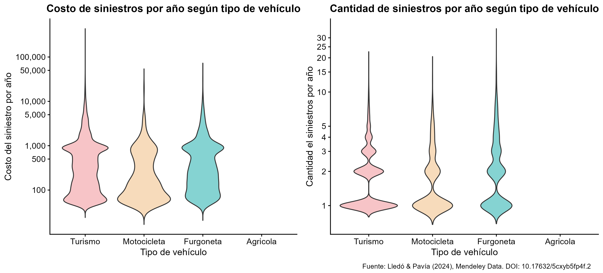{#fig-violin-combinado width="100%"}

```{r fig-violin-siniestros, warning=FALSE, message=FALSE, echo=FALSE, fig.cap="Distribución del costo y cantidad de siniestros por año según tipo de vehículo", fig.align='center'}

violin_frecuencia <- datos_modificados %>%
  filter(is.finite(N_claims_year)) %>%
  mutate(categoria = factor(categoria,
                            levels = c("Turismo", "Motocicleta", "Furgoneta", "Agricola"))) %>% 
  ggplot(aes(x = categoria, y = N_claims_year, fill = categoria)) +
  geom_violin(alpha = 0.6, trim = FALSE) + 
  scale_fill_manual(values = paleta_pamplemousse[2:5]) +
  scale_y_log10(labels = scales::comma,
                breaks = c(1,2,3,4,5,10,15,20,25,30)) +
  labs(title = "Cantidad de siniestros por año según tipo de vehículo",
       x = "Tipo de vehículo", 
       y = "Cantidad el siniestros por año") +
  estilo_grupo3 +
  theme(legend.position = "none")

violin_costo <- datos_modificados %>%
  filter(is.finite(Cost_claims_year)) %>%
  mutate(categoria = factor(categoria,
                            levels = c("Turismo", "Motocicleta", "Furgoneta", "Agricola"))) %>% 
  ggplot(aes(x = categoria, y = Cost_claims_year, fill = categoria)) +
  geom_violin(alpha = 0.6, trim = FALSE) + 
  scale_fill_manual(values = paleta_pamplemousse[2:5]) +
  scale_y_log10(labels = scales::comma,
                breaks = c(100,500,1000,5000,10000,50000,100000)) + 
  labs(title = "Costo de siniestros por año según tipo de vehículo",
       x = "Tipo de vehículo", 
       y = "Costo del siniestro por año") +
  estilo_grupo3 +
  theme(legend.position = "none")

violin_combinado <- plot_grid(violin_costo, violin_frecuencia) %>% 
  ggdraw() +
  draw_label("Fuente: Lledó & Pavía (2024), Mendeley Data. DOI: 10.17632/5cxyb5fp4f.2",
             x = 0.98, y = 0.02, hjust = 1, vjust = 2.5,  size = 9) +
  theme(plot.margin = margin(0, 0, 15, 0)) # Ajustar el margen inferior

ggsave("../../../bitacoras/bitacora_3/figuras/violin_combinado.png", violin_combinado, width = 11, height = 5, dpi = 300)

```

En el gráfico de la izquierda se observa que los costos de los siniestros presentan una distribución bastante dispersa, con una alta concentración de valores bajos y algunos casos extremos de costos elevados.
Aunque la mayoría de los reclamos tiende a mantenerse en montos relativamente bajos o moderados, existen siniestros puntuales que generan costos mucho mayores.
Tal situación es visible principalmente en los vehículos de turismo y en las furgonetas, donde la distribución se extiende hacia valores más altos.

En el caso de las motocicletas, los costos parecen concentrarse en rangos más bajos en comparación con los otros tipos de vehículos, aunque también se observan algunos valores elevados.
Por su parte, los vehículos agrícolas no presentan una distribución visible, lo que podría deberse a una cantidad muy reducida de registros o a la ausencia de siniestros relevantes en esta categoría dentro de la base analizada.

En el gráfico de la derecha se muestra la cantidad de siniestros por año.
La mayoría de los vehículos registra pocos siniestros anuales, principalmente entre uno y dos reclamos.
Sin embargo, las furgonetas y los vehículos de turismo presentan una mayor dispersión, con algunos casos donde la cantidad de siniestros es considerablemente más alta.
Esto sugiere que tales categorías de vehículo podrían estar asociadas con una mayor exposición al riesgo o con un uso más frecuente.

A manera de síntesis, la figura sugiere que el tipo de vehículo sí puede influir tanto en la frecuencia como en la severidad de los siniestros.
Las furgonetas y los vehículos de turismo muestran una mayor variabilidad, mientras que las motocicletas parecen concentrarse en niveles más bajos.

La @fig-peso muestra la comparación entre la distribución de distintas características físicas del vehículo: el peso, el largo, la potencia, el cilindraje y el número de puertas, en los casos en donde se supera el umbral de los 900 euros.

```{r fig-caracteristicas-vehiculos, warning=FALSE, message=FALSE, echo=FALSE, fig.cap="Distribución de las características físicas de los vehículos con costos de siniestro altos", fig.align='center'}
peso_costo <- datos_modificados %>% 
  filter(Cost_claims_year >= 900) %>% 
  ggplot(aes(x= Weight)) +
  geom_histogram(bins = 75, color = "white", fill = paleta_pamplemousse[2]) +
  scale_x_continuous(breaks = seq(0,2500, 250)) +
  scale_y_continuous(breaks = seq(0,250,50))+
  labs(title = "Distribución del peso de los vehículos",
     subtitle = "Filtrado por costo de siniestro por año mayor a €900",
     x = "Peso del vehículo",
     y = "Cantidad")+
  estilo_grupo3

largo_costo <- datos_modificados %>% 
  filter(Cost_claims_year >= 900) %>% 
  ggplot(aes(x= Length)) +
  geom_histogram(bins = 75, color = "white", fill = paleta_pamplemousse[1]) +
  scale_x_continuous(breaks = seq(0,7,0.5)) +
  scale_y_continuous(breaks = seq(0,350,50))+
  labs(title = "Distribución del largo de los vehículos",
     subtitle = "Filtrado por costo de siniestro por año mayor a €900",
     x = "Largo del vehículo",
     y = "Cantidad")+
  estilo_grupo3

potencia_costo <- datos_modificados %>% 
  filter(Cost_claims_year >= 900) %>% 
  ggplot(aes(x= Power)) +
  geom_histogram(bins = 75, color = "white", fill = paleta_pamplemousse[4]) +
  scale_x_continuous(breaks = seq(0,250,50)) +
  labs(title = "Distribución de la potencia de los vehículos",
     subtitle = "Filtrado por costo de siniestro por año mayor a €900",
     x = "Caballos de fuerza",
     y = "Cantidad")+
  estilo_grupo3

cilindraje_costo <- datos_modificados %>% 
  filter(Cost_claims_year >= 900) %>% 
  ggplot(aes(x= Cylinder_capacity)) +
  geom_histogram(bins = 75, color = "white", fill = paleta_pamplemousse[5]) +
  scale_x_continuous(breaks = seq(0,3500,500)) +
  scale_y_continuous(breaks = seq(0,600,100)) +
  labs(title = "Distribución de la capacidad de cilindraje de los vehículos",
     subtitle = "Filtrado por costo de siniestro por año mayor a €900",
     x = "Capacidad de cilindraje",
     y = "Cantidad")+
  estilo_grupo3 +
  theme(plot.title = element_text(face = "bold", size = 11.65)) 

puertas_costo <- datos_modificados %>% 
  filter(Cost_claims_year >= 900) %>% 
  ggplot(aes(x= N_doors)) +
  geom_histogram(bins = 75, color = "white", fill = paleta_pamplemousse[3]) +
  scale_x_continuous(breaks = seq(0,6,1)) +
  scale_y_continuous(breaks = seq(0,2500,250)) +
  labs(title = "Distribución del número de puertas de los vehículos",
     subtitle = "Filtrado por costo de siniestro por año mayor a €900",
     x = "Número de puertas del vehículo",
     y = "Cantidad")+
  estilo_grupo3

caracteristicas_costo <- plot_grid(peso_costo, largo_costo, potencia_costo, cilindraje_costo, puertas_costo, ncol=2)%>% 
  ggdraw() +
  draw_label("Fuente: Lledó & Pavía (2024), Mendeley Data. DOI: 10.17632/5cxyb5fp4f.2",
             x = 0.98, y = 0.02, hjust = 1, vjust = 2,  size = 9)

ggsave("../../../bitacoras/bitacora_3/figuras/caracteristicas_costo.png", caracteristicas_costo, width = 10, height = 11, dpi = 300)
```

{#fig-peso width="90%"}

En general, se observa que estos reclamos se concentran principalmente en vehículos con pesos aproximados entre 1000 kg y 1500 kg, longitudes cercanas a 4.0–4.7 m, potencias entre 70 y 130 caballos de fuerza y un cilindraje alrededor de 1400 a 2000.
Lo anterior sugiere que los siniestros con costos superiores a 900 euros no se distribuyen de forma uniforme entre todos los tipos de vehículos, sino que se presentan con mayor frecuencia en vehículos de características intermedias, probablemente asociados al turismo, de uso común.

En cuanto al número de puertas, la mayor concentración corresponde a vehículos de 5 puertas, seguido en menor medida por vehículos de 3 y 4 puertas.
Es un indicador de que los reclamos superiores a 900 euros se relacionan principalmente con vehículos familiares o de uso cotidiano, aunque también puede deberse a que este tipo de vehículo es más frecuente dentro de la base de datos.

También se observan algunos valores aislados en pesos, potencias y cilindradas muy bajas o muy altas, los cuales podrían corresponder a registros atípicos, motocicletas, vehículos especiales o posibles inconsistencias en los datos.

Finalmente, la @fig-cost-zona muestra la distribución de la cantidad de siniestros por zona, ya sea rural o urbana, dividiendo los casos de acuerdo al costo de los 900 euros.

```{r fig-cost-zona, warning= FALSE, message=FALSE, echo =FALSE, fig.align='center', fig.cap='Distribución del costo de los siniestros por zona', fig.height = 5, fig.width = 8}

datos_modificados %>% 
  filter(is.finite(Cost_claims_year) & is.finite(Area)) %>% 
  mutate(zona = ifelse(Area == 0, "Rural", "Urbano"),
         rango = ifelse(Cost_claims_year >= 900, ">= €900", "< €900")) %>% 
  group_by(zona, rango) %>% 
  summarise(conteo = n()) %>% 
  ggplot(aes(x = zona, y = conteo, fill= rango)) +
  geom_col(position = "dodge") + 
  geom_text(aes(label = scales::comma(conteo)), 
             position = position_dodge(width = 0.9), 
            vjust = -0.4) +
  scale_y_continuous(breaks = seq(0,75000,15000), labels = scales::comma) + 
  scale_fill_manual(values = c(paleta_pamplemousse[1], paleta_pamplemousse[6])) +
  labs(title = "Distribución del costo de los siniestros por zona",
       x = "Zona",
       y = "Cantidad de siniestros",
       caption = "Fuente: Lledó & Pavía (2024), Mendeley Data. DOI: 10.17632/5cxyb5fp4f.2",
       fill = "Costo del siniestro") +
  estilo_grupo3 +
  theme(plot.caption = element_text(hjust = 1.5)) 

costo_siniestro_zona <- datos_modificados %>% 
  filter(is.finite(Cost_claims_year) & is.finite(Area)) %>% 
  mutate(zona = ifelse(Area == 0, "Rural", "Urbano"),
         rango = ifelse(Cost_claims_year >= 900, ">= €900", "< €900")) %>% 
  group_by(zona, rango) %>% 
  summarise(conteo = n()) %>% 
  ggplot(aes(x = zona, y = conteo, fill= rango)) +
  geom_col(position = "dodge") +
  geom_text(aes(label = scales::comma(conteo)), 
             position = position_dodge(width = 0.9), 
            vjust = -0.4) +
  scale_y_continuous(breaks = seq(0,75000,15000), labels = scales::comma) + 
  scale_fill_manual(values = c(paleta_pamplemousse[1], paleta_pamplemousse[6])) +
  labs(title = "Distribución del costo de los siniestros por zona",
       x = "Zona",
       y = "Cantidad de siniestros",
       caption = "Fuente: Lledó & Pavía (2024), Mendeley Data. DOI: 10.17632/5cxyb5fp4f.2",
       fill = "Costo del siniestro") +
  estilo_grupo3 +
  theme(plot.caption = element_text(hjust = 1.5)) 

ggsave("../../../bitacoras/bitacora_3/figuras/costo_siniestro_zona.png",costo_siniestro_zona, width = 11, height = 7, dpi = 300)
```

En ambos casos predominan ampliamente los siniestros con costos menores a 900 euros, lo que indica que la mayoría de los reclamos registrados son de baja o moderada severidad.

Se observa que la zona rural concentra una mayor cantidad total de registros, tanto para costos menores a 900 euros como para costos mayores o iguales a ese umbral.
Sin embargo, esto no necesariamente significa que la zona rural sea más riesgosa, ya que puede deberse a que hay más pólizas o más observaciones rurales en la base de datos.

En conjunto, el análisis descriptivo permite identificar varios elementos relevantes para la etapa de modelación.
Primero, la base presenta una estructura con múltiples registros por asegurado, lo cual permite estudiar el comportamiento anual de los siniestros.
Segundo, se observa una concentración importante de registros sin siniestros o con costos iguales a cero, aspecto que debe considerarse al modelar la frecuencia y la severidad.
Tercero, las variables relacionadas con los costos presentan asimetría y valores extremos, un elemento característico de los datos de seguros.
Finalmente, las comparaciones por tipo de vehículo y zona muestran que existen diferencias entre grupos, por lo que estas variables pueden ser consideradas como posibles factores explicativos en la modelación posterior.

### Ajuste completo del modelo seleccionado

Con base en los hallazgos del análisis descriptivo, el equipo seleccionó cuatro métodos complementarios que permiten responder de manera progresiva a la pregunta de investigación: el análisis descriptivo de la frecuencia y la severidad, el estudio de asociaciones entre variables cuantitativas mediante correlaciones de Spearman con intervalos de confianza, la comparación entre grupos definidos por variables categóricas y el análisis del umbral de los 900 euros mediante una distribución mixta.
La descripción detallada del fundamento matemático de cada uno de estos métodos se presenta en la sección 1.2 de este documento, donde también se justifica explícitamente por qué cada método fue elegido por encima de alternativas.
Los resultados del ajuste, es decir, la ejecución completa de estos métodos sobre los datos reales, se encuentran en la sección 1.2.2, donde cada análisis incluye comentarios que lo vinculan con la pregunta de investigación.

La selección de métodos responde directamente a las características observadas en los datos: la concentración de ceros hace necesario tratar la frecuencia y la severidad de forma separada; la asimetría y los valores extremos justifican el uso de coeficientes no paramétricos en lugar de Pearson; la presencia de variables categóricas como el tipo de vehículo exige un enfoque comparativo entre grupos; y la concentración de reclamos alrededor del umbral de los 900 euros motiva el modelado mediante una estructura de mezcla en lugar de una distribución única.
En este sentido, el modelo es la respuesta directa a lo que los propios datos mostraron en la fase exploratoria.

### Análisis de diagnósticos del modelo

La calidad del ajuste se evaluó mediante distintos elementos de diagnóstico, que se encuentran integrados en los resultados de la sección 1.2.2.
Para el análisis de correlaciones de Spearman, el diagnóstico se basa en los intervalos de confianza al 95% construidos con la transformación de Fisher: un intervalo que no contiene el cero indica que la asociación es estadísticamente distinguible de cero, mientras que la magnitud del coeficiente permite juzgar si esa asociación es sustantiva o meramente formal.
Para la comparación entre grupos categóricos, la prueba de Kruskal-Wallis opera como herramienta de diagnóstico inferencial, al evaluar si las diferencias observadas entre categorías como el tipo de vehículo o la zona de circulación son consistentes con variaciones esperables bajo la hipótesis de igualdad distribucional.
Para el análisis del umbral de los 900 euros, el diagnóstico se realiza mediante los gráficos generados por el paquete `fitdistrplus`: la comparación entre la función de distribución empírica y la teórica, el gráfico Q-Q y el gráfico P-P permiten evaluar si las distribuciones seleccionadas, lognormal para ambos componentes positivos, representan adecuadamente el comportamiento observado en los datos.

De manera general, los diagnósticos realizados sugieren que los métodos seleccionados son apropiados para las características de los datos analizados.
Además, las asociaciones observadas son estadísticamente distinguibles de cero, aunque de magnitud limitada, y la estructura de mezcla logra capturar adecuadamente el comportamiento de la distribución del costo anual de siniestros.
Estos resultados se presentan con mayor detalle en las secciones siguientes.

## Propuesta metodológica

La propuesta metodológica del proyecto se organiza como una secuencia de distintos análisis, orientados a estudiar la frecuencia y la severidad de los siniestros en el caso de los seguros de automóviles.
En el anteproyecto, el análisis se planteó a partir de cuatro ejes principales: la descripción de la frecuencia y la severidad, el estudio de asociaciones entre las variables cuantitativas, la comparación entre grupos categóricos y el análisis específico del umbral de 900 euros.
En la presente bitácora, dichos ejes se mantienen, pero se reformulan con una mayor precisión para incorporar la retroalimentación recibida.

El punto de partida de la metodología consiste en que las variables de la siniestralidad no presentan un comportamiento simple, tal como se observó en el análisis descriptivo de la segunda bitácora.
La frecuencia de los siniestros corresponde a una variable de conteo, mientras que la severidad corresponde a una variable continua no negativa.
Además, se identificó una alta concentración de ceros, una distribución asimétrica hacia la derecha y la presencia de valores extremos en el costo anual de los siniestros.
Estas características hacen necesario utilizar una combinación de métodos descriptivos, comparativos y de modelación exploratoria, según las variables que se pretendan analizar.

### Formulación de los métodos

La propuesta metodológica se organiza en cuatro métodos complementarios, detallados a continuación.
En primer lugar, el análisis descriptivo de la frecuencia y la severidad de los siniestros.
En segundo lugar, el estudio de posibles asociaciones entre las variables cuantitativas mediante coeficientes de correlación.
En tercer lugar, la comparación entre grupos definidos de acuerdo a variables categóricas.
Finalmente, la reformulación del análisis del umbral de 900 euros mediante un enfoque de distribución mixta, un análisis de cola derecha e intervalos de confianza, aspectos sugeridos en la presentación del anteproyecto.

La elección de la organización planteadas radica en que la estructura permite avanzar desde una descripción general de los datos hacia un análisis más específico de los reclamos de alta severidad.
Además, responde a las características observadas en la segunda bitácora y retomadas en el anteproyecto: una alta concentración de ceros, la asimetría hacia la derecha y la presencia de valores extremos en la variable del costo anual.

#### Análisis descriptivo de la frecuencia y la severidad

El primer método consistirá en realizar un análisis descriptivo de las dos variables principales del proyecto: la frecuencia anual de los siniestros y la severidad anual de los siniestros.
Dicha separación es necesaria de acuerdo a la literatura consultada, puesto que las variables tienen naturalezas estadísticas distintas.
La frecuencia corresponde a una variable de conteo, mientras que la severidad corresponde a una variable continua no negativa.
Por esta razón, no se analizarán como si representaran el mismo fenómeno, sino como dos componentes complementarios del riesgo asegurador.

Sea

$$
N_i = \texttt{N\_claims\_year}_i
$$

la cantidad de siniestros reportados por el asegurado $i$ durante el año, y sea

$$
Y_i = \texttt{Cost\_claims\_year}_i
$$

el costo anual de los siniestros asociado a ese mismo registro.

Para la variable de la frecuencia, se construirá una distribución de frecuencias absolutas y relativas.
Para cada posible cantidad de siniestros $k$, se calculará:

$$
f_k = \{i : N_i = k\},
$$

donde $f_k$ representa la cantidad de registros con exactamente $k$ siniestros.
También se calculará la frecuencia relativa correspondiente:

$$
p_k = \frac{f_k}{n},
$$

donde $n$ representa el número total de registros de la base de datos.
En particular, se calculará la proporción de asegurados sin siniestros durante el año:

$$
\widehat{p}_0 = \frac{\{i : N_i = 0\}}{n}.
$$

Este cálculo es relevante dado que permite cuantificar el exceso de ceros en la frecuencia de los siniestros.
Si una proporción muy alta de registros tiene $N_i=0$, entonces la frecuencia no puede analizarse únicamente mediante medidas como la media, ya que esta podría ocultar la concentración de asegurados sin reclamos.

Además, para la variable $N_i$ se calcularán medidas descriptivas como la media, la mediana, la desviación estándar, el mínimo, el máximo y los cuartiles.
Estas medidas se complementarán con gráficos de barras o histogramas, con el fin de observar visualmente si la mayoría de los registros se concentra en cero, si existen registros con múltiples siniestros y qué tan dispersa es la frecuencia anual.

Para la variable de la severidad, el análisis también se realizará en dos etapas.
Primero, se calculará la proporción de registros con costo anual igual a cero:

$$
\widehat{q}_0 = \frac{\{i : Y_i = 0\}}{n}.
$$

Tal proporción permite identificar cuántos registros presentan un costo anual de siniestros nulo.
Sin embargo, debido a que una alta cantidad de ceros puede ocultar el comportamiento real de los montos reclamados, se analizarán por separado los costos estrictamente positivos:

$$
Y_i \mid Y_i > 0.
$$

Así, además de estudiar la proporción de costos iguales a cero, se examinará la distribución del costo anual únicamente en los registros con un costo positivo asociado.
Sobre este subconjunto se calcularán medidas como la media, la mediana, la desviación estándar, los cuartiles, el mínimo y el máximo.
También se construirán histogramas y boxplots para observar la forma de la distribución, la presencia de la asimetría hacia la derecha y los posibles valores extremos.

Asimismo, la separación planteada es importante porque la variable de la severidad puede verse afectada por dos fenómenos distintos: por un lado, la ausencia de costos registrados, y por otro, la magnitud de los costos cuando efectivamente existe un reclamo.

En particular, el análisis descriptivo permite identificar si las variables presentan un exceso de ceros, una alta dispersión, alguna asimetría o ciertos valores atípicos.
Estos elementos son fundamentales para justificar las decisiones metodológicas posteriores.

En relación con la pregunta de investigación, el análisis de la frecuencia y la severidad permite caracterizar el comportamiento general de la siniestralidad en la base de datos.
La frecuencia muestra qué tan común es que los asegurados presenten reclamos durante el año, mientras que la severidad muestra qué tan altos son los costos cuando estos reclamos ocurren.
Por lo tanto, el análisis descriptivo constituye un punto de partida pertinente para estudiar qué características del asegurado o del vehículo podrían estar asociadas con una mayor frecuencia o severidad en los siniestros.

#### Análisis de asociación entre las variables cuantitativas

El segundo método consistirá en estudiar la asociación entre las variables cuantitativas del asegurado o del vehículo y las variables de la siniestralidad.
El propósito de esta etapa no será establecer relaciones causales, sino identificar patrones de asociación que permitan explorar si ciertas características numéricas se relacionan con una mayor frecuencia o severidad de los siniestros. Entre las variables cuantitativas consideradas se encuentran la edad del asegurado, la antigüedad como cliente, la antigüedad de la licencia de conducir, el historial de reclamos, así como el peso, la potencia, el valor y la edad del vehículo.

En una primera etapa, se analizará la asociación entre cada variable cuantitativa $X_i$ y las variables de respuesta $N_i$ e $Y_i$ mediante coeficientes de correlación de Spearman, presentados en una matriz de correlación y una tabla de intervalos de confianza al 95%. La matriz también permitirá identificar correlaciones entre las propias variables explicativas, lo cual constituye un diagnóstico preliminar de posible multicolinealidad relevante para las etapas de modelación. Este enfoque permite identificar la dirección y magnitud de las asociaciones de forma más precisa que un gráfico de dispersión, especialmente dado que $N_i$ toma valores enteros con alta concentración en cero, lo que dificulta la visualización directa.

Posteriormente, se calcularán coeficientes de correlación entre pares de variables cuantitativas.
En primer lugar, se considerará el coeficiente de correlación de Pearson, definido como:

$$
r =
\frac{
\sum_{i=1}^{n}(X_i-\overline{X})(Z_i-\overline{Z})
}
{
\sqrt{\sum_{i=1}^{n}(X_i-\overline{X})^2}
\sqrt{\sum_{i=1}^{n}(Z_i-\overline{Z})^2}
},
$$

donde $Z_i$ representa una variable de siniestralidad, como $N_i$ o $Y_i$. Si bien podría considerarse también el subconjunto de costos positivos $Y_i \mid Y_i > 0$, dado que la correlación entre $N_i$ e $Y_i$ es prácticamente perfecta ($\rho \approx 0.99$), el análisis sobre el costo total ya captura esencialmente la misma información, por lo que este subconjunto no se analiza por separado.

Sin embargo, debido a las características observadas en las variables de la siniestralidad, especialmente la alta concentración de ceros, la presencia de valores extremos y la asimetría hacia la derecha en la severidad, Pearson no se reportará como resultado principal. Su fórmula se presenta únicamente como punto de partida conceptual para introducir los coeficientes no paramétricos, que serán los utilizados en el análisis.
En este contexto, se dará prioridad a coeficientes no paramétricos como Spearman y Kendall, ya que estos no requieren asumir normalidad ni una relación estrictamente lineal entre las variables. En muestras grandes, ambos coeficientes tienden a producir conclusiones similares; sin embargo, se preferirá Spearman por su mayor eficiencia computacional y su uso más extendido en la literatura para análisis exploratorios de este tipo.

El coeficiente de Spearman se define como la correlación de Pearson aplicada a los rangos de las variables:

$$
\rho_s =
\frac{
\sum_{i=1}^{n}(R(X_i)-\overline{R(X)})(R(Z_i)-\overline{R(Z)})
}
{
\sqrt{\sum_{i=1}^{n}(R(X_i)-\overline{R(X)})^2}
\sqrt{\sum_{i=1}^{n}(R(Z_i)-\overline{R(Z)})^2}
},
$$

donde $R(X_i)$ y $R(Z_i)$ representan los rangos de las observaciones de $X_i$ y $Z_i$, respectivamente.
Este coeficiente permite evaluar si existe una relación monótona entre las variables, aunque dicha relación no sea lineal.

Cuando no existen empates en los rangos, Spearman también puede expresarse como:

$$
\rho_s =
1 -
\frac{6\sum_{i=1}^{n}d_i^2}{n(n^2-1)},
$$

donde

$$
d_i = R(X_i)-R(Z_i).
$$

Por otra parte, el coeficiente de Kendall se basa en la comparación entre pares de observaciones.
Dos observaciones $(X_i,Z_i)$ y $(X_j,Z_j)$, con $i<j$, son concordantes si ambas variables se mueven en la misma dirección, es decir, si:

$$
(X_i-X_j)(Z_i-Z_j)>0.
$$

Son discordantes si se mueven en direcciones opuestas:

$$
(X_i-X_j)(Z_i-Z_j)<0.
$$

Si $C$ representa el número de pares concordantes y $D$ el número de pares discordantes, el coeficiente de Kendall se define como:

$$
\tau =
\frac{C-D}{\binom{n}{2}}
=
\frac{C-D}{\frac{n(n-1)}{2}}.
$$

Este coeficiente es útil porque evalúa la asociación a partir del orden relativo de los datos, por lo que puede ser más adecuado cuando existen distribuciones asimétricas, valores extremos o relaciones no lineales.

En la implementación en R, las correlaciones se calcularán mediante la función `cor.test()`, ya que esta permite obtener tanto el coeficiente de correlación como una prueba de significancia asociada.
El método a utilizar se determinará mediante un `shapiro.test()`, el cual identifcará si las variables presentan una distribución normal o no.
En caso afirmativo, se utilizará el método Pearson, y en el caso contrario, se utilizará Kendall o Spearman según sea pertinente.

##### Intervalos de confianza para los coeficientes de correlación

Además de calcular los coeficientes de correlación planteados, se construirán intervalos de confianza para evaluar la precisión de las asociaciones estimadas.
La idea principal es no interpretar únicamente el valor puntual del coeficiente, sino también considerar la incertidumbre asociada a su estimación.

Sea $X_i$ una variable cuantitativa asociada al asegurado o al vehículo, y sea $Z_i$ una variable de siniestralidad.
De manera general, la correlación entre ambas variables se define como:

$$
\rho =
\operatorname{Corr}(X,Z)
=
\frac{\operatorname{Cov}(X,Z)}
{\sqrt{\operatorname{Var}(X)}\sqrt{\operatorname{Var}(Z)}}.
$$

Utilizando esperanzas, esta expresión se escribe:

$$
\rho =
\frac{
E[XZ]-E[X]E[Z]
}
{
\sqrt{\operatorname{Var}(X)}
\sqrt{\operatorname{Var}(Z)}
}.
$$

A nivel muestral, el coeficiente de correlación se estima mediante la fórmula:

$$
\widehat{\rho}
=
\frac{
\frac{1}{n}\sum_{i=1}^{n}X_iZ_i
-
\left(\frac{1}{n}\sum_{i=1}^{n}X_i\right)
\left(\frac{1}{n}\sum_{i=1}^{n}Z_i\right)
}
{
\sqrt{
\frac{1}{n}\sum_{i=1}^{n}(X_i-\overline{X})^2
}
\sqrt{
\frac{1}{n}\sum_{i=1}^{n}(Z_i-\overline{Z})^2
}
}.
$$

En la presente investigación, $\widehat{\rho}$ representará el coeficiente de correlación estimado según el método empleado.
Es decir, podrá corresponder a la correlación de Pearson, Spearman o Kendall, según las características de las variables analizadas.

Para construir intervalos de confianza, se utilizará una transformación estabilizadora de la varianza.
El problema es que el coeficiente de correlación no tiene una varianza constante en su escala original, pues esta depende del valor de la correlación poblacional.
De manera aproximada, para muestras grandes se tiene que:

$$
\sqrt{n}
\left(
\frac{\widehat{\rho}-\rho}{1-\rho^2}
\right)
\longrightarrow N(0,1).
$$

Por esta razón, se busca una función $g(\rho)$ que permita estabilizar la varianza.
Esta función debe cumplir que:

$$
g'(\rho)=\frac{1}{1-\rho^2}.
$$

Al integrar, se obtiene:

$$
g(\rho)
=
\int \frac{1}{1-\rho^2}\,d\rho
=
\operatorname{arctanh}(\rho).
$$

Por lo tanto:

$$
g(\rho)
=
\operatorname{arctanh}(\rho)
=
\frac{1}{2}
\ln\left(
\frac{1+\rho}{1-\rho}
\right).
$$

Aplicando esta transformación al coeficiente de correlación estimado, se define:

$$
z_{\widehat{\rho}}
=
\operatorname{arctanh}(\widehat{\rho})
=
\frac{1}{2}
\ln\left(
\frac{1+\widehat{\rho}}{1-\widehat{\rho}}
\right).
$$

Bajo esta transformación, el coeficiente transformado puede aproximarse mediante una distribución normal:

$$
z_{\widehat{\rho}}
\sim
N\left(
\operatorname{arctanh}(\rho),
\frac{1}{n-3}
\right).
$$

Así, un intervalo de confianza del 95 % para la correlación en la escala transformada está dado por:

$$
z_{\widehat{\rho}}
\pm
z_{0.975}
\frac{1}{\sqrt{n-3}}.
$$

Si se denotan los límites en la escala transformada como:

$$
L_z =
z_{\widehat{\rho}}
-
z_{0.975}
\frac{1}{\sqrt{n-3}},
$$

y

$$
U_z =
z_{\widehat{\rho}}
+
z_{0.975}
\frac{1}{\sqrt{n-3}},
$$

entonces se regresa a la escala original mediante la función tangente hiperbólica:

$$
\tanh(z)
=
\frac{e^{2z}-1}{e^{2z}+1}.
$$

Así, el intervalo de confianza del 95 % para la correlación será:

$$
IC_{95\%}(\rho)
=
\left[
\tanh(L_z),
\tanh(U_z)
\right].
$$

Es decir:

$$
IC_{95\%}(\rho)
=
\left[
\frac{e^{2L_z}-1}{e^{2L_z}+1},
\frac{e^{2U_z}-1}{e^{2U_z}+1}
\right].
$$

En este proyecto, el procedimiento detallado se aplicará a los coeficientes de correlación estimados, ya sea Pearson, Spearman o Kendall, con el objetivo de complementar el análisis puntual con una medida de incertidumbre.
De esta manera, no solo se observará si la correlación estimada es positiva, negativa o cercana a cero, sino también qué tan precisa es dicha estimación.

En caso de que el intervalo de confianza contenga el cero, la asociación se interpretará como débil o incierta.
En cambio, si el intervalo se mantiene completamente por encima de cero, se interpretará como evidencia descriptiva de asociación positiva.
Por último, si el intervalo se mantiene completamente por debajo de cero, se interpretará como evidencia descriptiva de asociación negativa.

#### Comparación entre grupos definidos por variables categóricas

El tercer método consistirá en comparar la frecuencia y la severidad de los siniestros entre grupos definidos por variables categóricas.
Este análisis es necesario porque algunas características relevantes del asegurado o del vehículo no son cuantitativas, sino cualitativas.
Por ejemplo, variables como el tipo de vehículo, la zona de circulación o el tipo de combustible no se analizan adecuadamente mediante correlaciones, sino mediante comparaciones entre grupos.

Considere $X_i$ una variable categórica asociada al registro $i$, cuyos posibles valores son:

$$
X_i \in \{g_1,g_2,\ldots,g_m\},
$$

donde $g_1,g_2,\ldots,g_m$ representan las categorías o grupos de la variable.

El objetivo será comparar el comportamiento de las variables de la siniestralidad dentro de cada grupo.
Para la frecuencia de siniestros, se analizará la variable $N_i$.

Para cada grupo $g$, se calculará la frecuencia promedio de siniestros:

$$
\overline{N}_g =
\frac{1}{n_g}
\sum_{X_i=g} N_i,
$$

donde $n_g$ representa la cantidad de registros pertenecientes al grupo $g$.
Dicha medida permitirá comparar si algunos grupos presentan, en promedio, más siniestros anuales que otros.

También se calculará la proporción de asegurados sin siniestros dentro de cada grupo:

$$
\widehat{p}_{0,g}
=
\frac{\{i:X_i=g \text{ y } N_i=0\}}{n_g}.
$$

La proporción anterior es importante porque permite identificar si ciertos grupos concentran una mayor cantidad de registros sin reclamos.
Debido a que la frecuencia de siniestros presenta una alta concentración de ceros, tal medida puede resultar mayormente informativa que analizar solo la media.

Por otra parte, para la severidad se analizará la variable $Y_i$.

En cada grupo $g$, se calculará la proporción de registros con costo positivo:

$$
\widehat{q}_{g}
=
\frac{\{i:X_i=g \text{ y } Y_i>0\}}{n_g}.
$$

A partir de ello, se observará qué grupos presentan una mayor cantidad de costos asociados a siniestros.
Además, para los registros con costos positivos, se calcularán medidas de tendencia central y dispersión por grupo, como la media, la mediana, los cuartiles y el máximo:

$$
Y_i \mid (Y_i>0, X_i=g).
$$

En particular, se dará importancia a la mediana del costo positivo por grupo:

$$
\operatorname{Mediana}(Y_i \mid Y_i>0, X_i=g),
$$

ya que la mediana es menos sensible a valores extremos que la media.
Esto es relevante porque la severidad de los siniestros puede presentar asimetría hacia la derecha y valores atípicos.

Para complementar la comparación entre grupos, se construirán tablas resumen que integren indicadores de la frecuencia y la severidad. Las tablas permitirán observar, para cada categoría, la cantidad de registros, la frecuencia promedio de siniestros, la proporción de asegurados sin siniestros, la proporción de registros con costo positivo y las medidas principales del costo positivo. De esta manera, será posible comparar no solo cuántos siniestros ocurren en cada grupo, sino también qué tan costosos son cuando ocurren..

Además, se elaborarán gráficos comparativos. En el caso de la frecuencia de los siniestros se utilizarán gráficos de barras que muestren la frecuencia promedio o la proporción de asegurados sin siniestros por grupo. En el caso de la severidad se utilizarán boxplots, ya que estos permiten observar diferencias en la distribución del costo entre categorías, así como la presencia de valores extremos. Dado que la severidad presenta una marcada asimetría hacia la derecha con valores extremos de gran magnitud, los boxplots se construirán filtrando los registros con costo positivo a un máximo de €5,000, con el fin de mejorar la legibilidad visual sin afectar la interpretación de la distribución central de los datos.

La escogencia de dicho método se basa en que permite analizar la asociación entre variables que no pueden estudiarse adecuadamente mediante correlación. Mientras que la sección anterior se enfoca en variables cuantitativas, esta sección permite estudiar diferencias entre grupos definidos por características categóricas.
En relación con la pregunta de investigación, la comparación entre grupos permite identificar si ciertas categorías presentan mayor frecuencia de siniestros, mayor proporción de costos positivos o mayor severidad entre los reclamos observados. De esta manera, el análisis aporta evidencia descriptiva sobre posibles diferencias en la siniestralidad según las características del asegurado o del vehículo.

#### Análisis del umbral de 900 euros mediante distribución mixta y ajuste de distribuciones

El cuarto método consistirá en analizar de manera específica el comportamiento de los registros cuyo costo anual de siniestros alcanza o supera los 900 euros.
En el anteproyecto, este umbral se había planteado mediante una variable indicadora que separaba los costos menores a 900 euros de los costos mayores o iguales a dicho valor.
Sin embargo, a partir de la retroalimentación recibida, dicha propuesta se reformula para incorporar tres elementos adicionales: una interpretación mediante distribución mixta, un análisis de la cola derecha de la distribución y el ajuste de las distribuciones paramétricas utilizando el paquete `fitdistrplus` de R.

El análisis exploratorio previo mostró que la variable $Y_i$ presenta una alta concentración de ceros, valores positivos moderados y algunos costos considerablemente altos.
Por esta razón, no se asumirá que todos los valores de $Y_i$ provienen de una única distribución homogénea.
En cambio, se considerará que la variable puede entenderse como una mezcla de distintos comportamientos: distribución mixta.

De manera general, la distribución del costo anual se puede expresar como:

$$
Y_i \sim \pi_0 \delta_0 + \pi_1 F_1(y \mid \theta_1) + \pi_2 F_2(y \mid \theta_2),
$$

donde $\delta_0$ representa la masa de probabilidad en cero, $F_1(y \mid \theta_1)$ representa la distribución de los costos positivos moderados y $F_2(y \mid \theta_2)$ representa la distribución de los costos altos.
Los parámetros $\pi_0$, $\pi_1$ y $\pi_2$ representan la proporción de observaciones en cada componente, de manera que:

$$
\pi_0+\pi_1+\pi_2=1.
$$

El planteamiento se inspira en el uso de modelos de mezcla en datos de seguros, donde se reconoce que los reclamos pueden presentar características como el exceso de ceros, la asimetría y las colas pesadas.
@mara2024 estudian distribuciones compuestas y distribuciones de mezcla aplicadas a datos de reclamos de seguros, señalando que estos modelos son útiles para representar datos de colas pesadas y mejorar el ajuste cuando una sola distribución no describe adecuadamente el comportamiento de las pérdidas.
Además, @pov2020 proponen modelos con inflación de ceros para la frecuencia y la severidad de los reclamos en seguros generales, precisamente para tratar datos con exceso de ceros provenientes de fuentes heterogéneas.

Para operacionalizar la idea, se definirá una variable categórica $G_i$ de la siguiente manera:

$$
G_i =
\begin{cases}
0, & \text{si } Y_i = 0,\\
1, & \text{si } 0 < Y_i < 900,\\
2, & \text{si } Y_i \geq 900.
\end{cases}
$$

El grupo $G_i=0$ corresponde a registros sin costo anual de siniestros.
El grupo $G_i=1$ corresponde a registros con costos positivos moderados, mientras que el grupo $G_i=2$ corresponde a registros con costos altos, ubicados en la cola derecha de la distribución.

Los pesos de la mezcla se estimarán mediante las proporciones observadas en la muestra:

$$
\widehat{\pi}_0 =
\frac{\{i:Y_i=0\}}{n},
$$

$$
\widehat{\pi}_1 =
\frac{\{i:0<Y_i<900\}}{n},
$$

y

$$
\widehat{\pi}_2 =
\frac{\{i:Y_i\geq 900\}}{n}.
$$

Las proporciones anteriores permitirán cuantificar qué parte de la base corresponde a registros sin costo, qué parte corresponde a costos positivos moderados y qué parte se ubica en la zona de alta severidad.

Posteriormente, se utilizará el paquete `fitdistrplus` de R para ajustar distribuciones paramétricas a los componentes positivos del costo anual.
Este paquete, de acuerdo a @deli2015 permite ajustar distribuciones paramétricas a datos no censurados o censurados y ofrece distintos métodos de estimación, como máxima verosimilitud, estimación por momentos, estimación por cuantiles, bondad de ajuste y máximo espaciamiento.
En este proyecto, se utilizará principalmente para comparar distribuciones candidatas y estimar los parámetros de aquellas que se adapten mejor a los datos observados.

Primero, se analizarán los costos positivos menores a 900 euros, que son los reclamos de severidad positiva moderada:

$$
Y_i \mid 0<Y_i<900.
$$

Para este grupo se evaluarán distribuciones candidatas como gamma, lognormal, Weibull y exponencial, debido a que son las distribuciones usuales para variables continuas positivas y asimétricas.

Luego, se analizarán los costos mayores o iguales a 900 euros:

$$
Y_i \mid Y_i \geq 900.
$$

Este componente corresponde a la cola derecha de la distribución, es decir, a los reclamos de mayor severidad.
El objetivo será determinar si los costos altos presentan un comportamiento distinto al de los costos positivos moderados y si requieren una distribución diferente para describirlos adecuadamente.

Para cada componente positivo, y siguiendo lo indicado por @deli2015, se estimarán los parámetros de las distribuciones candidatas.
De forma general, si $F_j(y \mid \theta_j)$ representa una distribución candidata para el componente $j$, el objetivo será estimar el vector de parámetros $\theta_j$.
Mediante máxima verosimilitud, estos parámetros se obtienen maximizando la función de verosimilitud:

$$
L(\theta_j)
=
\prod_{i \in C_j}
f_j(y_i \mid \theta_j),
$$

donde $C_j$ representa el conjunto de observaciones pertenecientes al componente analizado y $f_j(y_i \mid \theta_j)$ es la función de densidad de la distribución candidata.
De forma equivalente, se maximiza la log-verosimilitud:

$$
\ell(\theta_j)
=
\sum_{i \in C_j}
\log f_j(y_i \mid \theta_j).
$$

Una vez ajustadas las distribuciones candidatas, se comparará su desempeño mediante criterios de ajuste como el AIC (criterio de información de Akaike) y el BIC (criterio Bayesiano de información).
El criterio de información de Akaike se define como:

$$
AIC =
-2\ell(\widehat{\theta})
+
2k,
$$

donde $\ell(\widehat{\theta})$ representa la log-verosimilitud evaluada en los parámetros estimados y $k$ representa el número de parámetros del modelo.
Por su parte, el criterio bayesiano de información se define como:

$$
BIC =
-2\ell(\widehat{\theta})
+
k\ln(n).
$$

En ambos casos, valores más bajos indican un mejor equilibrio entre el ajuste y la complejidad del modelo.

Además de los criterios numéricos, se utilizarán herramientas gráficas de diagnóstico generadas a partir de los ajustes, como comparaciones entre la función de distribución empírica y la función de distribución ajustada.
Estos gráficos permitirán evaluar visualmente si la distribución seleccionada representa adecuadamente los datos observados.

Finalmente, el umbral de 900 euros se interpretará como una herramienta para separar el comportamiento de los costos moderados y de los costos altos.
No se utilizará únicamente como una variable indicadora, sino como parte de una estructura de mezcla que distingue entre ausencia de costo, severidad positiva moderada y severidad alta.
De esta manera, el análisis permitirá estimar tanto los pesos de cada componente como las distribuciones paramétricas que describen los costos positivos.

En relación con la pregunta de investigación, el método explicado permite identificar no solo qué proporción de registros se ubica en la zona de alta severidad, sino también qué tipo de distribución describe mejor los costos moderados y los costos altos.

#### Justificación integrada de los métodos

Los métodos propuestos se organizan como una secuencia de análisis complementarios.
En primer lugar, el análisis descriptivo permite caracterizar la estructura general de las variables de la siniestralidad, haciendo una distinción entre la frecuencia y la severidad.
Tal distinción es necesaria, dado que la frecuencia corresponde a una variable de conteo, mientras que la severidad corresponde a una variable continua no negativa.
Además, el análisis descriptivo permite identificar características importantes de los datos, como el exceso de ceros, la asimetría y la presencia de valores extremos.

En segundo lugar, el análisis de asociación entre las variables cuantitativas permite explorar si características numéricas del asegurado o del vehículo se relacionan con la frecuencia o la severidad de los siniestros.
Este método no busca establecer causalidad, sino identificar patrones preliminares que puedan orientar la interpretación de los resultados.
Debido a que las variables de siniestralidad pueden presentar distribuciones asimétricas y valores atípicos, se dará prioridad a coeficientes no paramétricos como Spearman y Kendall.

En tercer lugar, la comparación entre grupos permite estudiar variables categóricas, como el tipo de vehículo, la zona de circulación o el tipo de combustible.
Se complementa el análisis de correlación, ya que muchas características relevantes del problema no son numéricas.
A través de tablas, proporciones y gráficos comparativos, será posible observar si ciertos grupos presentan mayor frecuencia de siniestros, mayor proporción de costos positivos o mayor severidad en los reclamos.

Finalmente, el análisis del umbral de 900 euros permite estudiar con mayor detalle los reclamos de alta severidad.
Este método incorpora la retroalimentación recibida, al no tratar el umbral únicamente como una variable indicadora, sino como parte de una posible estructura de mezcla en la distribución del costo anual.
De esta manera, se distinguen registros sin costo, registros con costos positivos moderados y registros ubicados en la cola derecha de la distribución.

Los cuatro métodos descritos anteriormente serán ejecutados en su totalidad dentro de este mismo documento.
El análisis descriptivo de la frecuencia y la severidad, el análisis de correlaciones de Spearman con intervalos de confianza de Fisher, la comparación entre grupos categóricos y el análisis del umbral de los 900 euros mediante una distribución mixta; se desarrollaron con los datos reales del dataset de Lledó & Pavía (2024), por lo que el programa maqueta y la ejecución coinciden en el mismo apartado.
En cuanto a la validación, esta se aborda mediante tres elementos complementarios: los intervalos de confianza al 95% construidos con la transformación de Fisher para cada coeficiente de correlación de Spearman, los gráficos diagnósticos generados por el paquete fitdistrplus para cada componente de la distribución mixta, que incluyen la comparación entre la función de distribución empírica y la teórica, el gráfico Q-Q y el gráfico P-P, y la prueba de Kruskal-Wallis aplicada a las variables categóricas, cuyos resultados se presentan en la sección de comparación entre grupos.

### Programa maqueta, etapa de validación y respaldo de la propuesta metodológica

Dado que los cuatro métodos descritos anteriormente se ejecutan directamente sobre los datos reales del *dataset* de Lledó & Pavía (2024), el programa maqueta y los resultados finales coinciden en un mismo espacio de trabajo.
Es decir, no existe una fase de prototipado separada del análisis real: el código que se presenta a continuación es, a la vez, el programa exploratorio en el que se afinaron los parámetros y la implementación definitiva que produce los resultados reportados.
Esta decisión responde a que los datos ya estaban disponibles desde la primera bitácora y a que el equipo consideró más transparente mostrar directamente cómo cada función, parámetro y gráfico surgió de la exploración iterativa del *dataset* real.

La validación de cada método se encuentra integrada en el propio análisis, no en una sección separada.
Para el análisis de asociación entre variables cuantitativas, la validez se sustenta en los intervalos de confianza al 95% construidos mediante la transformación de Fisher para cada coeficiente de correlación de Spearman: si el intervalo no contiene el cero, la asociación es estadísticamente distinguible de cero.
Para la comparación entre grupos categóricos, se aplica la prueba de Kruskal-Wallis, cuyo resultado aparece en la sección correspondiente y permite evaluar si las diferencias observadas entre grupos son consistentes con lo que cabría esperar bajo la hipótesis nula de igualdad de distribuciones.
Finalmente, para el análisis del umbral de los 900 euros mediante distribución mixta, la validación se realiza a través de los gráficos diagnósticos generados por el paquete `fitdistrplus`: la comparación entre la función de distribución empírica y la teórica, el gráfico Q-Q y el gráfico P-P permiten juzgar visualmente si la distribución seleccionada representa adecuadamente los datos de cada componente.

En conjunto, los resultados que se presentan a continuación constituyen el respaldo empírico de la propuesta metodológica.
Cada análisis se conecta con la pregunta de investigación mediante comentarios explícitos dentro del propio texto, de modo que sea posible rastrear, para cada hallazgo, de qué manera este contribuye, o no, a explicar la frecuencia y la severidad de los siniestros en la cartera de seguros de automóviles analizada.

```{r, echo=FALSE, warning=FALSE, message=FALSE}
library(ggplot2)
library(cowplot)
library(dplyr)
library(lubridate)
library(tidyverse)
library(readr)
library(corrplot)
library(ggcorrplot)
library(kableExtra)
datos <- read.csv("../../../datos/originales/Motor vehicle insurance data.csv", sep = ";")
datos_modificados <- read.csv("../../../datos/procesados/datos_modificados.csv")

paleta_pamplemousse <- c(
  "#E56B78",
  "#F29CA3",
  "#F2C38F",
  "#36B7B4",
  "#1E9CC7",
  "#253494"
)

estilo_grupo3 <- theme_cowplot(font_size = 12) +
  theme(
    plot.title = element_text(face = "bold", hjust = 0.5),
    axis.title = element_text(size = 12),
    axis.text = element_text(size = 11)
  )
```

#### Análisis descriptivo de la frecuencia y la severidad

El primer conjunto de resultados corresponde al análisis descriptivo de las dos variables centrales del proyecto.
La finalidad de este análisis es caracterizar la estructura de la siniestralidad antes de aplicar métodos comparativos o de ajuste distribucional.
Tal como se anticipó en la formulación metodológica, la frecuencia y la severidad se analizan de manera separada, dada su naturaleza estadística diferente.
Los resultados que se presentan a continuación son, al mismo tiempo, el programa maqueta y la ejecución final: dado que el análisis se realizó sobre los datos reales desde el inicio, no hay distinción entre la fase de exploración y la fase de reporte.

Para evaluar el comportamiento de la frecuencia de siniestros, se examina en primera instancia la distribución de los registros anuales concentrados en el rango de menor actividad. El análisis visual de este componente permite identificar las características particulares de la masa de probabilidad en los valores bajos de la escala, prestando especial atención a la proporción de pólizas que no registraron reclamaciones durante el periodo observado. A continuación, se presenta la distribución empírica detallada para este segmento de la cartera:

```{r fig-frecuencia-siniestros-baja, warning=FALSE, message=FALSE, echo=FALSE, fig.cap="Distribución de la frecuencia de siniestros para registros con diez o menos casos anuales", fig.align='center'}
distribucion_frecuencia <- datos %>% 
  filter(N_claims_year <= 10) %>% 
  group_by(N_claims_year) %>% 
  summarise(conteo = n()) %>% 
  mutate(p_k = conteo / sum(conteo),
         etiqueta = if_else(N_claims_year <= 2,
                            paste0(scales::comma(conteo), "\n(", scales::percent(p_k, accuracy = 0.01), ")"),
                            scales::percent(p_k, accuracy = 0.01))) %>%
  ggplot(aes(x = N_claims_year, y = conteo)) +
  geom_col(fill = paleta_pamplemousse[1], width = 0.75) +
  geom_text(aes(label = etiqueta), 
            size = 2.5, 
            vjust = -0.4, 
            lineheight = 0.85,
            fontface = "bold") + 
  scale_x_continuous(breaks = seq(0, 10, 1)) +
  scale_y_continuous(breaks = seq(0, 80000, 20000),
                     labels = scales::comma,
                     limits = c(0, 90000)) + 
  labs(title = "Distribución de la frecuencia de las cantidades de siniestros menores a 10",
       x = "Número de siniestros por año",
       y = "Cantidad de observaciones",
       caption = "Fuente: Lledó & Pavía (2024), Mendeley Data. DOI: 10.17632/5cxyb5fp4f.2") +
  estilo_grupo3 +
  theme(plot.title = element_text(size = 12, face = "bold"),
        plot.caption = element_text(size = 7.5))

ggsave("../../../bitacoras/bitacora_3/figuras/distribucion_frecuencia_menor_10.png",
       distribucion_frecuencia, width = 8, height = 5, dpi = 300)
```
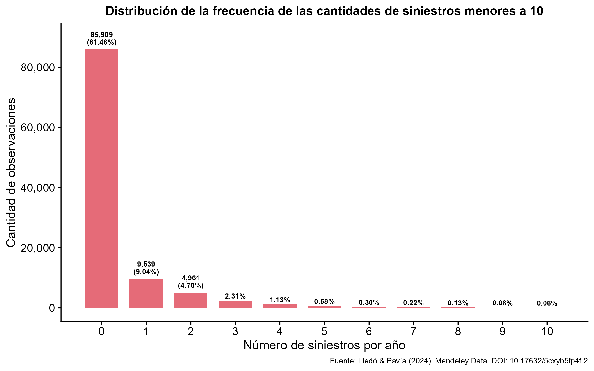{#fig-frecuencia-siniestros-baja}

En la @fig-frecuencia-siniestros-baja se puede observar una alta concentración de observaciones en el valor cero, con un total de 85,909 registros que representan el 81.46% de los datos. A este comportamiento le siguen los registros con un único siniestro anual (9,539 observaciones, 9.04%) y con dos siniestros (4,961 observaciones, 4.70%). En contraste, las frecuencias para tres o más siniestros decrecen de manera drástica, variando desde un 2.31% para tres reclamos, hasta alcanzar apenas un 0.06% en el caso de diez siniestros anuales.Esta estructura evidencia una distribución marcadamente decreciente donde, conforme aumenta la cantidad de siniestros, el volumen de observaciones disminuye de forma pronunciada. Dicho patrón confirma la presencia de un exceso de ceros en la variable de conteo (N_claims_year), un hallazgo crítico para la selección del modelo de frecuencia, ya que una distribución Poisson estándar sería inadecuada debido a la sobredispersión y a la incapacidad de capturar correctamente esta concentración extrema en el origen.

```{r fig-comparacion-ceros-poisson, warning=FALSE, message=FALSE, echo=FALSE, fig.cap="Comparación porcentual entre los ceros observados y los esperados bajo una distribución Poisson", fig.align='center'}
ceros_frecuencia <- data.frame(
  Origen = c("Ceros observados", "Ceros esperados"),
  Porcentaje = c(81.39, 67.39)
)

comparacion_ceros_poisson <- ceros_frecuencia %>% 
  ggplot(aes(x = Origen, y = Porcentaje, fill = Origen)) +
  geom_bar(stat = "identity") +
  geom_text(aes(label = paste0(Porcentaje, "%")), vjust = -0.5) +
  scale_fill_manual(values = c(paleta_pamplemousse[1], paleta_pamplemousse[6])) +
  labs(title = "Comparación entre ceros observados y esperados",
       subtitle = "Modelado mediante una distribución Poisson",
       x = "",
       y = "Porcentaje de ceros",
       caption = "Fuente: Lledó & Pavía (2024), Mendeley Data. DOI: 10.17632/5cxyb5fp4f.2") +
  ylim(0, 100) +
  estilo_grupo3 + 
  theme(plot.caption = element_text(hjust = 2),
        plot.subtitle = element_text(hjust = 0.5) )

ggsave("../../../bitacoras/bitacora_3/figuras/comparacion_ceros_poisson.png",comparacion_ceros_poisson, width = 8, height = 7, dpi = 300)
```

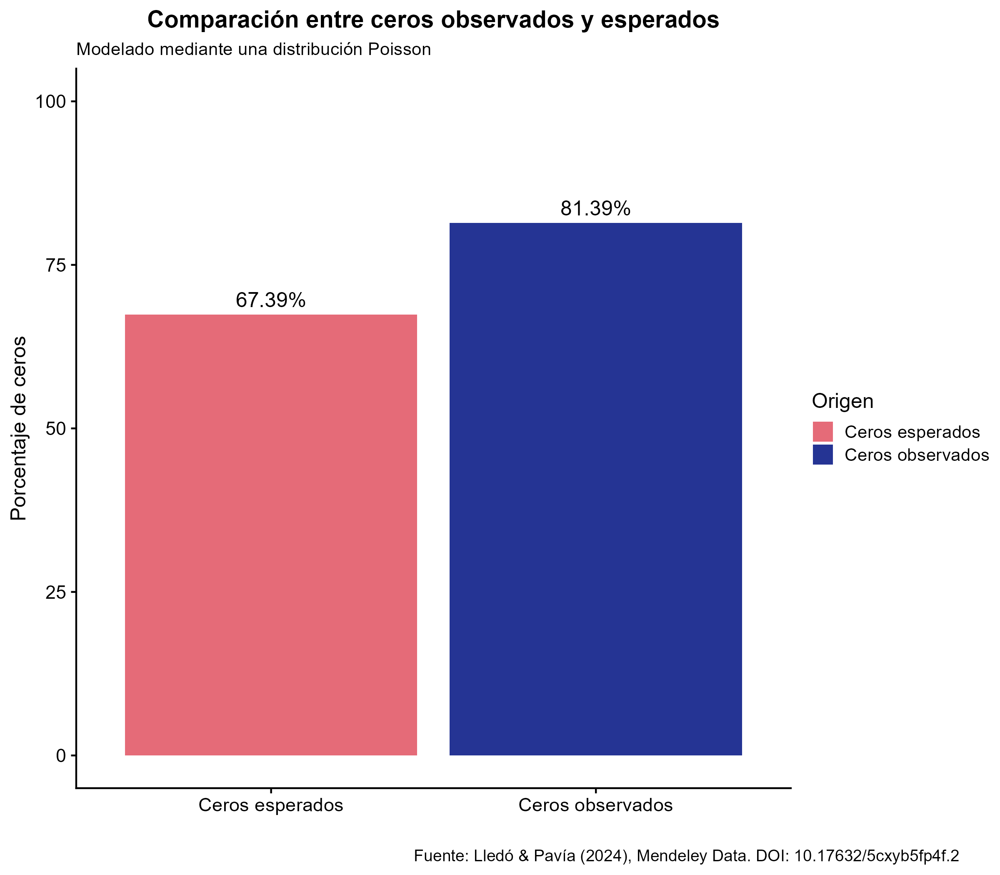{#fig-comparacion-ceros-poisson width="80%"}

En la @fig-comparacion-ceros-poisson muestra la proporción de ceros observados en los datos originales con la proporción de ceros esperada según una distribución Poisson de parámetro $\lambda$ = 0.39, el cual es el promedio de la frecuencia de siniestros por año.
Se obtuvo que, con la distribución Poisson, la proporción de ceros esperada es de 67.39%, mientras que la proporción de ceros observada en los datos es de 81.39%, resultando en una diferencia de 14% en la proporción de ceros, lo que indica que la distribución Poisson no es adecuada para modelar la frecuencia de los siniestros debido a la gran cantidad de ceros observada en la columna *N_claims_year*.

```{r, warning= FALSE, message=FALSE, echo =FALSE, fig.align='center'}
boxplot_costos <- datos %>%
  filter(Cost_claims_year > 0, Cost_claims_year <= 5000) %>%
  ggplot(aes(y = Cost_claims_year)) +
  geom_boxplot(fill = paleta_pamplemousse[2], color = "black") +
  labs(title = "Distribución de los costos de reclamos por año",
       subtitle = "Costos mayores a €0 y menores a €5,000",
       y = "Costo anual",
       caption = "Fuente: Lledó & Pavía (2024), Mendeley Data. DOI: 10.17632/5cxyb5fp4f.2") +
  estilo_grupo3
ggsave("../../../bitacoras/bitacora_3/figuras/boxplot_costos.png",boxplot_costos, width = 8, height = 9, dpi = 300)
```

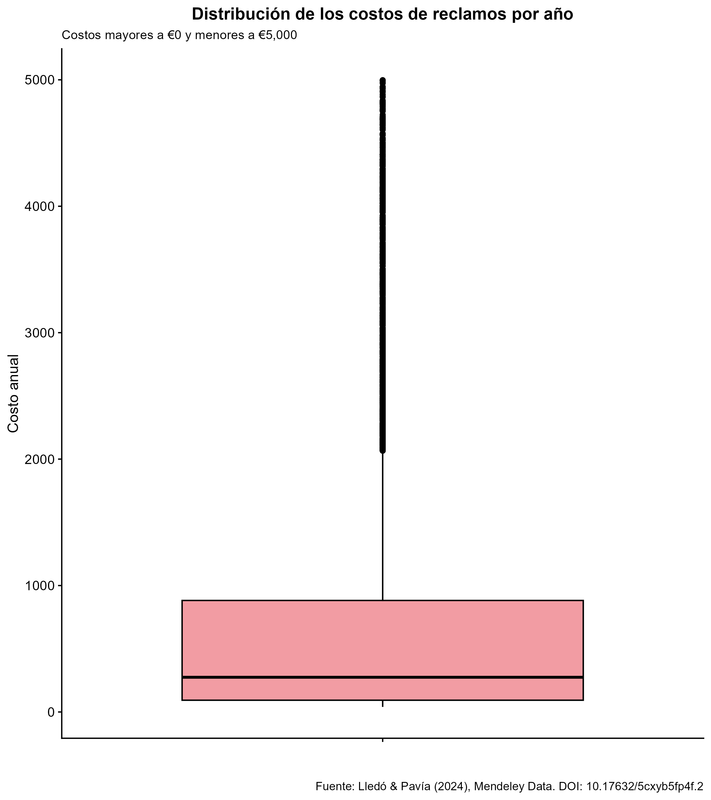{#fig-boxplot-costos width="80%"}

La @fig-boxplot-costos muestra la distribución de la variable *Cost_claims_year* para reclamos mayores a 0 euros y menores a 5000 euros.
En la figura, se puede observar que la variable presenta una fuerte asimetría hacia la derecha, una alta concentración en valores bajos y múltiples valores atípicos.
Lo anterior justifica el uso de coeficientes no paramétricos: Spearman y Kendall, para el análisis de la asociación entre las variables, en lugar del coeficiente de Pearson; así como el uso de la mediana en lugar de la media, debido a la gran cantidad de valores atípicos.

```{r fig-histograma-costos, warning=FALSE, message=FALSE, echo=FALSE, fig.cap="Distribución de los costos anuales de reclamos estrictamente positivos", fig.align='center', fig.width=6.5, fig.height=5.5}
histograma_costos <- datos %>%
  filter(Cost_claims_year > 0, Cost_claims_year <= 5000) %>%
  ggplot(aes(x = Cost_claims_year)) +
  geom_histogram(fill = paleta_pamplemousse[2],
                 bins = 50) +
  scale_x_continuous(labels = scales::dollar_format(prefix = "€", big.mark = ",")) +
  scale_y_continuous(labels = scales::comma) +
  labs(title = "Distribución de los costos anuales de reclamos",
       subtitle = "Costos estrictamente positivos y menores a €5,000",
       x = "Costo anual (€)",
       y = "Cantidad de observaciones",
       caption = "Fuente: Lledó & Pavía (2024), Mendeley Data. DOI: 10.17632/5cxyb5fp4f.2") +
  estilo_grupo3 +
  theme(
    plot.title = element_text(hjust = 0.5),   
    plot.subtitle = element_text(hjust = 0.5)  
  )

ggsave("../../../bitacoras/bitacora_3/figuras/histograma_costos.png",
       histograma_costos, width = 6.5, height = 5.5, dpi = 300)
```

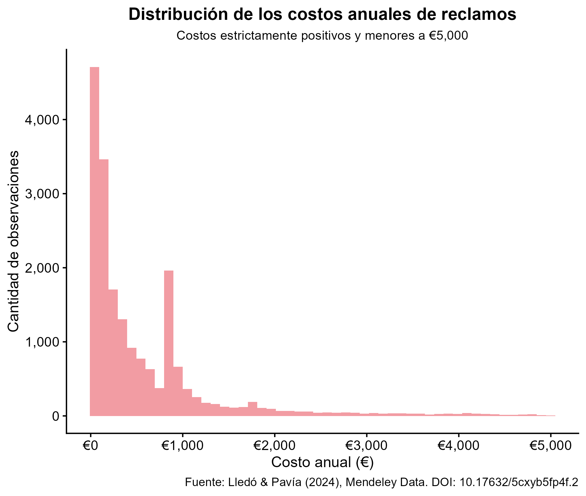{#fig-histograma-costos width="80%"}

La @fig-histograma-costos muestra la distribución de los costos anuales de reclamos para valores estrictamente positivos menores a €5,000, evidenciando una marcada asimetría positiva con una concentración masiva de observaciones en el rango de €0 a €500, donde se alcanza el pico más alto del gráfico con más de 4,000 registros. Conforme se incrementa el costo anual, la cantidad de observaciones decrece de forma abrupta, con la notable excepción de una barra inusualmente alta en la región inmediatamente anterior a los €1,000, la cual rompe la tendencia decreciente al rozar las 2,000 observaciones y sugiere una acumulación sistemática de siniestros justo antes de dicho umbral. Posterior a este repunte, la frecuencia se desploma y se extiende de manera casi asintótica hacia los €5,000, conformando una cola larga y pesada en la que el volumen de registros se reduce al mínimo.

```{r tbl-estadisticos-descriptivos, warning=FALSE, message=FALSE, echo=FALSE}
library(pastecs)

stat_frec <- stat.desc(datos_analisis$N_claims_year, 
                       basic = TRUE, desc = TRUE, norm = FALSE)

costos_positivos <- datos_analisis$Cost_claims_year[
                     datos_analisis$Cost_claims_year > 0]

stat_sev <- stat.desc(costos_positivos, 
                      basic = TRUE, desc = TRUE, norm = FALSE)

indicadores <- c("nbr.val", "min", "max", "mean", "median", 
                 "var", "std.dev", "coef.var")

nombres <- c("N válidos", "Mínimo", "Máximo", "Media", 
             "Mediana", "Varianza", "Desviación estándar", 
             "Coeficiente de variación")

q_frec <- quantile(datos_analisis$N_claims_year, probs = c(0.25, 0.75))
q_sev  <- quantile(costos_positivos,             probs = c(0.25, 0.75))

tabla_fs <- tibble(
  Indicador = c(
    nombres,
    "Cuartil 1 (Q1)",
    "Cuartil 3 (Q3)",
    "% de ceros (toda la variable)",
    "Índice de sobredispersión (var/media)"
  ),
  frecuencia = c(
    round(stat_frec[indicadores], 4),
    round(q_frec["25%"], 4),
    round(q_frec["75%"], 4),
    round(mean(datos_analisis$N_claims_year == 0) * 100, 2),
    round(var(datos_analisis$N_claims_year) /
          mean(datos_analisis$N_claims_year), 4)
  ),
  severidad = c(
    round(stat_sev[indicadores], 2),
    round(q_sev["25%"], 2),
    round(q_sev["75%"], 2),
    round(mean(datos_analisis$Cost_claims_year == 0) * 100, 2),
    NA
  )
) %>%
  rename(
    `Frecuencia (N_claims_year)` = frecuencia,
    `Severidad (Cost_claims_year)` = severidad
  )

knitr::kable(
  tabla_fs,
  caption = "Estadísticos descriptivos de frecuencia y severidad de siniestros",
  booktabs = TRUE,
  align = c("l", "r", "r"),
  format.args = list(big.mark = ",", scientific = FALSE)
) %>%
  kableExtra::kable_styling(
    full_width = FALSE,
    position = "center",
    font_size = 10,
    latex_options = "hold_position"
  )
```

La @tbl-estadisticos-descriptivos detalla los indicadores estadísticos calculados para la frecuencia y la severidad de los siniestros, permitiendo cuantificar de manera rigurosa las características observadas en las fases previas. En lo que respecta a la frecuencia, de los 103,791 registros válidos, el 81.21% no presentó ningún siniestro durante el año, lo que se confirma con una mediana y un primer y tercer cuartil iguales a cero, evidenciando la masiva concentración de ceros en la distribución. La media de 0.3982 siniestros anuales se encuentra fuertemente influenciada por los casos extremos de la cartera, donde el máximo observado alcanza los 25 siniestros en un solo año. El índice de sobredispersión de 3.0855 indica que la varianza (1.2286) es más de tres veces mayor que la media, lo cual viola el supuesto clásico de equidispersión de la distribución Poisson y justifica formalmente el descarte de este modelo estándar debido a la marcada heterogeneidad y el exceso de ceros de la variable.

Por otro lado, los estadísticos de severidad se calcularon exclusivamente sobre los 19,499 registros con costos estrictamente positivos, cifra que se corresponde con el 18.79% restante de la base total (coincidiendo con el complemento del 81.21% de ceros). Entre estos registros con reclamaciones, la media del costo se sitúa en €828.22, pero la mediana es de apenas €291.00; esta brecha considerable, sumada a un primer cuartil de €96.26 y un tercer cuartil de €882.00, refleja la profunda asimetría hacia la derecha que caracteriza a la variable. La gran mayoría de los reclamos son de baja cuantía, pero coexisten con eventos extremos de altísima severidad que distorsionan el promedio, tal como lo demuestra el costo máximo registrado de €260,853.24. Esta dispersión masiva se ve reflejada en una desviación estándar de €3,353.78, la cual supera en cuatro veces el valor de la media, y en un coeficiente de variación de 4.05. Estos hallazgos validan el uso de la mediana sobre la media como métrica representativa de tendencia central y respaldan firmemente la necesidad de recurrir a distribuciones asimétricas de cola pesada para el modelado de los costos positivos.

#### Análisis de asociación entre las variables cuantitativas

Una vez completado el análisis descriptivo de la frecuencia y la severidad, el segundo método explora si las variables cuantitativas del asegurado o del vehículo se asocian con el número o el costo de los siniestros.
Este análisis no busca establecer causalidad, sino identificar patrones preliminares que orienten la interpretación.
Como primer paso, se determina el método de correlación apropiado mediante la prueba de normalidad de Shapiro-Wilk: si se rechaza la normalidad, se prioriza el coeficiente de Spearman sobre Pearson, lo que constituye en sí mismo un elemento de diagnóstico que garantiza la adecuación del método al tipo de datos analizados.

Para determinar el método de correlación más adecuado, se aplicó la prueba de Shapiro-Wilk sobre una muestra de 5,000 valores de la variable *N_claims_year*.
Se obtuvo un estadístico W = 0.37226 y un p-valor \< 2.2e-16.
Como el p-valor es menor a 0.05, se rechaza la hipótesis de normalidad, por lo que se descarta el coeficiente de Pearson y se utiliza Spearman para el análisis de correlación.
Se eligió Spearman sobre Kendall porque con muestras grandes, como la de este proyecto, ambos coeficientes tienden a producir conclusiones similares, pero Spearman es computacionalmente más eficiente y es el más utilizado en la literatura de seguros para este tipo de análisis exploratorio.

```{r, warning=FALSE, message=FALSE, echo=FALSE, include=FALSE}
shapiro.test(datos$N_claims_year[1:5000])
```

```{r fig-matriz-correlacion, warning=FALSE, message=FALSE, echo=FALSE, fig.cap="Matriz de correlación de Spearman para las variables numéricas del modelo", fig.align='center'}
variables_cor <- datos_modelacion %>%
  select(N_claims_year, Cost_claims_year, edad, Seniority, 
         N_claims_history, Weight, Power, Value_vehicle)

correlacion_spearman <- cor(variables_cor, method = "spearman", use = "complete.obs")

colores_paleta <- c(paleta_pamplemousse[6], paleta_pamplemousse[3], paleta_pamplemousse[1])

matriz_correlacion <- ggcorrplot(correlacion_spearman,
           method = "square", # Forma de las correlaciones
           type = "upper",
           lab = TRUE, # Mostrar los valores dentro de los cuadrados
           lab_size = 3.5,
           title = "Matriz de correlaciones de las variables numéricas",
           colors = colores_paleta,
           legend.title = "Correlación") + 
  labs(x = NULL, y = NULL, 
       caption = "Fuente: Lledó & Pavía (2024), Mendeley Data. DOI: 10.17632/5cxyb5fp4f.2") + # Arreglar problema de nombre en los ejes
  estilo_grupo3 +
  theme(plot.title = element_text(hjust = 0.5, face = "bold"),
        axis.text.x = element_text(angle = 90, vjust = 0.5, hjust = 1))  # Etiquetas del eje "x" en vertical

ggsave("../../../bitacoras/bitacora_3/figuras/matriz_correlacion.png", matriz_correlacion, width = 9, height = 9, dpi = 300)
```

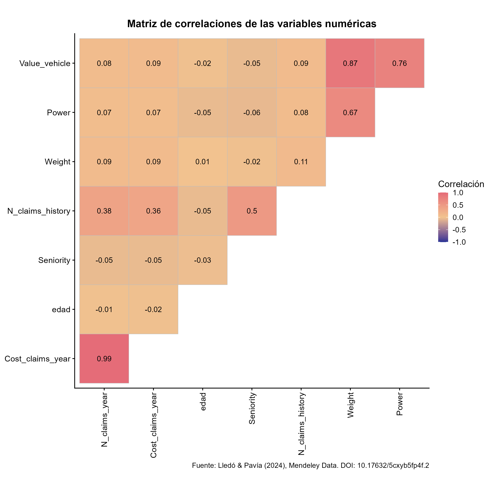{#fig-matriz-correlacion height="70%"}

La matriz permite observar las asociaciones entre las variables cuantitativas.
En cuanto a las variables de la siniestralidad, *N_claims_history* presenta la correlación más alta con *N_claims_year* ($\rho$ = 0.38) y con *Cost_claims_year* ($\rho$ = 0.36), lo que indica que los asegurados con mayor historial de reclamos tienden a presentar más siniestros y costos más altos en el año analizado.
La correlación casi perfecta entre *N_claims_year* y *Cost_claims_year* ($\rho$ = 0.99) es un resultado esperable, ya que a mayor número de reclamos mayor será el costo acumulado, por lo que ambas variables capturan esencialmente el mismo fenómeno desde ángulos distintos.

Como observación secundaria, la matriz también muestra correlaciones altas entre variables explicativas entre sí.
El peso del vehículo (*Weight*) presenta una correlación positiva fuerte con el valor del vehículo *(Value_vehicle*, $\rho$ = 0.87) y con la potencia *(Power*, $\rho$ = 0.67), lo que sugiere que estas tres variables podrían estar midiendo aspectos relacionados entre sí.
Lo anterior es relevante para las etapas posteriores de modelación, ya que incluir variables que están muy correlacionadas entre sí podría generar redundancia en el modelo.

```{r, echo = FALSE}
ic_spearman <- function(var_x, var_y, df) {
  
  pares <- df %>% 
    select(all_of(c(var_x, var_y))) %>% 
    drop_na()
  
  n <- nrow(pares)
  test <- cor.test(pares[[var_x]], pares[[var_y]], method = "spearman", exact = FALSE)
  rho <- as.numeric(test$estimate)
  
  # Transformación Fisher
  z <- atanh(rho)
  se <- 1 / sqrt(n - 3)
  z975 <- qnorm(0.975)
  
  ic_inf <- tanh(z - z975 * se)
  ic_sup <- tanh(z + z975 * se)
  
  tibble(
    `Variable explicativa` = var_x,
    `Variable respuesta` = var_y,
    `ρ Spearman` = round(rho, 4),
    `IC inferior (95%)` = round(ic_inf, 4),
    `IC superior (95%)` = round(ic_sup, 4),
    `p-valor` = round(test$p.value, 6),
    `Interpretación` = case_when(
      ic_inf > 0 ~ "Asociación positiva",
      ic_sup < 0 ~ "Asociación negativa",
      TRUE       ~ "No concluyente"
    )
  )
}

# Variables explicativas usadas en la matriz
vars_explicativas <- c("edad", "Seniority", "antiguedad_licencia",
                       "edad_vehiculo", "Power", "Value_vehicle",
                       "Weight", "N_claims_history")

# Calcular IC para N_claims_year y Cost_claims_year
tabla_ic <- map_dfr(vars_explicativas, function(v) {
  bind_rows(
    ic_spearman(v, "N_claims_year",    datos_modelacion),
    ic_spearman(v, "Cost_claims_year", datos_modelacion)
  )
})

knitr::kable(
  tabla_ic,
  caption = "Correlaciones de Spearman con intervalos de confianza al 95\\%",
  booktabs = TRUE,
  align = c("l", "l", "r", "r", "r", "r", "l"),
  format.args = list(scientific = FALSE)
) %>%
  kableExtra::kable_styling(
    latex_options = c("hold_position", "centering"),
    full_width = FALSE,
    font_size = 9
  ) %>%
  kableExtra::pack_rows("Variables temporales del asegurado", 1, 8) %>%
  kableExtra::pack_rows("Variables del vehículo e historial", 9, 16)
```

Los resultados de la tabla confirman que ninguna variable explicativa presenta una asociación fuerte con la frecuencia ni con la severidad de los siniestros.
La correlación más alta corresponde a *N_claims_history*, con $\rho$ = 0.3782 para la frecuencia y $\rho$ = 0.3645 para la severidad, presenta una asociación positiva moderada consistente con lo observado en la matriz.
Este resultado es esperable desde una perspectiva actuarial, ya que el historial de reclamos es un predictor natural del comportamiento futuro.

Las variables asociadas a características físicas del vehículo, como *Weight, Value_vehicle* y *Power,* muestran asociaciones positivas débiles con coeficientes entre 0.06 y 0.09, lo que sugiere que vehículos más pesados, valiosos o potentes están levemente asociados con mayor siniestralidad.
Las variables del asegurado, como *edad, antiguedad_licencia* y *Seniority,* presentan asociaciones negativas muy débiles con coeficientes entre -0.01 y -0.05, mientras que *edad_vehiculo* muestra una asociación positiva débil de $\rho$ = 0.066.

En todos los casos, los intervalos de confianza al 95% no contienen el cero, lo que indica que las asociaciones son estadísticamente distinguibles de cero.
Sin embargo, dado que los coeficientes son cercanos a cero en la mayoría de los casos, estas asociaciones deben interpretarse como débiles en términos prácticos, no como relaciones sustantivas entre las variables.

#### Comparación entre grupos definidos a partir de variables categóricas

Una vez caracterizadas las asociaciones entre variables cuantitativas, el análisis avanza hacia las variables categóricas del *dataset*.
Este tercer método completa el panorama exploratorio al incorporar factores que no pueden estudiarse mediante correlación: el tipo de vehículo, la zona de circulación y el tipo de combustible.
La comparación entre grupos responde directamente a la pregunta de investigación, pues permite identificar si ciertas categorías concentran una mayor frecuencia de siniestros, una mayor proporción de costos positivos o una severidad más alta cuando ocurre un reclamo.
Para cada variable categórica se presentan gráficos de barras para la frecuencia, boxplots para la severidad y tablas resumen que integran ambas dimensiones.

```{r fig-frecuencia-promedio-vehiculo, warning=FALSE, message=FALSE, echo=FALSE, fig.cap="Frecuencia promedio de siniestros anuales según la categoría del vehículo", fig.align='center'}
frecuencia_promedio_vehiculo <- datos_modificados %>%
  group_by(categoria) %>%
  summarise(frecuencia_promedio = mean(N_claims_year, na.rm = TRUE), n = n()) %>%
  ggplot(aes(x = factor(categoria), y = frecuencia_promedio, fill = factor(categoria))) +
  geom_bar(stat = "identity") +
  geom_text(aes(label = round(frecuencia_promedio, 3)), vjust = -0.5) +
  scale_fill_manual(values = paleta_pamplemousse[1:4]) +
  labs(title = "Frecuencia promedio de siniestros por tipo de vehículo",
       x = "Tipo de vehículo",
       y = "Frecuencia promedio de siniestros por año",
       caption = "Fuente: Lledó & Pavía (2024), Mendeley Data. DOI: 10.17632/5cxyb5fp4f.2") +
  scale_y_continuous(breaks = seq(0, 0.6, 0.1)) +
  ylim (0, 0.6) + 
  guides(fill = "none") +
  estilo_grupo3

ggsave("../../../bitacoras/bitacora_3/figuras/frecuencia_promedio_tipo_vehiculo.png", frecuencia_promedio_vehiculo, width = 10, height = 7, dpi = 300)
```

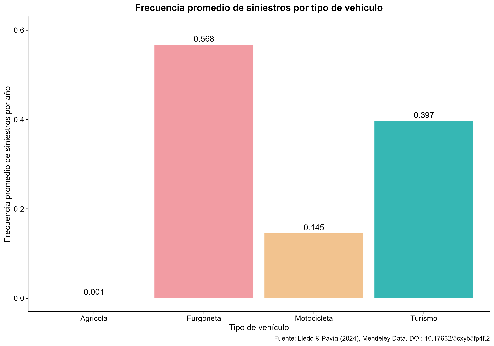{#fig-promedio-tipo-vehiculo width="90%"}

Se observa que las furgonetas son el tipo de vehículo que mayor frecuencia promedio de siniestros anual posee, con 0.568 siniestros por año, luego están los turismos, los cuales tienen 0.397 siniestros por año, luego están las motocicletas con 0.145 siniestros por año y por último están los vehículos agrícolas, los cuales poseen 0.001 siniestros por año.

Estos resultados indican que el tipo de vehículo es un factor de importancia en la frecuencia de siniestros; las furgonetas son el tipo de vehículo con la mayor frecuencia promedio de siniestros anual, las furgonetas poseen en promedio más del doble de siniestros que las motocicletas y más de 500 veces más siniestros en promedio que los vehículos agrícolas.

Este hallazgo indica que la variable del tipo de vehículo "Type_risk" interviene en la frecuencia de los siniestros.

```{r fig-proporcion-sin-siniestros, warning=FALSE, message=FALSE, echo=FALSE, fig.cap="Porcentaje de pólizas sin reportes de siniestros según el tipo de vehículo", fig.align='center'}
proporcion_sin_siniestros <- datos_modificados %>% 
  group_by(categoria) %>% 
  summarise(proporcion_sin_siniestros = mean(N_claims_year == 0, na.rm = TRUE), n = n()) %>% 
  ggplot(aes(x = factor(categoria), y = proporcion_sin_siniestros, fill = factor(categoria))) +
  geom_bar(stat = "identity") +
  geom_text(aes(label = scales::percent(proporcion_sin_siniestros, accuracy = 0.01)), vjust = -0.5) +
  scale_fill_manual(values = paleta_pamplemousse[1:4]) + 
  labs(title = "Proporción de asegurados sin siniestros por tipo de vehículo",
       x = "Tipo de vehículo",
       y = "Proporción",
       caption = "Fuente: Lledó & Pavía (2024), Mendeley Data. DOI: 10.17632/5cxyb5fp4f.2") +
  ylim(0,1) +
  guides(fill = "none") +
  estilo_grupo3

ggsave("../../../bitacoras/bitacora_3/figuras/proporcion_sin_siniestros.png", proporcion_sin_siniestros, width = 10, height = 7, dpi = 300)
```

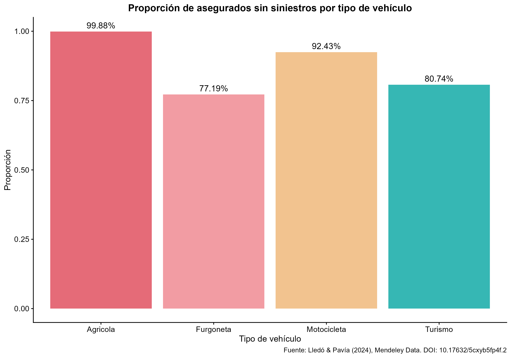{width="90%"}

Como muestra el gráfico, los vehículos agrícolas son los que poseen mayor proporción de asegurados sin siniestros, con un 99.88% que no presentan reclamaciones, seguido por las motocicletas las cuales poseen un 92.43% de asegurados sin reclamaciones, los turismos poseen un 80.74% y las furgonetas un 77.19%.

Estos hallazgos concuerdan con el hallazgo anterior, ya que las furgonetas no solamente poseen la mayor frecuencia promedio: 0.568, sino que también poseen la menor proporción de asegurados sin siniestros: 77.19%.
A diferencia de los vehículos agrícolas los cuales prácticamente nunca reportan siniestros y son los que mayor proporción de asegurados sin siniestros tienen, con 99.88% como se mencionó anteriormente.

```{r fig-proporcion-costo-positivo, warning=FALSE, message=FALSE, echo=FALSE, fig.cap="Porcentaje de registros con costos de siniestro mayores a cero según el tipo de vehículo", fig.align='center'}
dist_costo_positivo <- datos_modificados %>% 
  group_by(categoria) %>% 
  summarise(proporcion_costo_mayor_0 = mean(Cost_claims_year > 0, na.rm = TRUE), n = n()) %>% 
  ggplot(aes(x = factor(categoria), y = proporcion_costo_mayor_0, fill = factor(categoria))) +
  geom_bar(stat = "identity") +
  geom_text(aes(label = scales::percent(proporcion_costo_mayor_0, accuracy = 0.01)), vjust = -0.5) +
  scale_fill_manual(values = paleta_pamplemousse[1:4]) + 
  labs(title = "Proporción de registros con costo de siniestros mayor a €0 por tipo de vehículo",
       x = "Tipo de vehículo",
       y = "Proporción",
       caption = "Fuente: Lledó & Pavía (2024), Mendeley Data. DOI: 10.17632/5cxyb5fp4f.2") +
  ylim(0,1) +
  guides(fill = "none") +
  estilo_grupo3

ggsave("../../../bitacoras/bitacora_3/figuras/dist_costo_positivo_tipo_vehiculo.png", dist_costo_positivo, width = 10, height = 7, dpi = 300)
```

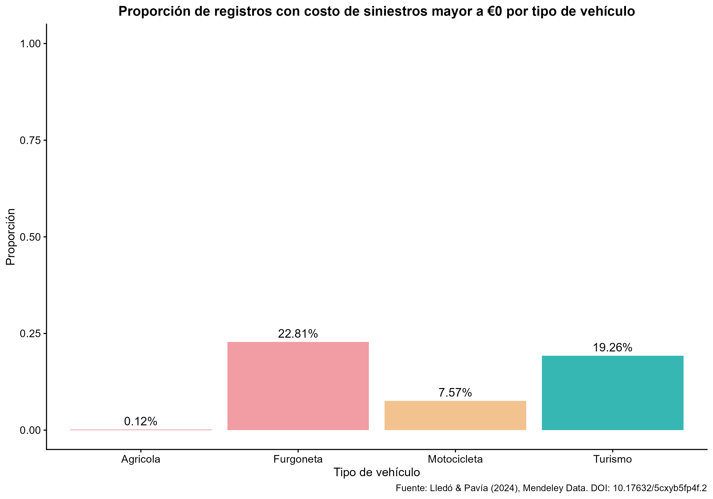{width="90%"}

En este gráfico se puede observar que los vehículos agrícolas son los que poseen la menor proporción de registros con costo mayor a €0, con una proporción de 0.12%, seguido de las motocicletas las cuales tienen un 7.57%, luego los turismos con 19.26% y finalmente, las furgonetas son las que tienen la mayor proporción, con 22.81%.
El presente gráfico y el anterior son complementarios, ya que las furgonetas, las cuales tienen un 77.19% en la proporción de asegurados sin siniestros, son las que mayor proporción de asegurados con costo positivo tiene, con 22.81%.
En contraste, los vehículos agrícolas los cuales son los que poseen mayor proporción sin siniestros, con 99.88%, tienen prácticamente una nula presencia en la proporción de costos positivos, con 0.12%.

```{r fig-boxplot-costo-vehiculo, warning=FALSE, message=FALSE, echo=FALSE, fig.cap="Distribución del costo anual de siniestros por tipo de vehículo para valores entre €0 y €5,000", fig.align='center'}
velas_tipo_vehiculo <- datos_modificados %>% 
    filter(Cost_claims_year > 0, Cost_claims_year <= 5000) %>%
  ggplot(aes(x = factor(categoria), y = Cost_claims_year, fill = factor(categoria))) +
  geom_boxplot() +
  scale_fill_manual(values = paleta_pamplemousse[1:4]) +
  labs(title = "Distribución del costo anual por tipo de vehículo",
       subtitle = "Filtrado para costos anuales mayores a 0 y menores a 5000",
       x = "Tipo de vehículo",
       y = "Costo anual",
       caption = "Fuente: Lledó & Pavía (2024), Mendeley Data. DOI: 10.17632/5cxyb5fp4f.2") +
  scale_y_continuous(labels = scales::comma, breaks = seq(0, 5000, 500)) +
  guides(fill = "none") +
  estilo_grupo3

ggsave("../../../bitacoras/bitacora_3/figuras/velas_costo_tipo_vehiculo.png", velas_tipo_vehiculo, width = 10, height = 7, dpi = 300)

```

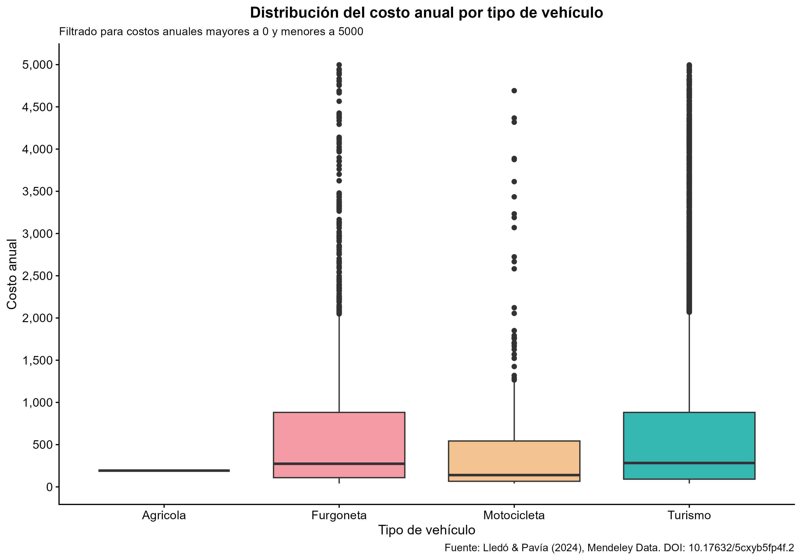{width="90%"}

Como se puede observar, la mediana de las furgonetas, motocicletas y turismos, se encuentra por debajo de la mitad de la caja de cada una, indicando que existe una asimetría positiva para estos tres tipos de vehículos.
Además, las cajas de las furgonetas y turismos son prácticamente iguales, lo que indica que tienen una variabilidad similar, a pesar de esto, los turismos presentan muchos valores atípicos desde los 2000 hasta los 5000, mientras que las furgonetas poseen menos valores atípicos.

La caja de las motocicletas es más pequeña que la de las furgonetas y la de los turismos, indicando que posee menor variabilidad que estos dos tipos de vehículos, además, posee menos valores atípicos.
Para el caso de los vehículos agrícolas, su caja es casi una línea, indicando que hay prácticamente un costo fijo cerca de 200, además, no posee valores atípicos ni bigotes, esto concuerda con su frecuencia promedio de siniestros que es prácticamente 0.

```{r, echo=FALSE}
tabla_resumen_tipo_vehiculo <- datos_modificados %>%
  group_by(categoria) %>%
  summarise(
    n = n(),
    frec_promedio = mean(N_claims_year, na.rm = TRUE),
    prop_sin_siniestros = mean(N_claims_year == 0, na.rm = TRUE),
    prop_costo_positivo = mean(Cost_claims_year > 0, na.rm = TRUE),
    media_costo_pos = mean(Cost_claims_year[Cost_claims_year > 0], na.rm = TRUE),
    mediana_costo_pos = median(Cost_claims_year[Cost_claims_year > 0], na.rm = TRUE),
    q1_costo_pos = quantile(Cost_claims_year[Cost_claims_year > 0], 0.25, na.rm = TRUE),
    q3_costo_pos = quantile(Cost_claims_year[Cost_claims_year > 0], 0.75, na.rm = TRUE),
    max_costo_pos = max(Cost_claims_year[Cost_claims_year > 0], na.rm = TRUE)
  )
```

```{r, echo=FALSE}
tabla_resumen_tipo_vehiculo %>%
  mutate(
    frec_promedio = round(frec_promedio, 4),
    prop_sin_siniestros = scales::percent(prop_sin_siniestros, accuracy = 0.01),
    prop_costo_positivo = scales::percent(prop_costo_positivo, accuracy = 0.01),
    across(c(media_costo_pos, mediana_costo_pos,
             q1_costo_pos, q3_costo_pos, max_costo_pos),
           ~ formatC(., format = "f", digits = 2, big.mark = ","))
  ) %>%
  knitr::kable(
    col.names = c("Tipo de vehículo", "n", "Frec. promedio",
                  "Sin siniestros", "Costo > €0",
                  "Media (€)", "Mediana (€)", "Q1 (€)", "Q3 (€)", "Máximo (€)"),
    caption = "Resumen de frecuencia y severidad por tipo de vehículo",
    booktabs = TRUE,
    align = c("l", "r", "r", "r", "r", "r", "r", "r", "r", "r"),
    format.args = list(scientific = FALSE)
  ) %>%
  kableExtra::kable_styling(
    full_width = FALSE,
    position = "center",
    font_size  = 9,
    latex_options = "hold_position"
  )
```

En cuanto a la frecuencia, los resultados confirman que las furgonetas presentan la mayor siniestralidad promedio con 0.5676 siniestros por año, seguidas por los turismos con 0.3967, las motocicletas con 0.1454, y los vehículos agrícolas con 0.0012.
Este mismo ordenamiento se refleja en la proporción de asegurados sin siniestros: los vehículos agrícolas concentran el 99.88% de registros sin reclamaciones, mientras que las furgonetas tienen la menor proporción con 77.19%.
En cuanto a la severidad, cuando se presentan siniestros, los turismos son el tipo de vehículo con mayor costo promedio (€857.00) y el mayor costo máximo registrado (€260,853.24), lo que sugiere la presencia de siniestros de alta severidad en este grupo.
Sin embargo, su mediana (€298.42) es cercana a la de las furgonetas (€282.32), lo que indica que la mayoría de los siniestros en ambos grupos tienen costos similares y que la diferencia en la media está impulsada por valores extremos.
Un hallazgo notable es que tanto las furgonetas como los turismos presentan un tercer cuartil de exactamente €882.00, lo que coincide con el umbral analizado en secciones anteriores del presente informe y sugiere una concentración de siniestros en ese valor para ambos tipos de vehículo.
Las motocicletas, aunque con menor frecuencia que furgonetas y turismos, presentan una mediana de costo positivo de €141.25, la más baja entre los tres grupos activos, lo que indica que sus siniestros tienden a ser menos costosos.
Para los vehículos agrícolas, todos los estadísticos de severidad convergen en €192.67, resultado consistente con el hecho de que prácticamente la totalidad de sus escasos registros con costo positivo corresponden a un único valor.

A continuación, se realizará la comparación entre grupos por área:

```{r fig-frecuencia-promedio-area, warning=FALSE, message=FALSE, echo=FALSE, fig.cap="Frecuencia promedio de siniestros anuales según la zona de circulación (rural o urbana)", fig.align='center'}
frecuencia_promedio_area <- datos_modelacion %>%
  mutate(Area = factor(Area, levels = c(0,1), labels = c("Rural","Urbana"))) %>%
  group_by(Area) %>%
  summarise(frecuencia_promedio = mean(N_claims_year, na.rm = TRUE), n = n()) %>%
  ggplot(aes(x = Area, y = frecuencia_promedio, fill = Area)) +
  geom_bar(stat = "identity") +
  geom_text(aes(label = round(frecuencia_promedio, 3)), vjust = -0.5) +
  scale_fill_manual(values = paleta_pamplemousse[1:2]) +
  labs(title = "Frecuencia promedio de siniestros por zona de circulación",
       x = "Zona", y = "Frecuencia promedio de siniestros por año",
       caption = "Fuente: Lledó & Pavía (2024), Mendeley Data. DOI: 10.17632/5cxyb5fp4f.2") +
  ylim(0, 0.6) +
  guides(fill = "none") +
  estilo_grupo3

ggsave("../../../bitacoras/bitacora_3/figuras/frecuencia_promedio_area.png",
       frecuencia_promedio_area, width = 10, height = 7, dpi = 300)
```

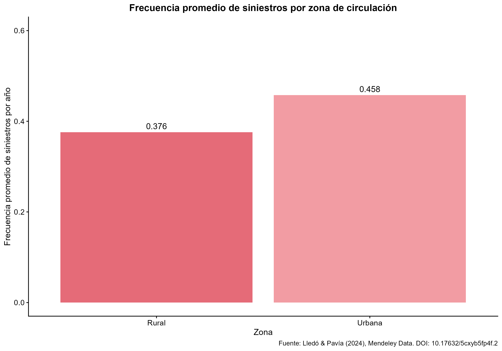{width="90%"}

Se muestra que los asegurados en zonas urbanas presentan una mayor frecuencia promedio de siniestros anual en comparación con los asegurados en zonas rurales.
Si bien la diferencia no es tan pronunciada como la observada entre tipos de vehículo, sí existe una brecha visible entre ambas zonas, lo que sugiere que la zona de circulación tiene alguna influencia sobre la frecuencia de siniestros.
Esto es consistente con lo esperado, dado que las zonas urbanas presentan mayor densidad de tráfico y, por tanto, mayor exposición al riesgo de siniestros.

```{r fig-proporcion-sin-siniestros-area, warning=FALSE, message=FALSE, echo=FALSE, fig.cap="Porcentaje de pólizas sin reportes de siniestros según la zona de circulación", fig.align='center'}
proporcion_sin_siniestros_area <- datos_modificados %>%
  mutate(Area = factor(Area, levels = c(0,1), labels = c("Rural","Urbana"))) %>%
  group_by(Area) %>%
  summarise(prop_sin_siniestros = mean(N_claims_year == 0, na.rm = TRUE), n = n()) %>%
  ggplot(aes(x = Area, y = prop_sin_siniestros, fill = Area)) +
  geom_bar(stat = "identity") +
  geom_text(aes(label = scales::percent(prop_sin_siniestros, accuracy = 0.01)), vjust = -0.5) +
  scale_fill_manual(values = paleta_pamplemousse[1:2]) +
  labs(title = "Proporción de asegurados sin siniestros por zona de circulación",
       x = "Zona", y = "Proporción",
       caption = "Fuente: Lledó & Pavía (2024), Mendeley Data. DOI: 10.17632/5cxyb5fp4f.2") +
  ylim(0, 1) +
  guides(fill = "none") +
  estilo_grupo3

ggsave("../../../bitacoras/bitacora_3/figuras/proporcion_sin_siniestros_area.png",
       proporcion_sin_siniestros_area, width = 10, height = 7, dpi = 300)
```

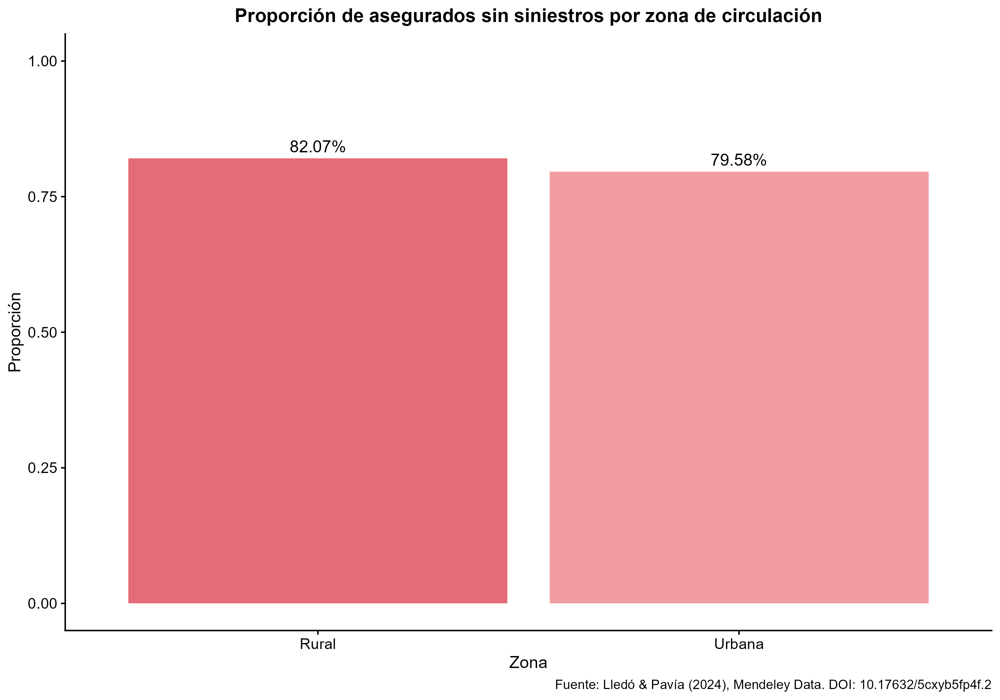{width="90%"}

La zona rural presenta una proporción de asegurados sin siniestros ligeramente mayor (82.07%) en comparación con la zona urbana.
Este resultado es complementario al gráfico anterior, ya que la zona urbana, que tiene mayor frecuencia promedio de siniestros, también tiene menor proporción de asegurados sin reclamaciones.
Sin embargo, la diferencia entre ambas zonas es modesta, lo que indica que la zona de circulación, aunque relevante, no genera diferencias tan marcadas en la concentración de ceros como sí lo hace el tipo de vehículo.

```{r fig-proporcion-costo-positivo-area, warning=FALSE, message=FALSE, echo=FALSE, fig.cap="Porcentaje de registros con costos de siniestro mayores a cero según la zona de circulación", fig.align='center'}
dist_costo_positivo_area <- datos_modificados %>%
  mutate(Area = factor(Area, levels = c(0,1), labels = c("Rural","Urbana"))) %>%
  group_by(Area) %>%
  summarise(prop_costo_mayor_0 = mean(Cost_claims_year > 0, na.rm = TRUE), n = n()) %>%
  ggplot(aes(x = Area, y = prop_costo_mayor_0, fill = Area)) +
  geom_bar(stat = "identity") +
  geom_text(aes(label = scales::percent(prop_costo_mayor_0, accuracy = 0.01)), vjust = -0.5) +
  scale_fill_manual(values = paleta_pamplemousse[1:2]) +
  labs(title = "Proporción de registros con costo de siniestros mayor a €0 por zona",
       x = "Zona", y = "Proporción",
       caption = "Fuente: Lledó & Pavía (2024), Mendeley Data. DOI: 10.17632/5cxyb5fp4f.2") +
  ylim(0, 1) +
  guides(fill = "none") +
  estilo_grupo3

ggsave("../../../bitacoras/bitacora_3/figuras/dist_costo_positivo_area.png",
       dist_costo_positivo_area, width = 10, height = 7, dpi = 300)
```

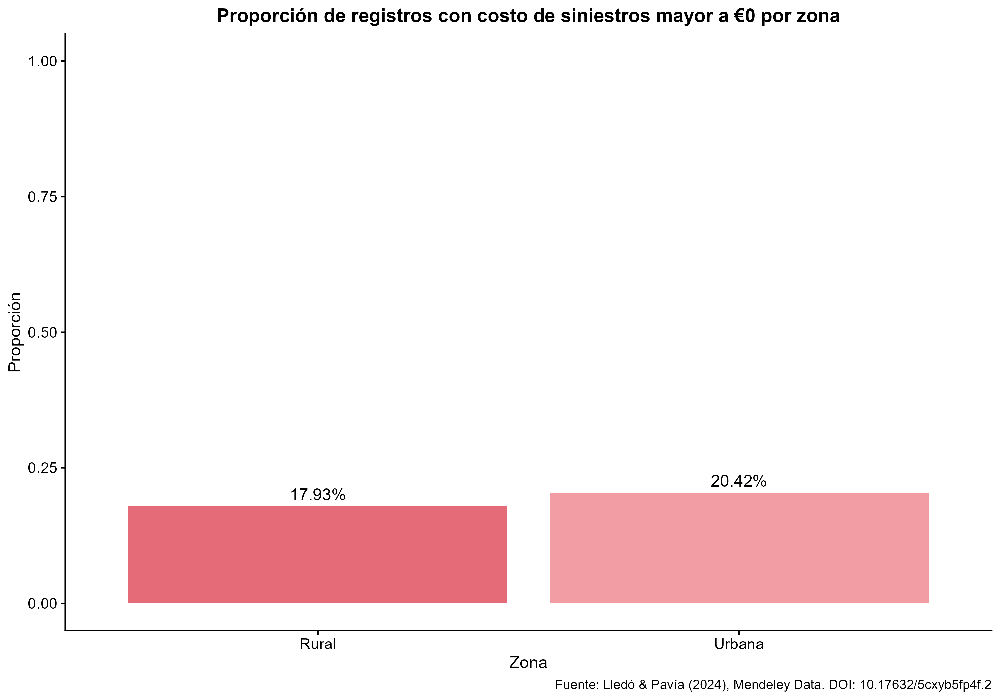{width="90%"}

En este gráfico se puede observar que las zonas urbanas presentan una mayor proporción de registros con costo mayor a €0 (20.42 %) en comparación con las zonas rurales (17.93 %).
Este resultado es el complemento directo del gráfico anterior: la zona urbana, que tiene menor proporción de asegurados sin siniestros (79.58%), es también la que mayor proporción de registros con costo positivo presenta.
La diferencia entre zonas es de aproximadamente 2 puntos porcentuales, modesta pero consistente con el patrón de mayor siniestralidad en entornos urbanos.

```{r fig-boxplot-costo-area, warning=FALSE, message=FALSE, echo=FALSE, fig.cap="Distribución del costo anual de siniestros por zona de circulación para valores entre €0 y €5,000", fig.align='center'}
velas_area <- datos_modificados %>%
  mutate(Area = factor(Area, levels = c(0,1), labels = c("Rural","Urbana"))) %>%
  filter(Cost_claims_year > 0, Cost_claims_year <= 5000) %>%
  ggplot(aes(x = Area, y = Cost_claims_year, fill = Area)) +
  geom_boxplot() +
  scale_fill_manual(values = paleta_pamplemousse[1:2]) +
  labs(title = "Distribución del costo anual por zona de circulación",
       subtitle = "Filtrado para costos anuales mayores a 0 y menores a 5000",
       x = "Zona", y = "Costo anual",
       caption = "Fuente: Lledó & Pavía (2024), Mendeley Data. DOI: 10.17632/5cxyb5fp4f.2") +
  scale_y_continuous(labels = scales::comma, breaks = seq(0, 5000, 500)) +
  guides(fill = "none") +
  estilo_grupo3

ggsave("../../../bitacoras/bitacora_3/figuras/velas_costo_area.png",
       velas_area, width = 10, height = 7, dpi = 300)
```

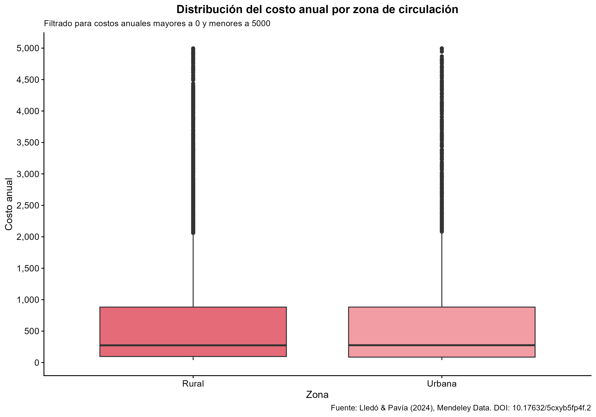{width="90%"}

Las distribuciones del costo anual positivo son notablemente similares entre zonas rurales y urbanas.
Ambas cajas tienen tamaños prácticamente iguales, con medianas cercanas a los €300, lo que indica una variabilidad y tendencia central muy parecidas entre zonas.
En ambos casos la mediana se encuentra en la parte inferior de la caja, evidenciando una asimetría positiva: la mayoría de los siniestros con costo positivo tienen costos relativamente bajos, pero existen valores atípicos que se extienden hasta los €5,000 en el rango visible del gráfico.
La cantidad y distribución de estos valores atípicos son similares entre zonas.

```{r, echo=FALSE}
tabla_resumen_area <- datos_modelacion %>%
  mutate(Area = factor(Area, levels = c(0, 1), 
                       labels = c("Rural", "Urbana"))) %>%
  group_by(Area) %>%
  summarise(
    n = n(),
    frec_promedio = mean(N_claims_year, na.rm = TRUE),
    prop_sin_siniestros = mean(N_claims_year == 0, na.rm = TRUE),
    prop_costo_positivo = mean(Cost_claims_year > 0, na.rm = TRUE),
    media_costo_pos = mean(Cost_claims_year[Cost_claims_year > 0], na.rm = TRUE),
    mediana_costo_pos = median(Cost_claims_year[Cost_claims_year > 0], na.rm = TRUE),
    q1_costo_pos = quantile(Cost_claims_year[Cost_claims_year > 0], 0.25, na.rm = TRUE),
    q3_costo_pos = quantile(Cost_claims_year[Cost_claims_year > 0], 0.75, na.rm = TRUE),
    max_costo_pos = max(Cost_claims_year[Cost_claims_year > 0], na.rm = TRUE)
  )

tabla_resumen_area %>%
  mutate(
    frec_promedio = round(frec_promedio, 4),
    prop_sin_siniestros = scales::percent(prop_sin_siniestros, accuracy = 0.01),
    prop_costo_positivo = scales::percent(prop_costo_positivo, accuracy = 0.01),
    across(c(media_costo_pos, mediana_costo_pos,
             q1_costo_pos, q3_costo_pos, max_costo_pos),
           ~ formatC(., format = "f", digits = 2, big.mark = ","))
  ) %>%
  knitr::kable(
    col.names = c("Zona", "n", "Frec. promedio",
                    "Sin siniestros", "Costo > €0",
                    "Media (€)", "Mediana (€)", "Q1 (€)", "Q3 (€)", "Máximo (€)"),
    caption = "Resumen de frecuencia y severidad por zona de circulación",
    booktabs = TRUE,
    align = c("l", "r", "r", "r", "r", "r", "r", "r", "r", "r"),
    format.args = list(scientific = FALSE)
  ) %>%
  kableExtra::kable_styling(
    full_width = FALSE,
    position = "center",
    font_size = 9,
    latex_options = "hold_position"
  ) %>%
  kableExtra::add_header_above(
    c(" " = 2,
      "Frecuencia" = 2,
      "Severidad" = 6)
  )
```

En cuanto a la frecuencia, los asegurados en zonas urbanas presentan una mayor siniestralidad promedio (0.4578 siniestros por año) en comparación con los de zonas rurales (0.3758), lo que es consistente con las condiciones de tráfico más densas características de las áreas urbanas.
Esto también se refleja en la proporción de asegurados sin siniestros, que es ligeramente mayor en zonas rurales (81.91%) que en zonas urbanas (79.36%).
En cuanto a la severidad, las diferencias entre zonas son menos pronunciadas que las observadas entre tipos de vehículo.
La media del costo positivo es de €850.65 en zonas urbanas y €818.62 en zonas rurales, una diferencia modesta.
Las medianas son también similares: €295.31 para zonas urbanas y €288.98 para zonas rurales, lo que indica que la distribución central de los costos cuando ocurre un siniestro no varía sustancialmente entre zonas.
Como ya se observó para el tipo de vehículo, ambas zonas presentan un tercer cuartil de €882.00, lo que refuerza la hipótesis de una concentración de siniestros en ese umbral con independencia de la zona de circulación.
El costo máximo registrado es mayor en zonas urbanas (€260,853.24) que en rurales (€236,285.18), aunque ambos valores corresponden a eventos extremos y no son representativos del comportamiento general.
En conjunto, estos resultados sugieren que la zona de circulación tiene una influencia moderada sobre la frecuencia de siniestros, siendo las zonas urbanas ligeramente más siniestradas, mientras que su efecto sobre la severidad es limitado.

A continuación, se realiza la comparación entre grupos según el tipo de combustible del vehículo.

```{r fig-frecuencia-promedio-combustible, warning=FALSE, message=FALSE, echo=FALSE, fig.cap="Frecuencia promedio de siniestros anuales según el tipo de combustible del vehículo", fig.align='center'}
frecuencia_promedio_combustible <- datos_modificados %>%
  filter(!is.na(Type_fuel)) %>%
  mutate(Type_fuel = factor(Type_fuel, levels = c("P", "D"), 
                            labels = c("Gasolina", "Diésel"))) %>%
  group_by(Type_fuel) %>%
  summarise(frecuencia_promedio = mean(N_claims_year, na.rm = TRUE), n = n()) %>%
  ggplot(aes(x = Type_fuel, y = frecuencia_promedio, fill = Type_fuel)) +
  geom_bar(stat = "identity") +
  geom_text(aes(label = round(frecuencia_promedio, 3)), vjust = -0.5) +
  scale_fill_manual(values = paleta_pamplemousse[1:2]) +
  labs(title = "Frecuencia promedio de siniestros por tipo de combustible",
       x = "Tipo de combustible",
       y = "Frecuencia promedio de siniestros por año",
       caption = "Fuente: Lledó & Pavía (2024), Mendeley Data. DOI: 10.17632/5cxyb5fp4f.2") +
  ylim(0, 0.6) +
  guides(fill = "none") +
  estilo_grupo3
frecuencia_promedio_combustible
```

Los vehículos de tipo diésel presentan una mayor frecuencia promedio de siniestros anual (0.456) en comparación con los de gasolina (0.302).
Esta diferencia es más pronunciada que la observada entre zonas de circulación, lo que sugiere que el tipo de combustible podría estar asociado con patrones de uso distintos, como una mayor exposición al riesgo en vehículos diésel, que suelen destinarse a usos comerciales o de mayor kilometraje.

```{r fig-proporcion-sin-siniestros-combustible, warning=FALSE, message=FALSE, echo=FALSE, fig.cap="Porcentaje de pólizas sin reportes de siniestros según el tipo de combustible del vehículo", fig.align='center'}
proporcion_sin_siniestros_combustible <- datos_modificados %>%
  filter(!is.na(Type_fuel)) %>%
  mutate(Type_fuel = factor(Type_fuel, levels = c("P", "D"), 
                            labels = c("Gasolina", "Diésel"))) %>%
  group_by(Type_fuel) %>%
  summarise(prop_sin_siniestros = mean(N_claims_year == 0, na.rm = TRUE), n = n()) %>%
  ggplot(aes(x = Type_fuel, y = prop_sin_siniestros, fill = Type_fuel)) +
  geom_bar(stat = "identity") +
  geom_text(aes(label = scales::percent(prop_sin_siniestros, accuracy = 0.01)), vjust = -0.5) +
  scale_fill_manual(values = paleta_pamplemousse[1:2]) +
  labs(title = "Proporción de asegurados sin siniestros por tipo de combustible",
       x = "Tipo de combustible",
       y = "Proporción",
       caption = "Fuente: Lledó & Pavía (2024), Mendeley Data. DOI: 10.17632/5cxyb5fp4f.2") +
  ylim(0, 1) +
  guides(fill = "none") +
  estilo_grupo3
proporcion_sin_siniestros_combustible
```

En línea con el hallazgo anterior, los vehículos de gasolina presentan una mayor proporción de asegurados sin siniestros (84.66 %) en comparación con los de diésel (79.15 %).
Este resultado es consistente con la frecuencia promedio observada, ya que el grupo con menor siniestralidad también concentra una mayor proporción de registros sin reclamaciones.

```{r fig-proporcion-costo-positivo-combustible, warning=FALSE, message=FALSE, echo=FALSE, fig.cap="Porcentaje de registros con costos de siniestro mayores a cero según el tipo de combustible del vehículo", fig.align='center'}
dist_costo_positivo_combustible <- datos_modificados %>%
  filter(!is.na(Type_fuel)) %>%
  mutate(Type_fuel = factor(Type_fuel, levels = c("P", "D"), 
                            labels = c("Gasolina", "Diésel"))) %>%
  group_by(Type_fuel) %>%
  summarise(prop_costo_mayor_0 = mean(Cost_claims_year > 0, na.rm = TRUE), n = n()) %>%
  ggplot(aes(x = Type_fuel, y = prop_costo_mayor_0, fill = Type_fuel)) +
  geom_bar(stat = "identity") +
  geom_text(aes(label = scales::percent(prop_costo_mayor_0, accuracy = 0.01)), vjust = -0.5) +
  scale_fill_manual(values = paleta_pamplemousse[1:2]) +
  labs(title = "Proporción de registros con costo de siniestros mayor a €0 por tipo de combustible",
       x = "Tipo de combustible",
       y = "Proporción",
       caption = "Fuente: Lledó & Pavía (2024), Mendeley Data. DOI: 10.17632/5cxyb5fp4f.2") +
  ylim(0, 1) +
  guides(fill = "none") +
  estilo_grupo3
dist_costo_positivo_combustible
```

Este gráfico es el complemento directo del anterior: los vehículos diésel, que tienen menor proporción de asegurados sin siniestros, presentan también la mayor proporción de registros con costo mayor a €0, con un 20.85 %, frente al 15.34 % de los vehículos de gasolina.

```{r fig-boxplot-costo-combustible, warning=FALSE, message=FALSE, echo=FALSE, fig.cap="Distribución del costo anual de siniestros por tipo de combustible para valores entre €0 y €5,000", fig.align='center'}
velas_combustible <- datos_modificados %>%
  filter(!is.na(Type_fuel), Cost_claims_year > 0, Cost_claims_year <= 5000) %>%
  mutate(Type_fuel = factor(Type_fuel, levels = c("P", "D"), 
                            labels = c("Gasolina", "Diésel"))) %>%
  ggplot(aes(x = Type_fuel, y = Cost_claims_year, fill = Type_fuel)) +
  geom_boxplot() +
  scale_fill_manual(values = paleta_pamplemousse[1:2]) +
  labs(title = "Distribución del costo anual por tipo de combustible",
       subtitle = "Filtrado para costos anuales mayores a 0 y menores a 5000",
       x = "Tipo de combustible",
       y = "Costo anual",
       caption = "Fuente: Lledó & Pavía (2024), Mendeley Data. DOI: 10.17632/5cxyb5fp4f.2") +
  scale_y_continuous(labels = scales::comma, breaks = seq(0, 5000, 500)) +
  guides(fill = "none") +
  estilo_grupo3
velas_combustible
```

En cuanto a la distribución del costo positivo, ambos tipos de combustible presentan una distribución similar: medianas por debajo de la mitad de la caja, lo que evidencia una asimetría positiva en ambos grupos.
Las cajas tienen tamaños comparables, con valores atípicos que se extienden hasta los €5,000 en el rango visible del gráfico.
La distribución del costo positivo no parece diferir sustancialmente entre tipos de combustible, a diferencia de lo que sí se observó en la frecuencia.

Para sintetizar los resultados anteriores, la siguiente tabla presenta los principales indicadores de frecuencia y severidad para cada tipo de combustible.

```{r, echo=FALSE}
tabla_resumen_combustible <- datos_modificados %>%
  filter(!is.na(Type_fuel)) %>%
  mutate(Type_fuel = factor(Type_fuel, levels = c("P", "D"), 
                            labels = c("Gasolina", "Diésel"))) %>%
  group_by(Type_fuel) %>%
  summarise(
    n = n(),
    frec_promedio = mean(N_claims_year, na.rm = TRUE),
    prop_sin_siniestros = mean(N_claims_year == 0, na.rm = TRUE),
    prop_costo_positivo = mean(Cost_claims_year > 0, na.rm = TRUE),
    media_costo_pos = mean(Cost_claims_year[Cost_claims_year > 0], na.rm = TRUE),
    mediana_costo_pos = median(Cost_claims_year[Cost_claims_year > 0], na.rm = TRUE),
    q1_costo_pos = quantile(Cost_claims_year[Cost_claims_year > 0], 0.25, na.rm = TRUE),
    q3_costo_pos = quantile(Cost_claims_year[Cost_claims_year > 0], 0.75, na.rm = TRUE),
    max_costo_pos = max(Cost_claims_year[Cost_claims_year > 0], na.rm = TRUE)
  )

tabla_resumen_combustible %>%
  mutate(
    frec_promedio = round(frec_promedio, 4),
    prop_sin_siniestros = scales::percent(prop_sin_siniestros, accuracy = 0.01),
    prop_costo_positivo = scales::percent(prop_costo_positivo, accuracy = 0.01),
    across(c(media_costo_pos, mediana_costo_pos,
             q1_costo_pos, q3_costo_pos, max_costo_pos),
           ~ formatC(., format = "f", digits = 2, big.mark = ","))
  ) %>%
  knitr::kable(
    col.names = c("Tipo de combustible", "n", "Frec. promedio",
                  "Sin siniestros", "Costo > €0",
                  "Media (€)", "Mediana (€)", "Q1 (€)", "Q3 (€)", "Máximo (€)"),
    caption = "Resumen de frecuencia y severidad por tipo de combustible",
    booktabs = TRUE,
    align = c("l", "r", "r", "r", "r", "r", "r", "r", "r", "r"),
    format.args = list(scientific = FALSE)
  ) %>%
  kableExtra::kable_styling(
    full_width = FALSE,
    position = "center",
    font_size = 9,
    latex_options = "hold_position"
  ) %>%
  kableExtra::add_header_above(
    c(" " = 2,
      "Frecuencia" = 2,
      "Severidad" = 6)
  )
```

En cuanto a la frecuencia, los vehículos diésel presentan una mayor siniestralidad promedio (0.4556 siniestros por año) frente a los de gasolina (0.3019), lo que se refleja también en una menor proporción de asegurados sin siniestros en el grupo diésel (79.15 %) respecto al de gasolina (84.66 %).
En cuanto a la severidad, las diferencias entre tipos de combustible son menores que las observadas entre tipos de vehículo.
Las medias del costo positivo son similares: €829.50 para diésel y €825.32 para gasolina, y las medianas también son cercanas, con €303.11 y €262.06 respectivamente.
Como ya se observó en los análisis anteriores, ambos grupos presentan un tercer cuartil de €882.00, lo que refuerza la hipótesis de una concentración de siniestros en ese umbral con independencia del tipo de combustible.
En conjunto, estos resultados sugieren que el tipo de combustible tiene una influencia moderada sobre la frecuencia de siniestros, mientras que su efecto sobre la severidad es limitado.

#### Análisis del umbral de 900 euros mediante distribución mixta

El cuarto y último método del análisis integra los hallazgos anteriores al estudiar con mayor detalle la estructura del costo anual de siniestros en torno al umbral de los 900 euros.
La comparación entre grupos ya mostró que, en prácticamente todos los subconjuntos analizados, el tercer cuartil del costo positivo se ubica en 882 euros, lo que sugiere una concentración sistemática de siniestros cerca de ese umbral.
El análisis de distribución mixta permite formalizar esa observación, estimando las proporciones de cada componente y las distribuciones paramétricas que mejor describen los costos en cada rango.
Este método responde directamente a la pregunta de investigación, pues permite cuantificar qué fracción de la cartera genera reclamos de alta severidad y caracterizar la forma de esa distribución.

Para estudiar el comportamiento del costo anual de los siniestros en el umbral de los €900, se propuso un modelo de distribución mixta, separado en tres componentes, primero, una masa puntual ubicada en cero, para la cual los costos corresponden a 0 (Y = 0).
Segundo, una distribución para los costos ubicados entre €0 y €900, sin incluir (0 \< Y \< 900).
Tercero, una distribución para los costos mayores o iguales a €900 (Y ≥ 900), la cual para una mejor visualización gráfica se acotó a €20000.
A continuación se presentan los resultados obtenidos a través del ajuste de distribuciones para costos mayores a €0.

Para el intervalo de 0 a 900, se ajustaron dos distribuciones posibles elegidas a partir de la visualización del gráfico de la distribución los costos entre €0 y €900, las cuales fueron la distribución Lognormal y la distribución Gamma.
Por medio del paquete "fitdistrplus" se realizó el ajuste, del cual se obtuvo que el Criterio de Información de Akaike (AIC) tuvo un valor de 211,339.9 para el caso de la distribución Lognormal, mientras que para la distribución Gamma se obtuvo un AIC de 212,684.5, resultando en una diferencia de 1,344.6; obteniendo que la distribución Lognormal posee un AIC significativamente menor que el de la distribución Gamma, lo que indica que posee un mejor ajuste para los datos.
De esta forma se seleccionó la Lognormal para modelar los costos que están en el intervalo \]0,900\[.
A partir del paquete "fitdistrplus" y su función "fitdist()" se obtuvo que los parámetros para esta distribución son: meanlog = 5.2785366 y sdlog = 0.9693318.
Los siguientes gráficos muestran pruebas adicionales que se realizaron para comparar ambas distribuciones.

```{r fig-diagnostico-lognormal, echo=FALSE, fig.cap="Gráficos diagnósticos de la distribución Lognormal para el intervalo 0 < Y < 900", fig.align='center', out.width="90%"}
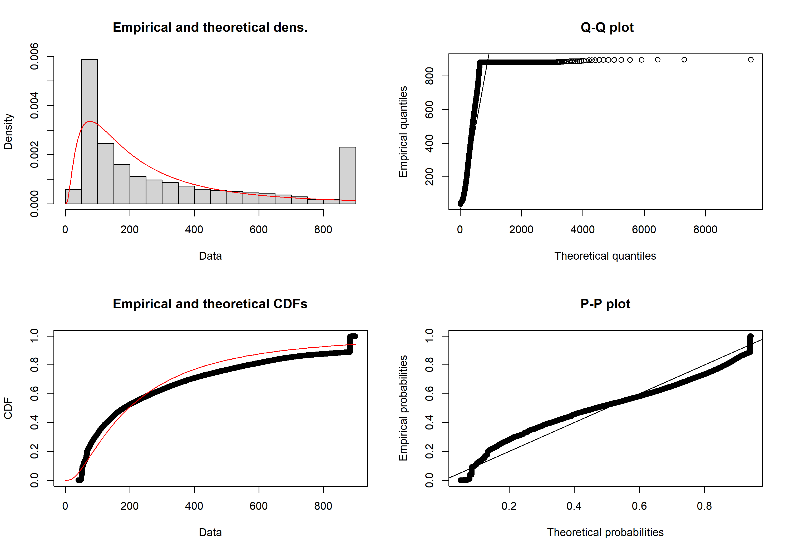
```

Los gráficos diagnósticos de la distribución Lognormal para los costos en el intervalo 0 < Y < 900, presentados en @fig-diagnostico-lognormal, muestran un ajuste aceptable, aunque con limitaciones visibles en los extremos de la distribución. En el gráfico de densidades empírica y teórica, la curva Lognormal captura razonablemente la forma general de los datos, caracterizada por una alta concentración de valores en el rango de €0 a €200 y una cola decreciente hacia €900; sin embargo, la curva teórica subestima el pico observado en los valores bajos y sobreestima ligeramente las densidades en el rango intermedio. Por su parte, el gráfico Q-Q evidencia que la distribución ajustada describe de manera óptima la parte central de los datos, pero presenta desviaciones importantes en la cola derecha: los cuantiles empíricos alcanzan el límite de €900 mientras que los teóricos se extienden sobre los €8,000, reflejando que la Lognormal asigna probabilidad positiva a valores fuera del intervalo acotado. Asimismo, el gráfico de funciones de distribución acumulada (CDF) muestra una superposición cercana entre la curva empírica y la teórica a lo largo de la mayor parte del rango, con una ligera separación en la región central. Este patrón se confirma en el gráfico P-P, donde los puntos siguen la diagonal de referencia de manera aproximada, exhibiendo una desviación sistemática en los percentiles intermedios, donde la distribución empírica acumula más probabilidad de la esperada bajo el modelo. En conjunto, estos diagnósticos indican que la Lognormal ofrece una aproximación razonable para este componente dentro de las distribuciones candidatas evaluadas.

```{r fig-diagnostico-gamma, echo=FALSE, fig.cap="Gráficos diagnósticos de la distribución Gamma para el intervalo 0 < Y < 900", fig.align='center', out.width="90%"}
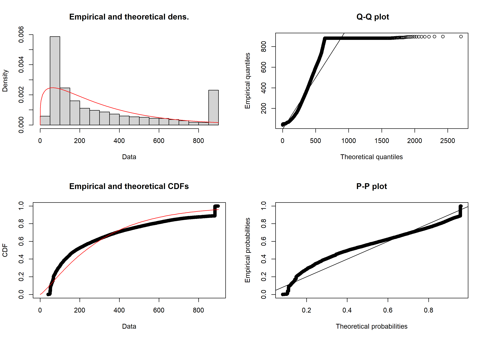
```

Los gráficos diagnósticos de la distribución Gamma, presentados en la @fig-diagnostico-gamma, revelan un ajuste inferior al de la distribución Lognormal en todos los indicadores visuales. En el gráfico de densidades empírica y teórica, la curva Gamma presenta un pico más tardío que el observado en los datos: mientras que el histograma muestra la mayor concentración de registros cerca de €0, la curva teórica alcanza su máximo alrededor de €100, lo que subestima la concentración en los valores más bajos y desplaza la masa de probabilidad hacia el centro del intervalo. Por su parte, el gráfico Q-Q muestra una desviación más pronunciada que en el caso Lognormal; los puntos se separan de la línea diagonal con mayor anticipación y de forma más marcada, indicando que la Gamma no captura adecuadamente ni la región inicial ni la cola derecha de los costos moderados. En particular, los cuantiles teóricos solo alcanzan aproximadamente €2,500 mientras que los empíricos ya se saturan en €900, lo que denota una sobreestimación del rango de la distribución. Asimismo, el gráfico de CDF muestra una separación visible entre la curva teórica y la empírica en el rango de €0 a €400, precisamente donde se concentra la mayor parte de los datos, mientras que en el tramo final la Gamma subestima la probabilidad acumulada. Este comportamiento se refleja en el gráfico P-P, donde la curva se aleja de la diagonal de referencia de forma consistente a lo largo de los percentiles intermedios, particularmente entre los percentiles 0.2 y 0.8. En definitiva, estos diagnósticos respaldan la selección de la Lognormal sobre la Gamma para el componente de costos medios, resultado que es plenamente coherente con la diferencia de AIC de 1,344.6 unidades observada entre ambas distribuciones.

Además, la siguiente figura muestra la comparación entre la distribución Lognormal y la Gamma, superpuestas al histograma de los costos en el intervalo 0 \< Y \< 900:

```{r fig-comparacion-lognormal-gamma, echo=FALSE, fig.cap="Comparación de las distribuciones Lognormal y Gamma para el intervalo 0 < Y < 900", fig.align='center', out.width="80%"}
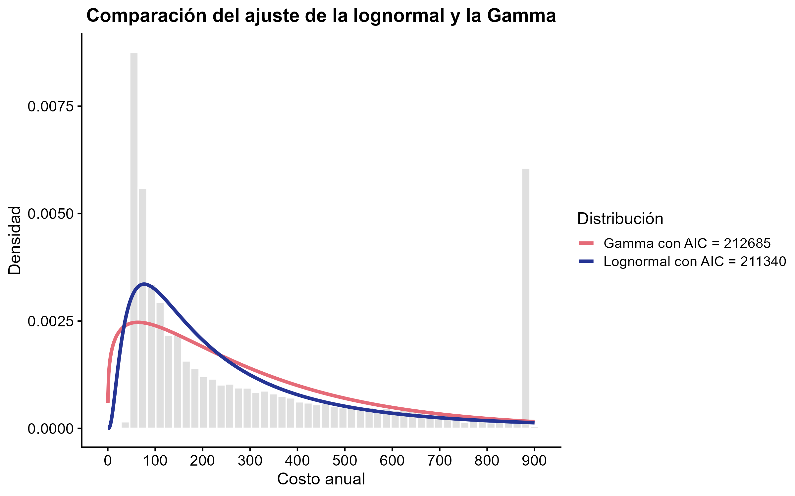
```

La @fig-comparacion-lognormal-gamma superpone las curvas de densidad de ambas distribuciones candidatas sobre el histograma de los costos en el intervalo (0 < Y < 900), lo que permite apreciar visualmente las diferencias clave en el ajuste. El histograma base revela dos características estructurales relevantes: una concentración muy elevada de valores cercanos a €0 y una barra notablemente alta en la región próxima a €900, la cual probablemente refleja la acumulación de registros justo antes del umbral de corte del intervalo. La distribución Lognormal (representada por la curva azul) presenta un pico más pronunciado y ubicado en un valor inferior, aproximadamente entre €50 y €100, lo que le permite aproximarse de mejor manera a la concentración inicial de los datos. Por el contrario, la distribución Gamma (curva rosada) exhibe un pico más suave y desplazado hacia la derecha, alrededor de los €100, lo que provoca una sobreestimación de la densidad en el rango intermedio y una subestimación en los valores más bajos. En la cola derecha, ambas distribuciones convergen de forma similar, aunque la Lognormal mantiene una densidad ligeramente mayor en los valores cercanos al límite de €900. Estas discrepancias visuales son plenamente consistentes con los criterios de selección numérica: la Lognormal (AIC = 211,340) describe con mayor fidelidad la geometría del histograma que la Gamma (AIC = 212,685), especialmente en la región de máxima concentración de datos.

Para el intervalo de los valores mayores o iguales a 900 (Y ≥ 900), primero se acotaron los costos por €20,000, de modo que quedó el intervalo (900 ≤ Y ≤ 20,000).
Después, se ajustaron dos distribuciones posibles elegidas a partir de la visualización del gráfico de la distribución los costos entre €900 y €20,000, las cuales fueron la distribución Lognormal y la distribución Pareto.
Por medio del paquete "fitdistrplus" y la función "fitdist()" se realizó el ajuste para la distribución Lognormal, del cual se obtuvo que el AIC tuvo un valor de 64,536.62, mientras que para la distribución Pareto se obtuvo un AIC de 66422.61, resultando en una diferencia de 1,885.99; obteniendo que la distribución Lognormal posee un AIC significativamente menor que el de la distribución Pareto, lo que indica que posee un mejor ajuste para los datos.
De esta forma se seleccionó la Lognormal para modelar los costos que están en el intervalo (Y ≥ 900).
Además, se obtuvo que los parámetros para esta distribución Lognormal son: meanlog = 7.5571894 y sdlog = 0.6816524.
Los siguientes gráficos muestran pruebas adicionales que se realizaron para comparar ambas distribuciones.

```{r fig-diagnostico-lognormal-mayores-900, echo=FALSE, fig.cap="Gráficos diagnósticos de la distribución Lognormal para el intervalo 900 ≤ Y ≤ 20,000", fig.align='center', out.width="90%"}
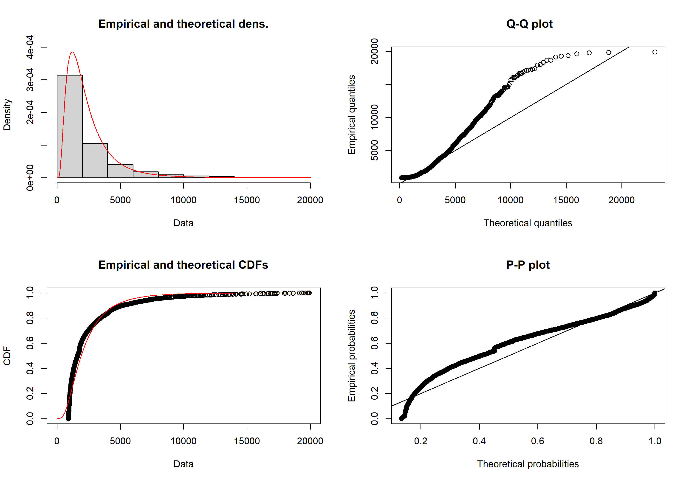
```

Los gráficos diagnósticos de la distribución Lognormal para los costos altos, presentados en la @fig-diagnostico-lognormal-mayores-900, muestran un ajuste razonablemente bueno en la región central, aunque con limitaciones visibles en los extremos de la distribución. En el gráfico de densidades empírica y teórica, la curva Lognormal captura la geometría general del histograma, caracterizada por una alta concentración de valores cerca del umbral de €900 y una cola larga hacia los €20,000; sin embargo, el modelo sobreestima la densidad en la región inmediatamente posterior al umbral (entre €900 y €2,000) y subestima el pico observado en ese mismo rango, lo que sugiere que la acumulación inicial de registros es más pronunciada de lo que predice la función teórica. El gráfico Q-Q exhibe un comportamiento adecuado en los cuantiles centrales, donde los puntos siguen de cerca la línea de referencia, pero evidencia desviaciones ascendentes en los cuantiles más altos: los valores empíricos extremos superan las proyecciones de la Lognormal, indicando que esta subestima la probabilidad de siniestros de muy alta severidad. Asimismo, el gráfico de CDF presenta una superposición cercana entre ambas curvas a lo largo de casi todo el rango, con una leve separación en el tramo inicial donde la distribución teórica acumula probabilidad más rápido que los datos. Por último, el gráfico P-P revela la limitación más clara del ajuste: la curva empírica se ubica consistentemente por encima de la diagonal en el rango de probabilidades teóricas entre 0.2 y 0.7, lo que refleja que el modelo asigna demasiada probabilidad a los valores intermedios del intervalo. A pesar de estas discrepancias, la Lognormal es la opción que mejor describe este componente dentro de las alternativas evaluadas, como lo confirma un AIC = 64,536.62 frente al AIC = 66,422.61 de la distribución Pareto.

```{r fig-diagnostico-pareto, echo=FALSE, fig.cap="Gráficos diagnósticos de la distribución Pareto para el intervalo 900 ≤ Y ≤ 20,000", fig.align='center', out.width="90%"}
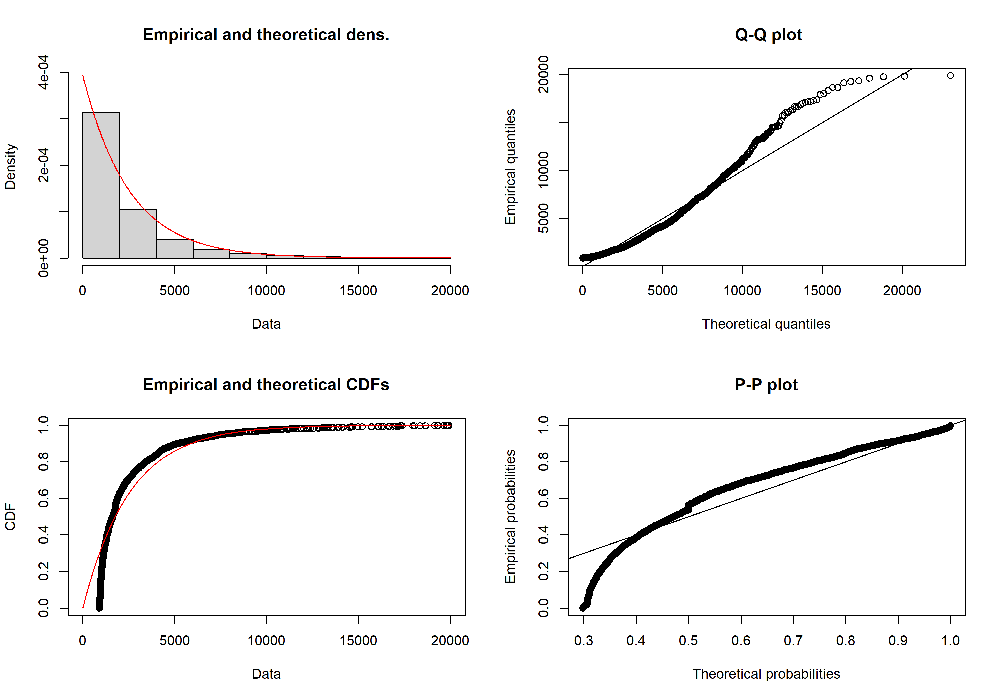
```

Los gráficos diagnósticos de la distribución Pareto para los costos altos, presentados en la @fig-diagnostico-pareto, revelan un ajuste deficiente en comparación con la distribución Lognormal en todos los indicadores visuales. En el gráfico de densidades empírica y teórica, la curva Pareto parte de una densidad relativamente baja al inicio del intervalo (900 ≤ Y ≤ 20,000) y decrece de forma muy lenta a lo largo de todo el rango. Por el contrario, el histograma subyacente muestra una concentración muy pronunciada justo después del umbral de €900, seguida de una caída abrupta hacia valores mayores; esto evidencia que el modelo de Pareto subestima marcadamente la densidad inicial y desplaza la masa de probabilidad hacia la cola de forma excesiva.El gráfico Q-Q expone que los puntos siguen la línea de referencia de manera aceptable en los cuantiles bajos e intermedios, pero presentan una desviación sistemática hacia arriba en la cola derecha: los cuantiles teóricos se extienden hasta valores de aproximadamente €22,000 a €23,000, mientras que los empíricos se estabilizan en el límite de €20,000 impuesto por el truncamiento, lo que indica que el modelo asigna probabilidad excesiva a valores extremos fuera del rango acotado. Asimismo, el gráfico de CDF muestra una separación visible entre la curva teórica y la empírica en la región de €1,000 a €4,000, tramo donde la función acumulada empírica crece a mayor velocidad que la proyectada por la Pareto, en concordancia con la subestimación de la densidad en los valores bajos del intervalo.Por su parte, el gráfico P-P resulta el diagnóstico más revelador del desajuste: la curva empírica se ubica consistentemente por encima de la diagonal de referencia en el rango de probabilidades teóricas entre 0.3 y 0.85, exhibiendo una desviación pronunciada que no se corrige en ningún tramo central, lo que denota que la Pareto acumula menos probabilidad de la observada en los percentiles intermedios. En conjunto, estos diagnósticos respaldan el rechazo de la Pareto como modelo para los costos altos y son plenamente coherentes con su (AIC = 66,422.61), valor notablemente superior al de la Lognormal (AIC = 64,536.62), estableciendo una diferencia de 1,885.99 unidades que favorece claramente a esta última.

Además, la siguiente figura muestra la comparación entre la distribución Lognormal y la Pareto, superpuestas al histograma de los costos en el intervalo 900 ≤ Y ≤ 20,000:

```{r fig-comparacion-lognormal-pareto, echo=FALSE, fig.cap="Comparación de las distribuciones Lognormal y Pareto para el intervalo 900 ≤ Y ≤ 20,000", fig.align='center', out.width="80%"}
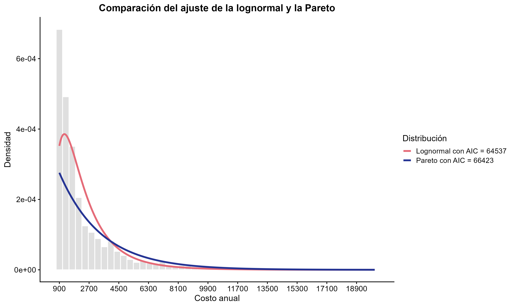
```

La @fig-comparacion-lognormal-pareto superpone las curvas de densidad de la Lognormal y la Pareto sobre el histograma de los costos altos en el intervalo (900 ≤ Y ≤ 20,000). El histograma muestra una distribución fuertemente concentrada en los valores cercanos al umbral de €900, con una barra inicial de densidad notablemente más alta que el resto y una caída rápida hacia valores mayores, lo que confirma la naturaleza de cola pesada de este componente. La distribución Lognormal (curva rosada) presenta un pico bien definido alrededor de los €1,000 a €1,500 que se aproxima razonablemente a la concentración inicial del histograma, y luego decrece de manera gradual siguiendo la geometría general de los datos. La distribución Pareto (curva azul), por el contrario, comienza con una densidad considerablemente más baja que la Lognormal en la región inicial del intervalo y decrece más lentamente a lo largo de toda la cola, lo que genera una sobreestimación persistente de la densidad en los valores altos y una subestimación marcada en la zona de mayor concentración de datos. Esta diferencia es especialmente evidente entre €900 y €3,000, que es precisamente donde se acumula la mayor parte de los registros del componente. La brecha entre ambas curvas se reduce progresivamente a partir de los €6,000, pero la Lognormal mantiene un mejor acuerdo con el histograma a lo largo de todo el rango visible. Estas diferencias visuales son coherentes con los resultados del AIC: la Lognormal (AIC = 64,537) describe mejor la distribución de los costos altos que la Pareto (AIC = 66,423), con una diferencia de 1,886 unidades que favorece claramente al modelo Lognormal.

```{r, warning= FALSE, message=FALSE, echo =FALSE}
proporciones <- datos_modificados %>%
  mutate(Grupo = factor(case_when(
    Cost_claims_year == 0 ~ "Ceros",
    Cost_claims_year > 0 & Cost_claims_year < 900 ~ "Medios",
    Cost_claims_year >= 900 ~ "Altos"
    ), levels = c("Ceros", "Medios", "Altos"))) %>% # Ordenar para que salgan en el orden ceros, medios, altos
  group_by(Grupo) %>%
  summarise(Frecuencia = n()) %>%
  mutate(Proporcion = Frecuencia / sum(Frecuencia), # Dividir cada frecuencia por el total de observaciones y redondearlo a 4
         Porcentaje = round(Proporcion * 100, 3))
```

```{r, warning= FALSE, message=FALSE, echo =FALSE}
proporciones %>%
  kable(caption = "Proporciones de los componentes de la distribución mixta",
        booktabs = TRUE,
        align = c("l", "r", "r", "r"),
        escape = FALSE) %>%
  kable_styling(full_width = FALSE, position = "center", font_size = 10)

sum(proporciones$Proporcion)
```

A través de los resultados obtenidos, presentados en la tabla anterior, se puede observar que los costos nulos representan un 81.388% del total de registros, mientras que el 15.017% de los registros corresponden a costos medios, ubicados en el intervalo (0 \< Y \< 900), mientras que solamente 3.595% de los registros corresponden a costos mayores o iguales a €900.

Con el análisis anterior, con las distribuciones y las proporciones determinadas, se puede construir la distribución mixta.
$$
Y_i \sim \pi_0 \cdot \delta_0 + \pi_1 \cdot \text{Lognormal}(\mu_1, \sigma_1) + \pi_2 \cdot \text{Lognormal}(\mu_2, \sigma_2)
$$ Donde:

-   $\pi_0 = 0.81388$
-   $\delta_0$ es una masa puntual en cero, donde $\delta_0 = 1$ si $Y = 0$, y $\delta_0 = 0$ en otro caso.
-   $\pi_1 = 0.15017$
-   $\text{Lognormal}(\mu_1, \sigma_1)$ es la distribución para costos en el intervalo ($0 < Y < 900$)
-   $\mu_1 = 5.2785366$
-   $\sigma_1 = 0.9693318$
-   $\pi_2 = 0.03595$
-   $\text{Lognormal}(\mu_2, \sigma_2)$ es la distribución para costos en el intervalo ($Y \geq 900$)
-   $\mu_2 = 7.5571894$
-   $\sigma_2 = 0.6816524$

Este modelo se adapta adecuadamente a la estructura de una distribución mixta para los datos, una masa en cero de $\pi_0 = 0.81388$ de las observaciones, un componente de costos medios correspondiente al intervalo (0 \< Y \< 900) el cual sigue una distribución Lognormal con parámetros $\mu_1 = 5.2785366$ y $\sigma_1 = 0.9693318$, el cual posee una proporción $\pi_1 = 0.15017$ y finalmente un componente para los costos altos, correspondiente al intervalo (Y ≥ 900), el cual sigue nuevamente una distribución Lognormal con parámetros $\mu_2 = 7.5571894$ y $\sigma_2 = 0.6816524$ el cual posee una proporción $\pi_2 = 0.03595$.
La información mencionada anteriormente se resume en la siguiente tabla.

```{r, warning=FALSE, message=FALSE, echo=FALSE}
# Tabla del modelo de distribución mixta
tabla_modelo <- data.frame(
  Componente = c("Costos Cero", "Costos Medios", "Costos Altos"),
  Rango = c("Y = 0", "0 < Y < 900", "Y ≥ 900"),
  Distribución = c("Masa puntual δ (Y = 0)", "Lognormal", "Lognormal"),
  Parámetros = c("—", 
                 "μ₁ = 5.2785366, σ₁ = 0.9693318",
                 "μ₂ = 7.5571894, σ₂ = 0.6816524"),
  Proporción = c("π₀ = 0.81388 (81.39%)",
                 "π₁ = 0.15017 (15.02%)",
                 "π₂ = 0.03595 (3.60%)")
)

kable(tabla_modelo,
      caption = "Parámetros del modelo de distribución mixta para el costo anual de siniestros",
      escape = FALSE,
      booktabs = TRUE,
      align = c("l", "l", "l", "l", "l")) %>%
  kable_styling(full_width = FALSE, position = "center", font_size = 10)
```

```{r fig-proporcion-costo-alto-vehiculo, warning=FALSE, message=FALSE, echo=FALSE, fig.cap="Porcentaje de reclamos con un costo anual igual o superior a €900 según el tipo de vehículo", fig.align='center'}
proporcion_mayores_900 <- datos_modificados %>%
  mutate(mayores_900 = ifelse(Cost_claims_year >= 900, 1, 0)) %>%
  group_by(categoria) %>%
  summarise(proporcion_900 = mean(mayores_900, na.rm = TRUE), n = n()) %>%
  ggplot(aes(x = factor(categoria), y = proporcion_900, fill = factor(categoria))) +
  geom_bar(stat = "identity") +
  geom_text(aes(label = scales::percent(proporcion_900, accuracy = 0.01)), vjust = -0.5) +
  scale_fill_manual(values = paleta_pamplemousse[1:4]) +
  labs(title = "Proporción de reclamos con costo mayor a €900 por tipo de vehículo",
       x = "Tipo de vehículo",
       y = "Proporción de reclamos mayores a €900",
       caption = "Fuente: Lledó & Pavía (2024), Mendeley Data. DOI: 10.17632/5cxyb5fp4f.2") +
  ylim(0, 0.2) +
  guides(fill = "none") +
  estilo_grupo3

ggsave("../../../bitacoras/bitacora_3/figuras/proporcion_mayores_900_tipo_vehiculo.png", proporcion_mayores_900, width = 10, height = 7, dpi = 300)

```

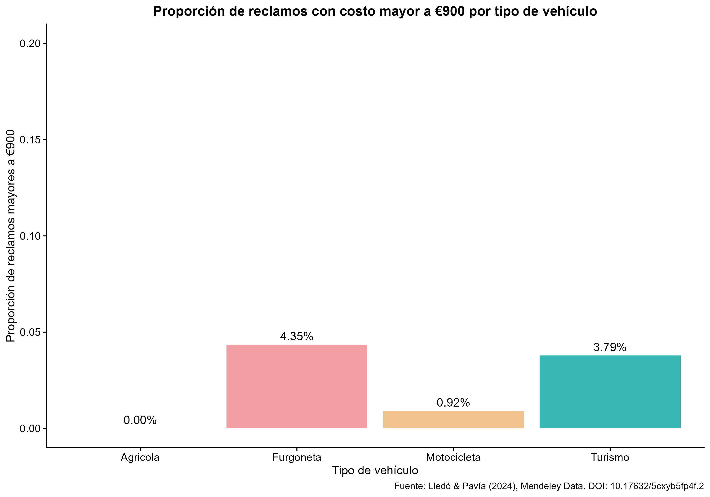{#fig-proporcion-mayores-900-tipo-vehiculo fig-pos="H"}

Como se puede observar, las furgonetas son las que tienen la mayor proporción de reclamos mayores a €900, presentando un 4.35% de casos en los que los reclamos son mayores a €900, seguidamente se encuentran los turismos con 3.79%, luego las motocicletas con 0.92% y por último los vehículos agrícolas con 0.00%, en donde no hay ningún caso en el que un vehículo agrícola posea un reclamo mayor a €900.

Este hallazgo indica que las furgonetas y turismos, no solamente poseen mayor frecuencia promedio, sino que también poseen mayor proporción de casos en donde los reclamos superan o son iguales al monto de los €900, lo que puede indicar que estos dos tipos de vehículos son relevantes para explicar el comportamiento en el umbral de los €900.

### Análisis fallido

#### Modelo Poisson para la frecuencia de siniestros

Para modelar la frecuencia de los siniestros se intentó ajustar un modelo lineal generalizado (GLM) con distribución Poisson para identificar las variables que influyen en la frecuencia de los siniestros por año.
Las variables explicativas utilizadas fueron la edad del asegurado, la antigüedad del asegurado con la aseguradora (Seniority), el número de reclamos histórico (N_claims_history), el tipo de vehículo (Type_risk), el número de puertas (N_doors), el largo de vehículo (Length) y el peso del vehículo (Weight).
El modelo se ajustó utilizando la función "glm()", utilizando "family = poisson()".

El modelo de Poisson falló por dos razones principales.
La primera, es que el modelo de Poisson asume que la media y la varianza son iguales o que no distan por mucho.
Sin embargo, gracias al análisis exploratorio realizado, se encontró que la variable N_claims_year tiene una media de aproximadamente 0.39, mientras que la varianza es de aproximadamente 1.22; lo que representa un indicio de sobredispersión en los datos.
Luego se procedió a calcular la relación entre la varianza y la media (varianza/media) y se obtuvo que es de 3.09, el cual es mayor a uno, por lo que según el índice de sobredispersión de datos, se confirma que hay sobredispersión.

La segunda razón por la cual el modelo de Poisson falló fue porque subestima drásticamente la cantidad de ceros; en los datos se observó que aproximadamente 81.39% del número de reclamos por año son cero, mientras que el modelo de Poisson, utilizando la media original de 0.39, estima que habrá 67.39% de ceros, esto resulta en una diferencia de 14 puntos porcentuales, evidenciando un exceso de ceros que la distribución Poisson no puede generar con la media de los datos.

Para saber que el modelo de Poisson falló se realizaron 3 pruebas.
Primero, se calculó la relación entre la varianza y la media, obteniendo un valor de 3.09, que como ya se indicó, implica sobredispersión en los datos.
Segundo, se realizó una comparación entre los ceros observados y la proporción de ceros esperada con la distribución Poisson, de esta prueba se obtuvo que ambos valores distaban de 14 puntos porcentuales en la proporción de ceros.
Tercero, se calculó el estadístico de sobredispersión por medio de los residuos de desviación del modelo de Poisson, de este cálculo se obtuvo un valor de 1.23, el cual es mayor a 1, lo que indica que hay una mayor variabilidad en los datos de la que el modelo Poisson puede contemplar.

Gracias a este fallo, se aprendió que para datos con alta concentración de ceros en la frecuencia no pueden modelarse por medio de una distribución Poisson, idea reforzada por la literatura consultada a lo largo de la investigación.
Además de esto, se observó que la sobredispersión está presente incluso antes de controlar los datos con variables explicativas.
Por esto, se descarta el uso del modelo Poisson para trabajar la frecuencia de los siniestros.

## Construcción de las fichas de resultados

::: callout-note
# Ficha 1: frecuencia promedio por tipo de vehículo

***Nivel descriptivo***

*Titular:* *Las furgonetas tienen mayor frecuencia promedio de siniestros*

*Nombre del hallazgo/resultado:* Existen diferencias notables en la frecuencia promedio anual según el tipo de vehículo.

*Resumen en una oración:* Las furgonetas poseen la mayor frecuencia promedio, 0.568, turismos 0.397, motocicletas 0.145 y agrícolas 0.001.

*Método o análisis que lo produjo:* Se calculó el promedio de la variable "N_claims_year" agrupada por el tipo de vehículo "categoria", para esto se utilizaron las funciones "group_by()" y "summarise()" de R y para la visualización de los resultados se utilizó un gráfico de barras.

*Evidencia:* El gráfico que respalda este hallazgo corresponde a la @fig-promedio-tipo-vehiculo de la tercera bitácora, titulada "Frecuencia promedio de siniestros por año según el tipo de vehículo".

***Nivel analítico***

*Conexión con la pregunta de investigación:* Este hallazgo responde directamente una parte de la pregunta de investigación, ya que confirma que el tipo de vehículo influye en la frecuencia de los siniestros, al encontrarse que las furgonetas y los turismos poseen una frecuencia promedio mayor a la de las motocicletas y vehículos agrícolas, los cuales poseen una frecuencia promedio mucho menor.

*Contraste con la literatura:* En relación con lo planteado por @parraga2024accidentes, se encuentra una concordancia ya que los autores plantean que el tipo de vehículo es un factor de riesgo asociado a la ocurrencia de accidentes de tránsito.

*Lo que NO explica este resultado:* Este resultado no explica a qué factores se debe que las furgonetas tengan la mayor frecuencia promedio, tales como si es por el kilometraje, el uso comercial, las características de los conductores, etc.

*Implicación para el siguiente paso:* La variable "categoria" creada a partir de la variable "Type_risk" del data set original, se considerará como un posible factor explicativo en el análisis de la frecuencia de los siniestros, acompañada de otras variables que también influyan en la frecuencia de los siniestros, en caso de ser identificadas.
:::

::: callout-note
# Ficha 2: la distribución Poisson subestima drásticamente los ceros observados en siniestros

***Nivel descriptivo***

*Nombre del hallazgo/resultado:* La distribución Poisson es inadecuada para modelar la frecuencia anual de siniestros debido a sobredispersión y exceso de ceros

*Resumen en una oración:* La Poisson predice 67.4% de ceros, pero los datos presentan 81.4%.

*Método o análisis que lo produjo:* Se calculó el índice de sobredispersión como la razón varianza/media sobre N_claims_year directamente desde los datos, obteniendo un valor de 3.09.
La proporción de ceros esperada bajo Poisson se obtuvo aplicando la fórmula analítica $P(X = 0) = e^{-λ}$ con $λ = 0.39$ (la media observada de N_claims_year), lo que da 67.39 %.
Ambos valores se compararon visualmente con la proporción observada de ceros (81.39 %), calculada como $mean(N_claims_year == 0) * 100$, mediante un gráfico de barras construido con ggplot2.

*Evidencia:* Figura 2 ("Comparación entre ceros observados y esperados"), Tabla 9 ("Estadísticos descriptivos de frecuencia y severidad") e índice de sobredispersión = 3.09 reportado en la sección 1.2.5.1.

***Nivel analítico***

*Conexión con la pregunta de investigación:* Este resultado es fundamental para la pregunta de investigación porque descarta un modelo de referencia clásico para la frecuencia de siniestros.
Si la Poisson asumiera correctamente el comportamiento de N_claims_year, bastaría con un GLM estándar.
Al fallar, se confirma que la estructura de los datos con exceso de ceros y sobredispersión, exige modelos más flexibles, como la binomial negativa o modelos con inflación de ceros, lo que orienta directamente la etapa de modelación formal.

*Contraste con la literatura:* Este resultado coincide plenamente con lo planteado por Počuča et al. (2020) en su ficha literaria, quienes advierten que los modelos tradicionales son insuficientes cuando los datos de seguros presentan distintas fuentes de heterogeneidad y exceso de ceros.
La diferencia de 14 puntos porcentuales entre los ceros observados y los esperados bajo Poisson es, precisamente, la evidencia empírica que motiva el uso de modelos con inflación de ceros que los autores proponen.

*Comparación explícita entre lo obtenido y lo esperado según la literatura:* La literatura revisada, en particular Počuča et al. (2020) y Frees (2021), anticipaba que la distribución de Poisson podría ser un punto de partida razonable para modelar frecuencias de siniestros, pero advertía que los datos reales suelen presentar sobredispersión.
El resultado obtenido confirma esta advertencia de manera contundente: el índice de sobredispersión de 3.09 indica que la varianza triplica a la media, y la brecha de 14 puntos porcentuales en la proporción de ceros hace que el modelo Poisson sea directamente inviable, no solo impreciso.
Esta discrepancia no sorprende dado que los datos de seguros de automóviles incluyen asegurados muy heterogéneos, ya que algunos nunca tienen accidentes, otros los tienen frecuentemente, lo cual genera naturalmente un exceso de ceros que la Poisson no puede capturar con un único parámetro λ.
La implicación es que cualquier análisis de frecuencia debe partir de modelos que separen la probabilidad de no tener ningún siniestro de la distribución de los siniestros cuando sí ocurren.

*Lo que NO explica este resultado:* Este resultado descarta la Poisson, pero no determina cuál distribución alternativa es la más adecuada.
No permite distinguir entre una binomial negativa, una Poisson inflada de ceros o un modelo hurdle.
Tampoco identifica qué variables explicativas generan la sobredispersión observada.

*Implicación para el siguiente paso:* Se debe explorar modelos alternativos para la frecuencia que contemplen sobredispersión y exceso de ceros, como lo son las cuatro etapas metodológicas que se han desarrollado a lo largo de esta bitácora.
:::

::: callout-note
# Ficha 3: proporción de reclamos mayores a €900 por tipo de vehículo

***Nivel descriptivo***

*Titular:* *Las furgonetas y turismos concentran reclamos con alta severidad*

*Nombre del hallazgo/resultado:* El tipo de vehículo influye en la proporción de reclamos del umbral que supera los €900.

*Resumen en una oración:* Las furgonetas poseen la mayor proporción, 4.35%, turismos 3.79%, motocicletas 0.92% y agrícolas 0%.

*Método o análisis que lo produjo:* Para este hallazgo, primero se creó una variable llamada "mayores_900", la cual toma el valor de 1 si la variable "Cost_claims_year" era mayor o igual a 900, y 0 si no.
Luego se calculó el promedio de esta variable agrupando por el tipo de vehículo "categoria", obteniendo así la proporción de reclamos que supera el umbral de los €900 y se generó un gráfico de barras para la visualización de los resultados.

*Evidencia:* El gráfico que respalda este hallazgo corresponde a la @fig-proporcion-mayores-900-tipo-vehiculo de la tercera bitácora, titulada "Proporción de reclamos mayores a €900 según el tipo de vehículo".

***Nivel analítico***

*Conexión con la pregunta de investigación:* Este hallazgo responde directamente una parte del segundo componente de la pregunta de investigación, la cual intenta identificar qué explica el incremento abrupto en el umbral de los €900.
Con este hallazgo, se puede confirmar que el tipo de vehículo es un factor relevante para explicar el comportamiento de los costos en el umbral de los €900, ya que las furgonetas y los turismos concentran las proporciones más altas de reclamos que superan este umbral.

*Contraste con la literatura:* No se identificaron estudios contemplados en esta investigación que mencionen el análisis categórico por tipo de vehículo en los costos de reclamos en un valor determinado como es el caso de este hallazgo, por lo que no se puede contrastar directamente con la literatura propuesta para esta investigación.

*Lo que NO explica este resultado:* Este resultado no explica por qué las furgonetas y los turismos poseen una mayor proporción de reclamos que superan los €900.
No se identifica si esta mayor proporción se debe a factores como la distancia que recorren estos tipos de vehículos, el uso comercial que se les da, características de los conductores u otros factores no contemplados en la base de datos utilizada.

*Implicación para el siguiente paso:* A partir de este hallazgo, las furgonetas y turismos se identifican como dos grupos prioritarios para analizar los costos de reclamos que superen los €900.
La variable del tipo de vehículo "categoria", deberá ser considerada para análisis que busquen explicar el aumento en los costos de reclamos en el umbral de los €900.
:::

::: callout-note
# Ficha 4: ajuste de la distribución lognormal

***Nivel descriptivo***

*Titular:* *La distribución Lognormal presenta mejor ajuste para los costos positivos menores a 900 euros*

*Nombre del hallazgo/resultado:* Para los costos anuales de siniestros ubicados en el intervalo entre 0 y 900 euros, la distribución Lognormal mostró un mejor ajuste que la distribución Gamma.

*Resumen en una oración:* En el intervalo $0 < Y < 900$, la distribución Lognormal obtuvo un AIC de 211,339.9, mientras que la distribución Gamma obtuvo un AIC de 212,684.5, por lo que se seleccionó la Lognormal como la distribución con mejor ajuste.

*Método o análisis que lo produjo:* Se ajustaron dos distribuciones candidatas, Lognormal y Gamma, para los costos anuales positivos menores a 900 euros mediante el paquete `fitdistrplus` de R y la función `fitdist()`.
Posteriormente, se compararon los valores del Criterio de Información de Akaike, AIC, para determinar cuál distribución presentaba mejor ajuste.

*Evidencia:* El análisis del umbral de 900 euros (gráficos 10, 11 y 12 de la bitácora 3) muestra que la distribución Lognormal obtuvo un AIC menor que la distribución Gamma.
Además, los parámetros estimados para la distribución Lognormal fueron `meanlog = 5.278536` y `sdlog = 0.969318`.

***Nivel analítico***

*Conexión con la pregunta de investigación:* Este resultado se relaciona con la pregunta de investigación porque permite estudiar la severidad de los siniestros, específicamente el comportamiento de los costos anuales positivos que no alcanzan el umbral de 900 euros.
Esto ayuda a diferenciar los costos moderados de los costos de mayor severidad.

*Contraste con la literatura:* Este resultado se vincula directamente con lo planteado por Delignette-Muller y Dutang (2015), quienes señalan que el ajuste de distribuciones no debe limitarse a elegir una distribución y estimar sus parámetros, sino que requiere un proceso que incluya exploración gráfica, selección de distribuciones candidatas, estimación de parámetros y evaluación de la calidad del ajuste.
En este caso, el uso de `fitdistrplus` permitió aplicar esa lógica metodológica al comparar la distribución Lognormal y la Gamma mediante el AIC, respaldando la elección de la Lognormal para los costos positivos menores a 900 euros.

*Lo que NO explica este resultado:* Este resultado no explica por qué ciertos asegurados presentan costos positivos menores a 900 euros, ni permite concluir cuáles variables del asegurado o del vehículo influyen en esos costos.
Además, como advierten Delignette-Muller y Dutang (2015), la elección de una distribución no debería depender únicamente de un criterio automático como el AIC, sino que también debe considerar la interpretación del problema y la visualización del ajuste.

*Implicación para el siguiente paso:* La distribución Lognormal puede utilizarse como componente para modelar los costos positivos menores a 900 euros dentro del análisis de distribución mixta.
Posteriormente, este componente debe complementarse con el análisis de la masa en cero y de los costos mayores o iguales a 900 euros, ya que `fitdistrplus` permite ajustar distribuciones a datos positivos, pero no resuelve por sí solo el problema de la alta concentración de ceros ni la posible cola derecha de los costos.
:::

::: callout-note
# Ficha 5: asociatividad entre el historial de reclamos y la siniestralidad anual

***Nivel descriptivo***

*Titular:* *El historial de reclamos se asocia positivamente con la siniestralidad del año analizado*

*Nombre del hallazgo/resultado:* La variable `N_claims_history` presenta las correlaciones más relevantes con las variables de siniestralidad anual.

*Resumen en una oración:* `N_claims_history` presenta una correlación positiva de $\rho = 0.38$ con `N_claims_year` y de $\rho = 0.36$ con `Cost_claims_year`.

*Método o análisis que lo produjo:* Se construyó una matriz de correlaciones de Spearman entre las variables numéricas del conjunto de datos, con el fin de identificar asociaciones entre las variables explicativas y las variables de frecuencia y severidad de los siniestros.

*Evidencia:* La matriz de correlaciones (figura 4 de la bitácora 3) muestra que `N_claims_history` tiene una correlación de 0.38 con `N_claims_year` y de 0.36 con `Cost_claims_year`.

***Nivel analítico***

*Conexión con la pregunta de investigación:* Este hallazgo se relaciona directamente con la pregunta de investigación, ya que permite identificar que el historial de reclamos del asegurado está asociado tanto con la frecuencia como con el costo anual de los siniestros.

*Contraste con la literatura:* En relación con lo planteado por Vinuesa (2016), este resultado muestra una aplicación práctica del análisis de correlación, ya que se utiliza para explorar la relación entre variables cuantitativas del proyecto.
En particular, la correlación positiva entre `N_claims_history`, `N_claims_year` y `Cost_claims_year` permite identificar una asociación entre el historial de reclamos y la siniestralidad anual.

*Lo que NO explica este resultado:* La correlación no permite afirmar causalidad.
Es decir, no se puede concluir que tener más reclamos históricos cause directamente más siniestros en el año analizado, sino solamente que ambas variables tienden a moverse en la misma dirección.

*Implicación para el siguiente paso:* La variable `N_claims_history` debe considerarse como una posible variable explicativa importante en los análisis posteriores, especialmente al estudiar la frecuencia de siniestros y los costos asociados.
:::

::: callout-note
# Ficha 6: convergencia del tercer cuartil en €882 entre grupos

***Nivel descriptivo***

*Titular:* *El umbral de €900 emerge como límite natural en múltiples grupos*

*Nombre del hallazgo/resultado:* El tercer cuartil del costo positivo de siniestros es exactamente €882.00 en todos los grupos analizados, independientemente del tipo de vehículo, zona de circulación o tipo de combustible.

*Resumen en una oración:* El Q3 del costo positivo converge en €882.00 para todos los grupos categóricos analizados.

*Método o análisis que lo produjo:* Se calcularon estadísticos descriptivos del costo anual de siniestros positivos (Costo \> €0) desagregados por las variables categóricas Type_risk (tipo de vehículo), Area (zona de circulación) y Type_fuel (tipo de combustible), utilizando `group_by()` y `summarise()` de R.
Los resultados se presentaron en tablas resumen con los indicadores de frecuencia y severidad por grupo.

*Evidencia:* Tabla 11 (resumen por tipo de vehículo: Q3 = €882.00 para Furgoneta y Turismo), Tabla 12 (resumen por zona: Q3 = €882.00 para Rural y Urbana) y Tabla 13 (resumen por tipo de combustible: Q3 = €882.00 para Gasolina y Diésel).

***Nivel analítico***

*Conexión con la pregunta de investigación:* Este hallazgo conecta directamente con el segundo componente de la pregunta de investigación, que busca explicar el aumento abrupto de reclamos cuando el costo supera los €900.
El hecho de que el 75 % de los siniestros con costo positivo se concentre por debajo de €882 en todos los grupos estudiados sugiere que el umbral de €900 no es arbitrario, sino que corresponde a un punto de corte estructural de la distribución del costo, independiente de las características del asegurado o del vehículo.
Esto refuerza la pertinencia metodológica de usar €900 como separador entre el componente de costos medios y el de costos altos en el modelo de distribución mixta.

*Contraste con la literatura:* Este resultado es consistente con lo planteado por Marambakuyana y Shongwe (2024) en su ficha literaria, quienes señalan que los modelos compuestos dividen la distribución en dos partes: una para reclamos pequeños o moderados y otra para reclamos grandes.
Esta división reconoce implícitamente la existencia de un punto de separación natural entre distintos regímenes de severidad.
La convergencia del Q3 en €882 en todos los grupos sugiere que ese punto de separación constituye una propiedad de la distribución global del costo y no un efecto particular de algún subgrupo específico, lo cual fortalece la justificación del umbral como criterio de segmentación.

*Comparación explícita entre lo obtenido y lo esperado según la literatura:* La literatura revisada, en particular Marambakuyana y Shongwe (2024) y el planteamiento general de los modelos de distribución mixta, anticipaba que los datos de seguros presentan regímenes diferenciados de severidad, pero no especificaba que el punto de transición entre regímenes sería tan consistente entre subgrupos.
Lo obtenido va más allá de lo esperado.
No solo se confirma la existencia de un umbral de severidad, sino que este umbral se manifiesta de forma casi idéntica (Q3 ≈ €882) en los distintos tipos de vehículo, en ambas zonas de circulación y en ambos tipos de combustible.
Este comportamiento no era predecible a partir de la literatura, ya que sería razonable esperar que grupos con perfiles de riesgo distintos, como furgonetas y motocicletas, o zonas urbanas y rurales, presentaran cuartiles superiores diferentes.
La coincidencia observada sugiere que el umbral de €900 podría estar relacionado con alguna característica institucional del mercado asegurador, como franquicias, límites de cobertura o criterios administrativos.
Aunque esta interpretación no puede confirmarse con los datos disponibles, constituye una hipótesis interesante para investigaciones futuras.

*Lo que NO explica este resultado:* Este resultado no explica por qué el tercer cuartil converge específicamente en €882 y no en otro valor cercano al umbral.
Tampoco permite determinar si esta convergencia responde a una característica intrínseca de los datos, a una convención del mercado asegurador español o a algún aspecto del proceso de recolección de información.
Además, no aporta evidencia sobre la distribución de los costos que exceden dicho umbral ni sobre las variables que podrían estar asociadas con la pertenencia al componente de costos altos.

*Implicación para el siguiente paso:* La consistencia del Q3 en €882 entre todos los grupos refuerza la decisión de utilizar €900 como umbral de segmentación en el modelo de distribución mixta.
Además, sugiere que este umbral puede incorporarse como variable de análisis para comparar grupos, evaluando si la proporción de registros que supera los €900 difiere significativamente entre categorías.
Este análisis ya se realizó parcialmente para el tipo de vehículo en la Figura 20 y podría extenderse a la zona de circulación y al tipo de combustible.
:::

::: callout-note
# Ficha 7: correlación entre ciertas características del asegurado y del vehículo tanto con la frecuencia como con la severidad de los siniestros

***Nivel descriptivo***

*Titular:* *Ciertas variables asociadas a las características del asegurado y a las características del vehículo presentan una correlación despreciable con la frecuencia y la severidad de los siniestros*

*Nombre del hallazgo/resultado:* las variables del valor del vehículo (*Value_vehicle*), la potencia del vehículo (*Power*), el peso del vehículo (*Weigth*), la antigüedad con la aseguradora (*Seniority*) y la edad del asegurado, poseen una correlación despreciable tanto con la frecuencia como con la severidad de los siniestros.

*Resumen en una oración:* el coeficiente de correlación obtenido, respecto a la frecuencia y la severidad de los siniestros, por parte de las variables del valor del vehículo (*Value_vehicle*), la potencia del vehículo (*Power*), el peso del vehículo (*Weigth*), la antigüedad con la aseguradora (*Seniority*) y la edad del asegurado, fue estrictamente menor al valor absoluto de 0.1 en todos los casos.

*Método o análisis que lo produjo:* en la sección *Análisis de asociación entre las variables cuantitativas*, se calcularon los coeficientes de correlación de Spearman para las variables del valor del vehículo (*Value_vehicle*), la potencia del vehículo (*Power*), el peso del vehículo (*Weigth*), la antigüedad con la aseguradora (*Seniority*) y la edad del asegurado, respecto a la frecuencia y la severidad de los siniestros.

*Evidencia:* los resultados obtenidos a partir del análisis de asociación entre las variables cuantitativas, se graficaron en la figura denominada *Matriz de correlaciones de las variables numéricas*.

***Nivel analítico***

*Conexión con la pregunta de investigación:* se determina que las variables del valor del vehículo (*Value_vehicle*), la potencia del vehículo (*Power*), el peso del vehículo (*Weigth*), la antigüedad con la aseguradora (*Seniority*) y la edad del asegurado, poseen una relación despreciable con la frecuencia y la severidad de los siniestros; de manera que su intervención en dichas variables respuesta es despreciable de igual manera.
Asimismo, estas variables no representan buenos prospectos explicativos para el cambio abrupto en la cantidad de reclamos cuando el monto de los mismos supera los 900 euros.

*Contraste con la literatura:* el resultado descrito discrepa con lo mencionado por Guillen et al. (2021), quienes en el artículo titulado *Modelos predictivos del riesgo y aplicaciones a los seguros,* encontraron que la edad del asegurado, representada a través de la antigüedad del carnet de conducir, poseía un efecto significativo para explicar la siniestralidad.

*Lo que NO explica este resultado:* el resultado al definir que las variables del valor del vehículo (*Value_vehicle*), la potencia del vehículo (*Power*), el peso del vehículo (*Weigth*), la antigüedad con la aseguradora (*Seniority*) y la edad del asegurado, poseen una relación despreciable tanto con la frecuencia como con la severidad de los siniestros, produce una reducción en las posibilidades explicativas respecto al cambio abrupto en la cantidad de reclamos cuando el monto de los mismos supera los 900 euros.

*Implicación para el siguiente paso:* a partir del presente hallazgo, se deben considerar otros prospectos explicativos en torno al cambio abrupto en la cantidad de reclamos cuando el monto de los mismos supera los 900 euros.
Asimismo, se debe concluir que las variables del valor del vehículo (*Value_vehicle*), la potencia del vehículo (*Power*), el peso del vehículo (*Weigth*), la antigüedad con la aseguradora (*Seniority*) y la edad del asegurado, presentan una intervención despreciable en la frecuencia y la severidad de los siniestros.
:::

::: callout-note
# Ficha 8: la frecuencia y la severidad según la zona de circulación

***Nivel descriptivo***

*Titular:* *La frecuencia y la severidad adoptan un comportamiento distinto frente a la variable categórica de la zona de circulación*

*Nombre del hallazgo/resultado:* la frecuencia muestra un comportamiento diferenciado según la zona de circulación, mientras que la severidad no presenta diferencias notables en su comportamiento bajo dichas categorías.

*Resumen en una oración:* los asegurados de las zonas urbanas presentan un mayor promedio en la frecuencia de la siniestralidad anual, en comparación con los asegurados de las zonas rurales.
Además, las distribuciones del costo anual positivo son notablemente similares entre las zonas rurales y las zonas urbanas.

*Método o análisis que lo produjo:* en la sección *Comparación entre grupos definidos a partir de variables categóricas*, se trabajó el análisis del comportamiento de la frecuencia y la severidad de acuerdo a la zona de circulación.
Dentro del análisis desarrollado, se estudió la frecuencia promedio de la siniestralidad anual por zona y las distribuciones del costo anual positivo presentadas por las zonas.

*Evidencia:* el hallazgo se respalda en dos gráficos distintos.
Lo anterior se debe a que la frecuencia y la severidad de los siniestros se estudian como fenómenos separados, dada la naturaleza de las variables.
El gráfico que respalda el comportamiento de la frecuencia se titula *Frecuencia promedio de siniestros por zona de circulación*, mientras que el gráfico que respalda el comportamiento de la severidad se denomina *Distribución del costo anual por zona de circulación*.

***Nivel analítico***

*Conexión con la pregunta de investigación:* en la pregunta de investigación, se plantea estudiar la naturaleza de la relación existente entre las características del vehículo con la frecuencia y la severidad de los siniestros.
La zona de circulación se contempla como una característica asociada a los vehículos, sin embargo, recibe un tratamiento distinto debido a que constituye una variable cualitativa, de forma que el análisis de su relación con las variables respuesta se desarrolla a través de una metodología centrada en el estudio de medidas estadísticas descriptivas y la observación de gráficos.

*Contraste con la literatura:* el resultado obtenido respecto al comportamiento de la frecuencia de los siniestros según la zona de circulación, concuerda con lo concluido por Guillen et al. (2021) en el artículo titulado *Modelos predictivos del riesgo y aplicaciones a los seguros,* donde determinaron que conducir por vía urbana se asocia a un mayor número de siniestros.

*Lo que NO explica este resultado:* el resultado no afirma, a la vez que tampoco niega, la posibilidad de que la zona de circulación constituya un factor explicativo para el incremento abrupto que se presenta en la cantidad de reclamos cuando el monto de los mismos supera los 900 euros.

*Implicación para el siguiente paso:* si bien, ya se determinó la forma en que se relaciona la zona de circulación con la frecuencia y la severidad de los siniestros, aún resta verificar si dicha variable explica de alguna manera el comportamiento observado en la cantidad de reclamos cuando el monto de los mismos supera los 900 euros.
:::

## Ordenamiento de los elementos del reporte

En la presente sección se realizará el ordenamiento de los elementos del reporte, los cuales serán clasificados como primarios o secundarios según su nivel de relevancia y aporte a la investigación.
Se incluyen hipótesis, ideas, teorías provenientes de la literatura, así como hallazgos y resultados obtenidos a lo largo de la ejecución del proyecto.

Este proceso tiene como finalidad organizar la información de manera estructurada, de modo que sirva como base para la construcción del borrador final del informe.

Como primer paso en el proceso, se identifican y clasifican los elementos del proyecto en primarios y secundarios, según su nivel de importancia para el desarrollo de la investigación.
Los elementos primarios corresponden a aquellos sin los cuales el trabajo perdería sentido, mientras que los secundarios aportan apoyo y contexto, pero no son fundamentales.

```{r, message=FALSE, warning=FALSE, echo=FALSE}
tabla_elementos <- tibble(
  Primarios = c("Frees (2021):\\textit{Loss data analytics}", "Ayuso-Gutierrez et al. (2015): \\textit{Modelización del tiempo de hospitalización en lesiones por tránsito}", "Vinuesa (2016): \\textit{Correlación: teoría y práctica}", "Resultado: \\textit{vehículos de turismo lideran el costo anual de siniestros, furgonetas la frecuencia}","Resultado: \\textit{las furgonetas tienen mayor frecuencia promedio de siniestros}", "Resultado: \\textit{vehículos comunes concentran reclamos superiores a €900}", "Resultado: \\textit{las furgonetas y los vehículos de turismo concentran reclamos con alta severidad}", "Resultado: \\textit{el historial de reclamos se asocia positivamente con la siniestralidad del año analizado}", "Resultado: \\textit{el umbral de €900 emerge como límite natural en múltiples grupos}", "Resultado: \\textit{ciertas variables asociadas a las características del asegurado y a las características del vehículo presentan una correlación despreciable con la frecuencia y la severidad de los siniestros}", "Resultado: \\textit{la frecuencia y la severidad adoptan un comportamiento distinto frente a la variable categórica de la zona de circulación}"),
  Secundarios = c("Guillen et al. (2021): \\textit{Modelos predictivos del riesgo y aplicaciones a los seguros}", "Omari et al. (2018): \\textit{ Modeling the Frequency and Severity of Auto Insurance Claims Using Statistical Distributions}","Resultado: \\textit{más del 85% de asegurados no reportó siniestros en el año}", "Resultado: \\textit{variables del costo anual de los siniestros y el número de siniestros por año evidencian valores extremos marcados}", "Resultado: \\textit{la distribución Poisson es inadecuada para modelar la frecuencia anual de siniestros debido a sobredispersión y exceso de ceros}", "Resultado: \\textit{la distribución Lognormal presenta mejor ajuste para los costos positivos menores a 900 euros}","", "", "", "", ""))# espacios vacíos para poder correr el código jeje))

knitr::kable(
  tabla_elementos,
  booktabs = TRUE,
  longtable = TRUE,
  align = c("l", "l") 
) %>%
  kableExtra::kable_styling(
    latex_options = c("repeat_header"),
    full_width = FALSE,
    position = "center",
    font_size = 11
  ) %>%
  
  kableExtra::add_header_above(
    c("Elementos del reporte" = 2), 
    line = TRUE
  )
```

Posteriormente, con base en la clasificación anterior, se establece una propuesta de organización para la redacción del informe final.
La siguiente tabla presenta la distribución de los elementos dentro de las distintas secciones del documento, con el objetivo de garantizar una estructura lógica, coherente y ordenada para la presentación final del trabajo.

```{r, message=FALSE, warning=FALSE, echo=FALSE}
tabla_guia <- tibble(
  Sección = c(
    "Introducción", "Introducción", "Introducción", "Introducción", "Introducción", "Introducción", "Metodología", "Metodología", "Metodología",
    "Resultados", "Resultados", "Resultados", "Resultados", "Resultados", "Resultados", "Resultados", "Resultados", ""),
  `Temas a tratar` = c(
    "1. Frees (2021): Loss data analytics (Primario)",
    "2. Omari et al. (2018): Modeling the Frequency and Severity of Auto Insurance Claims Using Statistical Distributions (Secundario)",
    "3. Resultado: variables del costo anual de los siniestros y el número de siniestros por año evidencian valores extremos marcados (Secundario)",
    "4. Resultado: más del 85% de asegurados no reportó siniestros en el año (Secundario)",
    "5. Vinuesa (2016): Correlación: teoría y práctica (Primario)",
    "6. Guillen et al. (2021): Modelos predictivos del riesgo y aplicaciones a los seguros (Secundario)", 
    "7. Ayuso-Gutierrez et al. (2015): Modelización del tiempo de hospitalización en lesiones por tránsito (Primario)", 
    "1. Resultado: la distribución Poisson es inadecuada para modelar la frecuencia anual de siniestros debido a sobredispersión y exceso de ceros (Secundario)",
    "2. Resultado: la distribución Lognormal presenta mejor ajuste para los costos positivos menores a 900 euros (Secundario)",
    "3. Resultado: (Secundario)",
    "1. Resultado: el historial de reclamos se asocia positivamente con la siniestralidad del año analizado (Primario)",
    "2.Resultado: el umbral de €900 emerge como límite natural en múltiples grupos (Primario)",
    "3. Resultado: ciertas variables asociadas a las características del asegurado y a las características del vehículo presentan una correlación despreciable con la frecuencia y la severidad de los siniestros (Primario)", 
    "4. Resultado: la frecuencia y la severidad adoptan un comportamiento distinto frente a la variable categórica de la zona de circulación (Primario)", 
    "5. Resultado: vehículos de turismo lideran el costo anual de siniestros, furgonetas la frecuencia (Primario)",
    "6. Resultado: las furgonetas tienen mayor frecuencia promedio de siniestros(Primario)",
    "7. Resultado: vehículos comunes concentran reclamos superiores a €900 (Primario)",
    "8. Resultado: las furgonetas y los vehículos de turismo concentran reclamos con alta severidad  (Primario)"
    ))

knitr::kable(
  tabla_guia,
  booktabs = TRUE,
  longtable = TRUE,
  align = c("l", "l")
) %>%
  kableExtra::kable_styling(
    latex_options = c("repeat_header"),
    full_width = FALSE,
    position = "center",
    font_size = 11
  ) %>%
  kableExtra::collapse_rows(
    columns = 1, 
    valign = "top",     
    latex_hline = "major" 
  )
```

## La imagen que cuenta la historia

A continuación, se adjunta la imagen que, hasta ahora, representa la mejor visualización del trabajo:

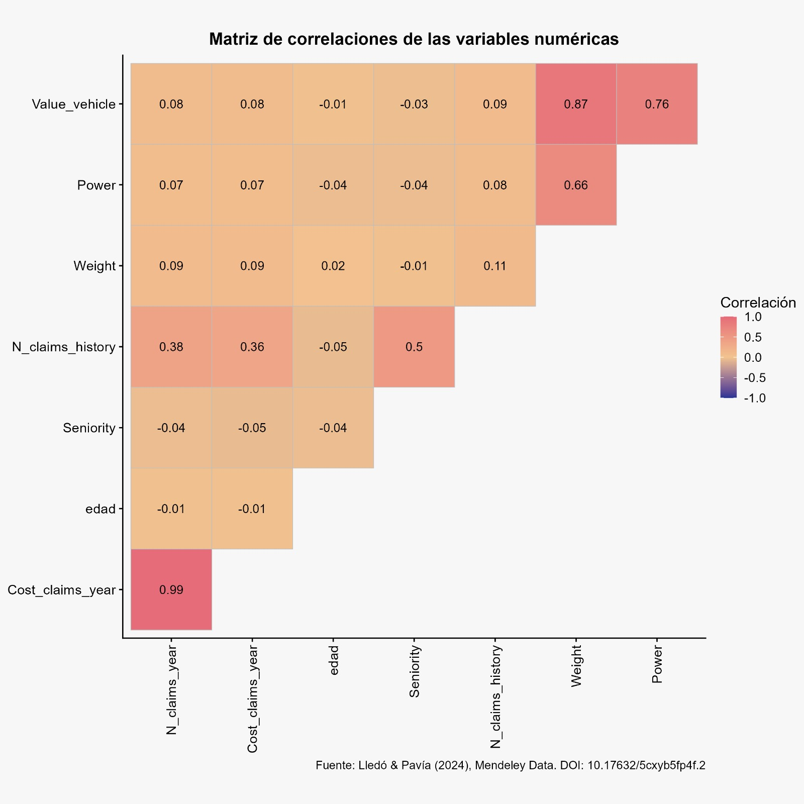{fig-align="center" width="560"}

Previo a profundizar en la argumentación, es preciso recordar que la pregunta de investigación aborda dos aspectos: la relación entre la edad del asegurado, la antigüedad con la aseguradora, el historial de siniestros y las características del vehículo, tanto con la frecuencia como con la severidad de los siniestros; y la determinación de los factores que explican el incremento abrupto en la cantidad de reclamos al momento que el costo de los mismos supera el monto de 900 euros.
En la bitácora pasada, se definió el pimer aspecto mencionado como el elemento central del proyecto, de modo que la imagen seleccionada se enfoca en presentar nueva información respecto a este.

Además de lo mencionado anteriormente, otro criterio de selección de la imagen consistió en la relevancia de la información que presenta.
A partir de la visualización, es posible notar que determinadas variables de interés para el proyecto poseen ya sea una correlación despreciable o una correlación mediana, con la frecuencia y la severidad de los siniestros, variables representandas a través de *N_claims_year* y *Cost_claims_year,* respectivamente.

En primer lugar, se tiene que las variables del valor del vehículo (*Value_vehicle*), la potencia del vehículo (*Power*), el peso del vehículo (*Weigth*), la antigüedad con la aseguradora (*Seniority*) y la edad del asegurado, poseen una correlación despreciable tanto con la frecuencia como con la severidad de los siniestros.
De acuerdo a @vinuesa2016, se presenta una correlación despreciable cuando el coeficiente calculado es estrictamente menor al valor absoluto de 0.1, condición que se cumple en el caso de las variables mencionadas.
Este resultado es de gran importancia, ya que se determina que la edad del asegurado, la antigüedad con la aseguradora, el valor del vehículo, al igual que la potencia y el peso del mismo, son componentes que poseen una relación despreciable con las variables respuesta.

Por otro lado, en lo que respecta al historial de siniestros (*N_claims_history*), se tiene que presenta una correlación mediana con la frecuencia y la severidad de los mismos.
Según @vinuesa2016, el valor del coeficiente para una correlación mediana debe ser estrictamente mayor al valor absoluto de 0.3 y menor o igual al valor absoluto de 0.5.
El coeficiente de correlación obtenido para el historial de siniestros de acuerdo a la frecuencia y la severidad de los reclamos, es de 0.38 y 0.36 respectivamente, sitúandose en el rango especificado.
Así, se determina que el historial de siniestros posee una relación media con las variables respuesta.

Seguidamente, a partir de la observación de la imagen y en el contexto del aseguramiento, alguien podría distinguir un elemento principal: los asegurados con un mayor historial de reclamos tienden a presentar más siniestros y costos más altos en el año analizado.
Así, el historial de reclamos constituye una característica de los asegurados indicadora de riesgo.
Se podría tomar la decisión de emprender acciones pertinentes que mitiguen el riesgo asociado a dicha característica, con el objetivo de mantener un mayor control sobre los aspectos que potencialmente podrían disparar el pago de obligaciones con montos elevados y resguardar de esta forma la capacidad de pago de la aseguradora.

En conocimiento de la información extendida por el gráfico y en consideración de lo desarrollado hasta la segunda bitácora, la comprensión del problema ha evolucionado.
Con los resultados obtenidos en la presente bitácora, mostrados además en la imagen, se concluyó que determinadas variables comprendidas en el problema de investigación poseen una relación despreciable con las variables respuesta, de manera que su intervención en ellas es despreciable de igual manera.
Dado lo anterior, se determina a la vez que estas variables no representan buenos prospectos explicativos para el cambio abrupto en la cantidad de reclamos cuando el monto de los mismos supera los 900 euros.

Finalmente, en caso de que la imagen presentada fuera la portada del artículo del proyecto, predominaría una historia: la relación que presentan determinadas variables entre sí.
La visualización no solo muestra la correlación de las variables contempladas con la frecuencia y la severidad de los siniestros, sino que también expone la correlación que presentan las variables entre ellas mismas.
Así, la imagen constituye un espacio de interacción multidireccional, en el cual se cuentan múltiples historias simultáneamente, la historia de cómo interactúan las variables entre sí.

# Arco narrativo del proyecto

# Parte de escritura

# Parte de reflexión

## Reflexión sobre alcance del proyecto

## Construcción y actualización de la UVE de Gowin

Luego de reflexionar sobre el alcance del proyecto, se replantearon algunas ideas y se incorporaron en la figura de la UVE de Gowin trabajada previamente en la Bitácora #1.
Además, se agregaron las secciones de conclusiones y registro y transformación de datos, con el fin de completar la estructura del esquema.

En la sección de conclusiones, se indicó que, a partir del análisis realizado hasta el momento, es posible identificar algunas variables asociadas con la frecuencia y severidad de los siniestros.
Sin embargo, es importante aclarar que estas no corresponden todavía a las conclusiones generales del proyecto, sino a observaciones preliminares basadas en los análisis desarrollados previamente.
También se incluyó que el umbral de 900 euros permite distinguir reclamos de mayor severidad, aspecto que igualmente se determinó a partir del trabajo previo.
Una vez que se complete el análisis restante, será posible plantear conclusiones más sólidas y contundentes.

Por otro lado, en la sección de registro y transformación de datos se describe, de manera general, el tratamiento aplicado a la base de datos entre la Bitácora #2 y la Bitácora #3.
En esta parte se mencionan las transformaciones realizadas sobre algunas variables y la elaboración del análisis descriptivo.
Los demás elementos de la UVE de Gowin se conservaron según la construcción realizada anteriormente.


# Fichas literarias construidas en la tercera bitácora

::: callout-note
# Marambakuyana y Shongwe (2024)

***Nivel descriptivo***

*Título:* *Composite and Mixture Distributions for Heavy-Tailed Data—An Application to Insurance Claims*

*Autores:* Walena Anesu Marambakuyana y Sandile Charles Shongwe.

*Año:* 2024.

*Nombre del tema:* comparación de modelos compuestos y modelos de mezcla para ajustar datos de reclamos de seguros con colas pesadas.

*Clasificación:* Metodológica.

Se eligió esta etiqueta porque el artículo compara una gran cantidad de distribuciones paramétricas, modelos compuestos y modelos de mezcla para determinar cuáles se ajustan mejor a datos de reclamos de seguros.
En particular, los autores analizan 256 modelos compuestos y 256 modelos de mezcla derivados de 16 distribuciones paramétricas populares.

*Resumen en una oración:* el artículo compara modelos compuestos y modelos de mezcla para analizar reclamos de seguros con distribuciones asimétricas y colas pesadas.

*Argumento central:* los autores sostienen que los modelos compuestos y de mezcla ofrecen mayor flexibilidad que las distribuciones clásicas para modelar reclamos de seguros, especialmente cuando los datos presentan asimetría, alta severidad y colas pesadas.
Sin embargo, concluyen que, para los dos conjuntos de datos analizados, los modelos compuestos tienden a brindar mejores estimaciones de riesgo que los modelos de mezcla.

*Problemas con el argumento o el tema:* una limitación importante es que el artículo se concentra en datos positivos de reclamos, por lo que no aborda directamente variables con exceso de ceros o acumulaciones en valores específicos como 0 o 900.
Además, los propios autores advierten que no existe un modelo universalmente superior, ya que el mejor modelo depende de la estructura de los datos y de las métricas de riesgo utilizadas.
También señalan que el acceso a datos reales de aseguradoras suele estar limitado por restricciones privadas, lo cual dificulta el uso de técnicas más avanzadas y procesos de validación más robustos.

***Nivel analítico***

*Conexión con mi proyecto:* este artículo se relaciona directamente con el proyecto porque trabaja con reclamos de seguros y con la modelización de variables de severidad.
En el proyecto, la variable `Cost_claims_year` también representa una medida de severidad monetaria, por lo que la comparación entre distribuciones compuestas y modelos de mezcla puede servir como referencia metodológica para analizar la distribución de los costos.
Además, el artículo es útil para justificar el uso de modelos más flexibles cuando los datos presentan asimetría y colas pesadas, características que pueden estar presentes en los reclamos con costos altos.

*Lo que NO dice el autor:* el artículo no estudia una variable con concentración específica en un umbral fijo como €900, ni propone una metodología diseñada para detectar un salto abrupto en un valor determinado.
Tampoco trabaja con una distribución cero-inflada o con una masa puntual en valores como 0 o 900; más bien, se enfoca en reclamos positivos y en el ajuste de colas pesadas.

*Contraste con otra fuente:* en comparación con *Ayuso-Gutiérrez et al. (2015)*, este artículo no se enfoca en datos con exceso de ceros, sino en reclamos positivos con colas pesadas.
Mientras *Ayuso-Gutiérrez et al. (2015)* es más útil para justificar modelos cero inflados, *Marambakuyana y Shongwe (2024)* es más útil para justificar el uso de distribuciones compuestas y de mezcla en datos de severidad monetaria.
Ambas fuentes se complementan: la primera ayuda a pensar el problema de la acumulación en cero, mientras que la segunda permite analizar la severidad de los costos positivos y las colas de la distribución.

*Evaluación de aplicabilidad (escala 1–5):* 4.

La metodología es bastante aplicable al proyecto porque permite justificar el análisis de la variable `Cost_claims_year` como una variable de severidad con posible asimetría y cola pesada.
Sin embargo, no recibe 5 porque el artículo no aborda directamente el problema de una concentración en el valor 900 ni el exceso de ceros.

*Pregunta que le haría al autor:* ¿Cómo modificaría los modelos compuestos o de mezcla para incorporar una masa puntual en valores específicos como 0 y 900 dentro de una variable de costos de reclamos?

*Resumen argumentativo:* Lo que los autores intentan resolver es cómo modelar datos de reclamos de seguros que presentan asimetría y colas pesadas, ya que las distribuciones clásicas como lognormal, gamma, Weibull o Pareto pueden no ser suficientemente flexibles para describir toda la estructura de los datos.
Para esto, comparan 256 modelos compuestos y 256 modelos de mezcla construidos a partir de 16 distribuciones paramétricas.
Los modelos compuestos dividen la distribución en dos partes: una para reclamos pequeños o moderados y otra para reclamos grandes; en cambio, los modelos de mezcla combinan dos distribuciones sobre el mismo dominio.
Los autores evalúan los modelos mediante criterios como NLL, AIC y BIC, además de medidas de riesgo como VaR y TVaR.
Su conclusión principal es que los modelos compuestos tienden a producir mejores estimaciones de riesgo para los datos analizados.
Para el proyecto, este artículo es útil porque respalda la idea de no asumir una única distribución simple para `Cost_claims_year`, sino comparar modelos flexibles capaces de capturar comportamientos distintos entre reclamos pequeños, moderados y altos.
No obstante, como el proyecto también tiene concentración en 0 y posiblemente en 900, esta metodología debería complementarse con modelos que permitan masas puntuales o componentes discretos.
:::

::: callout-note
# Počuča et al. (2020)

***Nivel descriptivo***

*Título:* *Modeling Frequency and Severity of Claims with the Zero-Inflated Generalized Cluster-Weighted Models*

*Autores:* Nikola Počuča, Petar Jevtić, Paul D. McNicholas y Tatjana Miljkovic.

*Año:* 2020.

*Nombre del tema:* modelización conjunta de la frecuencia y severidad de reclamos de seguros mediante modelos generalizados ponderados por conglomerados con inflación de ceros.

*Clasificación:* Metodológica.

Se eligió esta etiqueta porque el artículo propone una extensión metodológica de los modelos *cluster-weighted models* para adaptarlos a datos de seguros.
En particular, introduce los modelos generalizados ponderados por conglomerados y una versión cero inflada para trabajar con reclamos que presentan exceso de ceros.

*Resumen en una oración:* el artículo propone modelos cero inflados basados en conglomerados para analizar conjuntamente la frecuencia y la severidad de reclamos de seguros.

*Argumento central:* los autores sostienen que los modelos tradicionales pueden ser insuficientes para representar datos de seguros cuando existen distintas fuentes de heterogeneidad y exceso de ceros; por ello, proponen los modelos ZI-GCWM, los cuales permiten clasificar observaciones en grupos latentes y, al mismo tiempo, modelar la presencia de ceros en los reclamos.

*Problemas con el argumento o el tema:* una posible limitación es que la metodología es más compleja que modelos más tradicionales como GLM, modelos cero inflados simples o distribuciones compuestas.
Esto puede dificultar su implementación e interpretación en un proyecto aplicado.
Además, aunque el artículo trabaja con exceso de ceros, no se enfoca específicamente en una acumulación en un valor monetario distinto de cero, como el umbral de €900.

***Nivel analítico***

*Conexión con mi proyecto:* este artículo se relaciona directamente con el proyecto porque la variable `Cost_claims_year` presenta una gran cantidad de ceros, lo cual sugiere que no todos los asegurados generan reclamos durante el periodo observado.
La propuesta de los autores es útil porque permite modelar datos de seguros con exceso de ceros y, además, considera la heterogeneidad entre grupos de pólizas o asegurados.
Esto puede ser relevante para analizar si ciertos grupos de observaciones tienen mayor probabilidad de presentar reclamos positivos o costos más altos.

*Lo que NO dice el autor:* el artículo no se centra en explicar un salto abrupto en un umbral monetario específico como €900.
Aunque el modelo cero inflado ayuda a tratar el exceso de ceros, no resuelve directamente el problema de una concentración adicional en otro valor puntual.
Por eso, para el proyecto, esta fuente debería complementarse con una metodología que permita analizar masas puntuales o cambios estructurales alrededor del umbral de €900.

*Contraste con otra fuente:* en comparación con *Marambakuyana y Shongwe (2024)*, este artículo se enfoca más en el exceso de ceros y en la modelización conjunta de frecuencia y severidad, mientras que Marambakuyana y Shongwe se concentran en distribuciones compuestas y de mezcla para datos positivos con colas pesadas.
Por otra parte, en contraste con *Ayuso-Gutiérrez et al. (2015)*, ambos artículos consideran datos con exceso de ceros, pero *Počuča et al. (2020)* incorpora una estructura de conglomerados latentes que permite capturar heterogeneidad entre grupos de asegurados.

*Evaluación de aplicabilidad (escala 1–5):* 4.5.

La metodología es altamente aplicable al proyecto porque trabaja directamente con reclamos de seguros y con exceso de ceros, dos elementos centrales de la variable `Cost_claims_year`.
Sin embargo, no recibe 5 porque no aborda de forma específica la acumulación en el valor €900, por lo que habría que adaptar el enfoque o combinarlo con otro modelo.

*Pregunta que le haría al autor:* ¿Cómo podría adaptarse el modelo ZI-GCWM para incluir no solo inflación en cero, sino también una concentración adicional en un valor monetario específico como €900?

*Resumen argumentativo:* Lo que los autores intentan resolver es cómo modelar datos de seguros donde la frecuencia y la severidad de los reclamos no se comportan de manera homogénea para todos los asegurados.
Para esto, extienden los modelos ponderados por conglomerados y proponen una versión cero inflada, llamada ZI-GCWM, que permite trabajar con datos donde existen muchos ceros provenientes de distintas fuentes.
La idea central es que los datos pueden estar formados por grupos latentes con comportamientos diferentes, por lo que un único modelo global podría no capturar adecuadamente la relación entre las variables explicativas, la frecuencia de reclamos y la severidad.
Para el proyecto, esta metodología es especialmente útil porque `Cost_claims_year` tiene una concentración importante en cero, lo cual puede interpretarse como ausencia de reclamos o ausencia de costo durante el periodo observado.
Además, el enfoque por conglomerados puede ayudar a identificar grupos de observaciones con distintos patrones de riesgo.
No obstante, como el proyecto también analiza el comportamiento alrededor del umbral de €900, sería necesario complementar este enfoque con una estrategia que permita estudiar ese punto específico de acumulación.
:::

::: callout-note
# Delignette-Muller y Dutang (2015)

***Nivel descriptivo***

*Título:* *fitdistrplus: An R Package for Fitting Distributions*

*Autores:* Marie Laure Delignette-Muller y Christophe Dutang.

*Año:* 2015.

*Nombre del tema:* ajuste de distribuciones paramétricas en R mediante el paquete `fitdistrplus`.

*Clasificación:* Metodológica.

Se eligió esta etiqueta porque el artículo presenta una herramienta estadística en R para ajustar distribuciones a distintos tipos de datos.
El paquete permite estimar parámetros, comparar distribuciones, generar gráficos de bondad de ajuste y utilizar criterios como AIC y BIC para evaluar cuál distribución describe mejor los datos.

*Resumen en una oración:* el artículo presenta el paquete `fitdistrplus` como una herramienta en R para ajustar y comparar distribuciones probabilísticas a datos observados.

*Argumento central:* los autores sostienen que ajustar una distribución a los datos no consiste únicamente en elegir una distribución y estimar sus parámetros, sino que requiere un proceso iterativo que incluye exploración gráfica, elección de distribuciones candidatas, estimación de parámetros y evaluación de la calidad del ajuste.
Para esto, proponen el paquete `fitdistrplus`, que permite realizar este proceso de forma ordenada en R.

*Problemas con el argumento o el tema:* una limitación del artículo es que se concentra en el ajuste de distribuciones univariadas, por lo que no estudia directamente la relación entre la variable de severidad y variables explicativas como edad, tipo de vehículo o antigüedad de la licencia.
Además, aunque el paquete permite comparar distribuciones, la decisión final no debe basarse únicamente en un criterio automático como AIC o BIC, sino también en la interpretación del problema y en el comportamiento visual de los datos.

***Nivel analítico***

*Conexión con mi proyecto:* este artículo se relaciona directamente con el proyecto porque el profesor recomendó utilizar el paquete `fitdistrplus` para analizar a qué distribución se ajusta mejor la variable `Cost_claims_year`.
En lugar de asumir desde el inicio una distribución específica para los costos de reclamos, el paquete permite comparar varias distribuciones candidatas, observar gráficos de ajuste y utilizar criterios como AIC y BIC para respaldar la elección.
Esto es útil especialmente para el análisis de los costos positivos y para estudiar si la variable presenta asimetría o cola derecha.

*Lo que NO dice el autor:* el artículo no propone un modelo específico para reclamos con acumulación en el valor 900 ni desarrolla una metodología particular para detectar umbrales monetarios.
Tampoco resuelve por sí solo el problema de los ceros en `Cost_claims_year`; más bien, ofrece una herramienta general para ajustar distribuciones a datos observados.

*Contraste con otra fuente:* en comparación con *Marambakuyana y Shongwe (2024)*, este artículo es más práctico y menos especializado.
Mientras Marambakuyana y Shongwe analizan modelos compuestos y de mezcla para datos de seguros con colas pesadas, *Delignette-Muller y Dutang (2015)* ofrecen una herramienta concreta en R para ajustar distribuciones y comparar su bondad de ajuste.
Por eso, este artículo puede usarse como base operativa para implementar una parte sencilla de la metodología, mientras que Marambakuyana y Shongwe funciona mejor como respaldo teórico para explicar por qué los costos de reclamos pueden requerir distribuciones flexibles.

*Evaluación de aplicabilidad (escala 1–5):* 5.

La aplicabilidad es muy alta porque el paquete `fitdistrplus` puede incorporarse directamente en el análisis del proyecto.
Permite trabajar en R, comparar distribuciones candidatas, estimar parámetros y generar criterios de ajuste para justificar la selección de una distribución para los costos positivos de reclamos.

*Pregunta que le haría al autor:* ¿Cómo recomendaría utilizar `fitdistrplus` cuando una variable de costos tiene muchos ceros y, además, una posible concentración en un valor específico como €900?

*Resumen argumentativo:* Lo que los autores intentan resolver es la necesidad de contar con una herramienta práctica en R para ajustar distribuciones probabilísticas a datos reales.
El artículo explica que este proceso no debe limitarse a aplicar una fórmula, sino que requiere explorar los datos, escoger distribuciones candidatas, estimar parámetros y evaluar la calidad del ajuste mediante gráficos y criterios estadísticos.
Para esto, presentan el paquete `fitdistrplus`, el cual permite ajustar distribuciones mediante diferentes métodos, como máxima verosimilitud, emparejamiento de momentos, emparejamiento de cuantiles y criterios de bondad de ajuste.
Para el proyecto, este artículo es especialmente útil porque permite justificar el uso de `fitdistrplus` como herramienta para estudiar la distribución de `Cost_claims_year`, principalmente en los valores positivos.
En este sentido, no sería necesario afirmar que se aplicará un modelo de mezcla complejo, sino que se compararán distribuciones candidatas de manera exploratoria y metodológicamente respaldada.
:::

::: callout-note
# Ostertagová et al. (2014)

***Nivel descriptivo***

*Título:* Methodology and Application of the Kruskal-Wallis Test

*Autor(es):* Ostertagová, E., Ostertag, O.
y Kováč, J.

*Año:* 2014

*Nombre del tema:* Fundamentación matemática y aplicación práctica de la prueba de Kruskal-Wallis y sus procedimientos de comparación múltiple post-hoc.

*Clasificación:* Metodológica.
Se eligió esta etiqueta porque el artículo no propone una teoría nueva ni realiza una revisión histórica del problema; en cambio, desarrolla el sustento matemático formal del estadístico H, incluyendo la corrección por empates y el procedimiento de comparaciones múltiples de Conover-Inman, y los ilustra mediante un ejemplo aplicado, lo que lo convierte en una guía técnica de implementación.

*Resumen en una oración:* Desarrollo formal del estadístico de Kruskal-Wallis con corrección por empates y comparaciones múltiples de Conover-Inman.

*Argumento central:* La prueba de Kruskal-Wallis constituye una alternativa no paramétrica robusta al ANOVA de una vía cuando no se cumplen los supuestos de normalidad u homocedasticidad.
El artículo formaliza el cálculo del estadístico H basado en rangos, introduce la corrección necesaria cuando existen empates entre observaciones (situación frecuente en datos reales), y propone el procedimiento de Conover-Inman como método de comparaciones múltiples post-hoc, el cual aplica el método de mínima diferencia significativa de Fisher directamente sobre los rangos.

*Problemas con el argumento o el tema:* Los autores señalan que, si bien la prueba de Kruskal-Wallis es más flexible que el ANOVA paramétrico, sigue requiriendo que las distribuciones de los grupos tengan la misma forma, diferenciándose únicamente en su mediana, supuesto que en la práctica puede no verificarse.
Además, el artículo trabaja con un ejemplo de n = 25 observaciones y cinco grupos de tamaño igual, condición que dista considerablemente de escenarios con grupos de tamaños muy desiguales o con cientos de miles de observaciones.

***Nivel analítico***

*Conexión con mi proyecto:* Este artículo aporta el respaldo matemático formal que justifica el uso de Kruskal-Wallis en el proyecto.
Al comparar la frecuencia (N_claims_year) y la severidad (Cost_claims_year) entre categorías como el tipo de vehículo o la zona de circulación, es esperable que existan empates en los datos, por ejemplo múltiples pólizas con costo cero, por lo que la corrección del estadístico H por empates descrita en el artículo resulta directamente aplicable a la base de datos utilizada.

*Lo que NO dice el autor:* El artículo no discute el comportamiento de la prueba cuando el tamaño de muestra es muy grande, como ocurre en la base de datos de Lledó y Pavía (2024) con más de 100,000 observaciones, escenario en el que el estadístico H tiende a ser significativo casi con certeza incluso ante diferencias de magnitud pequeña.
Esto implica que los resultados de la prueba deben interpretarse con cautela y en conjunto con los hallazgos descriptivos ya presentados, que aportan contexto sobre la magnitud real de las diferencias entre grupos.

*Contraste con otra fuente:* Este artículo complementa metodológicamente las fuentes ya citadas en el proyecto, como Počuča et al. (2020), quienes trabajan con datos de seguros con exceso de ceros y heterogeneidad entre grupos.
Mientras que Počuča et al. proponen modelos para capturar esa heterogeneidad, Ostertagová et al. (2014) ofrecen una herramienta formal para verificar estadísticamente si las diferencias entre grupos son distinguibles del azar, sin asumir normalidad ni homogeneidad de varianzas.

*Evaluación de aplicabilidad (escala 1–5):* 4.
La corrección del estadístico H por empates es directamente aplicable dado el alto volumen de ceros en las variables de siniestralidad.
No alcanza el puntaje máximo porque no aborda el problema de potencia excesiva con muestras de gran tamaño, aspecto relevante para la interpretación de los resultados en este proyecto.

*Pregunta que le haría al autor:* Con una muestra de más de 100,000 observaciones donde prácticamente cualquier diferencia resulta estadísticamente significativa, ¿cómo recomendarían interpretar los resultados de la prueba para determinar si las diferencias entre grupos tienen relevancia práctica más allá de la significancia estadística?

*Resumen argumentativo:* El problema que Ostertagová et al. (2014) abordan es la necesidad de comparar más de dos grupos cuando los supuestos del ANOVA paramétrico no se cumplen, situación que aplica directamente al proyecto dado que las variables de siniestralidad presentan distribuciones asimétricas, gran cantidad de empates y grupos de tamaños desiguales.
La prueba se utiliza en este proyecto como respaldo estadístico formal de las diferencias descriptivas ya observadas entre tipos de vehículo, entre zonas de circulación y entre tipos de combustible, con el objetivo de verificar que dichas diferencias no son producto del azar sino patrones sistemáticos en los datos.
:::

# Implementación de la retroalimentación

Las recomendaciones extendidas a partir de la presentación del anteproyecto se efectuaron en torno a dos ejes: el uso de intervalos de confianza para el cálculo de las correlaciones y una interpretación mediante distribución mixta para el análisis del umbral de 900 euros.
En la presente entrega se procuró implementar las distintas recomendaciones, por lo que se detalla a continuación la manera en que esto fue realizado, según las distintas áreas.

### Intervalos de confianza 

En la sección *Análisis de asociación entre las variables cuantitavivas*, se desarrolló el cálculo de los coeficientes de correlación de Spearman de las variables cuantitativas contempladas en la pregunta de investigación, respecto a la frecuencia y la severidad de los siniestros.

Además de calcular los coeficientes de correlación planteados, se construyeron intervalos de confianza con el objetivo de evaluar la precisión de las asociaciones estimadas.
De esta manera, se procuró no interpretar únicamente el valor del coeficiente, sino también considerar la incertidumbre asociada a su estimación.

### Análisis del umbral de 900 euros

Después, en la sección *Análisis del umbral de 900 euros mediante distribución mixta*, se desarrolló el cuarto y último método del análisis.
Se integraron los hallazgos obtenidos hasta ese momento con tal de estudiar a mayor profundidad la estructura del costo anual de siniestros en torno al umbral de los 900 euros.
El análisis de distribución mixta utilizado, permitió formalizar la concentración de siniestros en dicha área, estimando las proporciones de cada componente y las distribuciones paramétricas que mejor describen los costos en cada rango.
El método descrito responde directamente a la pregunta de investigación, pues permite cuantificar qué fracción de la cartera genera reclamos de alta severidad y caracterizar la forma de esa distribución.

# Relativo al trabajo en equipo

## Rastro de decisiones

Durante la elaboración de la tercera bitácora, el equipo se vio en la necesidad de tomar una serie de decisiones con el objetivo de desarrollar óptimamente las tareas requeridas.
Dichas decisiones atravesaron varios ejes, los cuales se detallan a continuación en compañía de los párrafos explicativos correspondientes.

### Inclusión de nuevas fichas de literatura

Para la elaboración de la propuesta metodológica correspondiente a la tercera bitácora, se incorporaron cuatro nuevas fichas de literatura que no estaban presentes en bitácoras anteriores, estas corresponden a @ostertagova2014methodology, @deli2015, @mara2024 y @pov2020.

La inclusión de @ostertagova2014methodology respondió a la necesidad de respaldar metodológicamente la prueba de Kruskal-Wallis, utilizada en el análisis de la comparación entre grupos.
Dado que los datos de la siniestralidad no cumplen con los supuestos de normalidad necesarios para un ANOVA paramétrico, se requirió una prueba no parametrizada.
Por otro lado, la incorporación de la ficha de @deli2015 se incluyó para justificar el uso del paquete `fitdistrplus` en el ajuste de distribuciones para la construcción de la distribución mixta para los costos de los siniestros.
La inclusión de @mara2024 respondió a la necesidad de respaldar el análisis de la cola derecha de la distribución del costo anual de siniestros, ya que el artículo estudia distribuciones compuestas para datos de reclamos que presentan asimetría y colas pesadas.
La ficha de @pov2020 se incorporó para justificar metodológicamente el tratamiento del exceso de ceros en la variable `Cost_claims_year`, dado que los autores proponen modelos cero inflados para datos de seguros en los que no hay homogeneidad entre grupos.

### Selección de la distribución para la distribución mixta del costo de reclamos anual

Para modelar los costos positivos de los reclamos, se consideraron 3 distribuciones candidatas.
Primero, para los costos moderados (0 \< Y \< 900) se consideró una distribución lognormal y una distribución gamma, para ambas distribuciones, se escogieron los parámetros obtenidos por medio de la estimación por máxima verosimilitud y para realizar la comparación entre ambas se comparó el valor del AIC de cada una, resultando que la distribución lognormal tenía un valor de AIC significativamente menor que el de la distribución gamma, por esta razón, para el intervalo de los €0 a los €900 se seleccionó la distribución lognormal con los parámetros anteriormente mencionados en la bitácora.
Para los costos altos (Y ≥ 900), se consideró una distribución Pareto y una lognormal, estimando sus parámetros por máxima verosimilitud y comparando sus AIC, se obtuvo nuevamente que la distribución lognormal tenía un AIC menor que la distribución pareto, es por esto que para los costos altos también se seleccionó una distribución lognormal.

### Modificaciones en la propuesta metodológica

La propuesta metodológica experimentó varios cambios a lo largo del desarrollo del trabajo.

En primer lugar, inicialmente no se había contemplado calcular intervalos de confianza para las correlaciones entre las variables numéricas.
Sin embargo, tras una conversación con el profesor, se acordó incorporarlos con el fin de verificar el rango en el que se encuentra cada coeficiente de correlación.
De esta forma, se construyeron intervalos de confianza del 95% para los coeficientes de correlación de Spearman.

Por otra parte, debido a la manera en que se planteó en un inicio la propuesta metodológica, se consideró calcular intervalos de confianza para las proporciones de los tres componentes de la distribución mixta.
No obstante, luego de tener una reunión con el profesor, se cambió drásticamente la forma en que se construiría dicha distribución para los costos.
En un principio, se había planteado utilizar una función indicadora para determinar si se tenía un costo cero o no.
Posteriormente, se optó por construir la distribución mixta mediante tres componentes: una masa puntual ubicada en cero, una distribución para los costos medios y otra distribución para los costos altos.
Los parámetros de cada componente se estimaron por medio del método de máxima verosimilitud, utilizando el paquete `fitdistrplus` de R.

## Diario de aprendizaje

La presente sección está diseñada para registrar los aprendizajes adquiridos durante la elaboración de la bitácora, en torno al proceso acumulativo del desarrollo del proyecto: ¿qué fue difícil?,
¿qué resultó distinto a lo planeado?
Lo anterior a través de oraciones concisas que respondan a la siguiente pregunta: ¿qué sabemos ahora que no sabíamos al entregar la segunda bitácora?
Dichas oraciones proceden a detallarse como sigue:

-   Durante esta etapa, se incorporó el uso de la librería fitdistrplus en R como apoyo para el análisis metodológico de la severidad de los siniestros.
    Esta herramienta permitió plantear una forma más ordenada de comparar posibles distribuciones para los costos positivos, utilizando criterios de ajuste que ayudan a justificar la selección del modelo más adecuado.

-   Se fortaleció el concepto de distribución mixta.
    A partir de la identificación visual del histograma de la variable *Cost_claims_year*, se dividió esta variable en tres componentes: costos cero, costos medios y costos altos.
    Se aprendió a modelar la distribución de cada componente y su respectiva proporción por medio de gráficos y comparaciones del AIC de distintas distribuciones con el fin de seleccionar la que mejor se adaptaba a cada componente.

-   Un elemento obstaculizador para el trabajo colaborativo en la presente entrega, fue el carácter acumulativo de determinadas tareas.
    En particular, la dependencia de la *Parte de escritura* hacia las fichas de resultados elaboradas en la tercera bitácora, generó que fuera poco viable iniciar tal sección previo a terminar estas últimas.
    En consecuencia, dicho apartado de considerable densidad, tuvo que desarrollarse en un periodo de menor extensión al planeado.

## Audiencia del proyecto

Esta semana el equipo le diría a un actuario que se enfoca en el área de seguros para vehículos que se descubrió que el tipo de vehículo influye en la frecuencia de los siniestros y, además, en los costos superiores a €900 de reclamos anuales.
Esto sugiere que, para la tarificación de pólizas, el tipo de vehículo debería considerarse como un factor relevante, ya que las furgonetas y los turismos concentran tanto la mayor frecuencia como los reclamos de mayor cuantía.
Con base en estos hallazgos, se contempla utilizar esta variable para el análisis tanto de la frecuencia como del costo de reclamos anual mayores o iguales a €900.

## Registro del uso de IA

Se detalla a continuación el respectivo registro:

#### Primer registro

*Herramienta:* ChatGPT.

*Prompt:* Se solicitó apoyo (en varios prompts) para comprender cómo utilizar la librería `fitdistrplus` en R dentro de la metodología del proyecto, especialmente para analizar posibles distribuciones asociadas a la severidad de los siniestros.

*Respuesta de la IA:* A modo de resumen de todo el chat, la IA explicó que `fitdistrplus` permite ajustar y comparar distintas distribuciones de probabilidad a datos positivos, como los costos de siniestros.
También ayudó a relacionar el uso de esta librería con una referencia bibliográfica, para justificar metodológicamente la selección de distribuciones mediante criterios de ajuste.

*Evaluación:* La respuesta fue útil porque permitió entender mejor el propósito de la librería y cómo integrarla dentro de la metodología sin presentar el procedimiento como una decisión arbitraria.

*Modificaciones:* Se adaptó la explicación al contexto del proyecto, enfocándola en el análisis de severidad y en la comparación de distribuciones para los costos positivos de los siniestros.

*Aprendizaje:* Se comprendió que el uso de una librería estadística debe estar acompañado de una justificación teórica y metodológica, de modo que las decisiones de modelación puedan explicarse con mayor claridad.

#### Segundo registro

*Herramienta:* Deepseek.

*Prompt:* Se solicitó información (en varios prompts) para comprender cómo utilizar la librería `fitdistrplus` en R dentro, y funciones útiles para el ajuste de distintas distribuciones para modelar la distribución mixta de los costos anuales.

*Respuesta de la IA:* A modo de resumen de todo el chat, la IA explicó que `fitdistrplus` tiene diversas funciones muy útiles como `fitdist` la cual devuelve un objeto con los parámetros de la distribución seleccionada que mejor se ajustan a los datos, además, dijo que ese objeto tiene un atributo `$aic` el cual devuelve el aic del ajuste de la distribución seleccionada, además de esto, comentó que con la función `plot()` se realizaba un gráfico con 4 pruebas y explicó cómo superponer varias distribuciones a la vez sobre el gráfico del histograma de costos.

*Evaluación:* La respuesta fue muy útil porque permitió hacer más sencilla la comparación de las distribuciones candidatas para la distribución mixta de los costos anuales.

*Modificaciones:* Se adaptó la explicación al contexto del proyecto, utilizando las distribuciones candidatas seleccionadas por el grupo a partir de la visualización de la forma del histograma de los costos anuales.

*Aprendizaje:* Se comprendió que el uso de esta libraría y sus distintas funciones haría más sencilla la construcción de la distribución mixta.

#### Tercer registro

*Herramienta:* Gemini.

*Prompt:* Se solicitó apoyo para encontrar artículos académicos y metodológicos de acceso abierto (Open Access) sobre las pruebas no paramétricas de Mann-Whitney y Kruskal-Wallis, con la condición explícita de que fueran gratuitos, libres de muros de pago (paywalls) y descartando páginas web informales o de dudosa calidad.

*Respuesta de la IA:* La IA sugirió artículos específicos indexados en redes científicas legítimas (como Redalyc y SciELO) y recomendó portales académicos abiertos como Dialnet.
Además, proporcionó un desglose conceptual de las metodologías basadas en rangos y enseñó comandos de búsqueda avanzados (como filetype:pdf) para localizar de forma directa manuales de cátedra o tesis doctorales en formato PDF.

*Evaluación:* La respuesta fue útil porque facilitó la ruta directa hacia literatura científica formal y rigurosa sin tropezar con restricciones de pago o registros molestos, permitiendo filtrar con éxito el contenido informal de internet.

*Modificaciones*: Se descartaron los primeros ejemplos de la IA debido a que eran muy informales, no tenían referencias precisas y no parecían académicos.
En su lugar, se redirigió el proceso hacia las plataformas y comandos avanzados sugeridos para realizar una búsqueda propia de fuentes indexadas reales.

*Aprendizaje:* Se descubrieron nuevos lugares y repositorios especializados (como SciELO, Redalyc y Dialnet) para encontrar artículos académicos verdaderamente útiles, expandiendo las herramientas disponibles para localizar literatura científica confiable de forma gratuita.

## Registro del trabajo en equipo

La siguiente tabla contiene los aportes de los integrantes, de acuerdo a las secciones en las que cada uno se desempeñó:

+:------------------------------:+:-----------------------------------------------------:+
| **Nombre**                     | **Contribuciones**                                    |
+--------------------------------+-------------------------------------------------------+
| Alexandra González Bermúdez    | Corrección en base a la retroalimentación             |
|                                |                                                       |
|                                | La imagen que cuenta la historia                      |
|                                |                                                       |
|                                | Ordenamiento de los elementos del reporte             |
|                                |                                                       |
|                                | Parte de escritura                                    |
|                                |                                                       |
|                                | Registro del trabajo en equipo                        |
|                                |                                                       |
|                                | Diario de aprendizaje                                 |
|                                |                                                       |
|                                | Construcción de fichas de resultados                  |
|                                |                                                       |
|                                | Revisión de la redacción del documento                |
+--------------------------------+-------------------------------------------------------+
| **Nombre**                     | **Contribuciones**                                    |
+--------------------------------+-------------------------------------------------------+
| Emily Estefanía Mora Contreras | Análisis de la modelación                             |
|                                |                                                       |
|                                | Carga automática de datos                             |
|                                |                                                       |
|                                | Análisis descriptivo completo                         |
|                                |                                                       |
|                                | Propuesta metodológica                                |
|                                |                                                       |
|                                | Parte de reflexión: UVE de Gowin                      |
|                                |                                                       |
|                                | Diario de aprendizaje                                 |
|                                |                                                       |
|                                | Construcción de fichas de resultados                  |
|                                |                                                       |
|                                | Contrucción de fichas de literatura                   |
+--------------------------------+-------------------------------------------------------+
| **Nombre**                     | **Contribuciones**                                    |
+--------------------------------+-------------------------------------------------------+
| Daniela Prado Vargas           | Análisis de la modelación                             |
|                                |                                                       |
|                                | Arco narrativo del proyecto                           |
|                                |                                                       |
|                                | Diario de aprendizaje                                 |
|                                |                                                       |
|                                | Construcción de fichas de resultados                  |
+--------------------------------+-------------------------------------------------------+
| **Nombre**                     | **Contribuciones**                                    |
+--------------------------------+-------------------------------------------------------+
| José Miguel Rodríguez Gómez    | Organización de las tareas de acuerdo a su dificultad |
|                                |                                                       |
|                                | Análisis de la modelación                             |
|                                |                                                       |
|                                | Audiencia del proyecto                                |
|                                |                                                       |
|                                | Rastro de decisiones                                  |
|                                |                                                       |
|                                | Diario de aprendizaje                                 |
|                                |                                                       |
|                                | Construcción de fichas de resultados                  |
+--------------------------------+-------------------------------------------------------+

\newpage

# Referencias
