```{=latex}
\setcounter{page}{1} 
```

\newpage

# Parte de planificación

Tras un largo y exhaustivo proceso, en el cual se desarrolló y se mejoró el planteamiento extendido en la primera bitácora; finalmente el proyecto llega a su última etapa.
En vista de lo anterior, resulta necesario definir las variables, los datos y los métodos finales.
Asimismo, la práctica de una nueva iteración del proceso de modelación de resultados para el problema descrito, se convierte en un elemento imprescindible, en vías de evaluar el desempeño del modelo y generar nuevos hallazgos que concreten o respalden la respuesta a la pregunta de investigación.

La presente sección está destinada a cubrir los aspectos detallados.

## Iteración de la modelación de resultados

```{r, message=FALSE, warning=FALSE, echo=FALSE}
# Librerías necesarias para el análisis

library(tidyverse)
library(lubridate)
library(readr)
library(knitr)
library(kableExtra)
library(cowplot)
library(scales)
library(dplyr)

# Paleta utilizada desde la Bitácora 2

paleta_pamplemousse <- c(
  "#E56B78",
  "#F29CA3",
  "#F2C38F",
  "#36B7B4",
  "#1E9CC7",
  "#253494"
)

# Estilo gráfico reutilizado desde la Bitácora 2

estilo_grupo3 <- theme_cowplot(font_size = 12) +
  theme(
    plot.title = element_text(face = "bold", hjust = 0.5),
    axis.title = element_text(size = 12),
    axis.text = element_text(size = 11)
  )

# Carga de datos

datos <- read.csv(
  "../../../datos/originales/Motor vehicle insurance data.csv",
  sep = ";"
)

datos_modificados <- datos %>% 
  mutate(
    Date_start_contract = as.Date(Date_start_contract, format = "%d/%m/%Y"),
    Date_last_renewal = as.Date(Date_last_renewal, format = "%d/%m/%Y"),
    Date_next_renewal = as.Date(Date_next_renewal, format = "%d/%m/%Y"),
    Date_birth = as.Date(Date_birth, format = "%d/%m/%Y"),
    Date_driving_licence = as.Date(Date_driving_licence, format = "%d/%m/%Y"),
    Date_lapse = as.Date(Date_lapse, format = "%d/%m/%Y"),
    
    categoria = case_when(
      Type_risk == 1 ~ "Motocicleta",
      Type_risk == 2 ~ "Furgoneta",
      Type_risk == 3 ~ "Turismo",
      Type_risk == 4 ~ "Agricola",
      TRUE ~ "Sin clasificar"
    ),
    
    edad = floor(time_length(interval(Date_birth, Date_start_contract), "years")),
    antiguedad_licencia = floor(time_length(interval(Date_driving_licence, Date_start_contract), "years")),
    edad_vehiculo = year(Date_start_contract) - Year_matriculation
  )
```

### Análisis de variables asociadas a reclamos de costos altos: mayores o iguales a 900 euros

Para esta sección se agregarán gráficos correspondientes al análisis de variables asociadas a reclamos de alta severidad: mayores o iguales a 900 euros, no contemplados en el desarrollo de la tercera bitácora.

```{r, message=FALSE, warning=FALSE, echo=FALSE}
comparación_variables_mayores_menores_900 <- datos_modificados %>%
  mutate(supera_900 = ifelse(Cost_claims_year >= 900, "≥ 900", "< 900")) %>%
  select(supera_900, edad, Seniority, N_claims_history, Value_vehicle, Power, Weight) %>%
  rename(Edad = edad, # Cambiar nombres para el título de cada sub gráfico
         Antigüedad = Seniority,
         "Número de reclamos histórico" = N_claims_history,
         "Valor del vehículo" = Value_vehicle,
         Potencia = Power,
         Peso = Weight) %>% 
  pivot_longer(cols = -supera_900, names_to = "variable", values_to = "valor") %>%
  ggplot(aes(x = supera_900, y = valor, fill = supera_900)) +
  geom_boxplot(outlier.size = 0.5) + # outlier.size es para cambiar el tamaño de los puntos de los outliers
  facet_wrap(~variable, scales = "free", ncol = 3) + # Hacer los subgráficos, que hayan 3 por fila
  scale_fill_manual(values = paleta_pamplemousse[c(1, 5)]) +
  labs(
    title = "Comparación de variables según el tramo del costo",
    x = "",
    y = "Valor",
    caption = "Fuente: Lledó & Pavía (2024), Mendeley Data. DOI: 10.17632/5cxyb5fp4f.2"
  ) +
  scale_y_continuous(
    labels = scales::comma,  # Poner comas en los miles del eje y 
    breaks = scales::pretty_breaks()  # Número de breaks automático
  ) +
  estilo_grupo3 +
  theme(legend.position = "none")

ggsave("../../../bitacoras/bitacora_4/figuras/comparación_variables_mayores_menores_900.png",comparación_variables_mayores_menores_900, width = 10, height = 8, dpi = 300)
```

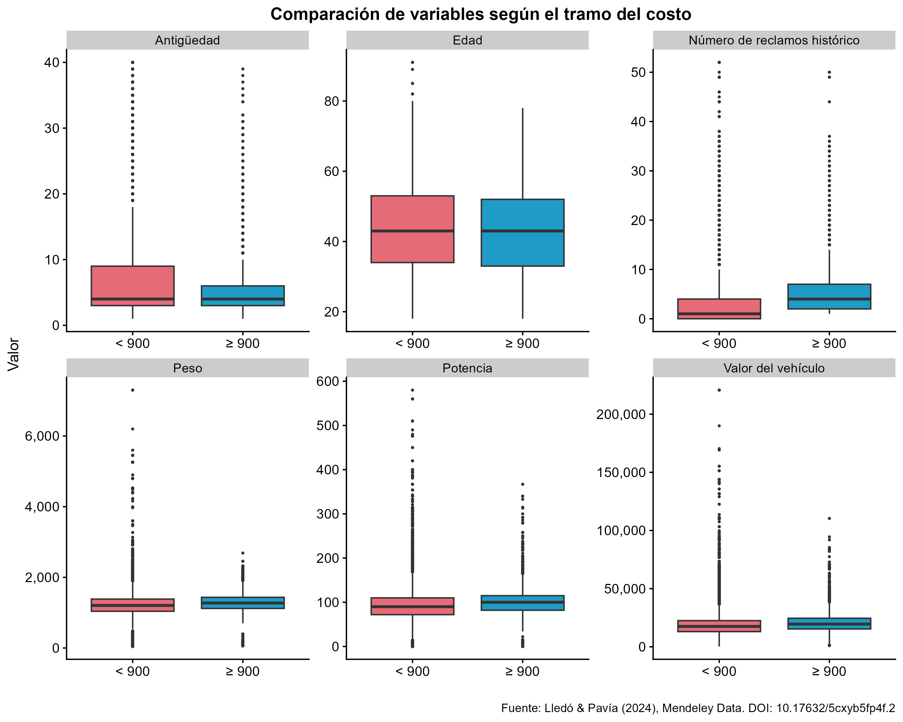{#fig-comparacion-var-900 fig-pos="H"}

La @fig-comparacion-var-900 presenta seis gráficos comparativos de variables como la edad del asegurado, la antigüedad con la aseguradora, el peso del vehículo, entro otros.
Esta comparación se realiza por medio de boxplots, con una división que separa las observaciones que poseen costos menores a 900 euros de las observaciones que presentan costos mayores o iguales a 900 euros.
Como se puede observar, en el caso de la edad del asegurado y la antigüedad, las medianas para cada grupo son prácticamente iguales.
Sin embargo, para el número de reclamos históricos, se puede observar que la mediana del grupo que supera los 900 euros está claramente arriba de la mediana de los costos inferiores a 900 euros.
Además, para el caso de la antigüedad, el tamaño de la caja del grupo que no supera los 900 euros es más grande que la caja de los costos que sí superan los 900 euros, lo que indica que existe una mayor dispersión en los datos de los reclamos con un menor costo.
En cambio, para el peso, la potencia y el valor del vehículo, el tamaño de las cajas es prácticamente igual, aunque las medianas de los costos mayores a 900 euros son ligeramente mayores en los tres casos.
Finalmente, para todos los casos, excepto para la antigüedad con la aseguradora, se puede observar que los costos menores a 900 euros presentan mayor cantidad de valores atípicos.

```{r, message=FALSE, warning=FALSE, echo=FALSE}
comparacion_tipo_combustible_mayores_900 <- datos_modificados %>%
  mutate(tipo_combustible = case_when(
                            Type_fuel == "P" ~ "Gasolina",
                            Type_fuel == "D" ~ "Diésel",
                            TRUE ~ "No especificado"
  )) %>% 
  group_by(tipo_combustible) %>%
  summarise(
    n = n(),
    prop_900 = mean(Cost_claims_year >= 900, na.rm = TRUE) # Proporción de los que superan los 900 euros
  ) %>%
  ggplot(aes(x = tipo_combustible, y = prop_900, fill = tipo_combustible)) +
  geom_col() +
  geom_text(aes(label = paste0(round(prop_900 * 100, 2), "%")), 
            vjust = -0.5, size = 3) +
  scale_fill_manual(values = paleta_pamplemousse[c(1, 3, 4)]) +
  labs(
    title = "Proporción de reclamos mayores o iguales a €900 por tipo de combustible",
    x = "Tipo de combustible",
    y = "Proporción de reclamos ≥ €900",
    caption = "Fuente: Lledó & Pavía (2024), Mendeley Data. DOI: 10.17632/5cxyb5fp4f.2"
  ) +
  estilo_grupo3 +
  theme(legend.position = "none") +
  scale_y_continuous(labels = scales::percent, limits = c(0, 0.20))

ggsave("../../../bitacoras/bitacora_4/figuras/comparacion_tipo_combustible_mayores_900.png", comparacion_tipo_combustible_mayores_900, width = 8, height = 6, dpi = 300)
```

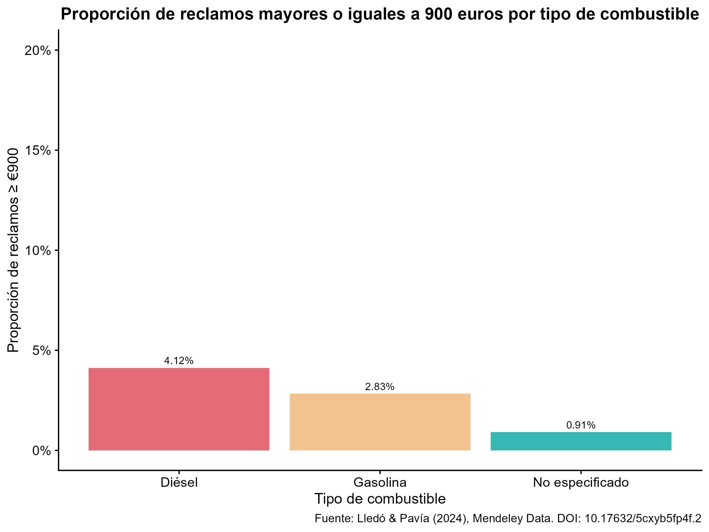{#fig-comparacion-tipo-vehiculo-900 fig-pos="H"}

En la @fig-comparacion-tipo-vehiculo-900 puede observarse que el tipo de combustible diésel presenta una mayor proporción de reclamos mayores o iguales a 900 euros.
El diésel obtuvo una proporción del 4.12%, mientras que la gasolina obtuvo un 2.83% y, para el caso en donde no se especifica el tipo de combustible, se obtuvo una proporción del 0.91%.
Esto implica que la proporción de costos altos en los vehículos que utilizan diésel es casi 1.5 veces mayor que la proporción de costos altos en los vehículos que utilizan usan gasolina, y más de 4 veces superior a la de aquellos que no especifican el tipo de combustible utilizado.

### Comparación de la distribución Weibull con la distribución Lognormal para la distribución mixta

A continuación se muestran gráficos de las distribuciones Lognormal, Weibull y Gamma tanto para los costos medios `(0 < Y < 900)` como para los costos altos `(Y ≥ 900)`, para realizar las comparaciones se utilizó nuevamente el paquete `fitdistrplus`.
Es importante destacar que para el ajuste de la distribución de los costos altos, se acotó el intervalo hasta los 20,000 euros, excluyendo 40 observaciones con costos superiores a dicha cifra La decisión se tomó por dos razones, primero, los valores excluidos corresponden a valores extremos aislados que distorsionan el ajuste de los parámetros; segundo, la cota: `(900 ≤ Y ≤ 20,000),` permite una visualización más clara de la distribución, manteniendo así la coherencia con el análisis gráfico presentado en la tercera bitácora.

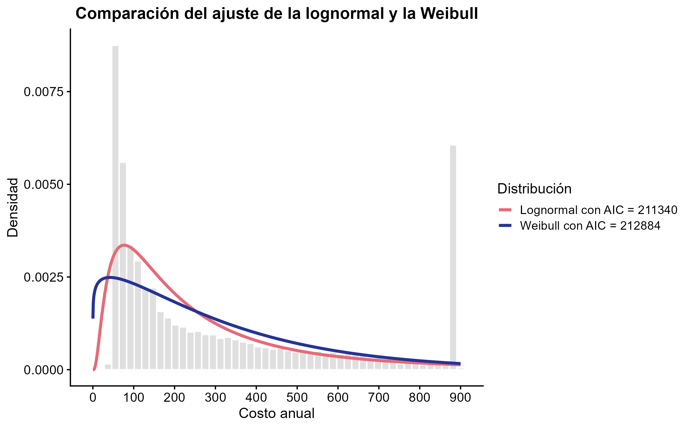{#fig-log-weibull-medios fig-pos="H"}

En la @fig-log-weibull-medios se puede observar que la distribución Lognormal obtuvo un AIC de 211,340 mientras que la distribución Weibull obtuvo 212,884, lo que representa una diferencia de 1,544 unidades a favor de la distribución Lognormal.
Además de esto, puede verse que la curva roja, la cual corresponde a la distribución Lognormal, se adapta mejor al histograma de los costos, ya que para costos bajos, cercanos a 100 euros, esta distribución abarca una mayor proporción de las barras, además, conforme aumentan los costos, la distribución Lognormal se mantiene más cercana a los datos observados.
Así, por medio de la comparación de los AIC de ambas distribuciones, se confirma que la distribución Lognormal es la más adecuada para la caracterización de los costos medios.

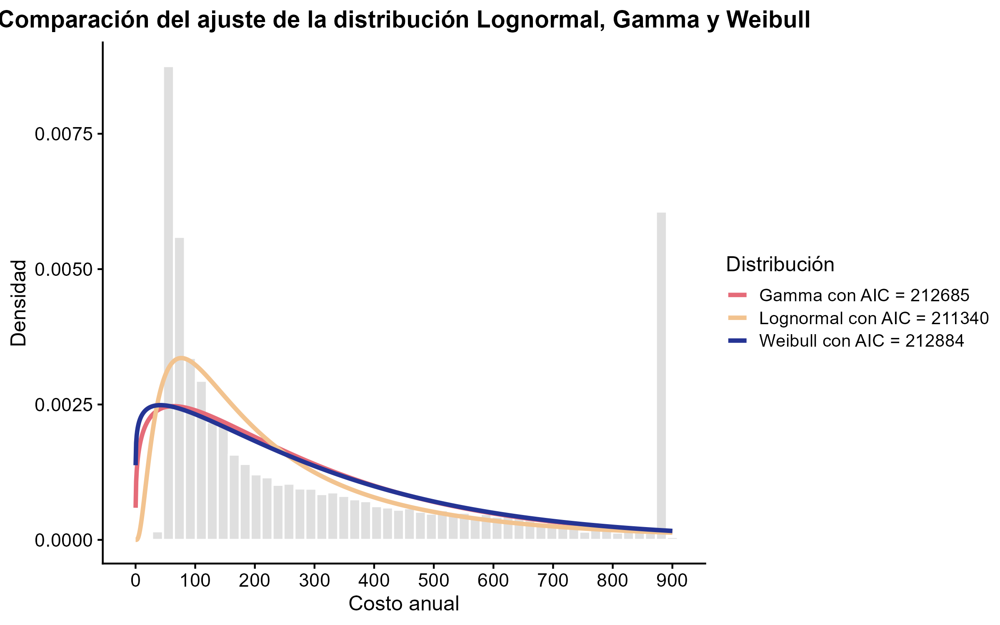{#fig-log-weibull-gamma-medios fig-pos="H"}

En la @fig-log-weibull-gamma-medios se puede observar que la distribución Lognormal obtuvo el menor AIC, con 211,340, seguida de la Gamma, la cual obtuvo 212,685 y finalmente la Weibull con 212,884 lo que representa una diferencia de 1,345 y 1,544 unidades respectivamente con respecto a la Lognormal.
El resultado confirma que la Lognormal es la distribución que mejor se ajusta a los costos medios entre las distribuciones evaluadas.

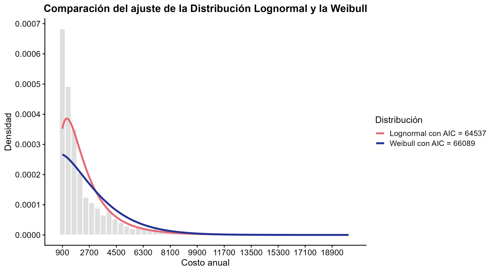{#fig-log-weibull-altos fig-pos="H"} En la @fig-log-weibull-altos se puede observar que la distribución Lognormal obtuvo un AIC de 64,537 mientras que la distribución Weibull alcanzó 66,089, lo que representa una diferencia de 1,552 unidades a favor de la distribución Lognormal.
Asimismo, puede verse que la curva roja, correspondiente a la Lognormal, se adapta mejor al histograma de los costos cercanos a 900 y 1,000 euros, esta distribución abarca una mayor proporción de las barras, además, conforme aumentan los costos, la distribución Lognormal se mantiene más cercana a los datos observados.
De esta forma, con la comparación de los AIC y el análisis visual, se confirma que la Lognormal es la distribución más adecuada para caracterizar los costos altos `(Y ≥ 900)`.

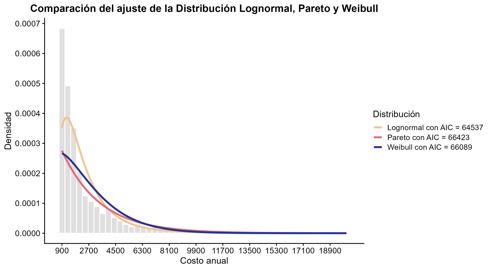{#fig-log-weibull-pareto-altos fig-pos="H"}

En la @fig-log-weibull-pareto-altos se puede observar que la distribución Lognormal alcanzó el menor AIC, con 64,537, seguida de la Weibull, la cual obtuvo 66,089 y finalmente la Pareto con 66,423 lo que representa una diferencia de 1,552 y 1,886 unidades respectivamente con respecto a la Lognormal.
Este resultado confirma que la Lognormal es la distribución que mejor se ajusta a los costos altos entre las distribuciones evaluadas.

### Cálculo de intervalos de confianza para los parámetros de la distribución mixta

```{r tbl-ic-parametros-mixta, message=FALSE, warning=FALSE, echo=FALSE}
library(tidyverse)
library(kableExtra)
# Los cálculos se realizaron en el archivo "03_modelacion.R", para evitar la sobrecarga de código dentro de la bitácora, se copiarán manualmente los resultados obtenidos en dicho archivo

tamanyo_miu_1 = 5.293627 - 5.263446  
tamanyo_sigma_1 = 0.9800332 - 0.9586915

tamanyo_miu_2 = 7.578995 - 7.535384
tamanyo_sigma_2 = 0.6971622 - 0.6663242 

tabla_ic_parámetros_dist_mixta <- data.frame(
  Componente = c("Costos Medios (0 < Y < 900)", "Costos Medios (0 < Y < 900)", 
                 "Costos Altos (Y ≥ 900)", "Costos Altos (Y ≥ 900)"),
  Parametro = c("μ₁", "σ₁", "μ₂", "σ₂"),
  "Valor Utilizado" = c(5.2785366, 0.9693318, 7.5571894,0.6816524),
  "IC inferior (95%)" = c(5.263446, 0.9586915, 7.535384, 0.6663242),
  "IC superior (95%)" = c(5.293627, 0.9800332, 7.578995, 0.6971622),
  "Tamaño del Intervalo" = c(tamanyo_miu_1, tamanyo_sigma_1, tamanyo_miu_2, tamanyo_sigma_2),
  check.names = FALSE # Hacer que se mantengan los espacios
)

kable(tabla_ic_parámetros_dist_mixta,
      caption = "Intervalos de confianza bootstrap para los parámetros de la distribución Lognormal",
      escape = FALSE,
      booktabs = TRUE,
      align = c("l", "l", "l", "l", "l")) %>%
  kable_styling(full_width = FALSE, position = "center", font_size = 9)

```

Como se observa en la @tbl-ic-parametros-mixta, la cual presenta los intervalos de confianza asintóticos al 95% para los parámetros de la distribución mixta de los costos.
Para todos los parámetros, la amplitud del intervalo de confianza es muy reducida, teniendo una amplitud redondeada de 0.0302 para μ₁, 0.0213 para σ₁, 0.0436 para μ₂ y 0.0308 para σ₂.
La diferencia pequeña en cada caso, indica que los valores seleccionados para cada parámetro son precisos y estables, lo cual es atribuible al tamaño de la muestra disponible, ya que para los costos medios `(0 < Y < 900)` se dispone de 15,851 observaciones y para los costos altos `(Y ≥ 900)` se dispone de 3,755 observaciones.
Gracias a esto, los valores de los parámetros seleccionados para el modelo de distribución mixta propuesta son adecuados para caracterizar el costo de los siniestros positivos.

## Variables, componentes y métodos (casi) finales

El punto de partida de la metodología consiste en que las variables de la siniestralidad no presentan un comportamiento simple, tal como se observó en el análisis descriptivo de la segunda bitácora.
La frecuencia de los siniestros corresponde a una variable de conteo, mientras que la severidad corresponde a una variable continua no negativa.
Además, luego del análisis descriptivo completo de la base de datos, se identificó una alta concentración de ceros, una distribución asimétrica hacia la derecha y la presencia de valores extremos en el costo anual de los siniestros.
Dichas características hacen necesario utilizar una combinación de métodos descriptivos, comparativos y de modelación exploratoria, según las variables que se pretendan analizar.

### Formulación de los métodos

La metodología se organiza en cuatro métodos complementarios, detallados a continuación.
En primer lugar, el análisis descriptivo de la frecuencia y la severidad de los siniestros.
En segundo lugar, el estudio de posibles asociaciones entre las variables cuantitativas mediante coeficientes de correlación.
En tercer lugar, la comparación entre grupos definidos de acuerdo a variables categóricas.
Finalmente, la reformulación del análisis del umbral de 900 euros mediante un enfoque de distribución mixta e intervalos de confianza.

La elección de la organización planteada radica en que la estructura permite avanzar desde una descripción general de los datos hacia un análisis más específico de los reclamos de alta severidad.
Además, responde a las características observadas en la segunda bitácora y retomadas en el anteproyecto: una alta concentración de ceros, la asimetría hacia la derecha y la presencia de valores extremos en la variable del costo anual.

#### Análisis descriptivo de la frecuencia y la severidad

El primer método consistió en realizar un análisis descriptivo de las dos variables principales del proyecto: la frecuencia anual de los siniestros y la severidad anual de los siniestros.
Dicha separación fue necesaria de acuerdo con @frees2021, puesto que las variables tenían naturalezas estadísticas distintas.
La frecuencia correspondió a una variable de conteo, mientras que la severidad correspondió a una variable continua no negativa.
Por esta razón, no se analizaron como si representaran el mismo fenómeno, sino como dos componentes complementarios del riesgo asegurador.

Se denota la variable $N_i = \texttt{N\_claims\_year}_i$ como la cantidad de siniestros reportados por el asegurado $i$ durante el año, y por otro lado $Y_i = \texttt{Cost\_claims\_year}_i$ denota el costo anual de los siniestros asociado a ese mismo registro.

Para la variable de la frecuencia, se construyó una distribución de frecuencias absolutas y relativas.
Para cada posible cantidad de siniestros $k$, se calculó:

$$
f_k = \{i : N_i = k\},
$$

donde $f_k$ representa la cantidad de registros con exactamente $k$ siniestros.
También se calculó mediante R la frecuencia relativa correspondiente:

$$
p_k = \frac{f_k}{n},
$$

donde $n$ representa el número total de registros de la base de datos.
En particular, se calculó la proporción de asegurados sin siniestros durante el año:

$$
\widehat{p}_0 = \frac{\{i : N_i = 0\}}{n}.
$$

Este cálculo es relevante dado que permite cuantificar el exceso de ceros en la frecuencia de los siniestros.
Una proporción elevada de registros con $N_i=0$ indica que una gran parte de la cartera no presentó reclamaciones durante el periodo observado, lo cual puede afectar la pertinencia de los modelos de conteo.

Además, para la variable $N_i$ se calcularon medidas descriptivas como la media, la mediana, la desviación estándar, el mínimo, el máximo y los cuartiles.
Estas medidas se complementaron con gráficos de barras para observar la concentración de registros en los valores bajos de la escala, especialmente en cero, y para identificar si existían observaciones con una cantidad inusualmente alta de siniestros.

Como parte del diagnóstico descriptivo de la frecuencia, también se calculó el índice de sobredispersión:

$$
D =
\frac{\operatorname{Var}(N_i)}{\operatorname{E}(N_i)}.
$$

Este indicador permitió comparar la variabilidad observada con la media de la variable.
Este diagnóstico se retomó posteriormente en el análisis del modelo Poisson descartado.

Para la variable de la severidad, el análisis también se realizó en dos etapas.
Primero, se calculó la proporción de registros con costo anual igual a cero, mediante la fórmula:

$$
\widehat{q}_0 = \frac{\{i : Y_i = 0\}}{n}.
$$

Tal proporción permite identificar cuántos registros presentan un costo anual de siniestros nulo.
Luego, debido a que una alta presencia de ceros puede ocultar el comportamiento real de los montos reclamados, se analizó por separado el subconjunto de costos estrictamente positivos:

$$
Y_i \mid Y_i > 0.
$$

Sobre este subconjunto se calcularon medidas de tendencia central y dispersión, como media, mediana, desviación estándar, cuartiles, mínimo y máximo.
La mediana tuvo un papel importante en la interpretación de la severidad, ya que es menos sensible a valores extremos que la media.
Esto fue necesario porque los costos de siniestros suelen presentar asimetría hacia la derecha, con muchos reclamos de baja cuantía y pocos eventos de alta severidad.

El análisis visual de la severidad se realizó mediante histogramas y boxplots.
Los histogramas permitieron observar la forma general de la distribución de los costos positivos, mientras que los boxplots permitieron identificar la concentración de la distribución central y la presencia de valores atípicos.
Para mejorar la legibilidad visual, algunos gráficos se construyeron restringiendo los costos positivos a valores menores o iguales a 5,000 euros.
Este filtro se utilizó únicamente con fines gráficos, ya que los valores extremos dificultan la visualización de la parte central de la distribución, pero no fueron ignorados en los estadísticos descriptivos generales.

En relación con la pregunta de investigación, el análisis de la frecuencia y la severidad permite caracterizar el comportamiento general de la siniestralidad en la base de datos.
La frecuencia muestra qué tan común es que los asegurados presenten reclamos durante el año, mientras que la severidad muestra qué tan altos son los costos cuando estos reclamos ocurren.
Por lo tanto, el análisis descriptivo constituyó un punto de partida pertinente para estudiar qué características del asegurado o del vehículo podrían estar asociadas con una mayor frecuencia o severidad en los siniestros.

#### Análisis de asociación entre las variables cuantitativas

El segundo método consistió en estudiar la asociación entre las variables cuantitativas del asegurado o del vehículo y las variables de la siniestralidad.
El propósito de esta etapa no fue establecer relaciones causales, sino identificar patrones de asociación que permitan explorar si ciertas características numéricas se relacionan con una mayor frecuencia o severidad de los siniestros.
Entre las variables cuantitativas consideradas se encuentran la edad del asegurado, la antigüedad como cliente, la antigüedad de la licencia de conducir, el historial de reclamos, así como el peso, la potencia, el valor y la edad del vehículo.

Antes de calcular las correlaciones, se evaluó la normalidad de la variable de frecuencia mediante la prueba de Shapiro-Wilk, aplicada sobre una muestra de 5,000 observaciones.
Esta prueba se utilizó como diagnóstico para decidir si era adecuado utilizar un coeficiente paramétrico, como Pearson, o si era preferible emplear un coeficiente no paramétrico.
Dado que la prueba rechazó la hipótesis de normalidad, y considerando además la alta concentración de ceros, la asimetría y la presencia de valores extremos observadas en el análisis descriptivo, se descartó el uso de Pearson como método principal.

Por esta razón, se utilizó únicamente el coeficiente de correlación de Spearman.
De acuerdo a lo planteado por @vinuesa2016, este coeficiente fue adecuado para el contexto del proyecto porque se basa en rangos y permite evaluar asociaciones monótonas sin exigir normalidad ni una relación lineal estricta entre las variables.
Además, frente a Kendall, Spearman resultó conveniente debido al tamaño de la base de datos y a que permite obtener una medida de asociación no paramétrica de interpretación directa para el análisis exploratorio.

En una primera etapa, se analizó la asociación entre cada variable cuantitativa $X_i$ y las variables de respuesta $N_i$ e $Y_i$ mediante coeficientes de correlación de Spearman, presentados en una matriz de correlación y una tabla de intervalos de confianza al 95%.
La matriz también permitió identificar correlaciones entre las propias variables explicativas, lo cual constituye un diagnóstico preliminar de posible multicolinealidad relevante para las etapas de modelación.
Este enfoque permite identificar la dirección y magnitud de las asociaciones de forma más precisa que un gráfico de dispersión, especialmente dado que $N_i$ toma valores enteros con alta concentración en cero, lo que dificulta la visualización directa.

En ese sentido, el coeficiente de Spearman se define como la correlación de Pearson aplicada a los rangos de las variables:

$$
\rho_s =
\frac{
\sum_{i=1}^{n}(R(X_i)-\overline{R(X)})(R(Z_i)-\overline{R(Z)})
}
{
\sqrt{\sum_{i=1}^{n}(R(X_i)-\overline{R(X)})^2}
\sqrt{\sum_{i=1}^{n}(R(Z_i)-\overline{R(Z)})^2}
},
$$

donde $R(X_i)$ y $R(Z_i)$ representan los rangos de las observaciones de $X_i$ y $Z_i$, respectivamente.
Este coeficiente permite evaluar si existe una relación monótona entre las variables, aunque dicha relación no sea lineal.

Cuando no existen empates en los rangos, Spearman también puede expresarse como:

$$
\rho_s =
1 -
\frac{6\sum_{i=1}^{n}d_i^2}{n(n^2-1)},
$$

donde

$$
d_i = R(X_i)-R(Z_i).
$$ En la implementación en R, las correlaciones se calcularán mediante la función `cor.test()`, utilizando el método "spearman", ya que esta permite obtener tanto el coeficiente de correlación como una prueba de significancia asociada.

##### Intervalos de confianza para los coeficientes de correlación

Para complementar la estimación puntual de cada correlación de Spearman, se construyeron intervalos de confianza aproximados al 95% mediante una transformación z tipo Fisher.
Esta transformación permite trabajar el coeficiente de correlación en una escala aproximadamente normal, especialmente cuando el tamaño muestral es grande.
Aunque la transformación de Fisher se formula de manera clásica para el coeficiente de Pearson, su uso también ha sido discutido para la construcción de intervalos de confianza asociados al coeficiente de Spearman mediante enfoques analíticos [@ruscio2008].

En este proyecto, esta decisión se adoptó porque Spearman puede interpretarse como una correlación aplicada a los rangos de las variables.
Además, dado que la base de datos utilizada tiene un tamaño muestral amplio, la aproximación resulta útil para complementar la estimación puntual con una medida de incertidumbre.
No obstante, los intervalos no se interpretaron como intervalos exactos para Spearman, sino como una aproximación descriptiva de la precisión de las asociaciones estimadas.

El cálculo específico utilizado para construir los intervalos de confianza se basó en el enfoque analítico descrito por @ruscio2008, quien estudia la construcción de intervalos para la correlación de Spearman.
En la presente investigación se utilizó únicamente el enfoque analítico, ya que el uso de bootstrap no formó parte del alcance metodológico del proyecto.
El cálculo, basado en el trabajo de @ruscio2008 y en parte de elaboración propia, utilizando esta transformación, se observa a continuación.

Sea $X_i$ una variable cuantitativa asociada al asegurado o al vehículo, y sea $Z_i$ una variable de siniestralidad.
De manera general, la correlación entre ambas variables se define como:

$$
\rho =
\operatorname{Corr}(X,Z)
=
\frac{\operatorname{Cov}(X,Z)}
{\sqrt{\operatorname{Var}(X)}\sqrt{\operatorname{Var}(Z)}}.
$$

Utilizando esperanzas, esta expresión se escribe:

$$
\rho =
\frac{
E[XZ]-E[X]E[Z]
}
{
\sqrt{\operatorname{Var}(X)}
\sqrt{\operatorname{Var}(Z)}
}.
$$

A nivel muestral, el coeficiente de correlación se estima mediante la fórmula:

$$
\widehat{\rho}
=
\frac{
\frac{1}{n}\sum_{i=1}^{n}X_iZ_i
-
\left(\frac{1}{n}\sum_{i=1}^{n}X_i\right)
\left(\frac{1}{n}\sum_{i=1}^{n}Z_i\right)
}
{
\sqrt{
\frac{1}{n}\sum_{i=1}^{n}(X_i-\overline{X})^2
}
\sqrt{
\frac{1}{n}\sum_{i=1}^{n}(Z_i-\overline{Z})^2
}
}.
$$

En la presente investigación, $\widehat{\rho}$ representará el coeficiente de correlación estimado según el método empleado.
Es decir, podrá corresponder a la correlación de Pearson, Spearman o Kendall, según las características de las variables analizadas.

Para construir intervalos de confianza, se utilizará una transformación estabilizadora de la varianza.
El problema es que el coeficiente de correlación no tiene una varianza constante en su escala original, pues esta depende del valor de la correlación poblacional.
De manera aproximada, para muestras grandes se tiene que:

$$
\sqrt{n}
\left(
\frac{\widehat{\rho}-\rho}{1-\rho^2}
\right)
\longrightarrow N(0,1).
$$

Por esta razón, se busca una función $g(\rho)$ que permita estabilizar la varianza.
Esta función debe cumplir que:

$$
g'(\rho)=\frac{1}{1-\rho^2}.
$$

Al integrar, se obtiene:

$$
g(\rho)
=
\int \frac{1}{1-\rho^2}\,d\rho
=
\operatorname{arctanh}(\rho).
$$

Por lo tanto:

$$
g(\rho)
=
\operatorname{arctanh}(\rho)
=
\frac{1}{2}
\ln\left(
\frac{1+\rho}{1-\rho}
\right).
$$

Aplicando esta transformación al coeficiente de correlación estimado, se define:

$$
z_{\widehat{\rho}}
=
\operatorname{arctanh}(\widehat{\rho})
=
\frac{1}{2}
\ln\left(
\frac{1+\widehat{\rho}}{1-\widehat{\rho}}
\right).
$$

Bajo esta transformación, el coeficiente transformado puede aproximarse mediante una distribución normal:

$$
z_{\widehat{\rho}}
\sim
N\left(
\operatorname{arctanh}(\rho),
\frac{1}{n-3}
\right).
$$

Así, un intervalo de confianza del 95 % para la correlación en la escala transformada está dado por:

$$
z_{\widehat{\rho}}
\pm
z_{0.975}
\frac{1}{\sqrt{n-3}}.
$$

Si se denotan los límites en la escala transformada como:

$$
L_z =
z_{\widehat{\rho}}
-
z_{0.975}
\frac{1}{\sqrt{n-3}},
$$

y

$$
U_z =
z_{\widehat{\rho}}
+
z_{0.975}
\frac{1}{\sqrt{n-3}},
$$

entonces se regresa a la escala original mediante la función tangente hiperbólica:

$$
\tanh(z)
=
\frac{e^{2z}-1}{e^{2z}+1}.
$$

Así, el intervalo de confianza del 95 % para la correlación será:

$$
IC_{95\%}(\rho)
=
\left[
\tanh(L_z),
\tanh(U_z)
\right].
$$

Es decir:

$$
IC_{95\%}(\rho)
=
\left[
\frac{e^{2L_z}-1}{e^{2L_z}+1},
\frac{e^{2U_z}-1}{e^{2U_z}+1}
\right].
$$

En este proyecto, el procedimiento detallado se aplicó a los coeficientes de correlación de Spearman estimados, con el objetivo de complementar el análisis puntual con una medida aproximada de incertidumbre.
De esta manera, no solo se observó si la correlación estimada era positiva, negativa o cercana a cero, sino también qué tan precisa era dicha estimación.

En caso de que el intervalo de confianza contuviera el cero, la asociación se interpretó como débil o incierta.
En cambio, si el intervalo se mantuvo completamente por encima de cero, se interpretó como evidencia descriptiva de asociación positiva.
Por último, si el intervalo se mantuvo completamente por debajo de cero, se interpretó como evidencia descriptiva de asociación negativa.

### Comparación entre grupos definidos por variables categóricas

El tercer método consistió en comparar la frecuencia y la severidad de los siniestros entre grupos definidos por variables categóricas.
Este análisis fue necesario porque algunas características relevantes del asegurado o del vehículo no eran cuantitativas, sino cualitativas.
Por ejemplo, variables como el tipo de vehículo, la zona de circulación y el tipo de combustible no podían analizarse adecuadamente mediante correlaciones, sino mediante comparaciones entre grupos.

Se consideró $X_i$ como una variable categórica asociada al registro $i$, cuyos posibles valores fueron:

$$
X_i \in \{g_1, g_2, \ldots, g_m\},
$$

donde $g_1, g_2, \ldots, g_m$ representaron las categorías o grupos de la variable.
En este proyecto, las variables categóricas consideradas fueron el tipo de vehículo, la zona de circulación y el tipo de combustible.
Estas variables permitieron observar si la siniestralidad presentaba comportamientos distintos entre categorías asociadas con diferentes perfiles de riesgo o niveles de exposición.

El objetivo fue comparar el comportamiento de las variables de siniestralidad dentro de cada grupo.
Para la frecuencia de siniestros, se analizó la variable $N_i$, definida como el número de siniestros anuales del registro $i$.
Para cada grupo $g$, se calculó la frecuencia promedio de siniestros:

$$
\overline{N}_g =
\frac{1}{n_g}
\sum_{X_i=g} N_i,
$$

donde $n_g$ representó la cantidad de registros pertenecientes al grupo $g$.
Esta medida permitió comparar si algunos grupos presentaban, en promedio, más siniestros anuales que otros.

Además, debido a que la variable de frecuencia presentaba una alta concentración de ceros, también se calculó la proporción de asegurados sin siniestros dentro de cada grupo:

$$
\widehat{p}_{0,g} =
\frac{\{i: X_i = g \text{ y } N_i = 0\}}{n_g}.
$$

Esta proporción fue importante porque permitió identificar si ciertos grupos concentraban una mayor cantidad de registros sin reclamos.
En datos de seguros, analizar únicamente la media podía resultar insuficiente, ya que una alta proporción de ceros podía ocultar diferencias relevantes entre categorías.

Para la severidad, se analizó la variable $Y_i$, definida como el costo anual de siniestros del registro $i$.
Primero, se calculó la proporción de registros con costo positivo dentro de cada grupo:

$$
\widehat{q}_g =
\frac{\{i: X_i = g \text{ y } Y_i > 0\}}{n_g}.
$$

Esta medida permitió observar qué grupos presentaban una mayor proporción de registros con costos asociados a siniestros.
Luego, para estudiar la magnitud de los reclamos cuando estos ocurrían, se analizó el costo positivo condicionado al grupo:

$$
Y_i \mid (Y_i > 0, X_i = g).
$$

Sobre este subconjunto se calcularon medidas descriptivas como la media, la mediana, el primer cuartil, el tercer cuartil y el máximo.
En particular, se dio mayor importancia a la mediana y a los cuartiles, ya que la variable de severidad presentaba una marcada asimetría hacia la derecha y valores extremos que podían afectar la interpretación de la media.

De esta forma, para cada variable categórica se construyó una tabla resumen que integró indicadores de frecuencia y severidad.
En cada grupo se reportó la cantidad de registros, la frecuencia promedio de siniestros, la proporción de asegurados sin siniestros, la proporción de registros con costo positivo, la media del costo positivo, la mediana, el primer cuartil, el tercer cuartil y el máximo.
Esta estructura permitió comparar no solo cuántos siniestros ocurrían en cada categoría, sino también qué tan costosos eran cuando se presentaban.

El análisis se complementó con visualizaciones.
Para la frecuencia, se utilizaron gráficos de barras de la frecuencia promedio de siniestros por grupo y de la proporción de asegurados sin siniestros.
Para la severidad, se utilizaron gráficos de barras de la proporción de registros con costo positivo y boxplots del costo anual positivo por categoría.
Dado que la severidad presentaba valores extremos de gran magnitud, los boxplots se construyeron filtrando los registros con $Y_i > 0$ y, cuando fue necesario para mejorar la legibilidad visual, restringiendo el eje de costos a valores menores o iguales a €5,000.
Este filtro no tuvo como propósito eliminar la existencia de valores extremos del análisis, sino facilitar una comparación visual más clara de la distribución central de los costos entre grupos.

En el caso del tipo de vehículo, se compararon las categorías motocicleta, turismo, furgoneta y agrícola.
Para la zona de circulación, se compararon las categorías rural y urbana.
Para el tipo de combustible, se compararon los vehículos de gasolina y diésel.
En cada caso, la interpretación se realizó de manera separada para la frecuencia y la severidad, ya que un grupo podía presentar mayor número promedio de siniestros sin necesariamente presentar costos más altos cuando ocurría un reclamo.

La escogencia de este método se basó en que permitió analizar variables que no podían estudiarse adecuadamente mediante correlación.
Mientras que el análisis de asociación entre variables cuantitativas se enfocó en características numéricas del asegurado o del vehículo, esta sección permitió estudiar diferencias entre grupos definidos por características categóricas.
En relación con la pregunta de investigación, la comparación entre grupos permitió identificar si ciertas categorías presentaban mayor frecuencia de siniestros, mayor proporción de costos positivos o mayor severidad entre los reclamos observados.
De esta manera, el análisis aportó evidencia descriptiva sobre posibles diferencias en la siniestralidad según características como el tipo de vehículo, la zona de circulación y el tipo de combustible.

#### Análisis del umbral de 900 euros mediante distribución mixta y ajuste de distribuciones

El cuarto método consistió en analizar de manera específica el comportamiento de los registros cuyo costo anual de siniestros alcanzó o superó los 900 euros.
En el anteproyecto, este umbral se había planteado inicialmente mediante una variable indicadora que separaba los costos menores a 900 euros de los costos mayores o iguales a dicho valor.
Sin embargo, a partir de la retroalimentación recibida y de los resultados exploratorios obtenidos, el análisis se reformuló para incorporar una estructura de distribución mixta, el ajuste de distribuciones paramétricas, la comparación entre distribuciones candidatas, la construcción de intervalos de confianza para los parámetros estimados y el estudio de variables asociadas a los reclamos de alta severidad.

El análisis exploratorio previo mostró que la variable $Y_i$, correspondiente al costo anual de siniestros del registro $i$, presentaba una alta concentración de ceros, valores positivos moderados y algunos costos considerablemente altos.
Por esta razón, no se asumió que todos los valores de $Y_i$ provinieran de una única distribución homogénea.
En cambio, se consideró que la variable podía entenderse como una mezcla de tres comportamientos: una masa de probabilidad en cero, un componente de costos positivos medios y un componente de costos altos.

De manera general, la distribución del costo anual se expresó como:

$$
Y_i \sim \pi_0\delta_0 + \pi_1F_1(y \mid \theta_1) + \pi_2F_2(y \mid \theta_2),
$$

donde $\delta_0$ representó la masa puntual en cero, $F_1(y \mid \theta_1)$ representó la distribución de los costos positivos moderados y $F_2(y \mid \theta_2)$ representó la distribución de los costos altos.
Los parámetros $\pi_0$, $\pi_1$ y $\pi_2$ representaron la proporción de observaciones en cada componente, de manera que:

$$
\pi_0 + \pi_1 + \pi_2 = 1.
$$

Para operacionalizar esta idea, se definió una variable categórica $G_i$ de la siguiente manera:

$$
G_i =
\begin{cases}
0, & \text{si } Y_i = 0,\\
1, & \text{si } 0 < Y_i < 900,\\
2, & \text{si } Y_i \geq 900.
\end{cases}
$$

El grupo $G_i = 0$ correspondió a registros sin costo anual de siniestros.
El grupo $G_i = 1$ correspondió a registros con costos positivos moderados, mientras que el grupo $G_i = 2$ correspondió a registros con costos altos, ubicados en la cola derecha de la distribución.
Esta separación permitió analizar el umbral de 900 euros no solamente como una división descriptiva, sino como un punto de separación entre componentes distintos de la distribución del costo anual.

Los pesos de la mezcla se estimaron mediante las proporciones observadas en la muestra:

$$
\widehat{\pi}_0 =
\frac{\{i: Y_i = 0\}}{n},
$$

$$
\widehat{\pi}_1 =
\frac{\{i: 0 < Y_i < 900\}}{n},
$$

y

$$
\widehat{\pi}_2 =
\frac{\{i: Y_i \geq 900\}}{n}.
$$

Estas proporciones permitieron cuantificar qué parte de la base correspondía a registros sin costo, qué parte correspondía a costos positivos moderados y qué parte se ubicaba en la zona de alta severidad.
De esta manera, el análisis del umbral no se limitó a identificar cuántos registros superaban los 900 euros, sino que permitió representar la estructura completa de la variable de severidad.

Posteriormente, se utilizó el paquete `fitdistrplus` de R para ajustar distribuciones paramétricas a los componentes positivos del costo anual.
De acuerdo con Delignette-Muller y Dutang (2015), este paquete permite ajustar distribuciones a datos empíricos y comparar la calidad del ajuste mediante herramientas numéricas y gráficas.
En este proyecto, se utilizó principalmente para estimar los parámetros de distribuciones candidatas y comparar su desempeño mediante criterios como el AIC, así como mediante gráficos diagnósticos.

Primero, se analizaron los costos positivos menores a 900 euros:

$$
Y_i \mid 0 < Y_i < 900.
$$

Para este grupo se evaluaron como distribuciones candidatas la Lognormal, la Gamma y la Weibull.
Estas distribuciones fueron consideradas porque permiten modelar variables continuas positivas y asimétricas, lo cual resulta adecuado para el costo de los siniestros.
La comparación entre estas distribuciones se realizó mediante el Criterio de Información de Akaike, AIC, y mediante la inspección visual de los ajustes sobre el histograma de los datos.

Luego, se analizaron los costos mayores o iguales a 900 euros:

$$
Y_i \mid Y_i \geq 900.
$$

Este componente correspondió a los reclamos de alta severidad.
Para efectos del ajuste paramétrico y de la visualización, este componente se acotó al intervalo:

$$
900 \leq Y_i \leq 20000.
$$

Esta acotación se realizó porque existían observaciones extremadamente altas que podían distorsionar el ajuste de los parámetros y dificultar la interpretación visual de la distribución.
Dichos valores no se interpretaron como inexistentes ni irrelevantes, sino como valores extremos que requerían un tratamiento cuidadoso.
Al restringir el análisis gráfico y paramétrico al intervalo mencionado, se buscó representar de mejor manera el comportamiento central de los reclamos de alta severidad.

Para los costos altos se evaluaron como distribuciones candidatas la Lognormal, la Pareto y la Weibull.
La distribución Pareto se consideró porque suele asociarse con fenómenos de cola pesada, mientras que la Weibull y la Lognormal se incluyeron como alternativas flexibles para variables positivas y asimétricas.
Al igual que en el componente de costos medios, la comparación se realizó mediante el AIC y mediante gráficos que superpusieron las distribuciones ajustadas sobre el histograma de los costos observados.

Para cada componente positivo, si $F_j(y \mid \theta_j)$ representaba una distribución candidata para el componente $j$, el objetivo fue estimar el vector de parámetros $\theta_j$.
Mediante máxima verosimilitud, estos parámetros se obtuvieron maximizando la función de verosimilitud:

$$
L(\theta_j)
=
\prod_{i \in C_j}
f_j(y_i \mid \theta_j),
$$

donde $C_j$ representó el conjunto de observaciones pertenecientes al componente analizado y $f_j(y_i \mid \theta_j)$ fue la función de densidad de la distribución candidata.
De forma equivalente, se maximizó la log-verosimilitud:

$$
\ell(\theta_j)
=
\sum_{i \in C_j}
\log f_j(y_i \mid \theta_j).
$$

Una vez ajustadas las distribuciones candidatas, se comparó su desempeño mediante el Criterio de Información de Akaike, definido como:

$$
AIC = -2\ell(\widehat{\theta}) + 2k,
$$

donde $\ell(\widehat{\theta})$ representa la log-verosimilitud evaluada en los parámetros estimados y $k$ representa el número de parámetros del modelo.
En este criterio, valores más bajos indican un mejor equilibrio entre calidad de ajuste y complejidad del modelo.

A partir de este procedimiento, se evaluaron como distribuciones candidatas la Lognormal, la Weibull y la Gamma.
En particular, la distribución Lognormal resultó relevante no solo porque presentó un mejor ajuste a los datos, sino también porque permitió justificar el cálculo de intervalos de confianza para los parámetros del modelo.
Esto se debe a que, si una variable positiva $Y$ sigue una distribución Lognormal con parámetros $\mu$ y $\sigma$, entonces su logaritmo natural sigue una distribución Normal.
Por tanto, al aplicar la transformación $W = \ln(Y)$, fue posible trabajar en una escala aproximadamente normal y utilizar los métodos estándar de inferencia para los parámetros $\mu$ y $\sigma$:

$$
Y \sim \operatorname{Lognormal}(\mu,\sigma^2)
\quad \Longleftrightarrow \quad
W = \ln(Y) \sim N(\mu,\sigma^2).
$$

Esta propiedad fue importante porque permitió trabajar los costos positivos en una escala logarítmica, donde el supuesto de normalidad resulta compatible con la definición formal de la distribución Lognormal.
Como señalan @crow1988lognormal, una variable aleatoria positiva sigue una distribución Lognormal cuando su logaritmo natural sigue una distribución Normal.
Por tanto, los parámetros $\mu$ y $\sigma$ no describen directamente la media y la desviación estándar del costo en su escala original, sino la media y la desviación estándar de la variable transformada $W = \ln(Y)$.

La justificación se observa de la siguiente manera.
Si $W = \ln(Y)$ y $W \sim N(\mu,\sigma^2)$, entonces la densidad de $W$ está dada por:

$$
f_W(w)
=
\frac{1}{\sigma\sqrt{2\pi}}
\exp\left(
-\frac{(w-\mu)^2}{2\sigma^2}
\right).
$$

Como $Y = e^W$, entonces $W = \ln(Y)$ y:

$$
\frac{d}{dy}\ln(y) = \frac{1}{y}.
$$

Por cambio de variable, la densidad de $Y$ se obtiene como:

$$
f_Y(y)
=
f_W(\ln y)
\left|
\frac{d}{dy}\ln(y)
\right|.
$$

Sustituyendo la densidad normal de $W$, se tiene:

$$
f_Y(y)
=
\frac{1}{y\sigma\sqrt{2\pi}}
\exp\left(
-\frac{(\ln y-\mu)^2}{2\sigma^2}
\right),
\quad y > 0.
$$

Esta es precisamente la densidad de una distribución Lognormal.
Por lo tanto, aplicar el logaritmo natural a los costos positivos permitió transformar el problema al caso normal, donde se pudieron utilizar métodos estándar para construir intervalos de confianza sobre los parámetros $\mu$ y $\sigma$.

Sea entonces $Y_1,Y_2,\ldots,Y_n$ una muestra de costos positivos pertenecientes a uno de los componentes de la distribución mixta, y defínase:

$$
W_i = \ln(Y_i).
$$

Si el componente se modela como Lognormal, entonces:

$$
W_1,W_2,\ldots,W_n \sim N(\mu,\sigma^2).
$$

A partir de la muestra transformada se estimó:

$$
\widehat{\mu}
=
\overline{W}
=
\frac{1}{n}
\sum_{i=1}^{n} W_i,
$$

y

$$
S^2
=
\frac{1}{n-1}
\sum_{i=1}^{n}
(W_i-\overline{W})^2.
$$

Bajo el supuesto normal en la escala logarítmica, se tiene que:

$$
\frac{\overline{W}-\mu}{S/\sqrt{n}}
\sim t_{n-1}.
$$

Por tanto, un intervalo de confianza del 95 % para $\mu$ está dado por:

$$
IC_{95\%}(\mu)
=
\left[
\overline{W}
-
t_{0.975,n-1}
\frac{S}{\sqrt{n}},
\;
\overline{W}
+
t_{0.975,n-1}
\frac{S}{\sqrt{n}}
\right].
$$

De manera similar, para la varianza en la escala logarítmica se utiliza el resultado:

$$
\frac{(n-1)S^2}{\sigma^2}
\sim \chi^2_{n-1}.
$$

Así, un intervalo de confianza del 95 % para $\sigma^2$ está dado por:

$$
IC_{95\%}(\sigma^2)
=
\left[
\frac{(n-1)S^2}{\chi^2_{0.975,n-1}},
\;
\frac{(n-1)S^2}{\chi^2_{0.025,n-1}}
\right].
$$

Finalmente, el intervalo de confianza para $\sigma$ se obtiene aplicando raíz cuadrada a los límites anteriores:

$$
IC_{95\%}(\sigma)
=
\left[
\sqrt{
\frac{(n-1)S^2}{\chi^2_{0.975,n-1}}
},
\;
\sqrt{
\frac{(n-1)S^2}{\chi^2_{0.025,n-1}}
}
\right].
$$

Este procedimiento permitió justificar la construcción de intervalos de confianza para los parámetros de la distribución Lognormal, ya que estos parámetros corresponden a la media y a la desviación estándar de los costos en escala logarítmica.
En consecuencia, los intervalos de confianza no se construyeron directamente sobre los costos originales, sino sobre los parámetros que describen su comportamiento después de aplicar la transformación logarítmica.

Además del ajuste distribucional, se incorporó una etapa adicional para estudiar qué variables se asociaban con el incremento de los reclamos al superar el umbral de 900 euros.
Para ello, se definió una variable indicadora:

$$
H_i =
\begin{cases}
0, & \text{si } Y_i < 900,\\
1, & \text{si } Y_i \geq 900.
\end{cases}
$$

Esta variable permitió separar los registros según si el costo anual del reclamo pertenecía al grupo de costos menores a 900 euros o al grupo de costos altos.
Con esta clasificación, se compararon variables cuantitativas como la edad del asegurado, la antigüedad con la aseguradora, el historial de reclamos, el peso del vehículo, la potencia del vehículo y el valor del vehículo.
La comparación se realizó mediante boxplots, con el objetivo de observar si las distribuciones de estas variables cambiaban de forma visible entre ambos grupos.

Esta etapa fue importante porque complementó el modelo de distribución mixta con una lectura explicativa del umbral.
Mientras que el ajuste distribucional permitió describir la forma de los costos, la comparación de variables permitió explorar qué características parecían diferenciar a los reclamos que superaban los 900 euros.
En particular, se prestó atención al historial de reclamos, ya que esta variable mostró una diferencia visual más clara entre los costos menores y los costos mayores o iguales a 900 euros.

Asimismo, se analizó la proporción de reclamos mayores o iguales a 900 euros según variables categóricas.
Para ello, se calculó la proporción de registros con $H_i = 1$ dentro de cada grupo:

$$
\widehat{r}_g =
\frac{\#\{i: X_i = g \text{ y } Y_i \geq 900\}}{n_g}.
$$

Esta proporción permitió observar si algunas categorías concentraban una mayor presencia de costos altos.
En el caso del tipo de vehículo, este análisis permitió identificar qué categorías presentaban mayor proporción de reclamos por encima del umbral.
En el caso del tipo de combustible, permitió comparar la proporción de reclamos de alta severidad entre vehículos de gasolina, diésel y registros sin especificación del combustible.

En relación con la pregunta de investigación, este análisis permitió abordar directamente el componente asociado al incremento abrupto de reclamos cuando el costo supera los 900 euros.
La distribución mixta permitió justificar la separación entre costos nulos, costos medios y costos altos; mientras que la comparación de variables permitió identificar cuáles características parecían asociarse con la pertenencia al grupo de alta severidad.
De esta forma, el umbral de 900 euros no se trató únicamente como un punto de corte numérico, sino como un elemento estructural de la severidad de los siniestros y como una guía para explorar posibles variables asociadas al incremento observado.

En conjunto, el análisis del umbral de 900 euros se desarrolló en tres niveles complementarios.
Primero, se construyó una distribución mixta para representar la estructura general del costo anual de siniestros, separando ceros, costos medios y costos altos.
Segundo, se ajustaron y compararon distribuciones paramétricas para los componentes positivos, seleccionando la Lognormal como mejor alternativa en ambos intervalos.
Tercero, se estudió la asociación del umbral con variables cuantitativas y categóricas mediante boxplots y proporciones por grupo.
Esta combinación permitió analizar el umbral no solo como un punto de corte, sino como una característica relevante para comprender el comportamiento de los reclamos de alta severidad.

#### Justificación integrada de los métodos

Los métodos propuestos se organizaron como una secuencia de análisis complementarios para estudiar la frecuencia y la severidad de los siniestros.
En primer lugar, se realizó un análisis descriptivo de ambas variables, distinguiendo la frecuencia como una variable de conteo y la severidad como una variable continua no negativa.
Esta etapa permitió identificar características relevantes de los datos, como la concentración de ceros, la asimetría hacia la derecha y la presencia de valores extremos.

En segundo lugar, se desarrolló un análisis de asociación entre variables cuantitativas del asegurado y del vehículo.
Debido a la asimetría de las variables de siniestralidad, la presencia de valores atípicos y el incumplimiento del supuesto de normalidad, se utilizó el coeficiente de Spearman.
Además, se construyeron intervalos de confianza al 95 % mediante la transformación de Fisher, con el fin de complementar la interpretación de las correlaciones estimadas.

En tercer lugar, se compararon grupos definidos por variables categóricas, como el tipo de vehículo, la zona de circulación y el tipo de combustible.
Este análisis permitió estudiar características que no podían evaluarse adecuadamente mediante correlaciones.
Para ello, se utilizaron tablas resumen, proporciones y gráficos comparativos, con el objetivo de observar diferencias en la frecuencia promedio, la proporción de registros sin siniestros, la proporción de costos positivos y la severidad de los reclamos entre categorías.

Finalmente, se analizó el umbral de 900 euros mediante una distribución mixta.
Este enfoque permitió dividir el costo anual de siniestros en tres componentes: registros sin costo, costos positivos moderados y costos altos.
Para los componentes positivos se ajustaron y compararon distribuciones paramétricas mediante el paquete `fitdistrplus`, considerando distribuciones como Lognormal, Gamma, Weibull y Pareto, según el intervalo analizado.
Además, se incorporó una revisión de variables asociadas a los reclamos mayores o iguales a 900 euros, como el historial de reclamos, el tipo de vehículo y el tipo de combustible.

### Programa maqueta, etapa de validación y respaldo de la propuesta metodológica

Los cuatro métodos se ejecutaron directamente sobre los datos reales del *dataset* de Lledó y Pavía (2024), por lo que el programa maqueta y la ejecución final coincidieron en un mismo espacio de trabajo.
No existió una fase de prototipado separada del análisis real; el código utilizado funcionó tanto como herramienta exploratoria para afinar decisiones metodológicas como implementación definitiva para producir los resultados reportados.

La validación se integró dentro de cada análisis.
Para las correlaciones, se utilizaron intervalos de confianza al 95 % mediante la transformación de Fisher.
Para la comparación entre grupos categóricos, se emplearon tablas, proporciones y visualizaciones que permitieron evaluar la consistencia descriptiva de las diferencias observadas, sin asumir normalidad ni imponer un modelo paramétrico.
Para la distribución mixta, se compararon distribuciones candidatas mediante el AIC y se utilizaron gráficos diagnósticos de `fitdistrplus`, como la comparación entre distribución empírica y teórica, gráficos Q-Q y gráficos P-P.

Adicionalmente, una vez seleccionada la distribución Lognormal para los componentes positivos, se construyeron intervalos de confianza para sus parámetros $\mu$ y $\sigma$ en escala logarítmica, aprovechando que si $Y$ sigue una distribución Lognormal, entonces $W = \ln(Y)$ sigue una distribución Normal.
En conjunto, estos procedimientos constituyeron el respaldo empírico de la propuesta metodológica y permitieron vincular cada análisis con la pregunta de investigación sobre la frecuencia, la severidad y el comportamiento del umbral de 900 euros.

## Construcción de las fichas de resultados

::: callout-note
# Ficha 1: ajuste de la distribución Lognormal para costos positivos

***Nivel descriptivo***

*Titular:* *La distribución Lognormal presenta mejor ajuste que la Gamma, Pareto y Weibull*

*Nombre del hallazgo/resultado:* La distribución Lognormal presenta el mejor ajuste entre las distribuciones evaluadas para los costos positivos en ambos intervalos de la distribución mixta.

*Resumen en una oración:* En el intervalo $0 < Y < 900$, la Lognormal obtuvo un AIC = 211,340, supera a la Gamma con AIC = 212,685 y a la Weibull con AIC = 212,884; para el intervalo $Y≥900$, la Lognormal obtuvo un AIC = 64,537, superando a la Weibull con AIC = 66,089 y Pareto con AIC = 66,423.

*Método o análisis que lo produjo:* Se ajustaron tres distribuciones candidatas, Lognormal, Gamma y Weibull, para los costos anuales positivos menores a €900 y tres distribuciones candidatas (Lognormal, Pareto y Weibull) para los costos mayores o iguales a €900; estos ajustes se realizaron mediante el paquete `fitdistrplus` de R y la función `fitdist()`.
Posteriormente, se compararon los valores del Criterio de Información de Akaike, AIC, para determinar cuál distribución presentaba mejor ajuste para cada intervalo.

*Evidencia:* Las figuras 3, 4, 5 y 6 muestran gráficamente la comparación de las distribuciones acompañadas del valor de los AIC correspondientes, en los cuatro gráficos, se observa que la distribución Lognormal se adapta mejor al histograma de los costos para cada intervalo.
Además, los parámetros estimados para la distribución Lognormal fueron `μ₁ = 5.2785366`, `σ₁ = 0.9693318` y `μ₂ = 7.5571894`, `σ₂ = 0.6816524` para el intervalo `(0 < Y < 900)` y `(Y ≥ 900)` respectivamente.

***Nivel analítico***

*Conexión con la pregunta de investigación:* Este resultado se relaciona con la pregunta de investigación ya que permite estudiar la severidad de los siniestros, tanto para los costos positivos que no superan los €900 como para los que sí lo hacen.
Esto permite identificar diferencias entre ambos intervalos de costos.

*Contraste con la literatura:* Este resultado se vincula directamente con lo planteado por Delignette-Muller y Dutang (2015), quienes señalan que el ajuste de distribuciones no debe limitarse a elegir una distribución y estimar sus parámetros, sino que requiere un proceso que incluya exploración gráfica, selección de distribuciones candidatas, estimación de parámetros y evaluación de la calidad del ajuste.
En este caso, el uso de `fitdistrplus` permitió aplicar esa lógica metodológica al comparar la distribución Lognormal con la Gamma y la Weibull y la Lognormal con la Pareto y la Weibull mediante el AIC, respaldando la elección de la Lognormal para los costos positivos.

*Lo que NO explica este resultado:* Este resultado no explica qué características tanto del asegurado como del vehículo, influyen en la permanencia en alguno de los dos componentes de la distribución mixta, ya sea para los costos positivos que no alcanzan los €900 o para los que sí llegan a ese umbral.
Este resultado tampoco explica el exceso de ceros en la variable de los costos.

*Implicación para el siguiente paso:* La distribución Lognormal se confirma como la distribución adecuada para ambos componentes positivos de la distribución mixta, lo que permite caracterizar con precisión la severidad de los siniestros.
Los parámetros estimados, `μ₁ = 5.2785366`, `σ₁ = 0.9693318`, `μ₂ = 7.5571894` y `σ₂ = 0.6816524` pueden utilizarse para describir el comportamiento de los costos medios y altos, y su estabilidad será validada mediante intervalos de confianza asintóticos en el desarrollo de la investigación.
:::

::: callout-note
# Ficha 2: comparación de frecuencia y severidad según tipo de combustible

***Nivel descriptivo***

*Titular:* *El tipo de combustible diferencia más la frecuencia que la severidad de los siniestros*

*Nombre del hallazgo/resultado:* Los vehículos diésel presentan mayor frecuencia promedio de siniestros que los vehículos de gasolina, pero las diferencias en severidad son reducidas.

*Resumen en una oración:* Los vehículos diésel tienen una frecuencia promedio de 0.4556 siniestros por año, frente a 0.3019 en gasolina, mientras que las medias del costo positivo son muy similares: 829.50 euros para diésel y 825.32 euros para gasolina.

*Método o análisis que lo produjo:* En la sección de comparación entre grupos categóricos, se agruparon los registros según el tipo de combustible, utilizando la variable `Type_fuel`.
Para cada grupo se calcularon indicadores de frecuencia y severidad, como la frecuencia promedio, la proporción de asegurados sin siniestros, la proporción de registros con costo positivo, la media, la mediana, los cuartiles y el máximo del costo positivo.
Además, se construyeron gráficos de barras para la frecuencia y la proporción de costos positivos, junto con un boxplot para comparar la distribución del costo anual positivo.

*Evidencia:* Este hallazgo se respalda en la *Figura 19: Frecuencia promedio de siniestros anuales según el tipo de combustible del vehículo*, donde se observa que los vehículos diésel presentan mayor frecuencia promedio que los de gasolina; la *Figura 20: Porcentaje de pólizas sin reportes de siniestros según el tipo de combustible del vehículo*, donde gasolina presenta mayor proporción sin siniestros; la *Figura 21: Porcentaje de registros con costos de siniestro mayores a cero según el tipo de combustible del vehículo*, donde diésel presenta mayor proporción de costos positivos; y la *Figura 22: Distribución del costo anual de siniestros por tipo de combustible para valores entre €0 y €5,000*, donde las distribuciones de severidad se observan similares.
También se respalda en la *Tabla 13: Resumen de frecuencia y severidad por tipo de combustible*, que resume los valores de frecuencia, proporción sin siniestros, proporción con costo positivo, media, mediana, cuartiles y máximo para gasolina y diésel.

***Nivel analítico***

*Conexión con la pregunta de investigación:* Este resultado se relaciona con la pregunta de investigación porque analiza una característica del vehículo, el tipo de combustible, y su comportamiento frente a las dos variables respuesta del proyecto: la frecuencia y la severidad.
El hallazgo sugiere que el tipo de combustible podría estar más asociado con la ocurrencia de siniestros que con el monto de los reclamos una vez que estos ocurren.

*Contraste con la literatura:* Este resultado puede vincularse con lo planteado por Frees (2021) y Omari et al. (2018), quienes enfatizan la importancia de distinguir entre frecuencia y severidad, ya que ambas dimensiones pueden responder a dinámicas distintas.
En este caso, el tipo de combustible muestra diferencias claras en la frecuencia, pero no en la severidad, lo cual confirma la necesidad de estudiar ambos componentes por separado.
Además, este hallazgo puede relacionarse con la idea de que ciertas características del vehículo pueden asociarse con distintos niveles de exposición al riesgo, aunque el análisis realizado no permite confirmar causalidad.

*Lo que NO explica este resultado:* Este hallazgo no permite concluir que el combustible diésel cause una mayor frecuencia de siniestros.
La diferencia observada podría estar relacionada con otros factores no controlados, como el uso comercial de los vehículos, el kilometraje anual, la zona de circulación, el tipo de vehículo o las características de los conductores.
Tampoco explica por qué la severidad se mantiene relativamente similar entre gasolina y diésel.

*Implicación para el siguiente paso:* El tipo de combustible puede considerarse como una variable categórica relevante para analizar la frecuencia de los siniestros, aunque parece tener un aporte limitado para explicar la severidad.
En análisis posteriores, sería conveniente estudiar esta variable junto con otras características del vehículo, especialmente el tipo de vehículo y la zona de circulación, para determinar si su efecto se mantiene al considerar otros factores.
:::

::: callout-note
# Ficha 3: el costo anual de los siniestros se estudia a través de tres componentes diferenciados

***Nivel descriptivo***

*Titular:* *El costo anual de siniestros se estructura en tres componentes diferenciados*

*Nombre del hallazgo/resultado:* El costo anual de siniestros puede representarse mediante una distribución mixta compuesta por una masa en cero, un componente de costos medios y un componente de costos altos.

*Resumen en una oración:* El 81.388 % de los registros corresponde a costos nulos, el 15.017 % a costos medios en el intervalo $0 < Y < 900$ y el 3.595 % a costos altos con $Y \geq 900$.

*Método o análisis que lo produjo:* Para obtener este resultado, se clasificó la variable `Cost_claims_year` en tres grupos: costos iguales a cero, costos positivos menores a 900 euros y costos mayores o iguales a 900 euros.
Luego, se calcularon las proporciones observadas de cada grupo y se ajustaron distribuciones paramétricas a los componentes positivos mediante el paquete `fitdistrplus` de R.
A partir de este procedimiento, se construyó una distribución mixta con una masa puntual en cero y dos componentes Lognormales.

*Evidencia:* El hallazgo se respalda en la *Tabla 14: Proporciones de los componentes de la distribución mixta* y en la *Tabla 15: Parámetros del modelo de distribución mixta para el costo anual de siniestros.* La Tabla 14 muestra que los costos nulos representan el 81.388 %, los costos medios el 15.017 % y los costos altos el 3.595 %.
La Tabla 15 resume la estructura final del modelo, con una masa puntual para $Y = 0$ y dos componentes Lognormales: uno para $0 < Y < 900$ y otro para $Y \geq 900$.

***Nivel analítico***

*Conexión con la pregunta de investigación:* Este hallazgo se relaciona directamente con la pregunta de investigación porque permite estudiar el incremento abrupto de reclamos al superar el monto de 900 euros.
En lugar de tratar el umbral como una simple variable indicadora, el modelo de distribución mixta permite interpretar el costo anual de siniestros como una variable compuesta por distintos comportamientos: ausencia de costo, costos moderados y costos de alta severidad.
Esto ayuda a comprender por qué los reclamos no siguen una distribución única y por qué el umbral de 900 euros funciona como una separación relevante dentro de la severidad.

*Contraste con la literatura:* Este resultado coincide con lo planteado por Frees (2021) y Omari et al. (2018), quienes señalan que la frecuencia y la severidad de los siniestros deben analizarse con cuidado debido a su comportamiento estadístico particular.
Además, se relaciona con lo planteado por Marambakuyana y Shongwe (2024), quienes explican que los modelos compuestos o de mezcla son útiles cuando los datos de reclamos presentan colas pesadas, heterogeneidad y distintos regímenes de severidad.
En este caso, la mezcla permite representar simultáneamente la alta concentración de ceros y la presencia de costos positivos de distinta magnitud.

*Lo que NO explica este resultado:* Este resultado no permite identificar por sí solo cuáles variables del asegurado o del vehículo explican que un registro pertenezca al componente de costos altos.
Tampoco demuestra causalidad ni determina si el umbral de 900 euros se debe a una característica del mercado asegurador, a criterios administrativos o a la propia estructura de los datos.
El modelo describe la forma de la distribución, pero no explica completamente las razones detrás de cada componente.

*Implicación para el siguiente paso:* Este hallazgo permite utilizar la distribución mixta como base para interpretar la severidad anual de los siniestros.
Además, sugiere que los análisis posteriores deberían estudiar qué variables se asocian con la pertenencia al grupo de costos altos, especialmente el tipo de vehículo, el historial de reclamos, la zona de circulación y el tipo de combustible.
:::

::: callout-note
# Ficha 4: la mediana del historial de siniestros presenta un comportamiento diferenciado según el tramo del costo

***Nivel descriptivo***

*Titular:* *La mediana del historial de siniestros presenta un comportamiento diferenciado según el tramo del costo*

*Nombre del hallazgo/resultado:* la mediana del número de reclamos histórico adopta valores diferenciados para el grupo de las observaciones con costos superiores a 900 euros, en comparación con el grupo de las observaciones con costos menores a 900 euros.

*Resumen en una oración:* la mediana del número de reclamos histórico perteneciente al grupo de las observaciones con montos mayores a 900 euros es superior a la mediana del número de reclamos histórico perteneciente al grupo de las observaciones con montos inferiores a 900 euros.

*Método o análisis que lo produjo:* en la sección *Análisis de variables asociadas a reclamos de costos altos: mayores o iguales a 900 euros* se construyó un gráfico compuesto de varios boxplots titulado *Comparación de variables según si el reclamo supera €900*, dentro de ellos se sitúa uno dedicado al número de reclamos.
A partir de la imagen es posible visualizar que la mediana del número de reclamos histórico perteneciente al grupo de las observaciones con montos superiores a 900 euros, está más arriba que la del otro grupo de comparación.

*Evidencia:* el hallazgo descrito se respalda en el gráfico *Comparación de variables según si el reclamo supera €900,* el cual está compuesto por una serie de boxplots, en particular se debe visualizar el que está dedicado al número de reclamos histórico.

***Nivel analítico***

*Conexión con la pregunta de investigación:* el segundo componente de la pregunta de investigación consiste en el análisis del incremento abrupto en la cantidad de reclamos al momento que el costo de los mismos supera los 900 euros, así el presente hallazgo se orienta a indagar en tal área, al estudiar el comportamiento estadístico de ciertas variables haciendo una diferenciación por tramos de costo.

*Contraste con la literatura:* el resultado descrito está potencialmente alineado con lo mencionado por Guillen et al. (2021), quienes en el artículo titulado *Modelos predictivos del riesgo y aplicaciones a los seguros,* encontraron que el número de reclamos histórico poseía una asociación significativa con lo relativo a la siniestralidad.

*Lo que NO explica este resultado:* si bien el resultado constituye una guía en torno al comportamiento estadístico de ciertas variables de acuerdo al tramo de los costos, se requiere de un estudio más profundo en vías de realizar afirmaciones sobre una posible asociación entre el número de reclamos histórico y el fenómeno bajo estudio.

*Implicación para el siguiente paso:* a partir de este hallazgo, es necesario estudiar a mayor profundidad el comportamiento del número de reclamos histórico de acuerdo al costo de las observaciones, con el objetivo de determinar la existencia de una potencial asociación con el fenómeno analizado.
:::

# Parte de escritura

## Mejora del texto planteado en la tercera bitácora

A partir del texto planteado en la tercera bitácora en el apartado *Parte de escritura*, se realizarán una serie de mejoras orientadas a satisfacer los siguientes requerimientos: la ausencia de ideas incompletas o faltantes, la existencia de una clara conexión del problema inicial con la solución propuesta, el desarrollo óptimo de todos los elementos de la metodología, la referenciación de los métodos a artículos científicos o a libros publicados, la correcta explicación de los resultados encontrados, y la óptima calidad de las figuras y las tablas.
El proceso de mejora contará con tres etapas: la relectura del texto planteado en la tercera bitácora, la identificación de los elementos a mejorar y la reescritura del texto en consideración de dichos elementos.

Se procede a continuación.

### Texto planteado en la tercera bitácora

La construcción, la fundamentación y el desarrollo del proyecto se nutren a partir de dos fuentes: la primera fuente consiste en la información consultada, dentro de la cual se contempla la literatura, además del acceso a los datos; por otro lado, la segunda fuente proviene de la interpretación y el manejo de la información consultada por parte de los miembros del equipo, al igual que de la puesta en marcha de la metodología del proyecto, sustentada por la primera fuente descrita.

Así, se tienen dos historias diferentes: la historia contada por los autores consultados en las fichas de literatura y la historia que está contando el proyecto a partir del análisis y la manipulación de la base de datos.
El objetivo del presente apartado consiste en unificar dichas historias, según la estructura propuesta en el *Ordenamiento de los elementos del reporte*: introducción, metodología y resultados.
De esta manera, a cada parte de la estructura le corresponderá un subapartado, donde se desarrollarán los elementos contenidos en ellas.

#### Introducción

El óptimo y eficiente desarrollo de un proyecto radica, en una enorme parte, en el pleno conocimiento de los elementos que el mismo contempla, así como en el establecimiento de una clara delimitación.
El recurso que se encarga de efectuar los dos aspectos detallados antes, corresponde a la pregunta de investigación, puesto que en ella se definen los fenómenos puntuales que se estudiarán, analizarán y descompondrán a lo largo del proceso.
En vista de lo anterior, resulta necesario recordar la pregunta de investigación planteada:

> ¿Cómo intervienen las variables de la edad del asegurado, la antigüedad con la aseguradora, el historial de siniestros y las características del vehículo, tanto en la frecuencia como en la severidad de los siniestros y qué factores explican el incremento abrupto en la cantidad de reclamos al momento que el costo de los mismos supera el monto de 900 euros?

Es posible notar que la interrogante aborda dos aspectos: la relación entre la edad del asegurado, la antigüedad con la aseguradora, el historial de siniestros y las características del vehículo, tanto con la frecuencia como con la severidad de los siniestros; y la determinación de los factores que explican el incremento abrupto en la cantidad de reclamos al momento que el costo de los mismos supera el monto de 900 euros.
Precisamente estas dos cuestiones son las que se buscarán responder en la elaboración del proyecto.

La pregunta de investigación define dos variables respuesta: la frecuencia y la severidad de los siniestros.
Una variable respuesta es aquella que se pretende explicar a través de otras variables, las cuales se conocen como las variables explicativas; es el foco de la pregunta construida y el resultado que se busca comprender.
Dicho esto, resulta necesario capacitarse en el tratamiento de la frecuencia y la severidad de los siniestros a través de fuentes externas, con tal de procurar un óptimo entendimiento de las variables respuesta del proyecto.

Sobre esto, @frees2021 sostiene que para analizar el riesgo asegurador, es preciso separar sus dos componentes principales: el número de siniestros que ocurren, la frecuencia; y el costo asociado a cada uno de ellos, la severidad.
Asimismo, señala la necesidad de emplear distribuciones probabilísticas distintas para cada componente, según la naturaleza de los datos y el comportamiento observado en los registros.
El problema principal que aborda el autor es cómo representar matemáticamente el riesgo en seguros cuando las pérdidas no son determinísticas, es decir, cuando no es posible predecir con exactitud ni cuántos eventos ocurrirán ni cuál será el costo económico asociado a cada uno.
Su propuesta funciona porque separa dos procesos aleatorios distintos: por un lado, cuántos siniestros ocurren en un periodo determinado, y por otro, cuánto cuesta cada uno de esos eventos.
Esta división permite trabajar cada variable de forma independiente y asignar distribuciones diferentes según su comportamiento estadístico, lo cual mejora la capacidad de ajuste de los modelos.
También señala que uno de los principales retos en este tipo de análisis es seleccionar las distribuciones adecuadas, ya que los datos de seguros suelen presentar asimetría, valores extremos y heterogeneidad entre asegurados.
Tales características dificultan que un único modelo funcione correctamente en todos los contextos, por lo que la elección de la distribución debe hacerse considerando el tipo de cartera, el comportamiento histórico de los datos y el objetivo del análisis.

Por otro lado, @omari2018modeling argumentan una idea análoga.
Los autores establecen que la frecuencia y la severidad de los reclamos en seguros de automóviles deben modelarse por separado, utilizando distribuciones ajustadas a las características observadas en los datos.
Además, plantean que la selección del modelo debe basarse en un procedimiento estadístico ordenado que incluya estimación por máxima verosimilitud y pruebas de bondad de ajuste con el fin de identificar qué distribución representa mejor cada componente del riesgo.
El problema principal que intentan resolver es cómo escoger distribuciones adecuadas para representar la frecuencia y la severidad de las reclamaciones, ya que una elección inadecuada puede afectar directamente el cálculo de las reservas, las primas y las proyecciones financieras dentro del sistema asegurador.
Su propuesta funciona bien como punto de partida porque sigue una secuencia clara: primero se seleccionan posibles familias de distribuciones, luego se estiman sus parámetros mediante máxima verosimilitud y finalmente se comparan los ajustes con indicadores estadísticos.
Uno de los principales problemas al modelar reclamaciones de seguros es que los datos no siguen distribuciones simples debido a su comportamiento estadístico.
En particular, se observa una asimetría positiva, la presencia de colas pesadas y una alta concentración de valores cero en la frecuencia de los siniestros.
A partir del análisis realizado, los autores encuentran que la severidad presenta un mejor ajuste con la distribución Lognormal, mientras que para la frecuencia se obtienen buenos resultados con las distribuciones Binomial negativa y Geométrica.
La diferencia en las distribuciones responde al comportamiento particular de los datos observados, ya que la frecuencia y la severidad presentan patrones distintos y no pueden representarse adecuadamente con un solo modelo.

Uno de los puntos de coincidencia entre los autores, corresponde al señalamiento de que, dadas las características de los datos de seguros, la elección de la distribución adecuada para las variables respuesta puede representar un reto complejo.
Dentro de las características descritas por ellos, figuran las colas pesadas, una alta concentración de ceros en la frecuencia de los siniestros, los valores extremos marcados y la heterogeneidad entre observaciones.
Tras un análisis exploratorio mediante estadísticos descriptivos, se determinó que la gran mayoría de los registros anuales presenta cero siniestros y costo nulo: la mediana de la frecuencia y la severidad de los siniestros es igual a cero en ambos casos, mientras que sus medias son mayores a cero, lo que evidencia una distribución fuertemente asimétrica.
Asimismo, se encontró que el costo anual de los siniestros y el número de siniestros por año, presentan valores atípicos marcados: si bien, ambas variables poseen valores mayormente bajos o moderados, existen algunos valores muy elevados que podrían influir en el análisis de las variables, mostrando importantes diferencias entre los clientes de la cartera.

En referencia a lo planteado por @omari2018modeling y @frees2021, se reafirma la importancia de manejar con cautela la selección de las distribuciones para modelar las variables de la frecuencia y la severidad de los siniestros; de igual manera se resalta que las distribuciones seleccionadas deben responder a las características observadas en los datos, empleando modelos separados, puesto que una elección inadecuada puede afectar directamente la veracidad de las conclusiones construidas.

Seguidamente, @ayuso2015modelizacion profundiza en la comparación de las distribuciones de probabilidad discretas para la modelación.
Dentro del contexto de este proyecto, los autores sostienen que las distribuciones que se utilizan comúnmente para modelar las variables discretas, como la distribución de Poisson, no obtienen un buen ajuste debido a una gran cantidad de ceros en los datos o la sobredispersión de los mismos.
Es por ello que optan por realizar una comparación entre distribuciones como la Binomial negativa o la Poisson-inversa gaussiana incluyendo versiones cero infladas de cada una de ellas.

Por último, otro elemento de gran importancia para el proyecto, corresponde a la comprensión del funcionamiento de las herramientas disponibles para evaluar la relación entre las variables: el análisis de correlación.
@vinuesa2016 aborda el concepto de la correlación, definiéndola como la relación lineal entre variables cuantitativas continuas.
Señala que la misma se expresa a través de un coeficiente cuyos valores se sitúan entre menos uno y uno, donde ambos extremos indican la presencia de una perfecta correlación, negativa y positiva respectivamente.
De igual modo, el autor hace hincapié en que el coeficiente, por sí mismo, es un indicador de la intensidad de la correlación, a la vez que brinda una lista de cuatro intervalos de valores para el coeficiente, en los que se clasifica el grado de correlación en despreciable, bajo, medio y alto.
Por otro lado, Vinuesa ahonda en la idea intuitiva que subyace al concepto: la correlación se define en términos de la varianza y la covarianza de las variables, de forma que constituye una medida de su variación conjunta.
Sin embargo, resalta que el obstáculo en utilizar la covarianza como medida de relación, se ubica en que la misma no es una medida estandarizada: no es posible emplearla para evaluar variables cuyas unidades de medida sean distintas.
En vista de esto, se presenta el coeficiente de Pearson, el cual busca solucionar el problema de la dependencia a las unidades de medición, al normalizar la covarianza tras dividirla con la desviación estándar, convirtiéndose en un coeficiente estandarizado.
Es importante considerar que, en vías de desarrollar pruebas de significancia bajo el estadístico de Pearson, se requiere que las variables sean cuantitativas continuas, además de estar normalmente distribuidas.
Esto último corresponde a una característica que no todas las variables poseen, en cuyo caso se introducen el coeficiente de Kendall y el coeficiente de Spearman, que al ser no paramétricos, resultan útiles cuando las variables no siguen una distribución normal.
El texto de Vinuesa proporciona al lector una guía de las posibles herramientas a utilizar con la meta de estudiar la correlación entre las variables.

En síntesis, la literatura consultada coincide en que la frecuencia y la severidad de los siniestros constituyen dos componentes de estudio que, debido a sus características particulares, deben analizarse mediante modelaciones estadísticas separadas, seleccionadas de acuerdo a las características presentadas por los datos.
Además, se destaca que ciertos fenómenos como las colas pesadas, una alta concentración de ceros en la frecuencia de los siniestros, los valores extremos marcados y la heterogeneidad entre observaciones, producen que la elección de las distribuciones adecuadas para las variables respuesta se convierta en un reto de una complejidad considerable; dichas características se evidencian en los datos utilizados en el proyecto.
Para concluir, si bien existen múltiples metodologías para evaluar la relación entre las variables mediante el análisis de correlación, es preciso verificar el cumplimiento de los supuestos efectuados bajo cada método y de esta forma seleccionar el coeficiente que mejor se ajuste a los datos empleados.

#### Metodología

La metodología del proyecto se organiza como una secuencia de distintos análisis, orientados a estudiar la frecuencia y la severidad de los siniestros en el caso de los seguros de automóviles.
En el anteproyecto, el análisis se planteó a partir de cuatro ejes principales: la descripción de la frecuencia y la severidad, el estudio de asociaciones entre las variables cuantitativas, la comparación entre grupos categóricos y el análisis específico del umbral de 900 euros.
A continuación, se detallarán los principales hallazgos encontrados a lo largo del proceso del desarrollo de la metodología.

En primer lugar, para modelar la frecuencia de los siniestros se intentó ajustar un modelo lineal generalizado con distribución Poisson, para identificar las variables que influyen en la frecuencia de los siniestros por año.
Las variables explicativas utilizadas fueron la edad del asegurado, la antigüedad con la aseguradora, el historial de reclamos, el tipo de vehículo, el número de puertas, el largo de vehículo y el peso del vehículo.
El modelo de Poisson falló por dos razones principales.
La primera, es que este asume que la media y la varianza son iguales o que no distan por mucho.
Sin embargo, se procedió a calcular la relación entre la varianza y la media (varianza/media) y se obtuvo un resultado de 3.09, el cual es mayor a uno, por lo que según el índice de sobredispersión de datos, existe una sobredispersión.
La segunda razón por la cual el modelo de Poisson falló consistió en la drástica subestimación de la cantidad de ceros; en los datos se observó que aproximadamente 81.39% del número de reclamos por año son cero, mientras que el modelo de Poisson, utilizando la media original de 0.39, estima que habrá 67.39% de ceros; esto resulta en una diferencia de 14 puntos porcentuales, evidenciando un exceso de ceros que la distribución Poisson no puede generar con la media de los datos.
Así, se descartó un modelo de referencia clásico para la frecuencia de los siniestros.

La literatura revisada, en particular @frees2021, anticipaba que la distribución de Poisson podría ser un punto de partida razonable para modelar frecuencias de los siniestros, pero advertía que los datos reales suelen presentar sobredispersión.
El resultado obtenido confirma esta advertencia de manera contundente: el índice de sobredispersión de 3.09 indica que la varianza triplica a la media, y la brecha de 14 puntos porcentuales en la proporción de ceros hace que el modelo Poisson sea directamente inviable, no solo impreciso.
Tal discrepancia no sorprende, dado que los datos de seguros de automóviles incluyen asegurados muy heterogéneos: algunos nunca tienen accidentes, mientras que otros los tienen frecuentemente; lo cual genera naturalmente un exceso de ceros que la Poisson no puede capturar con un único parámetro λ.
La implicación es que cualquier análisis de frecuencia debe partir de modelos que separen la probabilidad de no tener ningún siniestro, de la distribución de la frecuencia de los siniestros cuando los mismos sí ocurren.

En segundo lugar, se encontró que la distribución Lognormal presenta mejor ajuste para los costos positivos menores a 900 euros.
Para el intervalo de 0 a 900, se ajustaron dos distribuciones posibles elegidas a partir de la visualización del gráfico de la distribución los costos entre 0 y 900 euros, las cuales fueron la distribución Lognormal y la distribución Gamma.
Por medio del paquete *fitdistrplus* se realizó el ajuste, del cual se obtuvo que el Criterio de Información de Akaike (AIC) tuvo un valor de 211,339.9 para el caso de la distribución Lognormal, mientras que para la distribución Gamma se obtuvo un AIC de 212,684.5, resultando en una diferencia de 1,344.6; obteniendo que la distribución Lognormal posee un AIC significativamente menor que el de la distribución Gamma, lo que indica que posee un mejor ajuste para los datos.
De esta forma se seleccionó la Lognormal para modelar los costos que están en el intervalo \]0,900\[.

A partir de lo anterior, se confirma que el ajuste de las distribuciones no debe limitarse a elegir una distribución y estimar sus parámetros, sino que requiere un proceso que incluya la exploración gráfica, la selección de las distribuciones candidatas, la estimación de parámetros y la evaluación de la calidad del ajuste.
En este caso, el uso de *fitdistrplus* permitió aplicar dicha lógica metodológica al comparar la distribución Lognormal y la distribución Gamma mediante el AIC, respaldando así la elección de la Lognormal para los costos positivos menores a 900 euros.

En último lugar, se identificó que la variable de la frecuencia de los reclamos no satisface la hipótesis de normalidad.
Tras aplicar la prueba de Shapiro-Wilk sobre una muestra de 5,000 valores de la frecuencia de los reclamos; se obtuvo un estadístico W = 0.37226 y un p-valor \< 2.2e-16.
Dado que el p-valor es menor a 0.05, se rechazó la hipótesis de normalidad, por lo que se descartó el coeficiente de Pearson y se utilizó el coeficiente de Spearman para el análisis de correlación.
Es importante mencionar que se eligió Spearman sobre Kendall porque con muestras grandes, como la del presente proyecto, ambos coeficientes tienden a producir conclusiones similares, sin embargo, Spearman es computacionalmente más eficiente y es el más utilizado en la literatura de seguros para análisis exploratorios análogos.

El elemento central del proyecto consiste en estudiar la intervención de las variables de la edad del asegurado, la antigüedad con la aseguradora, el historial de siniestros y las características del vehículo, tanto en la frecuencia como en la severidad de los siniestros; de manera que se busca determinar la naturaleza de la relación que existe entre las variables descritas.
Para realizarlo, se calcula el coeficiente de correlación, sin embargo, es preciso seleccionar la metodología correcta de acuerdo a las características de los datos.
En vista de lo anterior, el resultado detallado cobra una gran importancia.

En síntesis, los resultados obtenidos respaldan lo abordado en la introducción: las características de los datos condicionan de manera decisiva las posibles herramientas estadísticas a utilizar para el análisis de las variables respuesta.
La presencia de una sobredispersión y el exceso de ceros descartó la utilización del modelo Poisson para la frecuencia de los siniestros, confirmando la necesidad de recurrir a modelos más flexibles capaces de representar adecuadamente la heterogeneidad observada entre los asegurados.
De igual forma, la comparación entre distribuciones candidatas para la severidad, mostró que la distribución Lognormal proporciona un mejor ajuste para los costos positivos inferiores a 900 euros, lo que respalda la importancia de seguir una metodología donde se efectúe la exploración gráfica, la selección de las distribuciones candidatas, la estimación de los parámetros y la evaluación de la calidad del ajuste.
Finalmente, el resultado de no normalidad en la frecuencia de los reclamos, justificó el uso del coeficiente de Spearman para estudiar las asociaciones entre variables, garantizando que el análisis de correlación se realice mediante una metodología consistente con la naturaleza de los datos.

#### Resultados

Dado que la pregunta de investigación aborda dos aspectos: la relación entre la edad del asegurado, la antigüedad con la aseguradora, el historial de siniestros y las características del vehículo, tanto con la frecuencia como con la severidad de los siniestros; y la determinación de los factores que explican el incremento abrupto en la cantidad de reclamos al momento que el costo de los mismos supera el monto de 900 euros; se optará por crear secciones diferenciadas para el abordaje de los resultados de cada componente, dichos resultados se detallan a continuación.

##### Relación entre las variables descritas con la frecuencia y la severidad de los siniestros

El análisis de la relación entre las variables contempladas con la frecuencia y la severidad de los siniestros, se desarrolló a partir de dos métodos: el primer método corresponde al análisis de correlación para las variables cuantitativas, mientras que el segundo método consiste en un análisis comparativo entre grupos definidos a partir de variables categóricas, como la zona de circulación y el tipo de vehículo.

En primer lugar, se halló que las variables del valor del vehículo, la potencia del vehículo, el peso del vehículo, la antigüedad con la aseguradora y la edad del asegurado, poseen una correlación despreciable tanto con la frecuencia como con la severidad de los siniestros.
El coeficiente de correlación obtenido fue estrictamente menor al valor absoluto de 0.1 en todos los casos, de manera que la relación de estas variables con la frecuencia y la severidad de los siniestros es despreciable.
Asimismo, el resultado obtenido indica que no representan buenos prospectos explicativos para el cambio abrupto en la cantidad de reclamos cuando el monto de los mismos supera los 900 euros.

Similarmente, se identificó que la variable del historial de reclamos presenta una correlación mediana con la frecuencia y la severidad de los mismos.
El valor del coeficiente para una correlación mediana debe ser estrictamente mayor al valor absoluto de 0.3 y menor o igual al valor absoluto de 0.5.
El coeficiente de correlación obtenido para el historial de siniestros de acuerdo a la frecuencia y la severidad de los reclamos, es de 0.38 y 0.36 respectivamente, situándose en el rango especificado.
Así, se determinó que el historial de siniestros posee una relación media con las variables respuesta.

En segundo lugar, se encontró que la frecuencia muestra un comportamiento diferenciado según la zona de circulación, mientras que la severidad no presenta diferencias notables en su comportamiento bajo dichas categorías.
Los asegurados de las zonas urbanas presentan un mayor promedio en la frecuencia de la siniestralidad anual, en comparación con los asegurados de las zonas rurales.
Además, las distribuciones del costo anual positivo son notablemente similares entre las zonas rurales y las zonas urbanas.
Así, es posible afirmar que la zona de circulación tiene alguna influencia sobre la frecuencia de los siniestros.
El resultado es consistente con lo esperado, dado que las zonas urbanas presentan mayor densidad de tráfico.

En tercer lugar, se analizó la relación entre la variable del tipo de vehículo con la frecuencia y la severidad de los siniestros.
Dado que el tipo de vehículo es una variable categórica, se calculó el promedio de la variable de la frecuencia de los siniestros, agrupada por el tipo de vehículo; también se estudió el costo de los siniestros por año según el vehículo.
En consecuencia, se concluyó que los vehículos de turismo poseen un mayor costo anual de siniestros, en comparación a los otros tipos de vehículos, mientras que las furgonetas presentan una mayor frecuencia de siniestros.
Con este hallazgo se puede evidenciar que el tipo de vehículo influye en la frecuencia y la severidad, donde los vehículos particulares o de turismo, tienen un mayor costo anual en sus siniestros, mientras que las furgonetas poseen una mayor cantidad de siniestros por año.

En síntesis, el análisis realizado muestra que las variables de las características asociadas a los asegurados y a los vehículos, poseen relaciones diferenciadas con la frecuencia y la severidad de los siniestros.
Mientras que las variables de la edad del asegurado, la antigüedad con la aseguradora, el valor, la potencia y el peso del vehículo presentan relaciones despreciables con las variables respuesta; la variable del historial de siniestros evidencia una asociación moderada con estas.
Asimismo, las comparaciones entre grupos revelan que la frecuencia de los siniestros varía según la zona de circulación y el tipo de vehículo, mientras que la severidad muestra diferencias más limitadas en el caso de la zona de circulación, en lo que respecta al tipo de vehículo, los vehículos de turismo concentran la mayor severidad, es decir, el mayor costo anual.

##### Análisis del incremento abrupto al superar el monto de 900 euros

Se encontraron tres resultados particulares en la presente área, los cuales se detallan como sigue:

En primer lugar, se calcularon los estadísticos descriptivos para el costo anual positivo de los siniestros, es decir, los costos mayores a cero.
Dichos estadísticos se calcularon para las clases de las variables categóricas del tipo de vehículo, la zona de circulación y el tipo de combustible.
A partir de los resultados obtenidos, se determinó que el tercer cuartil del costo positivo de los siniestros es exactamente €882.00 en todos los grupos analizados, independientemente del tipo de vehículo, la zona de circulación o el tipo de combustible.

El hallazgo descrito se conecta directamente con el segundo componente de la pregunta de investigación: el hecho de que el 75 % de los siniestros con costo positivo se concentre por debajo de 882 euros, en todos los grupos estudiados, sugiere que el umbral de 900 euros no es arbitrario, sino que corresponde a un punto de corte estructural de la distribución del costo, independiente de las características del asegurado o del vehículo.
Lo anterior refuerza la pertinencia metodológica de usar el monto de 900, como separador entre las clases de costo medio y de costo alto en el modelo de la distribución mixta.

En segundo lugar, se descubrió que el tipo de vehículo influye en la proporción de reclamos cuando el monto de los mismos supera los 900 euros, ya que las furgonetas y los vehículos de turismo concentraron los reclamos de alta severidad.
Tal hallazgo se encontró al crear una variable denominada *mayores_900*, la cual adopta el valor de uno si la variable de la severidad es mayor o igual a 900, y adopta el valor cero en el caso contrario.
Luego se calculó el promedio de esa variable, haciendo una agrupación por el tipo de vehículo; así se obtuvo la proporción de reclamos que supera el umbral de los 900 euros por cada clase de vehículo.
En consideración del presente resultado, se puede confirmar que el tipo de vehículo es un factor relevante para explicar el comportamiento de los costos en el umbral de los 900 euros, ya que las furgonetas y los vehículos de turismo concentran las proporciones más altas de reclamos que superan dicho umbral.

Similarmente, se determinó que los reclamos más costosos, aquellos que superan los 900 euros, se concentran en vehículos de características intermedias: los vehículos con pesos entre 1000 y 1500 kilogramos, longitudes entre 4.0 y 4.7 metros, potencias entre 70 y 130 caballos de fuerza, cilindrajes entre 1400 y 2000, así como cinco puertas, que corresponden a las cuatro puertas y la cajuela.
La concentración de reclamos superiores a 900 euros en vehículos de características medias sugiere que el aumento en el costo no está asociado en su mayoría con vehículos especiales, sino que está asociado principalmente con vehículos de uso común: los de turismo, los familiares o incluso los cotidianos.

En síntesis, los resultados obtenidos sugieren que el umbral de 900 euros constituye un punto de referencia relevante dentro de la estructura de los costos de los siniestros: coincide con un valor cercano al tercer cuartil de la distribución en todos los grupos analizados, definidos a partir de las variables categóricas.
Asimismo, se identificó que el tipo de vehículo desempeña un papel importante en los reclamos de alta severidad, puesto que las furgonetas y los vehículos de turismo concentran una mayor proporción de casos por encima del umbral definido.
Dicho hallazgo se complementa con la observación de que los reclamos más costosos no se asocian principalmente con los vehículos especiales o de alta gama, sino con los vehículos de uso común, que poseen características intermedias.

### Identificación de los elementos a mejorar

Tras una revisión del producto elaborado en la tercera bitácora, en compañía de la lectura de las indicaciones brindadas para la presente entrega, se identificó la necesidad de emprender una serie de puntos de mejora en cada una de las secciones desarrolladas.
Dichos puntos de mejora proceden a enunciarse a continuación, dedicando un subapartado a cada una de las áreas contempladas.

#### Introducción

En la introducción se aplicaron los siguientes puntos de mejora:

-   Se disminuyó considerablemente la extensión de la introducción, de manera que representara un porcentaje adecuado de la extensión total del texto.

-   Se eliminó de la introducción la contextualización literaria.
    En su lugar se agregó un breve párrafo que contextualiza al lector sobre aquello que otros autores han efectuado, el cual a la vez reafirma la importancia que posee el desarrollo del presente proyecto.

-   Se modificó el enfoque de la introducción.
    Ahora, la misma se dedica a fundamentar la relevancia de la investigación dentro del contexto en el que se desarrolla; además de comunicar al lector el objetivo del proyecto, así como el camino a seguir para alcanzarlo.

#### Metodología

En la metodología se aplicaron los siguientes puntos de mejora:

-   Se cambió el tiempo verbal de la metodología, pasando de una redacción orientada a lo que se “realizará” a una descripción de los procedimientos que efectivamente se aplicaron en el análisis.

-   Se justificó con mayor precisión el uso del coeficiente de correlación de Spearman, aclarando que fue seleccionado por el comportamiento no normal de los datos, la presencia de ceros, la asimetría y los valores extremos.

-   Se corrigió la explicación de la transformación de Fisher, indicando que su uso para Spearman corresponde a una aproximación y no a un intervalo exacto.

-   Se incorporaron referencias bibliográficas más adecuadas para respaldar el cálculo de los intervalos de confianza asociados al coeficiente de Spearman, especialmente a partir del enfoque analítico presentado por Ruscio (2008).

-   Se eliminó la ambigüedad entre los coeficientes de Pearson, Spearman y Kendall, dejando claro que el coeficiente utilizado como método principal fue Spearman.

-   Se fortaleció la sección relacionada con el umbral de 900 euros, incorporando el cálculo de intervalos de confianza para proporciones y una explicación más detallada del tratamiento de los reclamos de mayor severidad.

-   Se agregó la demostración de que, si una variable sigue una distribución lognormal, al aplicarle logaritmo se obtiene una variable con distribución normal, lo cual permitió justificar el cálculo de intervalos de confianza en la escala logarítmica.

-   Se mejoró la coherencia entre la metodología, el código implementado y los resultados obtenidos, de manera que los procedimientos descritos coincidan con las tablas, gráficos y análisis efectivamente presentados.

#### Resultados

En los resultados se aplicaron los siguientes puntos de mejora:

-   Se agregaron las citas de las figuras que respaldan los resultados descritos.
    Ls figuras se ordenaron en los anexos.

-   Se agregó la explicación de los resultados sobre el análisis de distribución mixta.

-   Se modificó la redacción de ciertas estructuras, evitando los verbos influir y explicar para referirse a la asociación entre variables.

-   Se estructuró de mejor manera la sección del análisis del incremento abrupto al superar el monto de 900 euros, haciendo una separación por cada aspecto desarrollado.

### Escritura del texto mejorado

#### Introducción

En el acontecer actuarial, predomina la existencia de múltiples variables, tanto cuantitativas como cualitativas, que interactúan simultáneamente en un espacio compartido.
En particular, en el ámbito asegurador automotriz, resulta imprescindible comprender la manera en que las diversas variables se relacionan con la ocurrencia y el costo de los siniestros reportados, ya que estos últimos elementos son ejes fundamentales en la determinación de las primas cobradas a los asegurados, a la vez que una correcta fijación de las primas potencia la sostenibilidad financiera de las aseguradoras.
Las variables de la edad del asegurado, la antigüedad con la aseguradora, el historial de siniestros y las características del vehículo, tienden a estar contenidas en la mayoría de las bases de datos pertenecientes a las aseguradoras automotrices, de manera que estudiar su intervención sobre la frecuencia y la severidad de los siniestros cobra una evidente importancia bajo el contexto planteado.

El presente proyecto posee el objetivo de analizar la relación entre las variables mencionadas en el párrafo anterior con dos variables respuesta: la frecuencia y la severidad de los siniestros.
Lo anterior se desarrollará a partir de la base de datos de autoría de @lledo2024, la cual muestra la información relacionada a una aseguradora situada en Valencia, España; con entradas que comprenden el periodo entre 1980 y 2019.
Adicionalmente, se examinará un fenómeno descubierto durante el análisis exploratorio de los datos: cuando el costo de los siniestros supera el monto de los 900 euros, la cantidad de siniestros aumenta de forma abrupta, interrumpiendo el comportamiento decreciente mostrado hasta ese valor; así, se pretende determinar qué variables inciden en el fenómeno detallado y desarrollar un análisis de distribución mixta.

Dado que el objetivo del proyecto considera variables cuantitativas y cualitativas, el manejo de las mismas difiere.
En el caso de las variables cuantitativas, se acudirá al análisis de correlación para estudiar su relación con la frecuencia y la severidad de los siniestros; mientras que en el caso de las variables cualitativas, que además son categóricas, se desarrollará un análisis segmentado por grupos: se estudiará el comportamiento de las categorías contenidas en cada variable cualitativa, respecto a la frecuencia y la severidad de los siniestros, apoyándose en un análisis principalmente gráfico.

Por otro lado, es importante destacar que tras una revisión literaria mediante búsquedas a partir de palabras clave como frecuencia, severidad, cantidad de reclamos y seguros automovilísticos; se identificó que la mayoría de las producciones gira en torno a la predicción del riesgo, también predomina la modelación de distintos elementos, dentro de ellos la frecuencia y la severidad de los siniestros.
En vista de lo anterior, el conocimiento producido a través del desarrollo de este proyecto cubrirá un espacio que actualmente está vacío: la indagación en la manera en que las variables del entorno asegurador automovilístico se relacionan con la frecuencia y la severidad de los siniestros.
Dicho conocimiento no solo adquiere la relevancia académica enunciada, sino que además proporciona información de utilidad para las aseguradoras automotrices, al brindarles un mayor conocimiento sobre los aspectos que potencialmente podrían disparar el pago de obligaciones con montos elevados y así puedan resguardar su capacidad de pago.
Esto último constituye una responsabilidad social: en situaciones de alta vulnerabilidad, por ejemplo un accidente de tránsito, los asegurados acuden a las compañías aseguradoras en vías de reclamar la cobertura que les fue garantizada, con el fin de cubrir los gastos derivados de tales escenarios; de esta manera, es primordial que las aseguradoras preserven su capacidad para financiar las obligaciones adquiridas con sus clientes.

Finalmente, la estructura del proyecto se compone de tres secciones: la metodología, los resultados y las conclusiones.
En la sección de la metodología se explicarán tanto los pasos como las herramientas empleadas para desarrollar la investigación.
Después, en la sección de resultados se expondrán los principales hallazgos que responden al objetivo de investigación planteado.
Por último, en la sección de conclusiones se enunciarán las observaciones emitidas a raíz de los descubrimientos.

#### Metodología

El objetivo de investigación planteado buscó establecer cómo intervienen la edad del asegurado, la antigüedad con la aseguradora, el historial de siniestros y las características del vehículo, tanto en la frecuencia como en la severidad de los siniestros, y analizar el incremento abrupto en la cantidad de reclamos cuando el costo de estos supera los 900 euros.

El punto de partida de la metodología consistió en que las variables de la siniestralidad no presentan un comportamiento simple: la frecuencia corresponde a una variable de conteo, mientras que la severidad corresponde a una variable continua no negativa.
Asimismo, el análisis descriptivo permitió identificar una alta concentración de ceros, una distribución asimétrica hacia la derecha y la presencia de valores extremos en el costo anual de los siniestros.
Tales características hicieron necesaria una combinación de métodos descriptivos, comparativos y de modelación exploratoria.

##### Datos

La base de datos utilizada corresponde al conjunto de datos de @lledo2024, disponible en Mendeley Data (DOI: 10.17632/5cxyb5fp4f.2).
Mediante una investigación en openICPSR se determinó que el origen geográfico de la base corresponde a España, por lo que la divisa utilizada para las variables monetarias es el euro.
La base contiene 105,555 registros y 34 variables, correspondientes a 53,502 asegurados únicos, con un promedio de 1.97 registros por asegurado.
La información cubre contratos desde 1980 hasta renovaciones registradas en 2018, e incluye cuatro tipos de vehículo: motocicleta, turismo, furgoneta y agrícola.

Se identificaron valores faltantes en tres variables.
*Date_lapse* presentó 70,408 valores faltantes (66.7 %) y se excluyó del análisis, al no ser indispensable para satisfacer el objetivo de la investigación.
*Length* presentó 10,329 valores faltantes (9.79 %) y se imputó mediante la mediana según el tipo de vehículo.
*Type_fuel* presentó 1,764 valores faltantes (1.67 %) y los registros correspondientes se eliminaron.

Para el análisis se seleccionaron variables relacionadas con tres dimensiones: las características del asegurado (edad, *Seniority*, antigüedad de la licencia de conducir), las características del vehículo (potencia, valor, peso, largo) y el historial de siniestros (*N_claims_history*, *R_Claims_history*), además de las variables centrales *N_claims_year* y *Cost_claims_year*, que permiten estudiar la frecuencia y la severidad anual de los siniestros, respectivamente.

##### Formulación de los métodos

La metodología se organizó en cuatro métodos complementarios: primero, el análisis descriptivo de la frecuencia y la severidad de los siniestros; segundo, el estudio de asociaciones entre variables cuantitativas mediante el coeficiente de correlación de Spearman; tercero, la comparación entre grupos definidos por variables categóricas; y cuarto, el análisis del umbral de 900 euros mediante una distribución mixta y el ajuste de distribuciones paramétricas.
Esta organización permite avanzar desde una descripción general de los datos hacia un análisis más específico de los reclamos de alta severidad, en respuesta a la alta concentración de ceros, la asimetría hacia la derecha y los valores extremos observados.

Para el análisis descriptivo de la frecuencia y la severidad se denota $N_i$ = *N_claims_year*$_i$ como la cantidad de siniestros reportados por el asegurado $i$ durante el año, e $Y_i$ = *Cost_claims_year*$_i$ como el costo anual de los siniestros asociado a ese registro.
Esta separación fue necesaria de acuerdo con @frees2021, dado que ambas variables tienen naturalezas estadísticas distintas: $N_i$ es una variable de conteo, mientras que $Y_i$ es una variable continua no negativa.

En lo que respecta a la frecuencia se calculó, para cada cantidad posible de siniestros $k$, la frecuencia absoluta $f_k = \{i : N_i = k\}$ y la frecuencia relativa $p_k = f_k/n$, además de la proporción de asegurados sin siniestros $\hat{p}_0 = \{i : N_i = 0\}/n$.
También se calculó el índice de sobredispersión $D = \mathrm{Var}(N_i)/E(N_i)$.
Para la severidad se calculó la proporción de registros con costo igual a cero, $\hat{q}_0 = \{i : Y_i = 0\}/n$, y se analizó por separado el subconjunto de costos positivos $Y_i \mid Y_i > 0$, sobre el cual se calcularon medidas de tendencia central y dispersión, dando mayor peso a la mediana por su menor sensibilidad a los valores extremos.
El análisis visual se realizó mediante histogramas y boxplots, restringiendo en algunos gráficos los costos positivos a valores menores o iguales a 5000 euros únicamente con fines de legibilidad.

La aplicación de este método mostró que el 81.21 % de los registros no presentó siniestros durante el año (mediana de $N_i$ igual a cero), con un promedio de 0.40 siniestros anuales y un máximo de 25.
El costo promedio anual fue de 155.60 euros, con mediana igual a cero y un máximo de 260,853.24 euros, lo que confirma la concentración de la distribución en cero y la presencia de reclamos de monto elevado.
Respecto al umbral de 900 euros, no se registraron observaciones con costo exactamente igual a dicho valor, pero 3,779 registros (3.64 %) presentaron costos superiores a 900 euros.
Mediante el método del rango intercuartílico (IQR), se identificó que *Cost_claims_year* y *N_claims_year* presentaron el mayor porcentaje de valores atípicos (18.79 % cada una), seguidas por *Weight*, *Power*, *R_Claims_history* y *Seniority* (entre 7 % y 9.7 %), mientras que *edad*, *antiguedad_licencia* y *edad_vehiculo* mostraron escasos valores atípicos.

La comparación según el tipo de vehículo mostró que los vehículos de turismo representan casi el 80% de los registros, seguidos por las furgonetas (12.73 %) y las motocicletas (6.61 %).
Las furgonetas presentaron el mayor promedio de siniestros (0.568) y el costo promedio más alto (166.35 euros), mientras que los vehículos de turismo mostraron un costo promedio similar (165.10 euros) pero una frecuencia menor.
Las categorías agrícola y motocicleta mostraron porcentajes muy altos sin siniestros, en particular la categoría agrícola con 99.86 %.
Según la zona, el 72.7 % de los registros corresponde a zona rural y el 27.3 % a zona urbana; sin embargo, la zona urbana presentó un mayor promedio de siniestros (0.458 frente a 0.376) y un costo promedio más alto (175.56 euros frente a 148.10 euros), aunque la mediana del costo fue cero en ambas zonas.

El segundo método consistió en estudiar la asociación entre las variables cuantitativas del asegurado o del vehículo (edad, antigüedad como cliente, historial de reclamos, peso, potencia y valor del vehículo) y las variables de siniestralidad, con el propósito de identificar patrones de asociación exploratorios, sin establecer relaciones causales.
Antes de calcular las correlaciones, se evaluó la normalidad de la variable de la frecuencia mediante la prueba de Shapiro-Wilk sobre una muestra de 5,000 observaciones.
Dado que la prueba rechazó la normalidad, y considerando la alta concentración de ceros, la asimetría y los valores extremos, se descartó el coeficiente de Pearson y se utilizó únicamente el coeficiente de correlación de Spearman, definido como la correlación de Pearson aplicada a los rangos de las variables:

$$\rho_s = \frac{\sum_{i=1}^n (R(X_i)-\overline{R(X)})(R(Z_i)-\overline{R(Z)})}{\sqrt{\sum_{i=1}^n (R(X_i)-\overline{R(X)})^2}\sqrt{\sum_{i=1}^n (R(Z_i)-\overline{R(Z)})^2}}.$$

De acuerdo con @vinuesa2016, el coeficiente resultó adecuado porque se basa en rangos y permite evaluar asociaciones monótonas sin exigir normalidad ni linealidad; frente a Kendall, Spearman resultó conveniente por el tamaño de la base de datos y por ofrecer una medida de interpretación directa.
Las correlaciones se calcularon en R mediante *cor.test()* con el método *spearman*, y se presentaron en una matriz de correlación, la cual también permitió un diagnóstico preliminar de multicolinealidad entre variables explicativas.

Para complementar la estimación puntual, se construyeron intervalos de confianza al 95 % mediante la transformación z de Fisher, $z_{\hat\rho} = \mathrm{arctanh}(\hat\rho)$, bajo la cual $z_{\hat\rho} \sim N(\mathrm{arctanh}(\rho), \tfrac{1}{n-3})$, de acuerdo con el enfoque analítico de @ruscio2008.
El intervalo en la escala transformada, $[z_{\hat\rho} - z_{0.975}/\sqrt{n-3},\ z_{\hat\rho} + z_{0.975}/\sqrt{n-3}]$, se regresó a la escala original aplicando la función tangente hiperbólica.
La interpretación se realizó de la siguiente manera: si el intervalo contenía el cero, la asociación se consideró débil o incierta; si el intervalo se mantuvo completamente por encima de cero, se interpretó como evidencia de asociación positiva; y si se mantuvo completamente por debajo de cero, como evidencia de asociación negativa.

El tercer método consistió en comparar la frecuencia y la severidad entre grupos definidos por variables categóricas (tipo de vehículo y zona de circulación), dado que estas características no podían analizarse mediante correlaciones.
Para cada grupo $g$ se calculó la frecuencia promedio de siniestros $\bar N_g = \frac{1}{n_g}\sum_{X_i=g} N_i$ y la proporción de asegurados sin siniestros $\hat p_{0,g}$.
Para la severidad, se calculó la proporción de registros con costo positivo $\hat q_g$ dentro de cada grupo, y sobre el subconjunto $Y_i \mid (Y_i>0, X_i=g)$ se calcularon medidas descriptivas, dando mayor peso a la mediana y los cuartiles por la asimetría de la variable.
Los resultados se complementaron con gráficos de barras (frecuencia promedio y proporción sin siniestros) y boxplots del costo anual positivo, filtrando y restringiendo el eje a valores menores o iguales a 5,000 euros solo con fines de visualización.

El cuarto método consistió en analizar el comportamiento de los registros cuyo costo anual alcanzó o superó los 900 euros.
A partir de la retroalimentación recibida y de los resultados exploratorios (en particular, el histograma del costo anual mostró una distribución asimétrica hacia la derecha con un pico pronunciado alrededor de los €900), el análisis se reformuló mediante una estructura de distribución mixta:

$$Y_i \sim \pi_0\delta_0 + \pi_1 F_1(y\mid\theta_1) + \pi_2 F_2(y\mid\theta_2),\qquad \pi_0+\pi_1+\pi_2=1,$$

donde $\delta_0$ representa la masa puntual en cero, $F_1$ los costos positivos moderados y $F_2$ los costos altos.
Se definió la variable categórica $G_i \in \{0,1,2\}$ según $Y_i=0$, $0<Y_i<900$ o $Y_i\geq900$, respectivamente, y los pesos $\hat\pi_0$, $\hat\pi_1$, $\hat\pi_2$ se estimaron como las proporciones observadas en la muestra.

Para los componentes positivos se utilizó el paquete *fitdistrplus* de R de acuerdo con @deli2015, para ajustar distribuciones mediante máxima verosimilitud y compararlas mediante el Criterio de Información de Akaike, $AIC = -2\ell(\hat\theta)+2k$.
Para los costos positivos menores a 900 euros se evaluaron como candidatas la Lognormal, la Gamma y la Weibull.
Para los costos mayores o iguales a 900 euros, acotados por la cifra de 20,000 euros únicamente para el ajuste gráfico y paramétrico, sin excluir dichas observaciones del análisis general, se evaluaron la Lognormal, la Pareto, que está asociada a colas pesadas, y la Weibull.

En ambos componentes, la distribución Lognormal presentó el mejor ajuste.
Esta selección se justificó, según @crow1988lognormal, porque si $Y\sim\text{Lognormal}(\mu,\sigma^2)$ entonces $W=\ln(Y)\sim N(\mu,\sigma^2)$, lo que permitió trabajar en una escala aproximadamente normal y utilizar métodos estándar de inferencia.
A partir de la muestra transformada $W_i=\ln(Y_i)$, se construyeron intervalos de confianza al 95 % para $\mu$, mediante la distribución $t_{n-1}$:

$$IC_{95\%}(\mu) = \left[\bar W - t_{0.975,n-1}\frac{S}{\sqrt n},\ \bar W + t_{0.975,n-1}\frac{S}{\sqrt n}\right],$$

y para $\sigma^2$, mediante la distribución $\chi^2_{n-1}$:

$$IC_{95\%}(\sigma^2) = \left[\frac{(n-1)S^2}{\chi^2_{0.975,n-1}},\ \frac{(n-1)S^2}{\chi^2_{0.025,n-1}}\right],$$

obteniendo el intervalo para $\sigma$ al aplicar raíz cuadrada a los límites anteriores.

Adicionalmente, se definió la variable indicadora $H_i = 1$ si $Y_i\geq900$ y $H_i=0$ en caso contrario, con la cual se compararon mediante boxplots variables cuantitativas como la edad, la antigüedad con la aseguradora, el historial de reclamos, el peso, la potencia y el valor del vehículo entre ambos grupos; el historial de reclamos mostró la diferencia visual más clara entre ambos grupos.
También se calculó, para cada variable categórica, la proporción de reclamos con $H_i=1$, $\hat r_g = \#\{i: X_i=g,\ Y_i\geq900\}/n_g$, con el fin de identificar qué categorías de tipo de vehículo, zona o tipo de combustible concentraban una mayor proporción de reclamos de alta severidad.

Dado que los cuatro métodos se ejecutaron directamente sobre los datos reales del dataset de Lledó y Pavía (2024), el programa maqueta y la ejecución final coincidieron en un mismo proceso de análisis.
La validación se abordó mediante elementos complementarios: para las correlaciones de Spearman, los intervalos de confianza al 95 % construidos con la transformación de Fisher; para la comparación entre grupos, las tablas resumen, proporciones y gráficos comparativos; y para el análisis del umbral de 900 euros, la comparación de distribuciones candidatas mediante el AIC, los gráficos diagnósticos generados por *fitdistrplus* (función de distribución empírica frente a la teórica, gráfico Q-Q y gráfico P-P), y los intervalos de confianza para los parámetros $\mu$ y $\sigma$ de la distribución Lognormal seleccionada, en escala logarítmica.

#### Resultados

Dado que el objetivo de la investigación aborda dos aspectos: la relación entre la edad del asegurado, la antigüedad con la aseguradora, el historial de siniestros y las características del vehículo: el valor, la potencia, el peso, el tipo y la zona de circulación, tanto con la frecuencia como con la severidad de los siniestros; y el estudio del incremento abrupto en la cantidad de reclamos al momento que el costo de los mismos supera el monto de 900 euros; se optará por crear secciones diferenciadas para el abordaje de los resultados de cada componente, los cuales se detallan a continuación.

##### Relación entre las variables descritas con la frecuencia y la severidad de los siniestros

El análisis de la relación entre las variables contempladas con la frecuencia y la severidad de los siniestros, se desarrolló a partir de dos métodos: el primer método corresponde al análisis de correlación para las variables cuantitativas, mientras que el segundo método consiste en un análisis comparativo entre grupos definidos a partir de las variables categóricas, como la zona de circulación y el tipo de vehículo.

En primer lugar, se halló que las variables del valor del vehículo, la potencia del vehículo, el peso del vehículo, la antigüedad con la aseguradora y la edad del asegurado, poseen una correlación despreciable tanto con la frecuencia como con la severidad de los siniestros.
El coeficiente de correlación obtenido fue estrictamente menor al valor absoluto de 0.1 en todos los casos, de manera que la relación de estas variables con la frecuencia y la severidad de los siniestros es despreciable.
Asimismo, el resultado obtenido indica que no representan buenos prospectos de asociación con el cambio abrupto en la cantidad de reclamos cuando el monto de los mismos supera los 900 euros.

Similarmente, se identificó que la variable del historial de reclamos presenta una correlación mediana con la frecuencia y la severidad de los mismos.
De acuerdo con @vinuesa2016, el valor del coeficiente para una correlación mediana debe ser estrictamente mayor al valor absoluto de 0.3 y menor o igual al valor absoluto de 0.5.
El coeficiente de correlación obtenido para el historial de siniestros de acuerdo a la frecuencia y la severidad de los reclamos, es de 0.38 y 0.36 respectivamente, situándose en el rango especificado.
Así, se determinó que el historial de siniestros posee una relación media con las variables respuesta.

Es importante destacar que los resultados hallados mediante el análisis de correlación, se estimaron a partir de intervalos de confianza al 95%.
Asimismo, los resultados pueden consultarse visualmente en la Figura 1 de los anexos.

En segundo lugar, se encontró que la frecuencia muestra un comportamiento diferenciado según la zona de circulación, tal como lo muestra la Figura 2, mientras que la severidad no presenta diferencias notables en su comportamiento bajo dichas categorías, un fenómeno evidenciado en la Figura 3.
Los asegurados de las zonas urbanas presentan un mayor promedio en la frecuencia de la siniestralidad anual, en comparación con los asegurados de las zonas rurales.
Además, las distribuciones del costo anual positivo son similares entre las zonas rurales y las zonas urbanas.
Así, es posible afirmar que la zona de circulación tiene cierta asociación con la frecuencia de los siniestros, sin embargo, no es posible realizar la afirmación análoga respecto a la severidad de los siniestros.
El resultado es consistente con lo esperado, dado que las zonas urbanas presentan mayor densidad de tráfico.

En tercer lugar, se analizó la relación entre la variable del tipo de vehículo con la frecuencia y la severidad de los siniestros.
Dado que el tipo de vehículo es una variable categórica, se efectuó una agrupación según el tipo de vehículo y se estudió la frecuencia y la severidad de los siniestros, ver Figura 4.
En consecuencia, se concluyó que los vehículos de turismo poseen un mayor costo anual de siniestros, en comparación a los otros tipos de vehículos, mientras que las furgonetas presentan una mayor frecuencia de siniestros.
El hallazgo evidencia que el tipo de vehículo está asociado con la frecuencia y la severidad, donde los vehículos particulares o de turismo, tienen siniestros con un mayor costo anual, por otro lado, las furgonetas poseen una mayor cantidad de siniestros por año.

En síntesis, el análisis realizado muestra que las variables de las características asociadas a los asegurados y a los vehículos, poseen relaciones diferenciadas con la frecuencia y la severidad de los siniestros.
Las variables de la edad del asegurado, la antigüedad con la aseguradora, el valor, la potencia y el peso del vehículo presentan relaciones despreciables con las variables respuesta; el caso contrario de la variable del historial de siniestros, la cual evidencia una asociación moderada con estas.
Asimismo, las comparaciones entre grupos revelan que la frecuencia de los siniestros varía según la zona de circulación y el tipo de vehículo, mientras que la severidad muestra diferencias más limitadas en el caso de la zona de circulación, en lo que respecta al tipo de vehículo, los vehículos de turismo concentran la mayor severidad, es decir, el mayor costo anual.

##### Análisis del incremento abrupto al superar el monto de 900 euros

El análisis del incremento abrupto al superar el monto de 900 euros se compone de dos acciones: determinar qué variables inciden en el fenómeno detallado y desarrollar un análisis de distribución mixta.
Respecto al primer componente se encontraron tres resultados particulares, los cuales se detallan como sigue.

###### Incidencia de las variables en el fenómeno bajo estudio

En primer lugar, se calcularon los estadísticos descriptivos para el costo anual positivo de los siniestros, es decir, los costos mayores a cero.
Dichos estadísticos se calcularon para las clases de las variables categóricas del tipo de vehículo, la zona de circulación y el tipo de combustible.
A partir de los resultados obtenidos, se determinó que el tercer cuartil del costo positivo de los siniestros es exactamente 882 euros en todos los grupos analizados, sin importar el tipo de vehículo, la zona de circulación o el tipo de combustible.
El hecho de que el 75 % de los siniestros con costo positivo se concentre por debajo de 882 euros en todos los grupos estudiados, sugiere que el umbral de 900 euros no es arbitrario, sino que corresponde a un punto de corte estructural de la distribución del costo.
Lo anterior refuerza la pertinencia metodológica de usar la cifra de 900 euros como separador entre las clases de costo medio y de costo alto en el modelo de la distribución mixta.

En segundo lugar, se descubrió que el tipo de vehículo se relaciona con la proporción de reclamos con costos superiores a los 900 euros, ya que las furgonetas y los vehículos de turismo concentraron los reclamos de alta severidad.
Tal hallazgo se encontró al crear una variable denominada mayores_900, la cual adopta el valor de uno si la variable de la severidad es mayor o igual a 900, y adopta el valor cero en el caso contrario.
Luego se calculó el promedio de esa variable, haciendo una agrupación por el tipo de vehículo; así se obtuvo la proporción de reclamos que supera el umbral de los 900 euros por cada clase de vehículo.
En consideración del presente resultado, se puede confirmar que el tipo de vehículo se asocia con el comportamiento de los costos alrededor del umbral de los 900 euros, ya que las furgonetas y los vehículos de turismo concentran las proporciones más altas de reclamos con costos superiores al mencionado.

Similarmente, se determinó que los reclamos más costosos, aquellos que superan los 900 euros, se concentran en vehículos de características intermedias: los vehículos con pesos entre 1000 y 1500 kilogramos, longitudes entre 4.0 y 4.7 metros, potencias entre 70 y 130 caballos de fuerza, cilindrajes entre 1400 y 2000, así como cinco puertas, que corresponden a las cuatro puertas y la cajuela, ver Figura 5.
La concentración de reclamos superiores a 900 euros en vehículos de características medias, sugiere que el aumento abrupto en el costo no está asociado en su mayoría con vehículos especiales, sino que está asociado principalmente con vehículos de uso común: los de turismo, los familiares o incluso los cotidianos.

En síntesis, los resultados obtenidos sugieren que el umbral de 900 euros constituye un punto de referencia relevante dentro de la estructura de los costos de los siniestros: coincide con un valor cercano al tercer cuartil de la distribución en todos los grupos analizados, definidos a partir de las variables categóricas.
Asimismo, se identificó que el tipo de vehículo desempeña un papel importante en los reclamos de alta severidad, puesto que las furgonetas y los vehículos de turismo concentran una mayor proporción de casos por encima del umbral definido.
Dicho hallazgo se complementa con la observación de que los reclamos más costosos no se asocian principalmente con los vehículos especiales, sino con los vehículos de uso común que poseen características intermedias.

###### Análisis de distribución mixta

Para estudiar el comportamiento del costo anual en torno al umbral de 900 euros, se implementó un modelo de distribución mixta, separando los registros en tres componentes: costos nulos, costos moderados, cuyos valores son mayores a cero y menores a 900 euros; y costos altos, cuyos montos son mayores o iguales a 900 euros y son menores o iguales a 20,000 euros.
A partir de la división planteada se encontraron dos resultados particulares, los cuales se detallan como sigue.

En primer lugar, se determinó que la distribución que presenta un mejor ajuste para los datos con costos entre 0 y 900 corresponde a la distribución Lognormal, al obtener un Criterio de Información de Akaike (AIC) de 211,339.9.
Esta distribución fue comparada con la distribución Gamma, la cual obtuvo un AIC de 212,684.5, con una diferencia de 1,344.6 respecto a la Lognormal.
En vista de lo anterior, se seleccionó la Lognormal para modelar los costos que están en el intervalo 0 a 900.
Mediante el paquete fitdistrplus, se recurrió a la función fitdist() para calcular los parámetros de la distribución, los resultados fueron: meanlog = 5.2785366 y sdlog= 0.9693318.

En segundo lugar, para el intervalo de los valores mayores o iguales a 900 euros y menores o iguales a 20,000 euros, se encontró que la distribución con un mejor ajuste para los datos en el rango descrito es la distribución Lognormal, la cual obtuvo un AIC de 64,536.62.
En este caso, dicha distribución se comparó con la distribución de Pareto, que resultó en un AIC de 66,422.61, con una diferencia de 1,885.99 respecto a la Lognormal.
Además, a través del uso del mismo paquete se concluyó que los parámetros para esta distribución son: meanlog= 7.5571894 y sdlog = 0.6816524.

Finalmente, es importante aclarar que la cota superior de 20,000 euros se fijó con el objetivo de facilitar el ajuste, puesto que las observaciones con costos superiores a tal cifra representan valores extremos aislados, los cuales pueden potencialmente distorsionar las estimaciones.

En síntesis, el análisis de distribución mixta permitió caracterizar el comportamiento de los costos anuales alrededor del umbral de 900 euros.
Los resultados evidenciaron que la distribución Lognormal proporciona el mejor ajuste tanto para los costos moderados como para los costos altos, superando a las distribuciones Gamma y Pareto según el criterio AIC.
Asimismo, la decisión de segmentar de los datos y de excluir a las observaciones con montos superiores a 20,000 euros, favoreció la obtención de estimaciones más estables.

\newpage

#### Anexos

```{=latex}
\begin{center}
```

**Figura 1**

*Matriz de correlaciones de las variables numéricas*

```{=latex}
\end{center}
```

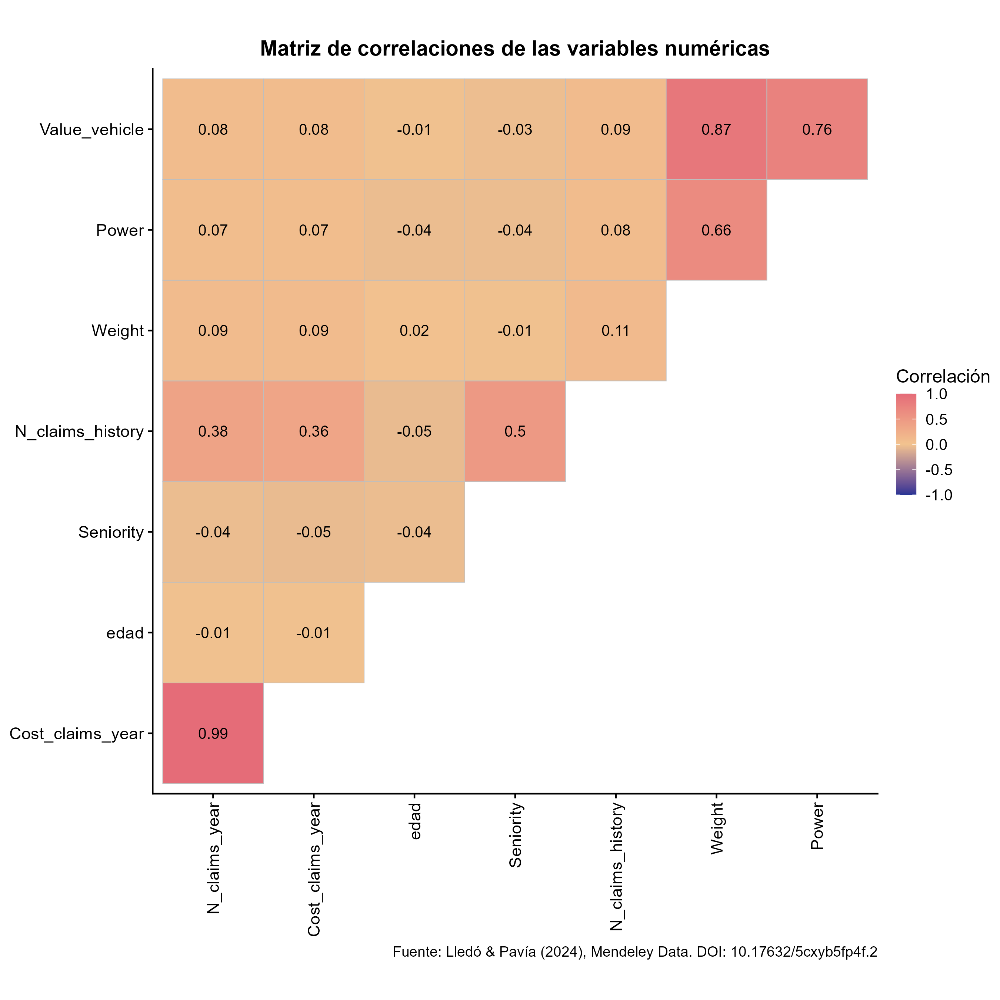{fig-align="center" width="507"}

\newpage

```{=latex}
\begin{center}
```

**Figura 2**

*Frecuencia promedio de los siniestros por zona de circulación*

```{=latex}
\end{center}
```

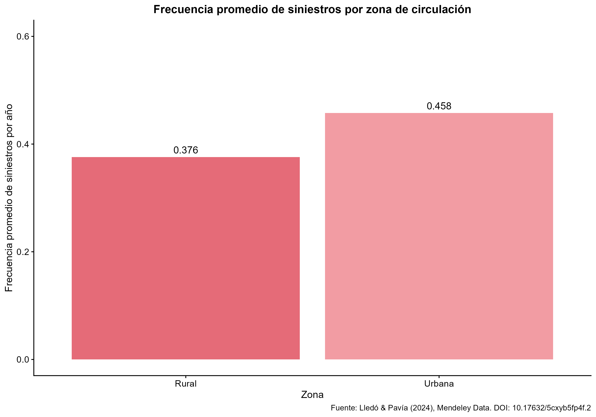{fig-align="center" width="507"}

```{=latex}
\begin{center}
```

**Figura 3**

*Distribución del costo anual por zona de circulación*

```{=latex}
\end{center}
```

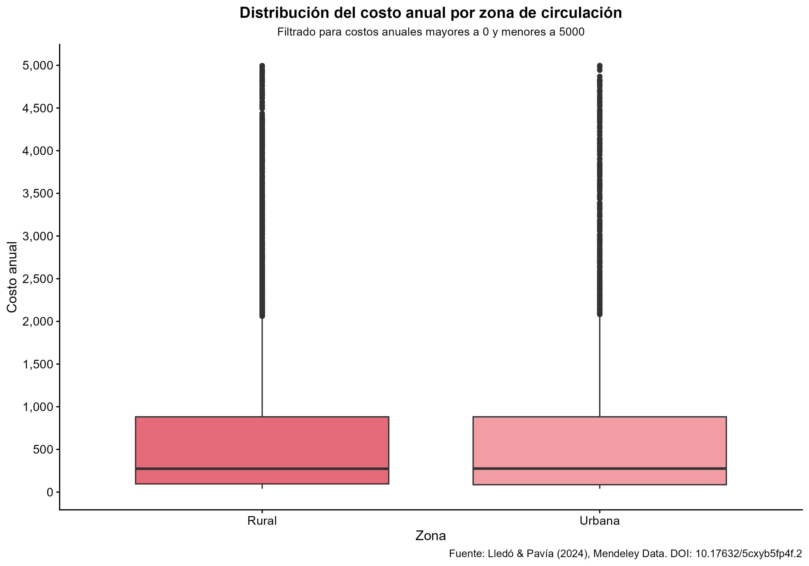{fig-align="center" width="507"}

```{=latex}
\begin{center}
```

**Figura 4**

*Costo de siniestros anual y cantidad de siniestros anual según el tipo de vehículo*

```{=latex}
\end{center}
```

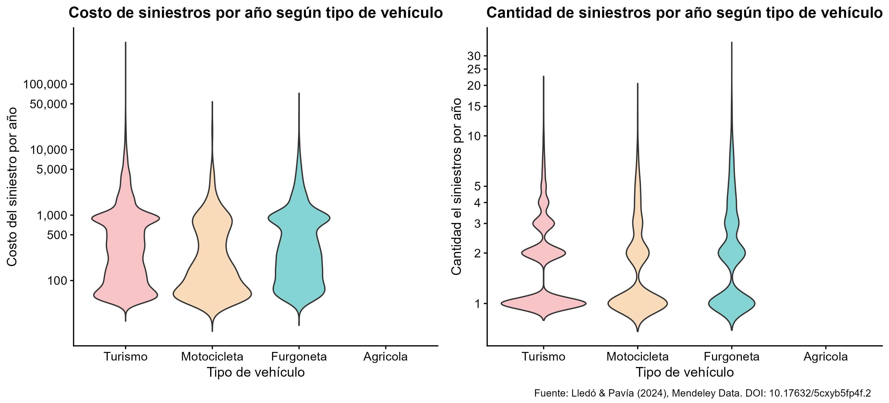{fig-align="center" width="661"}

\newpage

```{=latex}
\begin{center}
```

**Figura 5**

*Cantidad de observaciones con costos superiores a 900 euros según las características del vehículo*

```{=latex}
\end{center}
```

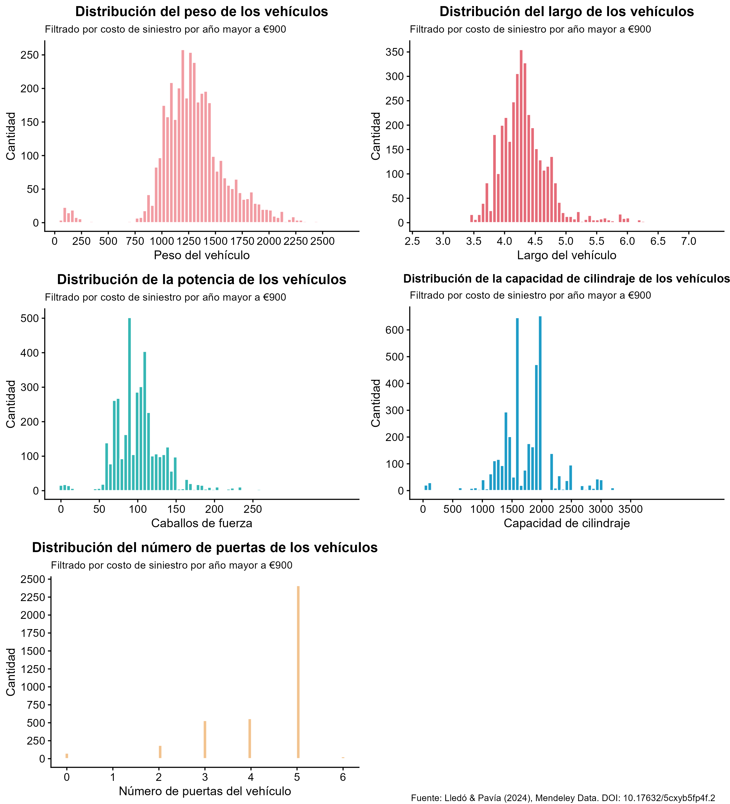{fig-align="center" width="600"}

## Conclusión

La presente investigación propuso analizar cómo las variables de la edad del asegurado, la antigüedad con la aseguradora, el historial de siniestros y las características del vehículo se relacionan con la frecuencia y la severidad de los siniestros, además de analizar el incremento abrupto en la cantidad de reclamos cuando el costo de los mismos alcanza los 900 euros.
Tal objetivo debió adaptarse, puesto que en la literatura consultada se señala que la frecuencia y severidad de los siniestros deben trabajarse por separado, además, se identificó la oportunidad de utilizar variables específicas tanto del asegurado como del vehículo para explorar su posible relación con ambos componentes.
En la investigación se esperaba encontrar que las variables tuvieran una asociación significativa con la frecuencia y la severidad, igualmente, se esperaba que el fenómeno bajo estudio estuviera asociado a ciertas características del vehículo.
Los resultados coinciden parcialmente con las expectativas, pues se encontró que el tipo de vehículo influye tanto en la frecuencia como en la severidad de los siniestros; el historial de siniestros se asocia positivamente con la siniestralidad; algunas variables del vehículo: el valor, la potencia, y el peso tienen una correlación despreciable tanto con la frecuencia como con la severidad, el caso análogo sucede con ciertas características del asegurado: la edad y la antigüedad con la aseguradora.

La metodología utilizada se divide en cuatro métodos complementarios, el análisis descriptivo de la base de datos, el cálculo de correlaciones de Spearman con intervalos de confianza para las variables numéricas, comparación entre grupos y la creación de una distribución mixta de tres componentes ajustada con el paquete *fitdistrplus* de R.
La metodología descrita permitió abordar el objetivo de investigación de manera satisfactoria.

El trabajo resuelve un vacío de conocimiento al proponer no solo un análisis de la intervención de distintas variables en la siniestralidad de los reclamos, sino también la explicación de un fenómeno específico: el aumento de reclamos a partir del umbral de 900 euros.
Lo anterior constituye un aspecto no abordado en la literatura estándar, la cual suele concentrarse en modelos de predicción más generales que estudian principalmente la siniestralidad de los reclamos.

Para futuras investigaciones se recomienda optar por la construcción de un aprendizaje práctico, de manera que las producciones generadas no enfoquen sus esfuerzos en un área meramente teórica, sino que el conocimiento hallado se aplique de igual manera a escenarios prácticos, lo cual puede constituir una guía para las entidades pertinentes y los profesionales que se desarrollan en el campo contemplado.
Asimismo, sería de gran valor aplicar este enfoque en distintas bases de datos de aseguradoras españolas o europeas, con el fin de identificar si existe un patrón: el aumento abrupto de la cantidad de reclamos a partir de un costo específico.
Finalmente, se sugiere incorporar información más detallada sobre el vehículo y el asegurado, con el fin de mejorar la precisión de los análisis realizados.

## Introducción

En el acontecer actuarial, predomina la existencia de múltiples variables, tanto cuantitativas como cualitativas, que interactúan simultáneamente en un espacio compartido.
En particular, en el ámbito asegurador automotriz, resulta imprescindible comprender la manera en que las diversas variables se relacionan con la ocurrencia y el costo de los siniestros reportados, ya que estos últimos elementos son ejes fundamentales en la determinación de las primas cobradas a los asegurados, a la vez que una correcta fijación de las primas potencia la sostenibilidad financiera de las aseguradoras.
Las variables de la edad del asegurado, la antigüedad con la aseguradora, el historial de siniestros y las características del vehículo, tienden a estar contenidas en la mayoría de las bases de datos pertenecientes a las aseguradoras automotrices, de manera que estudiar su intervención sobre la frecuencia y la severidad de los siniestros cobra una evidente importancia bajo el contexto planteado.

El presente proyecto posee el objetivo de analizar la relación entre las variables mencionadas en el párrafo anterior con dos variables respuesta: la frecuencia y la severidad de los siniestros.
Lo anterior se desarrollará a partir de la base de datos de autoría de @lledo2024, la cual muestra la información relacionada a una aseguradora situada en Valencia, España; con entradas que comprenden el periodo entre 1980 y 2019.
Adicionalmente, se examinará un fenómeno descubierto durante el análisis exploratorio de los datos: cuando el costo de los siniestros supera el monto de los 900 euros, la cantidad de siniestros aumenta de forma abrupta, interrumpiendo el comportamiento decreciente mostrado hasta ese valor; así, se pretende determinar qué variables inciden en el fenómeno detallado y desarrollar un análisis de distribución mixta.

Dado que el objetivo del proyecto considera variables cuantitativas y cualitativas, el manejo de las mismas difiere.
En el caso de las variables cuantitativas, se acudirá al análisis de correlación para estudiar su relación con la frecuencia y la severidad de los siniestros; mientras que en el caso de las variables cualitativas, que además son categóricas, se desarrollará un análisis segmentado por grupos: se estudiará el comportamiento de las categorías contenidas en cada variable cualitativa, respecto a la frecuencia y la severidad de los siniestros, apoyándose en un análisis principalmente gráfico.

Por otro lado, es importante destacar que tras una revisión literaria mediante búsquedas a partir de palabras clave como frecuencia, severidad, cantidad de reclamos y seguros automovilísticos; se identificó que la mayoría de las producciones gira en torno a la predicción del riesgo, también predomina la modelación de distintos elementos, dentro de ellos la frecuencia y la severidad de los siniestros.
En vista de lo anterior, el conocimiento producido a través del desarrollo de este proyecto cubrirá un espacio que actualmente está vacío: la indagación en la manera en que las variables del entorno asegurador automovilístico se relacionan con la frecuencia y la severidad de los siniestros.
Dicho conocimiento no solo adquiere la relevancia académica enunciada, sino que además proporciona información de utilidad para las aseguradoras automotrices, al brindarles un mayor conocimiento sobre los aspectos que potencialmente podrían disparar el pago de obligaciones con montos elevados y así puedan resguardar su capacidad de pago.
Esto último constituye una responsabilidad social: en situaciones de alta vulnerabilidad, por ejemplo un accidente de tránsito, los asegurados acuden a las compañías aseguradoras en vías de reclamar la cobertura que les fue garantizada, con el fin de cubrir los gastos derivados de tales escenarios; de esta manera, es primordial que las aseguradoras preserven su capacidad para financiar las obligaciones adquiridas con sus clientes.

Finalmente, la estructura del proyecto se compone de tres secciones: la metodología, los resultados y las conclusiones.
En la sección de la metodología se explicarán tanto los pasos como las herramientas empleadas para desarrollar la investigación.
Después, en la sección de resultados se expondrán los principales hallazgos que responden al objetivo de investigación planteado.
Por último, en la sección de conclusiones se enunciarán las observaciones emitidas a raíz de los descubrimientos.

## Resumen

La tarificación en seguros de automóviles requiere comprender los factores que se asocian con la siniestralidad, compuesta por la frecuencia y la severidad de los reclamos.
Este estudio analiza cómo las características del asegurado y del vehículo se relacionan con estos dos componentes, agregando una tercera capa de estudio: el análisis del incremento abrupto en la frecuencia de reclamos alrededor del umbral de 900 euros.
Se analizó una base de datos de 105,555 pólizas de una aseguradora española, con información entre 1980 y 2018, realizando un análisis descriptivo completo de los datos.
Para explorar relaciones, se utilizaron correlaciones de Spearman con intervalos de confianza de Fisher, junto con un modelo de distribución mixta de tres componentes: costos nulos, costos moderados y costos altos; ajustado con el paquete *fitdistrplus* de R y validado con intervalos asintóticos.
Los resultados muestran que variables como el historial de reclamos poseen una relación significativa con la siniestralidad, mientras que otras como la edad o el valor del vehículo presentan una correlación despreciable.
El tipo de vehículo resultó ser un factor importante para la severidad, y el modelo de distribución mixta identificó que los costos se caracterizan adecuadamente mediante una distribución Lognormal, con un mejor ajuste en comparación al de otras distribuciones: la Gamma, la Weibull y la Pareto.
Los intervalos de confianza para los parámetros mostraron amplitudes reducidas, 0.0302, 0.0213, 0.0436 y 0.0308, para \mu\_1, \sigma\_1, \mu\_2 y \sigma\_2 respectivamente, confirmando la estabilidad de las estimaciones.
La siniestralidad en la cartera no se asocia con una única variable, sino que presenta relaciones con una combinación de estas, el historial de reclamos y el tipo de vehículo son las variables más relevantes.
El modelo de distribución mixta captura adecuadamente la estructura de los costos, confirmando la relevancia del umbral de 900 euros.

## Agradecimientos

Primeramente, deseamos externar nuestro profundo agradecimiento a la Universidad de Costa Rica, un hogar educativo que promueve la excelencia, la creatividad y el pleno desarrollo de sus estudiantes.
Durante estos tres años de formación académica hemos recibido de su parte un cálido recibimiento, asimismo, su compromiso con la formación integral de profesionales ha fortalecido en nosotros no solo nuestros conocimientos y habilidades, sino también un amplio sentido de responsabilidad social.

Finalmente, agredecemos al docente Maikol Solís Chacón, quien ha sido nuestro mentor a lo largo del proceso.
Su disposición para brindar apoyo y su motivación por compartir sus vastos conocimientos, se reflejó de manera directa en la construcción de una investigación sólida y en un entorno de aprendizaje práctico.

## Ordenamiento final

**Palabras clave:** siniestralidad en seguros de automóviles, frecuencia de siniestros, severidad de siniestros, historial de reclamos, factores de riesgo.

# Fichas literarias construidas en la cuarta bitácora

::: callout-note
# Ruscio (2008)

***Nivel descriptivo***

*Título:* *Constructing Confidence Intervals for Spearman's Rank Correlation with Ordinal Data: A Simulation Study Comparing Analytic and Bootstrap Methods*

*Autor:* John Ruscio.

*Año:* 2008.

*Nombre del tema:* construcción de intervalos de confianza para el coeficiente de correlación de Spearman.

*Clasificación:* Metodológica.

Se eligió esta etiqueta porque el artículo compara métodos para construir intervalos de confianza para la correlación de Spearman, especialmente en situaciones donde los datos no cumplen necesariamente con los supuestos de normalidad requeridos por métodos paramétricos clásicos.

*Resumen en una oración:* el artículo analiza la construcción de intervalos de confianza para el coeficiente de Spearman y compara métodos analíticos con métodos bootstrap.

*Argumento central:* Ruscio sostiene que, aunque existen procedimientos analíticos para construir intervalos de confianza para la correlación de Spearman, su desempeño puede variar según la naturaleza de los datos.
En particular, el artículo muestra que los intervalos bootstrap pueden ofrecer una cobertura igual o superior a la de algunos métodos analíticos cuando se trabaja con datos ordinales.

*Problemas con el argumento o el tema:* una limitación para este proyecto es que el artículo se concentra principalmente en datos ordinales y en un estudio de simulación, mientras que en el proyecto se trabajó con variables cuantitativas de siniestralidad y con una base de datos real de seguros.
Además, el artículo no se enfoca en datos actuariales ni en variables de frecuencia o severidad de reclamos.

***Nivel analítico***

*Conexión con mi proyecto:* este artículo se relaciona con el proyecto porque se utilizaron correlaciones de Spearman para analizar la asociación entre variables cuantitativas del asegurado o del vehículo y las variables de siniestralidad.
Dado que las variables del proyecto presentaron asimetría, valores extremos y falta de normalidad, fue necesario complementar la estimación puntual de las correlaciones con intervalos de confianza.
La referencia de Ruscio (2008) permite justificar el uso de procedimientos aproximados para construir intervalos de confianza asociados al coeficiente de Spearman.

*Lo que NO dice el autor:* el artículo no propone un modelo para frecuencia o severidad de siniestros.
Tampoco estudia bases de datos de seguros, exceso de ceros, distribución mixta ni umbrales de severidad como el de 900 euros.
Su aporte se limita al problema metodológico de la inferencia sobre la correlación de Spearman.

*Contraste con otra fuente:* en comparación con Vinuesa (2016), Ruscio (2008) profundiza más en la parte inferencial de la correlación.
Mientras Vinuesa (2016) es útil para explicar qué es la correlación y por qué Spearman resulta adecuado cuando no se cumplen supuestos de normalidad, Ruscio (2008) permite justificar el cálculo de intervalos de confianza para ese coeficiente.
Por tanto, ambas fuentes se complementan: una aporta la explicación general del método y la otra respalda la construcción de intervalos.

*Evaluación de aplicabilidad (escala 1–5):* 4.

La referencia es aplicable porque respalda una parte concreta de la metodología: el cálculo de intervalos de confianza para las correlaciones de Spearman.
No recibe 5 porque el artículo no trabaja con datos de seguros ni con las variables específicas del proyecto.

*Pregunta que le haría al autor:* ¿Qué procedimiento recomendaría para construir intervalos de confianza de Spearman cuando se trabaja con bases de datos grandes, asimétricas y con valores extremos, como ocurre en datos de siniestralidad de seguros?

*Resumen argumentativo:* Lo que Ruscio (2008) intenta resolver es cómo construir intervalos de confianza adecuados para el coeficiente de correlación de Spearman, especialmente cuando los datos no se ajustan bien a los supuestos clásicos.
Para esto, compara métodos analíticos y métodos bootstrap mediante simulaciones.
Su aporte principal es mostrar que la estimación puntual de Spearman puede complementarse con intervalos de confianza, pero que la elección del método debe considerar la naturaleza de los datos.
Para el proyecto, esta fuente es útil porque permite justificar que las correlaciones no se interpreten únicamente como valores puntuales, sino acompañadas de una medida de incertidumbre.
Esto fortalece el análisis de asociación entre variables cuantitativas y variables de siniestralidad.
:::

::: callout-note
# Crow y Shimizu (1988)

***Nivel descriptivo***

*Título:* *Lognormal Distributions: Theory and Applications*

*Editores:* Edwin L. Crow y Kunio Shimizu.

*Año:* 1988.

*Nombre del tema:* teoría, propiedades, estimación y aplicaciones de la distribución Lognormal.

*Clasificación:* Teórica y metodológica.

Se eligió esta etiqueta porque el libro desarrolla la distribución Lognormal desde una perspectiva formal, incluyendo su definición, propiedades, métodos de estimación e intervalos de confianza.
Además, permite justificar el uso de la transformación logarítmica cuando una variable positiva se modela mediante una distribución Lognormal.

*Resumen en una oración:* el libro presenta la teoría y las aplicaciones de la distribución Lognormal, incluyendo su relación con la distribución Normal mediante la transformación logarítmica.

*Argumento central:* Crow y Shimizu presentan la distribución Lognormal como una distribución adecuada para variables positivas y asimétricas, cuya característica central es que el logaritmo de la variable sigue una distribución Normal.
Esta propiedad permite trabajar una variable sesgada en su escala original mediante una transformación logarítmica, donde los parámetros del modelo corresponden a la media y la desviación estándar del logaritmo de la variable.

*Problemas con el argumento o el tema:* una limitación para el proyecto es que el libro no se concentra específicamente en seguros de automóviles ni en datos de reclamos.
Además, aunque la distribución Lognormal puede ajustarse bien a variables positivas y asimétricas, esto no garantiza que siempre sea la mejor distribución para datos de severidad.
Por esta razón, en el proyecto fue necesario compararla con otras distribuciones candidatas, como Gamma, Weibull y Pareto.

***Nivel analítico***

*Conexión con mi proyecto:* esta referencia se relaciona directamente con el análisis del costo anual positivo de los siniestros.
En el proyecto, la variable `Cost_claims_year` presentó valores positivos con asimetría hacia la derecha, por lo que se evaluó la distribución Lognormal como candidata para los componentes positivos de la distribución mixta.
La referencia de Crow y Shimizu (1988) permitió justificar teóricamente que, si $Y$ sigue una distribución Lognormal, entonces $W = \ln(Y)$ sigue una distribución Normal.
Esta propiedad fue clave para construir intervalos de confianza para los parámetros $\mu$ y $\sigma$ en escala logarítmica.

*Lo que NO dice el autor:* el libro no estudia el umbral de 900 euros ni propone una metodología específica para separar costos medios y costos altos en datos de reclamos.
Tampoco aborda directamente el exceso de ceros ni la construcción de una distribución mixta con una masa puntual en cero.
Su aporte al proyecto se concentra en la justificación teórica de la Lognormal y de la transformación logarítmica.

*Contraste con otra fuente:* en comparación con Delignette-Muller y Dutang (2015), Crow y Shimizu (1988) aportan una fundamentación más teórica de la distribución Lognormal.
Delignette-Muller y Dutang (2015) son más útiles para justificar el ajuste computacional de distribuciones mediante `fitdistrplus`, mientras que Crow y Shimizu (1988) permiten explicar por qué la transformación $W = \ln(Y)$ lleva a una escala Normal cuando el modelo Lognormal es adecuado.
Ambas fuentes se complementan: una respalda la herramienta de ajuste y la otra respalda la propiedad probabilística utilizada para los intervalos de confianza.

*Evaluación de aplicabilidad (escala 1–5):* 4.

La referencia es aplicable porque justifica una parte central del análisis de severidad: el uso de la Lognormal para modelar costos positivos y la construcción de intervalos de confianza en escala logarítmica.
No recibe 5 porque no está enfocada específicamente en datos de seguros ni en el problema del umbral de 900 euros.

*Pregunta que le haría al autor:* ¿Qué criterios recomendaría utilizar para decidir cuándo una distribución Lognormal es preferible a distribuciones como Gamma, Weibull o Pareto en datos de reclamos de seguros con colas derechas?

*Resumen argumentativo:* Lo que Crow y Shimizu (1988) permiten justificar es la base teórica de la distribución Lognormal.
Si una variable positiva $Y$ es Lognormal, entonces su logaritmo natural $W = \ln(Y)$ sigue una distribución Normal.
Esta relación es importante porque permite transformar una variable positiva y asimétrica en una variable que puede analizarse bajo el marco de la Normal.
Para el proyecto, esta propiedad fue fundamental porque los costos positivos de siniestros se modelaron mediante distribuciones Lognormales dentro de una distribución mixta.
Además, permitió justificar que los intervalos de confianza para los parámetros $\mu$ y $\sigma$ se construyeran en la escala logarítmica, ya que esos parámetros describen la media y la desviación estándar de $\ln(Y)$, no directamente del costo en su escala original.
:::

# Relativo al trabajo en equipo

## Reflexión del diario de aprendizaje

A partir de las entradas efectuadas en los diarios de aprendizaje de las tres bitácoras anteriores, se externará una reflexión en torno al proceso que ha representado la construcción del proyecto en cada una de sus etapas.
Tal reflexión se detalla a partir de cuatro oraciones: tres oraciones dedicadas a cada una de las bitácoras concluidas y una última oración destinada a sintetizar la experiencia atravesada.
Dichas oraciones se detallan como sigue:

-   La primera bitácora representó el acercamiento inicial al desarrollo del proyecto.
    En ella se definieron elementos sumamente importantes como la pregunta de investigación, la base de datos que sustenta el trabajo y una primera revisión literaria que contextualizó al equipo en torno a las producciones realizadas por otros autores en el campo de estudio contemplado.
    Asimismo, dicha entrega constituyó la primera ocasión en que los miembros del equipo trabajaron conjuntamente, de manera que se atravesó un proceso tanto de conocimiento como de adaptación, relacionado a las fortalezas y a los puntos de mejora del esfuerzo grupal realizado.
    El compromiso, la comunicación activa, la cooperación y el apoyo fueron aspectos esenciales que impulsaron el desarrollo óptimo de la asignación, a la vez que garantizaron la existencia de un espacio de trabajo placentero.

-   En la segunda bitácora, se aprendió que el análisis descriptivo es una etapa esencial para comprender la estructura inicial de los datos, ya que permite identificar valores faltantes, valores atípicos y patrones relevantes mediante tablas y gráficos.
    Además, se comprendió que la construcción de visualizaciones y la escritura del informe requieren decisiones cuidadosas, desde elegir gráficos adecuados hasta comunicar los hallazgos con claridad y conectar la literatura con la pregunta de investigación.

## Registro del trabajo en equipo

La siguiente tabla contiene los aportes de los integrantes, de acuerdo a las secciones en las que cada uno se desempeñó:

+:------------------------------:+:------------------------------------------------------------------------------:+
| **Integrante**                 | **Contribuciones**                                                             |
+--------------------------------+--------------------------------------------------------------------------------+
| Alexandra González Bermúdez    | Mejora del texto planteado en la tercera bitácora                              |
|                                |                                                                                |
|                                | Introducción                                                                   |
|                                |                                                                                |
|                                | Revisión final                                                                 |
|                                |                                                                                |
|                                | Agradecimientos                                                                |
|                                |                                                                                |
|                                | Fichas de resultados                                                           |
|                                |                                                                                |
|                                | Diario de aprendizaje                                                          |
|                                |                                                                                |
|                                | Registro del trabajo en equipo                                                 |
+--------------------------------+--------------------------------------------------------------------------------+
| **Integrante**                 | **Contribuciones**                                                             |
+--------------------------------+--------------------------------------------------------------------------------+
| Emily Estefanía Mora Contreras | División de las tareas de acuerdo a su dificultad                              |
|                                |                                                                                |
|                                | Fichas de resultados adicionales                                               |
|                                |                                                                                |
|                                | Mejora del texto planteado en la tercera bitácora                              |
|                                |                                                                                |
|                                | Revisión final                                                                 |
|                                |                                                                                |
|                                | Fichas de resultados                                                           |
|                                |                                                                                |
|                                | Agradecimientos                                                                |
|                                |                                                                                |
|                                | Diario de aprendizaje                                                          |
+--------------------------------+--------------------------------------------------------------------------------+
| **Integrante**                 | **Contribuciones**                                                             |
+--------------------------------+--------------------------------------------------------------------------------+
| Daniela Prado Vargas           | Selección de las variables, la metodología, los datos y los resultados finales |
|                                |                                                                                |
|                                | Selección de las palabras clave del artículo                                   |
|                                |                                                                                |
|                                | Revisión final                                                                 |
|                                |                                                                                |
|                                | Fichas de resultados                                                           |
|                                |                                                                                |
|                                | Agradecimientos                                                                |
|                                |                                                                                |
|                                | Diario de aprendizaje                                                          |
+--------------------------------+--------------------------------------------------------------------------------+
| **Integrante**                 | **Contribuciones**                                                             |
+--------------------------------+--------------------------------------------------------------------------------+
| José Miguel Rodríguez Gómez    | Conclusión                                                                     |
|                                |                                                                                |
|                                | Resumen                                                                        |
|                                |                                                                                |
|                                | Iteración de modelación de resultados                                          |
|                                |                                                                                |
|                                | Revisión final                                                                 |
|                                |                                                                                |
|                                | Fichas de resultados                                                           |
|                                |                                                                                |
|                                | Agradecimientos                                                                |
|                                |                                                                                |
|                                | Diario de aprendizaje                                                          |
+--------------------------------+--------------------------------------------------------------------------------+

\newpage

# Referencias
